# 📚 Documentation Hub — Ecommerce Platform

> **Mục lục trung tâm cho toàn bộ docs.** Mỗi link bên dưới đều clickable
> khi xem trong markdown preview (VSCode `Ctrl+Shift+V`, GitHub web,
> IntelliJ, Obsidian, Typora) — link tự render màu xanh.
>
> **Quy tắc đọc nhanh** — không có thời gian đọc hết, đi theo lộ trình
> [§ 1. Reading paths](#1-reading-paths) bên dưới.

---

## 🗺️ 0. Quick map

```
docs/
├── 📘 README.md           ← bạn đang ở đây
├── 📅 ROADMAP.md          ← source of truth tiến độ 40 ngày
│
├── 🏗️  architecture/      ← high-level system & domain design
├── 📐 decisions/          ← ADRs (architectural decision records)
├── 📖 lessons/            ← concept giải thích — đọc đêm để ngấm
├── 🔥 issues/             ← production incident simulation (root cause + fix)
├── ⚡ performance/        ← tuning notes + benchmark
├── 🎤 interview/          ← Q&A theo day, có AI Playbook + Tech Lead Lens
├── 🏛️  system-design/     ← whiteboard problem (Week 6 intensive)
├── 🔧 runbooks/           ← operations playbook
├── 🔍 review/             ← AI/junior code review checklist (cumulative)
└── 👥 leadership/         ← incident log thật từ Sotatek (cho phỏng vấn lead)
```

### 40-day dependency map

> Mỗi node là 1 day. Mũi tên = dependency (day sau cần code/concept của day trước).

```mermaid
graph LR
    D1[Day 1<br/>Foundation]:::done

    subgraph Week1[Week 1 — Core]
        D2[Day 2<br/>Auth]:::done
        D3[Day 3<br/>Product]:::done
        D4[Day 4<br/>Inventory DDD]:::done
        D5[Day 5<br/>Cart Redis]:::done
        D6[Day 6<br/>Order DDD]:::done
        D7[Day 7<br/>Mock W1]:::done
    end

    subgraph Week2[Week 2 — Kafka & Async]
        D8[Day 8<br/>Kafka setup]:::planned
        D9[Day 9<br/>Order flow + OTel]:::planned
        D10[Day 10<br/>Payment]:::planned
        D11[Day 11<br/>Notification]:::planned
        D12[Day 12<br/>Retry + DLT]:::planned
        D13[Day 13<br/>Outbox]:::planned
        D14[Day 14<br/>Mock W2]:::done
    end

    subgraph Week3[Week 3 — Performance]
        D15[Day 15<br/>2-tier Cache]:::done
        D16[Day 16<br/>SQL tuning]:::done
        D17[Day 17<br/>N+1]:::done
        D18[Day 18<br/>Pagination]:::done
        D19[Day 19<br/>Concurrency]:::done
        D20[Day 20<br/>Load test]:::planned
        D21[Day 21<br/>Mock W3]:::planned
    end

    subgraph Week4[Week 4 — Data Layer NEW]
        D22[Day 22<br/>Elasticsearch]:::data
        D23[Day 23<br/>MongoDB]:::data
        D24[Day 24<br/>SQL/NoSQL/ES<br/>matrix]:::data
        D25[Day 25<br/>Polyglot review]:::data
    end

    subgraph Week5[Week 5 — Frontend]
        D26[Day 26<br/>React scaffold]:::planned
        D27[Day 27<br/>Auth + Cart UI]:::planned
        D28[Day 28<br/>Product + Order UI]:::planned
        D29[Day 29<br/>Admin dashboard]:::planned
        D30[Day 30<br/>E2E test]:::planned
    end

    subgraph Week6[Week 6 — System Design NEW]
        D31[Day 31<br/>Capacity estimation]:::sd
        D32[Day 32<br/>Homepage feed]:::sd
        D33[Day 33<br/>Flash sale]:::sd
        D34[Day 34<br/>Notification scale]:::sd
        D35[Day 35<br/>Autocomplete]:::sd
        D36[Day 36<br/>Payment recon]:::sd
        D37[Day 37<br/>Rate limiter]:::sd
    end

    subgraph Week7[Week 7 — Final]
        D38[Day 38<br/>CV + Portfolio]:::planned
        D39[Day 39<br/>Mock SD]:::planned
        D40[Day 40<br/>Final mock]:::planned
    end

    D1 --> D2 --> D3 --> D4 --> D5 --> D6 --> D7
    D7 --> D8 --> D9 --> D10
    D9 --> D11 --> D12 --> D13 --> D14
    D14 --> D15 --> D16 --> D17 --> D18 --> D19 --> D20 --> D21
    D21 --> D22 --> D23 --> D24 --> D25
    D25 --> D26 --> D27 --> D28 --> D29 --> D30
    D30 --> D31 --> D32 --> D33 --> D34 --> D35 --> D36 --> D37
    D37 --> D38 --> D39 --> D40

    classDef done       fill:#86efac,stroke:#16a34a,color:#000
    classDef inProgress fill:#fde68a,stroke:#d97706,color:#000
    classDef planned    fill:#e5e7eb,stroke:#6b7280,color:#000
    classDef data       fill:#fde68a,stroke:#d97706,color:#000
    classDef sd         fill:#e9d5ff,stroke:#9333ea,color:#000
```



> 🟢 done · 🟡 data layer (NEW) · 🟣 system design (NEW) · ⚪ planned

---

## 🧭 1. Reading paths

> Đọc theo persona — đỡ lan man.

### 🆕 Persona A — Recruiter / HR / Non-tech (5 phút)

1. [`/README.md`](../README.md) — pitch dự án + tech stack
2. [`ROADMAP.md` § Status snapshot](ROADMAP.md#status-snapshot) — tiến độ 40 ngày
3. *(stop here — đủ để screen)*

### 🧑‍💻 Persona B — Tech interviewer / engineering manager (15 phút)

1. [`/README.md`](../README.md) — overview
2. [`architecture/system-overview.md`](architecture/system-overview.md) — sơ đồ 9 service + flow
3. [`decisions/001-why-hybrid-architecture.md`](decisions/001-why-hybrid-architecture.md) — quyết định DDD/Layered
4. [`interview/day-01-foundation.md`](interview/day-01-foundation.md) — Q&A foundation + AI Playbook + Tech Lead Lens
5. [`review/ai-junior-traps.md`](review/ai-junior-traps.md) — proof of code review thinking

### 🎯 Persona C — Future-Tonny ôn phỏng vấn (30 phút mỗi tuần)

1. [`ROADMAP.md`](ROADMAP.md) — xác định đang ở day nào
2. Day vừa build → đọc `interview/day-NN-*.md` to lên (luyện diễn đạt)
3. Cuối tuần → `interview/week-NN-mock.md` (Day 7, 14, 21, 28)
4. [`leadership/incidents.md`](leadership/incidents.md) — review STAR stories
5. [`review/ai-junior-traps.md`](review/ai-junior-traps.md) — review checklist

### 🌅 Persona D-bis — Mỗi sáng / mở session (5 giây)

→ **[`daily.md`](daily.md) — cheatsheet 1 trang.** Morning startup / Evening wrap-up / Saturday mock / Pre-interview / Resume after break.

### 🤖 Persona D — Claude session mới (bootstrap)

1. [`/CLAUDE.md`](../CLAUDE.md) — context bootstrap (đọc đầu tiên, mục 1-9)
2. [`ROADMAP.md`](ROADMAP.md) — biết đang ở day nào
3. Day trước đó → đọc code + docs đã build để có context

### 🔧 Persona E — Dev mới onboard repo (1 giờ)

1. [`/README.md`](../README.md) § Quick start — bring up infra
2. [`architecture/system-overview.md`](architecture/system-overview.md) — big picture
3. [`decisions/001-why-hybrid-architecture.md`](decisions/001-why-hybrid-architecture.md) — vì sao 2 style
4. [`lessons/01-monorepo-vs-polyrepo.md`](lessons/01-monorepo-vs-polyrepo.md) — vì sao monorepo
5. Mở 1 service bất kỳ → đọc `package-info.java` (có style declaration)

---

## 📚 2. Index — full document catalog

> Status: ✅ done · 🚧 partial · ⏳ planned

### 📅 2.1. Roadmap & meta & learning

| Doc | Status | Mô tả |
| --- | ------ | ----- |
| [`daily.md`](daily.md) | ✅ | **Cheatsheet 1 trang — mở mỗi sáng.** Morning / Evening / Saturday / Pre-interview / Resume. |
| [`ROADMAP.md`](ROADMAP.md) | ✅ | 40-day plan + sprint checklist + status snapshot. **Source of truth tiến độ.** |
| [`learning-guide.md`](learning-guide.md) | ✅ | 3-phase daily ritual (code → understand → communicate) + weekly mock + pitfalls. **Mục tiêu học hiệu quả.** |

### 🏗️ 2.2. Architecture (`architecture/`)

> High-level system + per-domain design. Không số thứ tự — đọc theo nhu cầu.

| Doc | Status | Mô tả |
| --- | ------ | ----- |
| [`architecture/system-overview.md`](architecture/system-overview.md) | ✅ | Sơ đồ 9 microservice, communication topology, infra stack |
| [`architecture/order-domain.md`](architecture/order-domain.md) | ✅ | Aggregate Order + sealed `OrderStatus` state machine + sync orchestration sequence |
| [`architecture/event-driven-flow.md`](architecture/event-driven-flow.md) | ✅ | Kafka topic topology (5 topic) + sync vs async sequence diagram + JSON schema versioning rule |
| `architecture/data-ownership-map.md` | ⏳ Day 25 | Polyglot persistence: ai owns Postgres / Redis / Mongo / ES, sync direction |

### 📐 2.3. Decisions / ADRs (`decisions/`)

> Format `NNN-topic.md`. Mọi quyết định kiến trúc lớn phải có ADR.

| Doc | Status | Mô tả |
| --- | ------ | ----- |
| [`decisions/001-why-hybrid-architecture.md`](decisions/001-why-hybrid-architecture.md) | ✅ | Tại sao Hybrid Layered + DDD per service (3-điểm criteria) |
| [`decisions/002-jwt-vs-session.md`](decisions/002-jwt-vs-session.md) | ✅ | Quyết định auth: JWT stateless + refresh rotation DB-hashed (4 alternatives compared) |
| `decisions/003-ddd-for-order-inventory-payment.md` | ✅ | 3-điểm criteria DDD vs Layered, mapping 9 service |
| [`decisions/004-redis-primary-for-cart.md`](decisions/004-redis-primary-for-cart.md) | ✅ | Redis primary cho cart, 4 alternatives compared (PG / PG+Redis cache / Redis-only / Redis+PG snapshot) |
| [`decisions/005-feign-vs-http-interface.md`](decisions/005-feign-vs-http-interface.md) | ✅ | Spring 6.1 HTTP Interface chosen vs OpenFeign — 5 alternatives compared, version coupling + adapter flexibility là dominant reason |
| [`decisions/006-sync-orchestration-vs-async-events.md`](decisions/006-sync-orchestration-vs-async-events.md) | ✅ | Order flow async event-driven (Day 9) vs sync (Day 6) — 5 alternatives, accept eventual consistency + outbox/DLT debt |
| [`decisions/007-payment-service-layered-not-ddd.md`](decisions/007-payment-service-layered-not-ddd.md) | ✅ | payment-service dùng Layered + sealed status, revise scope ADR-003 — 1/3 DDD criteria không đạt, 4 alternatives compared |
| [`decisions/008-api-versioning-strategy.md`](decisions/008-api-versioning-strategy.md) | ✅ | URI versioning + N-1 deprecation policy (90-day sunset), 5 alternatives compared |
| [`decisions/009-outbox-vs-cdc.md`](decisions/009-outbox-vs-cdc.md) | ✅ | Transactional outbox + polling relay vs Debezium CDC, 5 alternatives compared, migration path khi volume > 10k/s |
| [`decisions/008-two-tier-cache-caffeine-redis.md`](decisions/008-two-tier-cache-caffeine-redis.md) | ✅ | 2-tier cache Caffeine L1 + Redis L2, 4 alternatives, trade-off consistency vs latency |
| `decisions/010-postgres-vs-elasticsearch-search.md` | ⏳ Day 22 | Postgres GIN/full-text vs Elasticsearch cho product search |
| `decisions/011-mongo-for-analytics-and-flexible-attributes.md` | ⏳ Day 23 | MongoDB use case có chủ ý: event store + flexible product attributes |

### 📖 2.4. Lessons (`lessons/`)

> Format `NN-topic.md` (NN = day intro). Concept giải thích cho future-Tonny đọc đêm.

| Doc | Status | Mô tả |
| --- | ------ | ----- |
| [`lessons/01-monorepo-vs-polyrepo.md`](lessons/01-monorepo-vs-polyrepo.md) | ✅ | Monorepo / polyrepo trade-off, scale-up trigger |
| [`lessons/02-jwt-vs-session.md`](lessons/02-jwt-vs-session.md) | ✅ | JWT vs session, when/when-not, 7 cạm bẫy, 4 interview Q |
| [`lessons/03-pagination-offset-vs-cursor.md`](lessons/03-pagination-offset-vs-cursor.md) | ✅ | Offset vs keyset pagination, 4 approaches, interview answer |
| `lessons/04-optimistic-locking.md` | ✅ | `@Version`, retry pattern, vs pessimistic |
| `lessons/04b-transaction-isolation.md` | ✅ | 4 isolation levels, MVCC vs next-key lock, Postgres `REPEATABLE READ` snapshot |
| [`lessons/05-redis-cart-vs-db-cart.md`](lessons/05-redis-cart-vs-db-cart.md) | ✅ | Redis-primary vs PG vs PG+cache, 4 approaches, when not to use |
| [`lessons/05b-redis-data-structures.md`](lessons/05b-redis-data-structures.md) | ✅ | Hash vs String JSON vs Sorted Set cho cart, atomicity field-level |
| [`lessons/06-aggregate-root.md`](lessons/06-aggregate-root.md) | ✅ | Aggregate boundary, 5 cạm bẫy, 3-approach comparison, "1 tx 1 aggregate" rule |
| [`lessons/06b-sealed-types-state-machine.md`](lessons/06b-sealed-types-state-machine.md) | ✅ | Sealed vs enum, exhaustive switch (JEP 441), persistence 2-column pattern |
| [`lessons/07-refactor-extract-discipline.md`](lessons/07-refactor-extract-discipline.md) | ✅ | Rule of three, 3-điểm criteria extract lên common-lib, 4 cạm bẫy, anti-pattern AHA |
| [`lessons/08-kafka-basics.md`](lessons/08-kafka-basics.md) | ✅ | Topic/Partition/Offset/Consumer group; 3 producer flags (`acks` + `enable.idempotence` + `max.in.flight`); delivery semantics preview |
| [`lessons/08b-feign-vs-http-interface.md`](lessons/08b-feign-vs-http-interface.md) | ✅ | 8-axis comparison + code side-by-side + 4 follow-up traps |
| [`lessons/09-distributed-tracing-otel.md`](lessons/09-distributed-tracing-otel.md) | ✅ | Micrometer Tracing + OTel bridge + Zipkin, W3C `traceparent` qua Kafka headers, sampling strategy |
| [`lessons/09b-eventual-consistency-window.md`](lessons/09b-eventual-consistency-window.md) | ✅ | Window async vs sync, khi nào dùng/KHÔNG, đo SLI lag |
| [`lessons/10-idempotency.md`](lessons/10-idempotency.md) | ✅ | 4-layer idempotency (Network/App-cache/Check-then-act/DB-UNIQUE) + Idempotency-Key header pattern + 5 cạm bẫy + Q&A |
| [`lessons/11-fire-and-forget.md`](lessons/11-fire-and-forget.md) | ✅ | Fire-and-forget pattern: at-most-once, idempotency bắt buộc, fail-open/closed Redis dedup |
| [`lessons/11b-api-versioning.md`](lessons/11b-api-versioning.md) | ✅ | URI / header / accept-version trade-off, N-1 deprecation policy, expand-contract pattern |
| [`lessons/12-retry-strategy.md`](lessons/12-retry-strategy.md) | ✅ | Exp backoff 1s/4s/16s + jitter + non-retryable classification, khi NÊN và KHÔNG NÊN retry, 5 cạm bẫy |
| [`lessons/12b-circuit-breaker-resilience4j.md`](lessons/12b-circuit-breaker-resilience4j.md) | ✅ | State machine CLOSED/OPEN/HALF_OPEN, sliding window count vs time, Bulkhead semaphore vs threadpool, fallback rules |
| [`lessons/12c-kafka-delivery-semantics.md`](lessons/12c-kafka-delivery-semantics.md) | ✅ | At-most/at-least/exactly-once + producer idempotence + manual ack + idempotent consumer (filled skeleton) |
| [`lessons/12d-partition-key-ordering.md`](lessons/12d-partition-key-ordering.md) | ✅ | Ordering per-partition, key choice cho project (`orderId`), skew + rebalance + DLT partition affinity (filled skeleton) |
| [`lessons/13-outbox-pattern.md`](lessons/13-outbox-pattern.md) | ✅ | Transactional outbox + scheduled relay, SKIP LOCKED, 5 cạm bẫy, 5 approaches comparison |
| [`lessons/13b-dual-write-problem.md`](lessons/13b-dual-write-problem.md) | ✅ | Dual-write concept, tại sao 2PC fail, solution family (outbox / CDC / saga) |
| [`lessons/15-cache-strategies.md`](lessons/15-cache-strategies.md) | ✅ | 4 cache strategy (cache-aside/read-through/write-through/write-behind), stampede/penetration/avalanche traps |
| [`lessons/16-postgres-indexing.md`](lessons/16-postgres-indexing.md) | ✅ | 5 loại index Postgres (B-tree / GIN trigram / tsvector / partial / covering) + decision matrix theo predicate shape + `CONCURRENTLY` |
| [`lessons/17-jpa-fetch-strategies.md`](lessons/17-jpa-fetch-strategies.md) | ✅ | EntityGraph vs JOIN FETCH vs projection — decision matrix + 4 cạm bẫy (HHH000104 in-memory pagination / MultipleBagFetchException / LazyInit + open-in-view / constructor expression) |
| [`lessons/19-java-locking.md`](lessons/19-java-locking.md) | ✅ | synchronized / ReentrantLock / StampedLock + DB optimistic vs pessimistic — JMH 7K/21K/5.6M ops/ms, decision matrix theo contention |
| [`lessons/19b-virtual-threads-deep.md`](lessons/19b-virtual-threads-deep.md) | ✅ | Loom mount/unmount, pinning (JFR `jdk.VirtualThreadPinned` proof), structured concurrency `StructuredTaskScope`, KHÔNG overclaim CPU-bound |
| [`lessons/19c-distributed-lock-redlock.md`](lessons/19c-distributed-lock-redlock.md) | ✅ | Redis SET NX PX + Lua owner-check release, Redlock + Kleppmann/antirez debate, fencing token enforce ở resource |
| `lessons/22-elasticsearch-basics.md` | ⏳ Day 22 | Inverted index, analyzer, mapping, faceted search |
| `lessons/22b-cdc-vs-app-sync-vs-debezium.md` | ⏳ Day 22 | 3 cách sync Postgres → ES, trade-off |
| `lessons/23-mongodb-when-to-use.md` | ⏳ Day 23 | Khi nào dùng Mongo (purposeful, không cargo-cult) |
| `lessons/23b-document-vs-relational-modeling.md` | ⏳ Day 23 | Modeling 1-N / N-N trong document vs relational |
| `lessons/24-sql-vs-nosql-vs-es-decision-matrix.md` | ⏳ Day 24 | 8 use case × 4 storage decision matrix |
| `lessons/24b-cap-pacelc-in-practice.md` | ⏳ Day 24 | CAP / PACELC áp dụng vào tool thật |
| `lessons/25-polyglot-persistence-anti-patterns.md` | ⏳ Day 25 | Dual-write, sync drift, "1 tool 1 service" sai chỗ |
| `lessons/26-frontend-architecture.md` | ⏳ Day 26 | Vertical slice, TanStack Query, axios envelope unwrap |
| `lessons/27-optimistic-ui-tanstack.md` | ⏳ Day 27 | Optimistic update, rollback, conflict resolution |
| `lessons/28-cursor-pagination-ui.md` | ⏳ Day 28 | Infinite scroll dùng cursor, không offset |
| `lessons/29-sse-vs-websocket-vs-polling.md` | ⏳ Day 29 | Real-time delivery option, khi nào chọn cái nào |

### 🔥 2.5. Issues — production incident simulation (`issues/`)

> Format `NN-topic.md`. Mỗi issue: Problem / Symptoms / Root Cause / Fix / Prevention.

| Doc | Status | Mô tả |
| --- | ------ | ----- |
| [`issues/02-token-refresh-race-condition.md`](issues/02-token-refresh-race-condition.md) | ✅ | 2 request refresh đồng thời → atomic UPDATE chống lost update (4 approaches compared) |
| [`issues/02b-testcontainers-docker-desktop-29.md`](issues/02b-testcontainers-docker-desktop-29.md) | ✅ | Testcontainers fail trên Docker Desktop 29.x Windows — root cause + workaround (5 approaches) |
| [`issues/03-entity-leak-in-response.md`](issues/03-entity-leak-in-response.md) | ✅ | Return JPA entity từ controller → `LazyInitializationException` + schema leak (4 approaches: OSIV / JOIN FETCH / DTO+MapStruct / `@JsonIgnore`) |
| `issues/04-overselling-stock.md` | ✅ | Concurrent reserve không atomic → bán quá tồn kho (4 approach) |
| [`issues/05-cart-merge-conflict-on-login.md`](issues/05-cart-merge-conflict-on-login.md) | ✅ | Anonymous → user cart merge: sum / overwrite / prompt — 4 approaches |
| [`issues/06-orchestration-rollback.md`](issues/06-orchestration-rollback.md) | ✅ | Order persisted nhưng inventory không rollback — 4 approaches (sync compensate / saga choreography / saga orchestration / 2PC) |
| [`issues/08-kafka-message-loss-acks-default.md`](issues/08-kafka-message-loss-acks-default.md) | ✅ | 0.3% event lost sau leader failover (Spring Kafka default `acks=1`) — 4 approaches (`acks=0/1/all/transactional`), chosen `acks=all + idempotent` |
| [`issues/09-eventual-consistency-order.md`](issues/09-eventual-consistency-order.md) | ✅ | Order PENDING reservation window 50ms-5s — 4 approaches (sync / async+status / sync-timeout-fallback / saga), chosen async+status |
| [`issues/10-duplicate-payment-callback.md`](issues/10-duplicate-payment-callback.md) | ✅ | VNPay retry → 2 event `payment.completed` cho cùng orderId — 4 approaches (Redis SETNX / DB UNIQUE / token table / event version), chosen UNIQUE partial index |
| [`issues/11-notification-email-spam.md`](issues/11-notification-email-spam.md) | ✅ | Kafka retry → gửi email 3 lần — 4 approaches (Redis SET NX / DB table / in-memory / Kafka EOS), chosen Redis SET NX TTL 24h fail-open |
| [`issues/12-poison-message.md`](issues/12-poison-message.md) | ✅ | NPE crash loop → 200k lag — 4 approaches (skip / DLT-ngay / sidetrack / retry-then-DLT), chosen retry-then-DLT |
| [`issues/13-order-paid-inventory-not-reserved.md`](issues/13-order-paid-inventory-not-reserved.md) | ✅ | Kafka broker restart 90s → 23 order DB OK, Kafka publish fail silently — 4 approaches (sync ack / outbox poll / Debezium CDC / reconciler), chosen outbox |
| `issues/15-cache-stampede.md` | ✅ | Hot key TTL expire → 1000 req hit DB. Single-flight vs probabilistic early expiration vs lock |
| `issues/15b-hot-key.md` | ✅ | 1 product viral → Redis 1 key bottleneck. Local cache fallback / key sharding |
| [`issues/16-slow-like-search-seq-scan.md`](issues/16-slow-like-search-seq-scan.md) | ✅ | `LIKE '%kw%'` non-sargable Seq Scan ở 1M rows — 4 approaches (prefix-only / GIN trigram chosen / tsvector / ES) |
| [`issues/17-jpa-n-plus-one.md`](issues/17-jpa-n-plus-one.md) | ✅ | `GET /orders` list 40 đơn → 41 query (EAGER N+1) — 4 approaches (BatchSize / EntityGraph / JOIN FETCH / projection chosen), 41→2 query |
| [`issues/18-deep-offset-pagination-slow.md`](issues/18-deep-offset-pagination-slow.md) | ✅ | Mobile feed page 49000 timeout — `OFFSET 980000` scan+discard 980K rows. 4 approaches (cap page / keyset chosen / cached approximate count / ES search_after) |
| [`issues/19-redlock-correctness.md`](issues/19-redlock-correctness.md) | ✅ | GC pause 25s → lock expire → 2 process cùng ghi snapshot. 4 approaches (tăng TTL / Redlock / ZooKeeper / fencing token chosen), DB `ON CONFLICT WHERE last_fencing_token <` guard |
| `issues/23-mongodb-no-transaction-trap.md` | ⏳ Day 23 | Mongo cross-document transaction trước v4.0 — pitfall thường gặp |

### ⚡ 2.6. Performance (`performance/`)

> Format `NN-topic.md`. Tuning notes + before/after benchmark.

| Doc | Status | Mô tả |
| --- | ------ | ----- |
| [`performance/03-product-search-indexing.md`](performance/03-product-search-indexing.md) | ✅ | Index strategy cho LIKE → GIN trigram (Day 16) → ES (Day 22) |
| `performance/15-cache-aside.md` | ✅ | Cache-aside pattern, TTL, invalidation |
| `performance/15b-two-tier-cache.md` | ✅ | Caffeine L1 + Redis L2, hit ratio |
| [`performance/16-sql-explain-analyze.md`](performance/16-sql-explain-analyze.md) | ✅ | EXPLAIN ANALYZE breakdown (cost/rows/actual/buffers) + before/after Seq Scan→Bitmap Index Scan + covering index Index-Only Scan + 5-step diagnostic |
| [`performance/18-seek-pagination.md`](performance/18-seek-pagination.md) | ✅ | OFFSET scan+discard cơ chế + keyset row-value `(created_at,id)<(cursor)` + index ordering direction + benchmark offset vs keyset (1M rows, 2.4s→3ms) |
| `performance/18-seek-pagination.md` | ⏳ Day 18 | Convert offset → keyset pagination |
| `performance/20-load-test-report-template.md` | ⏳ Day 20 | k6 + Grafana + OTel trace timeline |
| `performance/20b-vt-vs-platform-thread-bench.md` | ⏳ Day 20 | Virtual thread vs platform thread benchmark report |
| `performance/22-search-postgres-vs-es.md` | ⏳ Day 22 | LIKE 1M rows vs ES 1M docs — P50/P95/throughput |

### 🎤 2.7. Interview Q&A (`interview/`)

> Format `day-NN-topic.md`. Tiếng Việt kỹ thuật, giữ English term.
> **Day có decision lớn** (1, 4, 6, 8, 9, 12, 13, 15, 19) sẽ có thêm
> **AI Playbook + Tech Lead Lens** ở cuối file.

| Doc | Status | Mô tả |
| --- | ------ | ----- |
| [`interview/day-01-foundation.md`](interview/day-01-foundation.md) | ✅ | Monorepo / Hybrid / DB-per-service / ApiResponse / MDC + AI Playbook + Tech Lead Lens |
| [`interview/day-02-auth.md`](interview/day-02-auth.md) | ✅ | JWT / BCrypt / refresh rotation / virtual threads / Records — 5 Q&A + AI Playbook |
| [`interview/day-03-product.md`](interview/day-03-product.md) | ✅ | Bối cảnh ShopVN + 5 Q&A (pagination / DTO / JSONB vs EAV vs Mongo / PUT vs PATCH / MapStruct) + AI Playbook |
| `interview/day-04-inventory.md` | ✅ | Optimistic lock / Aggregate / domain event + AI Playbook + Tech Lead Lens |
| [`interview/day-05-cart.md`](interview/day-05-cart.md) | ✅ | Redis vs DB / Hash vs JSON / TTL refresh / merge / Redis crash — 5 Q&A + AI Playbook |
| [`interview/day-06-order.md`](interview/day-06-order.md) | ✅ | Bối cảnh ShopVN + 5 Q&A (aggregate boundary / sealed vs enum / orchestration rollback / exhaustive switch / 1 tx 1 aggregate) + AI Playbook + Tech Lead Lens |
| `interview/week-01-mock.md` | ✅ | 10 Q&A (5 SD + 5 Spring/DDD) self-grade brutally honest, 9 strong / 1 borderline |
| `interview/week-01-cv-bullets.md` | ✅ | 2 bullet metric-driven (DDD depth + modern stack), 90s elevator pitch |
| [`interview/day-08-kafka.md`](interview/day-08-kafka.md) | ✅ | Bối cảnh ShopVN + 5 Q&A (acks/idempotent · partition key · rebalance · Feign vs HTTP Interface · schema versioning) + AI Playbook + Tech Lead Lens |
| [`interview/day-09-order-flow.md`](interview/day-09-order-flow.md) | ✅ | Bối cảnh ShopVN + 5 Q&A (sync vs async · traceparent Kafka · sampling · dual-write · span vs MDC) + AI Playbook + Tech Lead Lens |
| [`interview/day-10-payment.md`](interview/day-10-payment.md) | ✅ | Bối cảnh ShopVN + 5 Q&A (idempotent definition · UNIQUE vs SETNX · race handling · eventual consistency UX · HMAC + replay) + AI Playbook |
| [`interview/day-11-notification.md`](interview/day-11-notification.md) | ✅ | Bối cảnh ShopVN + 5 Q&A (Kafka retry spam · URI versioning · breaking change · fire-and-forget · Thymeleaf XSS) + AI Playbook |
| [`interview/day-12-resilience.md`](interview/day-12-resilience.md) | ✅ | Bối cảnh ShopVN + 5 Q&A (exp backoff vs fixed · CB state machine · khi nào KHÔNG retry · DLT vs retry topic · Bulkhead semaphore vs threadpool) + AI Playbook + Tech Lead Lens |
| [`interview/day-13-outbox.md`](interview/day-13-outbox.md) | ✅ | Bối cảnh ShopVN + 5 Q&A (dual-write · outbox vs CDC · multi-instance race SKIP LOCKED · ordering per-aggregate · table bloat cleanup) + AI Playbook + Tech Lead Lens |
| [`interview/day-15-cache.md`](interview/day-15-cache.md) | ✅ | Bối cảnh NexaShop + 5 Q&A (2-tier vs single · stampede XFetch · invalidation · hit ratio · thrashing) + AI Playbook + Tech Lead Lens |
| [`interview/day-16-sql-tuning.md`](interview/day-16-sql-tuning.md) | ✅ | Bối cảnh ShopVN + 5 Q&A (LIKE sargability · Seq Scan dù có index · CONCURRENTLY · covering INCLUDE · GIN vs tsvector vs ES) + AI Playbook |
| [`interview/day-17-n-plus-one.md`](interview/day-17-n-plus-one.md) | ✅ | Bối cảnh ShopVN + 5 Q&A (N+1 nghịch lý EAGER · JOIN FETCH + Pageable in-memory · MultipleBagFetchException · projection vs EntityGraph · chặn tái phát) + AI Playbook |
| [`interview/day-18-pagination.md`](interview/day-18-pagination.md) | ✅ | Bối cảnh ShopVN + 5 Q&A (page 50000 fix · tie-break (created_at,id) · total + jump-to-page · opaque cursor + HMAC IDOR · sort động multi-index) + AI Playbook |
| [`interview/day-19-concurrency.md`](interview/day-19-concurrency.md) | ✅ | Bối cảnh ShopVN + 5 Q&A (3 lock chọn nào · VT pinning detect+fix · structured vs CompletableFuture · Redis lock safe? Redlock · distributed lock vs DB unique) + AI Playbook + Tech Lead Lens |
| [`interview/week-02-mock.md`](interview/week-02-mock.md) | ✅ | 10 Q Kafka senior (5 fundamentals + 5 production), self-grade 9 strong / 1 borderline (trace outbox path verify) / 0 fail |
| [`interview/week-02-cv-bullets.md`](interview/week-02-cv-bullets.md) | ✅ | 2 bullet metric-driven (event-driven foundation + dual-write resolution; resilience + 4 ADR/week discipline) + elevator pitch v2 90s |
| [`review/kafka-week2-findings.md`](review/kafka-week2-findings.md) | ✅ | Day 14 review brutally honest Week 2 — 9 finding (🔴 3 + 🟡 4 + 🟢 2) với severity + file:line + gap list Week 3 |
| `interview/week-NN-cv-bullets.md` | ⏳ Day 21/25/30/37 | CV bullet draft cuối mỗi tuần (Day 7, 14 ✅) |
| `interview/day-22-elasticsearch.md` | ⏳ Day 22 | ES use case + decision rationale |
| `interview/day-23-mongodb.md` | ⏳ Day 23 | Mongo use case + decision rationale |
| `interview/day-24-storage-decisions.md` | ⏳ Day 24 | "Khi nào dùng NoSQL?" — câu phỏng vấn classic |
| `interview/day-25-polyglot-review.md` | ⏳ Day 25 | Polyglot persistence review + anti-pattern |
| `interview/portfolio-pitch-script.md` | ⏳ Day 38 | Pitch 90s trung thực cho personal lab project |

### 🏛️ 2.8. System Design (`system-design/`)

> Whiteboard problem cho Week 6 intensive. Mỗi doc 1 vấn đề: requirement,
> back-of-envelope, high-level design, deep dive, trade-off, follow-up.

| Doc | Status | Mô tả |
| --- | ------ | ----- |
| `system-design/capacity-estimation-cheatsheet.md` | ⏳ Day 31 | Numbers-every-engineer-should-know, công thức QPS/storage/bandwidth |
| `system-design/homepage-feed.md` | ⏳ Day 32 | Tiki/Shopee homepage: personalized feed, fan-out, cache layer |
| `system-design/flash-sale.md` | ⏳ Day 33 | 100K user grab 1K item — oversell + queue + Redis Lua |
| `system-design/notification-at-scale.md` | ⏳ Day 34 | 10M push/day: fan-out, retry, dedup, rate per user |
| `system-design/autocomplete.md` | ⏳ Day 35 | Search-as-you-type: trie vs ES completion suggester, P99 |
| `system-design/payment-reconciliation.md` | ⏳ Day 36 | Daily recon job: gateway log vs payment-service, mismatch handling |
| `system-design/distributed-rate-limiter.md` | ⏳ Day 37 | Token bucket Redis, sliding window log vs counter |

### 🔧 2.9. Runbooks (`runbooks/`)

> Operations playbook. Format descriptive, không số.

| Doc | Status | Mô tả |
| --- | ------ | ----- |
| [`runbooks/kafka-topic-recovery.md`](runbooks/kafka-topic-recovery.md) | ✅ | 5-step recovery DLT (triage → inspect → classify → replay/discard → post-mortem) + anti-patterns |
| `runbooks/db-migration-rollback.md` | ⏳ Week 3 | Flyway rollback strategy |

### 🔍 2.10. Code review (`review/`)

> Cumulative checklist từ pattern lỗi thật gặp trong 30 ngày.

| Doc | Status | Mô tả |
| --- | ------ | ----- |
| [`review/ai-junior-traps.md`](review/ai-junior-traps.md) | 🚧 (4 entry) | Pattern lỗi AI/junior thường gặp + 10 quick-reference questions; entry [03] [04] thêm Day 7 (premature DRY + auto-config kéo dependency) |

### 👥 2.11. Leadership (`leadership/`)

> Tình huống leadership thật ở Sotatek — ammo cho phỏng vấn senior/lead.
> Có thể KHÔNG commit nếu nhạy cảm (xem note trong file).

| Doc | Status | Mô tả |
| --- | ------ | ----- |
| [`leadership/incidents.md`](leadership/incidents.md) | 🚧 (template) | STAR stories, 10 category cần ≥1 entry, pitch chuẩn 90s cho project này |

---

## 🔗 3. Cross-reference convention

- **Mọi link nội bộ dùng relative path** (vd: `../decisions/001-...md`) — không hardcode `https://github.com/...`.
- **Code reference**: link xuống file `.java` thật, không paste copy.
- **Bidirectional**: doc A link sang doc B → doc B nên link ngược về doc A trong section "Related".
- **Day folder**: 1 day có nhiều lesson/issue → suffix `a/b/c` (vd `06-aggregate-root.md` + `06b-sealed-types-state-machine.md`).

---

## 📋 4. Doc format reference

Format chuẩn cho mỗi loại doc — xem [`/CLAUDE.md` § 9](../CLAUDE.md):

| Loại     | Format bắt buộc                                                              |
| -------- | ---------------------------------------------------------------------------- |
| ADR      | Status / Context / Alternatives / Decision / Trade-offs / Consequences       |
| Issue    | Problem / Symptoms / Root Cause / Fix / Prevention / Related                 |
| Lesson   | TL;DR / Khi nào dùng / Khi nào KHÔNG / Cạm bẫy / Trả lời phỏng vấn / Related |
| Interview| Q → Strong answer (Việt + English term) → Follow-up traps + Senior mindset   |

---

## ✏️ 5. Khi update docs

> Checklist khi tạo/sửa doc:

1. ✏️ File đặt đúng folder + đúng naming convention (xem [`/CLAUDE.md` § 8b](../CLAUDE.md)).
2. 🔗 Cross-link tới ADR / lesson / code liên quan (relative path).
3. 📋 Thêm 1 dòng vào index ở [§ 2 Index](#2-index--full-document-catalog) trên (status + mô tả).
4. 📅 Tick checklist trong [`ROADMAP.md`](ROADMAP.md) + cập nhật status snapshot.
5. 📓 Ghi 1 dòng vào `ROADMAP.md` § Daily log.
