# 📚 Documentation Hub — Ecommerce Platform

> **Mục lục trung tâm cho toàn bộ docs.** Mỗi link bên dưới đều clickable
> khi xem trong markdown preview (VSCode `Ctrl+Shift+V`, GitHub web,
> IntelliJ, Obsidian, Typora) — link tự render màu xanh.
>
> **Quy tắc đọc nhanh** — không có thời gian đọc hết, đi theo lộ trình
> [§ 1. Reading paths](#1-reading-paths) bên dưới.

---

## 🗺️ 0. Quick map

```
docs/
├── 📘 README.md           ← bạn đang ở đây
├── 📅 ROADMAP.md          ← source of truth tiến độ 40 ngày
│
├── 🏗️  architecture/      ← high-level system & domain design
├── 📐 decisions/          ← ADRs (architectural decision records)
├── 📖 lessons/            ← concept giải thích — đọc đêm để ngấm
├── 🔥 issues/             ← production incident simulation (root cause + fix)
├── ⚡ performance/        ← tuning notes + benchmark
├── 🎤 interview/          ← Q&A theo day, có AI Playbook + Tech Lead Lens
├── 🏛️  system-design/     ← whiteboard problem (Week 6 intensive)
├── 🔧 runbooks/           ← operations playbook
├── 🔍 review/             ← AI/junior code review checklist (cumulative)
└── 👥 leadership/         ← incident log thật từ Sotatek (cho phỏng vấn lead)
```

### 40-day dependency map

> Mỗi node là 1 day. Mũi tên = dependency (day sau cần code/concept của day trước).

```mermaid
graph LR
    D1[Day 1<br/>Foundation]:::done

    subgraph Week1[Week 1 — Core]
        D2[Day 2<br/>Auth]:::planned
        D3[Day 3<br/>Product]:::planned
        D4[Day 4<br/>Inventory DDD]:::planned
        D5[Day 5<br/>Cart Redis]:::planned
        D6[Day 6<br/>Order DDD]:::planned
        D7[Day 7<br/>Mock W1]:::planned
    end

    subgraph Week2[Week 2 — Kafka & Async]
        D8[Day 8<br/>Kafka setup]:::planned
        D9[Day 9<br/>Order flow + OTel]:::planned
        D10[Day 10<br/>Payment]:::planned
        D11[Day 11<br/>Notification]:::planned
        D12[Day 12<br/>Retry + DLT]:::planned
        D13[Day 13<br/>Outbox]:::planned
        D14[Day 14<br/>Mock W2]:::planned
    end

    subgraph Week3[Week 3 — Performance]
        D15[Day 15<br/>2-tier Cache]:::planned
        D16[Day 16<br/>SQL tuning]:::planned
        D17[Day 17<br/>N+1]:::planned
        D18[Day 18<br/>Pagination]:::planned
        D19[Day 19<br/>Concurrency]:::planned
        D20[Day 20<br/>Load test]:::planned
        D21[Day 21<br/>Mock W3]:::planned
    end

    subgraph Week4[Week 4 — Data Layer NEW]
        D22[Day 22<br/>Elasticsearch]:::data
        D23[Day 23<br/>MongoDB]:::data
        D24[Day 24<br/>SQL/NoSQL/ES<br/>matrix]:::data
        D25[Day 25<br/>Polyglot review]:::data
    end

    subgraph Week5[Week 5 — Frontend]
        D26[Day 26<br/>React scaffold]:::planned
        D27[Day 27<br/>Auth + Cart UI]:::planned
        D28[Day 28<br/>Product + Order UI]:::planned
        D29[Day 29<br/>Admin dashboard]:::planned
        D30[Day 30<br/>E2E test]:::planned
    end

    subgraph Week6[Week 6 — System Design NEW]
        D31[Day 31<br/>Capacity estimation]:::sd
        D32[Day 32<br/>Homepage feed]:::sd
        D33[Day 33<br/>Flash sale]:::sd
        D34[Day 34<br/>Notification scale]:::sd
        D35[Day 35<br/>Autocomplete]:::sd
        D36[Day 36<br/>Payment recon]:::sd
        D37[Day 37<br/>Rate limiter]:::sd
    end

    subgraph Week7[Week 7 — Final]
        D38[Day 38<br/>CV + Portfolio]:::planned
        D39[Day 39<br/>Mock SD]:::planned
        D40[Day 40<br/>Final mock]:::planned
    end

    D1 --> D2 --> D3 --> D4 --> D5 --> D6 --> D7
    D7 --> D8 --> D9 --> D10
    D9 --> D11 --> D12 --> D13 --> D14
    D14 --> D15 --> D16 --> D17 --> D18 --> D19 --> D20 --> D21
    D21 --> D22 --> D23 --> D24 --> D25
    D25 --> D26 --> D27 --> D28 --> D29 --> D30
    D30 --> D31 --> D32 --> D33 --> D34 --> D35 --> D36 --> D37
    D37 --> D38 --> D39 --> D40

    classDef done       fill:#86efac,stroke:#16a34a,color:#000
    classDef inProgress fill:#fde68a,stroke:#d97706,color:#000
    classDef planned    fill:#e5e7eb,stroke:#6b7280,color:#000
    classDef data       fill:#fde68a,stroke:#d97706,color:#000
    classDef sd         fill:#e9d5ff,stroke:#9333ea,color:#000
```



> 🟢 done · 🟡 data layer (NEW) · 🟣 system design (NEW) · ⚪ planned

---

## 🧭 1. Reading paths

> Đọc theo persona — đỡ lan man.

### 🆕 Persona A — Recruiter / HR / Non-tech (5 phút)

1. [`/README.md`](../README.md) — pitch dự án + tech stack
2. [`ROADMAP.md` § Status snapshot](ROADMAP.md#status-snapshot) — tiến độ 40 ngày
3. *(stop here — đủ để screen)*

### 🧑‍💻 Persona B — Tech interviewer / engineering manager (15 phút)

1. [`/README.md`](../README.md) — overview
2. [`architecture/system-overview.md`](architecture/system-overview.md) — sơ đồ 9 service + flow
3. [`decisions/001-why-hybrid-architecture.md`](decisions/001-why-hybrid-architecture.md) — quyết định DDD/Layered
4. [`interview/day-01-foundation.md`](interview/day-01-foundation.md) — Q&A foundation + AI Playbook + Tech Lead Lens
5. [`review/ai-junior-traps.md`](review/ai-junior-traps.md) — proof of code review thinking

### 🎯 Persona C — Future-Tonny ôn phỏng vấn (30 phút mỗi tuần)

1. [`ROADMAP.md`](ROADMAP.md) — xác định đang ở day nào
2. Day vừa build → đọc `interview/day-NN-*.md` to lên (luyện diễn đạt)
3. Cuối tuần → `interview/week-NN-mock.md` (Day 7, 14, 21, 28)
4. [`leadership/incidents.md`](leadership/incidents.md) — review STAR stories
5. [`review/ai-junior-traps.md`](review/ai-junior-traps.md) — review checklist

### 🤖 Persona D — Claude session mới (bootstrap)

1. [`/CLAUDE.md`](../CLAUDE.md) — context bootstrap (đọc đầu tiên, mục 1-9)
2. [`ROADMAP.md`](ROADMAP.md) — biết đang ở day nào
3. Day trước đó → đọc code + docs đã build để có context

### 🔧 Persona E — Dev mới onboard repo (1 giờ)

1. [`/README.md`](../README.md) § Quick start — bring up infra
2. [`architecture/system-overview.md`](architecture/system-overview.md) — big picture
3. [`decisions/001-why-hybrid-architecture.md`](decisions/001-why-hybrid-architecture.md) — vì sao 2 style
4. [`lessons/01-monorepo-vs-polyrepo.md`](lessons/01-monorepo-vs-polyrepo.md) — vì sao monorepo
5. Mở 1 service bất kỳ → đọc `package-info.java` (có style declaration)

---

## 📚 2. Index — full document catalog

> Status: ✅ done · 🚧 partial · ⏳ planned

### 📅 2.1. Roadmap & meta

| Doc | Status | Mô tả |
| --- | ------ | ----- |
| [`ROADMAP.md`](ROADMAP.md) | ✅ | 40-day plan + sprint checklist + status snapshot. **Source of truth tiến độ.** |

### 🏗️ 2.2. Architecture (`architecture/`)

> High-level system + per-domain design. Không số thứ tự — đọc theo nhu cầu.

| Doc | Status | Mô tả |
| --- | ------ | ----- |
| [`architecture/system-overview.md`](architecture/system-overview.md) | ✅ | Sơ đồ 9 microservice, communication topology, infra stack |
| [`architecture/order-domain.md`](architecture/order-domain.md) | ⏳ Day 6 | Aggregate Order + sealed `OrderStatus` state machine |
| [`architecture/event-driven-flow.md`](architecture/event-driven-flow.md) | ⏳ Day 8 | Kafka topics, producer/consumer topology, ordering guarantees |
| `architecture/data-ownership-map.md` | ⏳ Day 25 | Polyglot persistence: ai owns Postgres / Redis / Mongo / ES, sync direction |

### 📐 2.3. Decisions / ADRs (`decisions/`)

> Format `NNN-topic.md`. Mọi quyết định kiến trúc lớn phải có ADR.

| Doc | Status | Mô tả |
| --- | ------ | ----- |
| [`decisions/001-why-hybrid-architecture.md`](decisions/001-why-hybrid-architecture.md) | ✅ | Tại sao Hybrid Layered + DDD per service (3-điểm criteria) |
| `decisions/002-jwt-vs-session.md` | ⏳ Day 2 | Quyết định auth: JWT stateless vs session-based |
| `decisions/003-ddd-for-order-inventory-payment.md` | ⏳ Day 4 | Cụ thể hóa ADR-001 cho 3 service DDD |
| `decisions/004-feign-vs-http-interface.md` | ⏳ Day 8 | Spring 6.1 HTTP Interface vs OpenFeign |
| `decisions/005-outbox-vs-cdc.md` | ⏳ Day 13 | Outbox pattern vs Debezium CDC |
| `decisions/006-postgres-vs-elasticsearch-search.md` | ⏳ Day 22 | Postgres GIN/full-text vs Elasticsearch cho product search |
| `decisions/007-mongo-for-analytics-and-flexible-attributes.md` | ⏳ Day 23 | MongoDB use case có chủ ý: event store + flexible product attributes |
| `decisions/008-api-versioning-strategy.md` | ⏳ Day 11 | URI vs header vs content negotiation — chọn URI versioning + N-1 compat |

### 📖 2.4. Lessons (`lessons/`)

> Format `NN-topic.md` (NN = day intro). Concept giải thích cho future-Tonny đọc đêm.

| Doc | Status | Mô tả |
| --- | ------ | ----- |
| [`lessons/01-monorepo-vs-polyrepo.md`](lessons/01-monorepo-vs-polyrepo.md) | ✅ | Monorepo / polyrepo trade-off, scale-up trigger |
| `lessons/02-jwt-vs-session.md` | ⏳ Day 2 | JWT mechanics, refresh token rotation, blacklist |
| `lessons/03-pagination-offset-vs-cursor.md` | ⏳ Day 3 | Offset vs keyset pagination |
| `lessons/04-optimistic-locking.md` | ⏳ Day 4 | `@Version`, retry pattern, vs pessimistic |
| `lessons/04b-transaction-isolation.md` | ⏳ Day 4 | 4 isolation levels, dirty/non-repeatable/phantom read, Postgres default READ COMMITTED |
| `lessons/05-redis-cart-vs-db-cart.md` | ⏳ Day 5 | Redis hash structure cho cart, TTL strategy |
| `lessons/06-aggregate-root.md` | ⏳ Day 6 | Aggregate boundary, transactional consistency |
| `lessons/06b-sealed-types-state-machine.md` | ⏳ Day 6 | Java 21 sealed interface cho state machine |
| `lessons/08-kafka-basics.md` | ⏳ Day 8 | Producer/consumer config, idempotent producer |
| `lessons/08b-feign-vs-http-interface.md` | ⏳ Day 8 | Trade-off declarative HTTP client |
| `lessons/09-distributed-tracing-otel.md` | ⏳ Day 9 | Micrometer Tracing + W3C traceparent |
| `lessons/10-idempotency.md` | ⏳ Day 10 | Idempotency key, dedup constraint |
| `lessons/11-fire-and-forget.md` | ⏳ Day 11 | Async notification pattern |
| `lessons/11b-api-versioning.md` | ⏳ Day 11 | URI / header / accept-version trade-off, N-1 deprecation policy |
| `lessons/12-retry-strategy.md` | ⏳ Day 12 | Exponential backoff, jitter, max retry |
| `lessons/12b-circuit-breaker-resilience4j.md` | ⏳ Day 12 | Resilience4j circuit breaker config |
| `lessons/12c-kafka-delivery-semantics.md` | ⏳ Day 12 | At-most/at-least/exactly-once, `enable.auto.commit=false`, manual ack |
| `lessons/12d-partition-key-ordering.md` | ⏳ Day 12 | Ordering guarantee per-partition, choosing partition key, rebalance gotcha |
| `lessons/13-outbox-pattern.md` | ⏳ Day 13 | Transactional outbox, relay, mark sent |
| `lessons/19-java-locking.md` | ⏳ Day 19 | synchronized / ReentrantLock / StampedLock |
| `lessons/19b-virtual-threads-deep.md` | ⏳ Day 19 | Loom internals, pinning, structured concurrency |
| `lessons/19c-distributed-lock-redlock.md` | ⏳ Day 19 | Redis SET NX PX, Redlock + Kleppmann/antirez debate, fencing token |
| `lessons/22-elasticsearch-basics.md` | ⏳ Day 22 | Inverted index, analyzer, mapping, faceted search |
| `lessons/22b-cdc-vs-app-sync-vs-debezium.md` | ⏳ Day 22 | 3 cách sync Postgres → ES, trade-off |
| `lessons/23-mongodb-when-to-use.md` | ⏳ Day 23 | Khi nào dùng Mongo (purposeful, không cargo-cult) |
| `lessons/23b-document-vs-relational-modeling.md` | ⏳ Day 23 | Modeling 1-N / N-N trong document vs relational |
| `lessons/24-sql-vs-nosql-vs-es-decision-matrix.md` | ⏳ Day 24 | 8 use case × 4 storage decision matrix |
| `lessons/24b-cap-pacelc-in-practice.md` | ⏳ Day 24 | CAP / PACELC áp dụng vào tool thật |
| `lessons/25-polyglot-persistence-anti-patterns.md` | ⏳ Day 25 | Dual-write, sync drift, "1 tool 1 service" sai chỗ |
| `lessons/26-frontend-architecture.md` | ⏳ Day 26 | Vertical slice, TanStack Query, axios envelope unwrap |
| `lessons/27-optimistic-ui-tanstack.md` | ⏳ Day 27 | Optimistic update, rollback, conflict resolution |
| `lessons/28-cursor-pagination-ui.md` | ⏳ Day 28 | Infinite scroll dùng cursor, không offset |
| `lessons/29-sse-vs-websocket-vs-polling.md` | ⏳ Day 29 | Real-time delivery option, khi nào chọn cái nào |

### 🔥 2.5. Issues — production incident simulation (`issues/`)

> Format `NN-topic.md`. Mỗi issue: Problem / Symptoms / Root Cause / Fix / Prevention.

| Doc | Status | Mô tả |
| --- | ------ | ----- |
| `issues/02-token-refresh-race-condition.md` | ⏳ Day 2 | 2 request refresh đồng thời → 1 thắng, 1 logout |
| `issues/04-overselling-stock.md` | ⏳ Day 4 | Concurrent reserve không atomic → bán quá tồn kho |
| `issues/09-eventual-consistency-order.md` | ⏳ Day 9 | Order created nhưng inventory consumer chưa thấy |
| `issues/10-duplicate-payment-callback.md` | ⏳ Day 10 | Gateway retry → callback 2 lần → trừ tiền 2 lần |
| `issues/12-poison-message.md` | ⏳ Day 12 | Message lặp throw → blocks consumer → DLT giải pháp |
| `issues/15-cache-stampede.md` | ⏳ Day 15 | Hot key TTL expire → 1000 req hit DB. Single-flight vs probabilistic early expiration vs lock |
| `issues/15b-hot-key.md` | ⏳ Day 15 | 1 product viral → Redis 1 key bottleneck. Local cache fallback / key sharding |
| `issues/17-jpa-n-plus-one.md` | ⏳ Day 17 | List orders → N+1 query items |
| `issues/19-redlock-correctness.md` | ⏳ Day 19 | GC pause → lock expire → 2 process cùng giữ lock. Fencing token approach |
| `issues/23-mongodb-no-transaction-trap.md` | ⏳ Day 23 | Mongo cross-document transaction trước v4.0 — pitfall thường gặp |

### ⚡ 2.6. Performance (`performance/`)

> Format `NN-topic.md`. Tuning notes + before/after benchmark.

| Doc | Status | Mô tả |
| --- | ------ | ----- |
| `performance/03-product-search-indexing.md` | ⏳ Day 3 | Index strategy cho search LIKE |
| `performance/15-cache-aside.md` | ⏳ Day 15 | Cache-aside pattern, TTL, invalidation |
| `performance/15b-two-tier-cache.md` | ⏳ Day 15 | Caffeine L1 + Redis L2, hit ratio |
| `performance/16-sql-explain-analyze.md` | ⏳ Day 16 | EXPLAIN ANALYZE, B-tree, partial, GIN index |
| `performance/18-seek-pagination.md` | ⏳ Day 18 | Convert offset → keyset pagination |
| `performance/20-load-test-report-template.md` | ⏳ Day 20 | k6 + Grafana + OTel trace timeline |
| `performance/20b-vt-vs-platform-thread-bench.md` | ⏳ Day 20 | Virtual thread vs platform thread benchmark report |
| `performance/22-search-postgres-vs-es.md` | ⏳ Day 22 | LIKE 1M rows vs ES 1M docs — P50/P95/throughput |

### 🎤 2.7. Interview Q&A (`interview/`)

> Format `day-NN-topic.md`. Tiếng Việt kỹ thuật, giữ English term.
> **Day có decision lớn** (1, 4, 6, 8, 9, 12, 13, 15, 19) sẽ có thêm
> **AI Playbook + Tech Lead Lens** ở cuối file.

| Doc | Status | Mô tả |
| --- | ------ | ----- |
| [`interview/day-01-foundation.md`](interview/day-01-foundation.md) | ✅ | Monorepo / Hybrid / DB-per-service / ApiResponse / MDC + AI Playbook + Tech Lead Lens |
| `interview/day-02-auth.md` | ⏳ Day 2 | JWT / refresh / Spring Security / virtual threads |
| `interview/day-03-product.md` | ⏳ Day 3 | CRUD / pagination / search / MapStruct |
| `interview/day-04-inventory.md` | ⏳ Day 4 | Optimistic lock / Aggregate / domain event |
| `interview/day-05-cart.md` | ⏳ Day 5 | Redis vs DB / TTL / merge anonymous → user |
| `interview/day-06-order.md` | ⏳ Day 6 | Aggregate root / sealed status / orchestration |
| `interview/week-01-mock.md` | ⏳ Day 7 | Mock interview tổng kết Week 1 |
| `interview/day-09-order-flow.md` | ⏳ Day 9 | Event-driven / OTel / consumer idempotency |
| `interview/day-13-outbox.md` | ⏳ Day 13 | Outbox / relay / dual write problem |
| `interview/week-02-mock.md` | ⏳ Day 14 | Kafka senior questions |
| `interview/week-NN-cv-bullets.md` | ⏳ Day 7/14/21/25/30/37 | CV bullet draft cuối mỗi tuần |
| `interview/day-22-elasticsearch.md` | ⏳ Day 22 | ES use case + decision rationale |
| `interview/day-23-mongodb.md` | ⏳ Day 23 | Mongo use case + decision rationale |
| `interview/day-24-storage-decisions.md` | ⏳ Day 24 | "Khi nào dùng NoSQL?" — câu phỏng vấn classic |
| `interview/day-25-polyglot-review.md` | ⏳ Day 25 | Polyglot persistence review + anti-pattern |
| `interview/portfolio-pitch-script.md` | ⏳ Day 38 | Pitch 90s trung thực cho personal lab project |

### 🏛️ 2.8. System Design (`system-design/`)

> Whiteboard problem cho Week 6 intensive. Mỗi doc 1 vấn đề: requirement,
> back-of-envelope, high-level design, deep dive, trade-off, follow-up.

| Doc | Status | Mô tả |
| --- | ------ | ----- |
| `system-design/capacity-estimation-cheatsheet.md` | ⏳ Day 31 | Numbers-every-engineer-should-know, công thức QPS/storage/bandwidth |
| `system-design/homepage-feed.md` | ⏳ Day 32 | Tiki/Shopee homepage: personalized feed, fan-out, cache layer |
| `system-design/flash-sale.md` | ⏳ Day 33 | 100K user grab 1K item — oversell + queue + Redis Lua |
| `system-design/notification-at-scale.md` | ⏳ Day 34 | 10M push/day: fan-out, retry, dedup, rate per user |
| `system-design/autocomplete.md` | ⏳ Day 35 | Search-as-you-type: trie vs ES completion suggester, P99 |
| `system-design/payment-reconciliation.md` | ⏳ Day 36 | Daily recon job: gateway log vs payment-service, mismatch handling |
| `system-design/distributed-rate-limiter.md` | ⏳ Day 37 | Token bucket Redis, sliding window log vs counter |

### 🔧 2.9. Runbooks (`runbooks/`)

> Operations playbook. Format descriptive, không số.

| Doc | Status | Mô tả |
| --- | ------ | ----- |
| `runbooks/kafka-topic-recovery.md` | ⏳ Day 12 | Khi DLT đầy, recover thế nào |
| `runbooks/db-migration-rollback.md` | ⏳ Week 3 | Flyway rollback strategy |

### 🔍 2.10. Code review (`review/`)

> Cumulative checklist từ pattern lỗi thật gặp trong 30 ngày.

| Doc | Status | Mô tả |
| --- | ------ | ----- |
| [`review/ai-junior-traps.md`](review/ai-junior-traps.md) | 🚧 (2 entry) | Pattern lỗi AI/junior thường gặp + 10 quick-reference questions |

### 👥 2.11. Leadership (`leadership/`)

> Tình huống leadership thật ở Sotatek — ammo cho phỏng vấn senior/lead.
> Có thể KHÔNG commit nếu nhạy cảm (xem note trong file).

| Doc | Status | Mô tả |
| --- | ------ | ----- |
| [`leadership/incidents.md`](leadership/incidents.md) | 🚧 (template) | STAR stories, 10 category cần ≥1 entry, pitch chuẩn 90s cho project này |

---

## 🔗 3. Cross-reference convention

- **Mọi link nội bộ dùng relative path** (vd: `../decisions/001-...md`) — không hardcode `https://github.com/...`.
- **Code reference**: link xuống file `.java` thật, không paste copy.
- **Bidirectional**: doc A link sang doc B → doc B nên link ngược về doc A trong section "Related".
- **Day folder**: 1 day có nhiều lesson/issue → suffix `a/b/c` (vd `06-aggregate-root.md` + `06b-sealed-types-state-machine.md`).

---

## 📋 4. Doc format reference

Format chuẩn cho mỗi loại doc — xem [`/CLAUDE.md` § 9](../CLAUDE.md):

| Loại     | Format bắt buộc                                                              |
| -------- | ---------------------------------------------------------------------------- |
| ADR      | Status / Context / Alternatives / Decision / Trade-offs / Consequences       |
| Issue    | Problem / Symptoms / Root Cause / Fix / Prevention / Related                 |
| Lesson   | TL;DR / Khi nào dùng / Khi nào KHÔNG / Cạm bẫy / Trả lời phỏng vấn / Related |
| Interview| Q → Strong answer (Việt + English term) → Follow-up traps + Senior mindset   |

---

## ✏️ 5. Khi update docs

> Checklist khi tạo/sửa doc:

1. ✏️ File đặt đúng folder + đúng naming convention (xem [`/CLAUDE.md` § 8b](../CLAUDE.md)).
2. 🔗 Cross-link tới ADR / lesson / code liên quan (relative path).
3. 📋 Thêm 1 dòng vào index ở [§ 2 Index](#2-index--full-document-catalog) trên (status + mô tả).
4. 📅 Tick checklist trong [`ROADMAP.md`](ROADMAP.md) + cập nhật status snapshot.
5. 📓 Ghi 1 dòng vào `ROADMAP.md` § Daily log.
