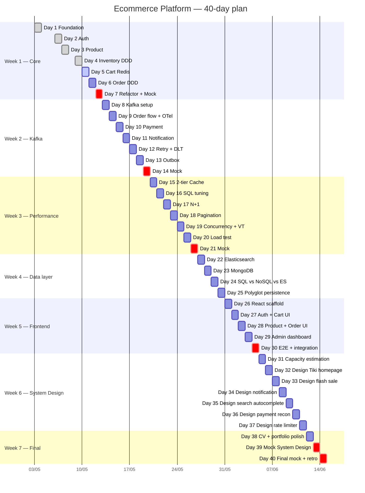

# 40-Day Roadmap & Progress Tracker

> **Đây là source of truth duy nhất về tiến độ.**
> Cập nhật mỗi khi xong 1 day. Khi mở session mới, đọc file này TRƯỚC.
>
> 💡 **"Day" = sprint unit, không phải calendar day.** 1 sprint có thể
> kéo 4 giờ hoặc 3 buổi calendar — đo bằng deliverable, không bằng
> đồng hồ. Tracking calendar date qua [Session log](#-session-log) cuối file.

---

## 🎯 Status snapshot

| Field             | Value                                       |
| ----------------- | ------------------------------------------- |
| Last updated      | 2026-05-09                                  |
| Current sprint    | **Day 4 ✅ Done** (inventory-service DDD: Stock aggregate, optimistic lock `@Version` + `@Retryable`, 100-thread no-oversell test, ADR-003 DDD criteria) |
| Next up           | **Day 5 — Cart Service (Redis)**            |
| Sprints completed | 4 / 40                                      |
| Services built    | 3 / 9 (`common-lib` ✅, `auth-service` ✅, `product-service` ✅, `inventory-service` ✅, gateway/cart/order/payment/notification/analytics ⏳) |
| Docs created      | 20                                          |
| Build tool        | **Gradle 8.11.1 (Kotlin DSL + Version Catalog) — Wrapper present** |
| Spring Boot       | **3.4.5**                                   |
| Blockers          | none                                        |

> Update protocol khi xong 1 day:
> 1. Tick checklist của day đó.
> 2. Cập nhật bảng status trên (Last updated, Current sprint, Next up, counters).
> 3. Ghi 1 dòng vào [Session log](#-session-log) cuối file.
> 4. Update index ở [`docs/README.md` § 2](README.md#2-index--full-document-catalog).

---

## 🧭 Quick navigation

- [Week 1 — Core services & foundation](#-week-1--core-services--foundation) (Day 1-7)
- [Week 2 — Kafka & async workflow](#-week-2--kafka--async-workflow) (Day 8-14)
- [Week 3 — Performance, SQL, concurrency](#-week-3--performance-sql-concurrency) (Day 15-21)
- [Week 4 — Data layer mastery (NoSQL + Search)](#-week-4--data-layer-mastery-nosql--search) (Day 22-25) — **NEW**
- [Week 5 — Frontend + integration](#-week-5--frontend--integration) (Day 26-30)
- [Week 6 — System Design intensive](#-week-6--system-design-intensive) (Day 31-37) — **NEW**
- [Week 7 — Final polish & portfolio](#-week-7--final-polish--portfolio) (Day 38-40)
- [Modernity additions per day](#-modernity-additions-per-day)
- [Session log](#-session-log)

---

## 📊 40-day Gantt overview

> 🟢 done · 🔵 active · ⚪ planned · 🔴 critical milestone (mock interview)

---

## 🏗️ WEEK 1 — Core services & foundation

### ✅ Day 1 — Architecture, repo, docker, common-lib

**Status**: ✅ Done (2026-05-03), **revised** cùng ngày để chuyển sang Gradle + Spring Boot 3.4.5.

- [x] Multi-project **Gradle (Kotlin DSL)** + Version Catalog
- [x] Gradle Wrapper 8.11.1 (`gradlew`, `gradlew.bat`, `gradle-wrapper.jar`)
- [x] Cleanup Maven legacy (`pom.xml` root + `common-lib/pom.xml` đã xóa)
- [x] `.gitignore` + `.gitattributes` (ép LF cho `*.sh` để Postgres init script chạy được trên Windows)
- [x] `docker-compose.yml` (Postgres multi-DB, Redis, Kafka KRaft, Kafka UI)
- [x] `common-lib`: ApiResponse, ErrorCode, BaseException family, BaseEntity, AuditorAware, CorrelationIdFilter, AutoConfiguration
- [x] Docs: system-overview, ADR-001, monorepo-vs-polyrepo lesson, day-01 interview Q&A

**Deliverables**

| Type | Path |
| ---- | ---- |
| Code | `settings.gradle.kts`, `build.gradle.kts`, `gradle/libs.versions.toml`, `gradle.properties` |
| Code | `common-lib/build.gradle.kts` + Java sources |
| Code | `docker-compose.yml`, `infra/postgres/init-multiple-dbs.sh` |
| Doc  | [`architecture/system-overview.md`](architecture/system-overview.md) |
| Doc  | [`decisions/001-why-hybrid-architecture.md`](decisions/001-why-hybrid-architecture.md) |
| Doc  | [`lessons/01-monorepo-vs-polyrepo.md`](lessons/01-monorepo-vs-polyrepo.md) |
| Doc  | [`interview/day-01-foundation.md`](interview/day-01-foundation.md) |

---

### ✅ Day 2 — Auth service

**Status**: done · 2026-05-06

**🆕 Modernity introduces**: Virtual Threads (`spring.threads.virtual.enabled=true`), Records cho DTO, Testcontainers `@ServiceConnection`.

- [x] `auth-service` Spring Boot scaffold + Flyway migration cho `users`, `refresh_tokens`
- [x] Bật virtual threads, kiểm tra `Thread.currentThread().isVirtual()` trong endpoint (`/auth/me`)
- [x] `POST /auth/register` — BCrypt hash (cost=10), validate `@Size(8..72)` chống BCrypt 72-byte trap
- [x] `POST /auth/login` — issue JWT (15min) + refresh token (7d, SHA-256 hash trong DB)
- [x] `POST /auth/refresh` — rotate refresh token, atomic UPDATE chống race
- [x] `GET /auth/me` — JWT-protected, return virtual thread flag
- [x] Exception → ApiResponse via common-lib (JwtAuthenticationFilter handle BusinessException)
- [x] Integration test với Testcontainers Postgres + `@ServiceConnection` (skip default trên local Windows do Docker Desktop 29.x compat — xem [issue 02b](issues/02b-testcontainers-docker-desktop-29.md); enable bằng `RUN_AUTH_INTEGRATION_TESTS=true`)
- [x] Smoke test thực tế (curl + docker compose Postgres): 6 scenario PASS — register / login / /me virtualThread / refresh rotation / duplicate email / wrong password
- [x] Doc: [`lessons/02-jwt-vs-session.md`](lessons/02-jwt-vs-session.md)
- [x] Doc: [`issues/02-token-refresh-race-condition.md`](issues/02-token-refresh-race-condition.md)
- [x] Doc: [`issues/02b-testcontainers-docker-desktop-29.md`](issues/02b-testcontainers-docker-desktop-29.md)
- [x] Doc: [`interview/day-02-auth.md`](interview/day-02-auth.md)
- [x] ADR: [`decisions/002-jwt-vs-session.md`](decisions/002-jwt-vs-session.md)

---

### ✅ Day 3 — Product service

**Status**: done · 2026-05-07

- [x] CRUD product + category
- [x] Search (LIKE basic, Day 16 sẽ tune index, Day 22 sẽ migrate sang ES)
- [x] Pagination offset-based + DTO mapping (MapStruct) + sort whitelist + size cap 100
- [x] Flyway: `products`, `categories` (JSONB `attributes` qua `@JdbcTypeCode(SqlTypes.JSON)` — chuẩn bị migrate Mongo Day 23)
- [x] JWT shared secret với auth-service, `@PreAuthorize("hasRole('ADMIN')")` cho write endpoint, public GET
- [x] DTO record + MapStruct compile-time, `open-in-view: false` chống entity leak
- [x] Integration test Testcontainers gated `RUN_PRODUCT_INTEGRATION_TESTS=true` (assert `hibernateLazyInitializer` doesNotExist)
- [x] Doc: [`lessons/03-pagination-offset-vs-cursor.md`](lessons/03-pagination-offset-vs-cursor.md)
- [x] Doc: [`performance/03-product-search-indexing.md`](performance/03-product-search-indexing.md)
- [x] Doc: [`issues/03-entity-leak-in-response.md`](issues/03-entity-leak-in-response.md)
- [x] Doc: [`interview/day-03-product.md`](interview/day-03-product.md)

---

### ✅ Day 4 — Inventory service (DDD)

**Status**: done · 2026-05-09

**🆕 Modernity introduces**: Sealed types cho domain state, optimistic locking + retry pattern.

- [x] Aggregate `Stock` với `quantity`, `reserved` — invariant `reserved ≤ quantity` enforce trong aggregate
- [x] `reserve(sku, qty)` + `release(sku, qty)` — optimistic lock via `@Version` (kế thừa BaseEntity) + `@Retryable(OptimisticLockingFailureException, REQUIRES_NEW, exp backoff 50→500ms)`
- [x] Domain event `StockReserved` / `StockReleased` qua `@DomainEvents` + `@AfterDomainEventPublication` (publish Day 9 wire Kafka outbox)
- [x] Concurrency test 100 thread reserve cùng 1 sku stock=50 → đúng 50 success, 50 fail `InsufficientStockException`, no oversell (gated `RUN_INVENTORY_INTEGRATION_TESTS=true`)
- [x] DB-level CHECK constraint defense-in-depth: `reserved ≥ 0`, `quantity ≥ 0`, `reserved ≤ quantity`
- [x] 9 unit test pass cho Stock invariant (factory, reserve, release, confirm, edge cases)
- [x] Doc: [`lessons/04-optimistic-locking.md`](lessons/04-optimistic-locking.md)
- [x] Doc: [`lessons/04b-transaction-isolation.md`](lessons/04b-transaction-isolation.md) — 4 isolation levels + Postgres MVCC vs MySQL next-key lock
- [x] Doc: [`issues/04-overselling-stock.md`](issues/04-overselling-stock.md) — 9-section, Approaches compared (optimistic / pessimistic / Redis Lua / SERIALIZABLE)
- [x] Doc: [`interview/day-04-inventory.md`](interview/day-04-inventory.md) — bối cảnh ShopVN/Anh Hùng + AI Playbook + Tech Lead Lens
- [x] ADR: [`decisions/003-ddd-for-order-inventory-payment.md`](decisions/003-ddd-for-order-inventory-payment.md) — 3-điểm criteria DDD vs Layered

---

### ⏳ Day 5 — Cart service

**Status**: pending

- [ ] Redis-backed cart (Hash structure, TTL 7 ngày)
- [ ] Add / update / remove / clear
- [ ] Optimistic merge khi user login (anonymous cart → user cart)
- [ ] Doc: `lessons/05-redis-cart-vs-db-cart.md`
- [ ] Doc: `interview/day-05-cart.md`

---

### ⏳ Day 6 — Order service (DDD)

**Status**: pending

**🆕 Modernity introduces**: Sealed interface cho `OrderStatus` + exhaustive pattern matching switch (Java 21).

- [ ] Aggregate `Order` + entity `OrderItem` + VO `Money`, `Address`
- [ ] Sealed interface `OrderStatus` permits PendingPayment / Paid / Shipped / Delivered / Cancelled
- [ ] Pattern matching switch cho transition rule
- [ ] `placeOrder()` orchestrate cart → inventory.reserve → save
- [ ] Doc: `architecture/order-domain.md`
- [ ] Doc: `lessons/06-aggregate-root.md`
- [ ] Doc: `lessons/06b-sealed-types-state-machine.md`
- [ ] Doc: `interview/day-06-order.md`

---

### ⏳ Day 7 — Refactor + review + mock interview (Week 1)

**Status**: pending

- [ ] Refactor common patterns phát hiện trong tuần
- [ ] REVIEW MODE pass toàn bộ code Week 1
- [ ] Mock interview: 5 câu System Design + 5 câu Spring Boot
- [ ] Doc: `interview/week-01-mock.md`
- [ ] Doc: `interview/week-01-cv-bullets.md`

---

## 📨 WEEK 2 — Kafka & async workflow

### ⏳ Day 8 — Kafka setup

**Status**: pending

**🆕 Modernity introduces**: Spring 6.1 HTTP Interface (declarative HTTP client) — so sánh với OpenFeign.

- [ ] Kafka topics: `order.created`, `order.cancelled`, `payment.completed`, `inventory.reserved`, `notification.outgoing`
- [ ] Producer/consumer config + idempotent producer
- [ ] Demo cả OpenFeign + HTTP Interface song song → Doc trade-off
- [ ] Doc: `lessons/08-kafka-basics.md`
- [ ] Doc: `lessons/08b-feign-vs-http-interface.md`
- [ ] Doc: `architecture/event-driven-flow.md`
- [ ] ADR: `decisions/004-feign-vs-http-interface.md`

---

### ⏳ Day 9 — OrderCreated flow

**Status**: pending

**🆕 Modernity introduces**: Micrometer Tracing + OpenTelemetry (W3C `traceparent` propagation qua Kafka headers).

- [ ] order-service publish `order.created` (mock outbox; thật sự ở Day 13)
- [ ] inventory-service consumer (chuyển từ Feign sang event-driven)
- [ ] notification-service consumer (mock email)
- [ ] Setup Micrometer Tracing + OTel exporter, propagate trace id qua Kafka
- [ ] Doc: `issues/09-eventual-consistency-order.md`
- [ ] Doc: `lessons/09-distributed-tracing-otel.md`
- [ ] Doc: `interview/day-09-order-flow.md`

---

### ⏳ Day 10 — Payment callback

**Status**: pending

- [ ] payment-service: tạo `PaymentIntent` aggregate
- [ ] Mock payment gateway callback endpoint
- [ ] Idempotent xử lý (dedup theo `transactionId` unique constraint)
- [ ] Doc: `issues/10-duplicate-payment-callback.md`
- [ ] Doc: `lessons/10-idempotency.md`

---

### ⏳ Day 11 — Notification service

**Status**: pending

- [ ] Consumer multi-topic (`order.*`, `payment.*`)
- [ ] Template engine (Thymeleaf đơn giản)
- [ ] Fire-and-forget với log
- [ ] API versioning v1 → v2 thử nghiệm trên 1 endpoint (gap problem)
- [ ] Doc: `lessons/11-fire-and-forget.md`
- [ ] Doc: `lessons/11b-api-versioning.md` — URI vs header vs Accept-Version, N-1 deprecation policy
- [ ] ADR: `decisions/008-api-versioning-strategy.md`

---

### ⏳ Day 12 — Retry + Dead Letter Topic

**Status**: pending

**🆕 Modernity introduces**: Resilience4j (circuit breaker + retry + bulkhead + rate limiter).

- [ ] Resilience4j config: circuit breaker cho Feign call, retry cho Kafka consumer, bulkhead cho payment-gateway call
- [ ] Retry policy (exponential backoff, max 3)
- [ ] DLT cho poison message
- [ ] Test: throw exception → message vào DLT, circuit breaker open sau N fails
- [ ] Doc: `lessons/12-retry-strategy.md`
- [ ] Doc: `lessons/12b-circuit-breaker-resilience4j.md`
- [ ] Doc: `lessons/12c-kafka-delivery-semantics.md` — at-most/at-least/exactly-once + manual ack (gap problem)
- [ ] Doc: `lessons/12d-partition-key-ordering.md` — ordering guarantee per-partition + key choice (gap problem)
- [ ] Doc: `issues/12-poison-message.md` — full format (Approaches: skip / DLT / sidetrack / retry-then-DLT)
- [ ] Runbook: `runbooks/kafka-topic-recovery.md`

---

### ⏳ Day 13 — Outbox pattern

**Status**: pending

- [ ] Bảng `outbox_event` ở order-service
- [ ] Outbox relay (scheduled poll → publish → mark sent)
- [ ] Refactor Day 9 dùng outbox thật
- [ ] Doc: `lessons/13-outbox-pattern.md`
- [ ] Doc: `interview/day-13-outbox.md`
- [ ] ADR: `decisions/005-outbox-vs-cdc.md`

---

### ⏳ Day 14 — Review Kafka + interview round (Week 2)

**Status**: pending

- [ ] REVIEW MODE Kafka code
- [ ] Mock interview Kafka senior questions
- [ ] Doc: `interview/week-02-mock.md`
- [ ] Doc: `interview/week-02-cv-bullets.md`

---

## ⚡ WEEK 3 — Performance, SQL, concurrency

### ⏳ Day 15 — Redis cache aside (+ Caffeine 2-tier)

**Status**: pending

**🆕 Modernity introduces**: 2-tier cache — Caffeine (L1, in-process) + Redis (L2, distributed).

- [ ] Cache-aside cho `getProduct(id)` + `searchProducts`
- [ ] L1 Caffeine 60s + L2 Redis 5min, hit ratio metrics
- [ ] TTL strategy + invalidation on update
- [ ] Stampede protection (single-flight pattern)
- [ ] Doc: `performance/15-cache-aside.md`
- [ ] Doc: `performance/15b-two-tier-cache.md`
- [ ] Doc: `issues/15-cache-stampede.md` — full format (Approaches: lock / single-flight / probabilistic early expiration / refresh-ahead) (gap problem)
- [ ] Doc: `issues/15b-hot-key.md` — viral product Redis bottleneck, local cache fallback / key sharding (gap problem)

---

### ⏳ Day 16 — Slow query tuning

**Status**: pending

- [ ] Tạo dataset 1M products
- [ ] EXPLAIN ANALYZE — tìm seq scan
- [ ] Index B-tree, partial, covering, GIN cho search
- [ ] Before/after benchmark
- [ ] Doc: `performance/16-sql-explain-analyze.md`

---

### ⏳ Day 17 — JPA N+1

**Status**: pending

- [ ] Tạo case N+1: order list with items
- [ ] Fix: `@EntityGraph` → `JOIN FETCH` → projection DTO
- [ ] Doc: `issues/17-jpa-n-plus-one.md`

---

### ⏳ Day 18 — Pagination at scale

**Status**: pending

- [ ] Offset pagination với 10M rows → đo chậm
- [ ] Convert sang seek (keyset) pagination
- [ ] Doc: `performance/18-seek-pagination.md`

---

### ⏳ Day 19 — Java concurrency

**Status**: pending

**🆕 Modernity introduces**: Virtual threads benchmark + Structured Concurrency preview (JEP 480/505).

- [ ] `synchronized` vs `ReentrantLock` vs `StampedLock` — benchmark
- [ ] Optimistic vs pessimistic DB lock — case inventory
- [ ] Virtual threads vs platform threads — JMH benchmark cho IO-bound endpoint
- [ ] Structured concurrency (`StructuredTaskScope`) — fan-out call cart + product + inventory
- [ ] Pinning gotcha: `synchronized` + virtual thread = pin; chuyển sang `ReentrantLock` để unpin
- [ ] Distributed lock với Redis SET NX PX cho 1 idempotent operation
- [ ] Doc: `lessons/19-java-locking.md`
- [ ] Doc: `lessons/19b-virtual-threads-deep.md`
- [ ] Doc: `lessons/19c-distributed-lock-redlock.md` — Redlock + Kleppmann/antirez debate + fencing token (gap problem)
- [ ] Doc: `issues/19-redlock-correctness.md` — full format (Approaches: SET NX / Redlock / ZooKeeper / fencing token; GC pause scenario) (gap problem)

---

### ⏳ Day 20 — Load testing

**Status**: pending

**🆕 Modernity introduces**: k6 + Grafana + visualize OTel traces qua Tempo/Jaeger.

- [ ] k6 script cho place-order flow
- [ ] Đo: P50, P95, P99, throughput, error rate
- [ ] Compare virtual-thread vs platform-thread under load
- [ ] Identify bottleneck via OTel trace timeline
- [ ] Doc: `performance/20-load-test-report-template.md`
- [ ] Doc: `performance/20b-vt-vs-platform-thread-bench.md`

---

### ⏳ Day 21 — Review performance + interview round (Week 3)

**Status**: pending

- [ ] REVIEW MODE performance code
- [ ] Mock interview: SQL tuning + concurrency + load test
- [ ] Doc: `interview/week-03-mock.md`
- [ ] Doc: `interview/week-03-cv-bullets.md`

---

## 🗄️ WEEK 4 — Data layer mastery (NoSQL + Search)

> **Mục đích**: trả lời câu phỏng vấn classic *"khi nào dùng NoSQL?"*
> bằng implementation thật, không phải lý thuyết. Sau tuần này có hands-on
> với 4 storage paradigm: **Postgres (relational) · Redis (k-v + cache) ·
> MongoDB (document) · Elasticsearch (inverted index)**.

### ⏳ Day 22 — Elasticsearch cho product search

**Status**: pending

**🆕 Modernity introduces**: Elasticsearch 8 + Spring Data Elasticsearch + sync via Kafka.

- [ ] Add ES vào `docker-compose.yml` (single-node, no security cho dev)
- [ ] Replace LIKE search ở `product-service` bằng ES — endpoint `/products/search?q=...`
- [ ] Sync Postgres → ES qua Kafka event `product.upserted` / `product.deleted` (CDC-lite)
- [ ] Faceted search: filter theo category + price range + brand, aggregation count
- [ ] Highlight matched terms trong response
- [ ] Benchmark: LIKE 1M rows vs ES 1M docs → P50/P95/throughput
- [ ] Doc: `lessons/22-elasticsearch-basics.md` (inverted index, analyzer, mapping)
- [ ] Doc: `lessons/22b-cdc-vs-app-sync-vs-debezium.md`
- [ ] Doc: `performance/22-search-postgres-vs-es.md`
- [ ] Doc: `interview/day-22-elasticsearch.md`
- [ ] ADR: `decisions/006-postgres-vs-elasticsearch-search.md`

---

### ⏳ Day 23 — MongoDB integration

**Status**: pending

**🆕 Modernity introduces**: MongoDB 7 + Spring Data MongoDB. Use case có **chủ ý**, không phải "Mongo cho có".

- [ ] Add MongoDB vào `docker-compose.yml`
- [ ] Use case 1 — `analytics-service` event store: schemaless event (`ProductViewed`, `CartUpdated`, `OrderPlaced`) với attribute đa dạng theo event type → document model phù hợp
- [ ] Use case 2 — `product-service` flexible attributes: TV có "screen_size/resolution", áo có "size/color/material" → ép schema relational sẽ EAV anti-pattern; document model là tự nhiên
- [ ] Aggregation pipeline cho analytics report (top products, conversion funnel)
- [ ] Index strategy: compound index, TTL index cho event expiry 90 ngày
- [ ] Doc: `lessons/23-mongodb-when-to-use.md`
- [ ] Doc: `lessons/23b-document-vs-relational-modeling.md`
- [ ] Doc: `issues/23-mongodb-no-transaction-trap.md` (transaction cross-document trước v4.0)
- [ ] Doc: `interview/day-23-mongodb.md`
- [ ] ADR: `decisions/007-mongo-for-analytics-and-flexible-attributes.md`

---

### ⏳ Day 24 — SQL vs NoSQL vs ES — comparative deep-dive

**Status**: pending

> Day này 90% là **doc + interview drill**, ít code mới. Mục đích: solidify
> mental model để answer câu phỏng vấn classic không bị flounder.

- [ ] Build **decision matrix** 8 use case × 4 storage (Postgres / Redis / Mongo / ES) với verdict + reasoning
- [ ] So sánh trên **5 axis**: consistency model · schema flexibility · query capability · scaling pattern · operational cost
- [ ] Drill anti-pattern: dùng Mongo cho data có invariant chặt; dùng Postgres cho schemaless attribute; dùng ES làm primary store
- [ ] Cập nhật `architecture/system-overview.md` — thêm Mongo + ES vào diagram, tô màu storage type khác nhau
- [ ] Doc: `lessons/24-sql-vs-nosql-vs-es-decision-matrix.md`
- [ ] Doc: `lessons/24b-cap-pacelc-in-practice.md`
- [ ] Doc: `interview/day-24-storage-decisions.md`

---

### ⏳ Day 25 — Polyglot persistence — review + anti-pattern

**Status**: pending

> Tuần này đã add Mongo + ES. Giờ system có 4 storage. Day 25 review
> kiến trúc + chống "polyglot persistence gone wrong".

- [ ] Review system: data ownership rõ ràng cho mỗi storage (source of truth ai giữ)
- [ ] Sync strategy: ai owns Postgres → ai owns ES → ai owns Mongo, sync chiều nào, eventual consistency window đo bằng gì
- [ ] Anti-pattern checklist: dual-write problem, sync drift, ops burden, "1 storage 1 service" sai chỗ
- [ ] Failure mode: Mongo down → app degrade thế nào; ES down → fallback Postgres LIKE?
- [ ] Doc: `architecture/data-ownership-map.md` (sơ đồ ai owns gì, sync cạnh nào)
- [ ] Doc: `lessons/25-polyglot-persistence-anti-patterns.md`
- [ ] Doc: `interview/day-25-polyglot-review.md`
- [ ] Doc: `interview/week-04-cv-bullets.md`

---

## 💻 WEEK 5 — Frontend & integration

> Frontend dồn vào tuần 5 (rule [CLAUDE.md § 7](../CLAUDE.md)). Goal:
> đủ để **demo end-to-end** ở phỏng vấn portfolio review, không phải FE
> showcase.

### ⏳ Day 26 — React scaffold + design system

**Status**: pending

- [ ] Vite + React 18 + TypeScript + TanStack Query v5 + Ant Design + Vitest
- [ ] Folder structure: `features/` (vertical slice) + `shared/`
- [ ] axios interceptor: `ApiResponse<T>` unwrap + `X-Correlation-Id` propagation
- [ ] Auth context + token refresh interceptor (silent refresh khi 401)
- [ ] Doc: `lessons/26-frontend-architecture.md`
- [ ] Doc: `interview/day-26-frontend-arch.md`

---

### ⏳ Day 27 — Auth + Cart UI

**Status**: pending

- [ ] Login / Register / `/me` page
- [ ] Cart page với optimistic update (TanStack Query mutation)
- [ ] Anonymous cart → user cart merge sau login
- [ ] Doc: `lessons/27-optimistic-ui-tanstack.md`

---

### ⏳ Day 28 — Product list + Order checkout

**Status**: pending

- [ ] Product list với ES search + faceted filter UI
- [ ] Pagination (cursor-based UI cho infinite scroll)
- [ ] Checkout flow: cart review → address → payment mock → order confirmation
- [ ] Doc: `lessons/28-cursor-pagination-ui.md`

---

### ⏳ Day 29 — Admin dashboard + analytics view

**Status**: pending

- [ ] Admin: product CRUD, inventory adjust, order list
- [ ] Analytics: top products, conversion funnel (data từ Mongo aggregation Day 23)
- [ ] Real-time: SSE cho order status update
- [ ] Doc: `lessons/29-sse-vs-websocket-vs-polling.md`

---

### ⏳ Day 30 — End-to-end + integration test

**Status**: pending

- [ ] Playwright: place-order happy path E2E
- [ ] CI: spin docker-compose + run E2E
- [ ] Polish: loading states, error boundary, 404/500 page
- [ ] Doc: `runbooks/local-dev-setup.md` (1 lệnh bring up cả stack)
- [ ] Doc: `interview/week-05-cv-bullets.md`

---

## 🏛️ WEEK 6 — System Design intensive

> 7 ngày system design **tách khỏi code** — luyện whiteboard interview.
> Mỗi day là 1 problem statement classic, output là design doc theo
> template + 90-second pitch.
>
> **Template cố định**:
> 1. Functional + non-functional requirements
> 2. Capacity estimation (numbers!)
> 3. High-level design (Mermaid diagram)
> 4. Deep-dive 2-3 component
> 5. Bottleneck + scale-out
> 6. Trade-off table
> 7. Interview talking points (90s pitch)

### ⏳ Day 31 — Capacity estimation skill

**Status**: pending

> Day này là **foundation cho cả tuần**. Đa số candidate skip step này
> trong interview → bị trừ điểm. Day 31 ép mình quen với numbers.

- [ ] Cheatsheet: latency (cache 1ms / DC RTT 0.5ms / cross-region 100ms / disk seek 10ms / SSD 0.1ms)
- [ ] Cheatsheet: throughput (1 server ~1k QPS web, ~10k QPS cache, ~10MB/s disk write)
- [ ] Drill 5 problem ước tính: ecommerce DAU → QPS peak → storage 5y → bandwidth → server count
- [ ] Doc: `system-design/31-capacity-estimation-cheatsheet.md`
- [ ] Doc: `interview/day-31-capacity.md`

---

### ⏳ Day 32 — Design Tiki/Shopee homepage feed

**Status**: pending

- [ ] Requirements: 10M DAU, personalized homepage, latency P99 < 200ms
- [ ] Trade-off: pre-compute (fan-out write) vs on-demand (fan-out read) vs hybrid
- [ ] Recommendation pipeline: realtime vs batch
- [ ] Cache strategy: edge CDN + Redis hot key + DB
- [ ] Doc: `system-design/32-homepage-feed.md`
- [ ] Doc: `interview/day-32-homepage.md`

---

### ⏳ Day 33 — Design flash sale (oversell prevention at scale)

**Status**: pending

> Topic này phỏng vấn HOT ở VN — Shopee/Tiki/Lazada interview hay hỏi.

- [ ] Requirements: 100k user/sec đập 1 SKU stock 1000, fairness, no oversell
- [ ] Strategy compare: DB pessimistic lock · Redis decrement · Kafka queue · Lua script atomic
- [ ] Pre-warming, rate limit, queue + estimated wait time UX
- [ ] Bot/abuse defense: captcha, IP rate limit, account age
- [ ] Doc: `system-design/33-flash-sale.md`
- [ ] Doc: `interview/day-33-flash-sale.md`

---

### ⏳ Day 34 — Design notification system at scale

**Status**: pending

- [ ] Requirements: 10M push/day, multi-channel (push/email/sms), priority queue, dedup
- [ ] Fan-out vs targeted, user preference, rate limit per user
- [ ] Provider failover (Firebase fail → fallback APNS direct)
- [ ] Delivery tracking + analytics
- [ ] Doc: `system-design/34-notification-at-scale.md`
- [ ] Doc: `interview/day-34-notification.md`

---

### ⏳ Day 35 — Design search autocomplete

**Status**: pending

- [ ] Requirements: latency P99 < 100ms, 50k QPS, top-K trending, personalization
- [ ] Trie vs ES suggester vs Redis sorted set — trade-off
- [ ] Index update lag, popular query precomputed
- [ ] Doc: `system-design/35-autocomplete.md`
- [ ] Doc: `interview/day-35-autocomplete.md`

---

### ⏳ Day 36 — Design payment reconciliation

**Status**: pending

- [ ] Requirements: end-of-day batch reconcile với 3 payment provider, idempotent retry, audit trail, exception flow
- [ ] Double-entry bookkeeping pattern
- [ ] Reconciliation mismatch handling: auto-resolve vs human-in-loop
- [ ] Doc: `system-design/36-payment-reconciliation.md`
- [ ] Doc: `interview/day-36-payment-recon.md`

---

### ⏳ Day 37 — Design distributed rate limiter

**Status**: pending

- [ ] Algorithm compare: token bucket · leaky bucket · fixed window · sliding window log/counter
- [ ] Distributed: Redis Lua atomic vs in-memory + sync vs cell-based
- [ ] Hot key + thundering herd defense
- [ ] Doc: `system-design/37-rate-limiter.md`
- [ ] Doc: `interview/day-37-rate-limiter.md`
- [ ] Doc: `interview/week-06-cv-bullets.md`

---

## 🎓 WEEK 7 — Final polish & portfolio

### ⏳ Day 38 — CV + portfolio polish

**Status**: pending

- [ ] Compile tất cả `interview/week-NN-cv-bullets.md` → 1 master CV bullet list
- [ ] README portfolio: GIF demo + architecture diagram + tech stack
- [ ] Personal-lab pitch script (90s) — phiên bản trung thực không claim "team 6 dev" (xem [`leadership/incidents.md`](leadership/incidents.md))
- [ ] LinkedIn / GitHub README polish
- [ ] Doc: `interview/portfolio-pitch-script.md`

---

### ⏳ Day 39 — Mock System Design interview

**Status**: pending (critical milestone)

- [ ] Tonny chọn 1 problem chưa đụng (vd: design Uber, design Netflix, design distributed cache)
- [ ] AI đóng role senior interviewer Style A — brutally honest
- [ ] 60 phút full session, ghi lại weakness
- [ ] Doc: `interview/day-39-mock-sd.md`

---

### ⏳ Day 40 — Final mock + retro

**Status**: pending (critical milestone)

- [ ] Mix mock: 30 phút coding + 30 phút system design + 15 phút behavioral
- [ ] Retrospective 40 day: gì work, gì waste, gì cần ôn thêm trước khi apply
- [ ] Action plan 30 ngày tiếp theo (apply pattern thật ở Sotatek + apply phỏng vấn)
- [ ] Doc: `interview/day-40-final.md`
- [ ] Doc: `retrospective.md`

---

## 🆕 Modernity additions per day

| Day | Tech mới được introduce                                            |
| --- | ------------------------------------------------------------------ |
| 2   | Virtual Threads (`spring.threads.virtual.enabled=true`), Records, Testcontainers `@ServiceConnection` |
| 4   | Optimistic locking (`@Version`), Sealed types cho domain state     |
| 6   | Sealed interface cho `OrderStatus` + exhaustive pattern matching   |
| 8   | Spring 6.1 HTTP Interface vs OpenFeign — so sánh trade-off         |
| 9   | Micrometer Tracing + OpenTelemetry (W3C traceparent)               |
| 12  | Resilience4j: circuit breaker + retry + bulkhead + DLT             |
| 15  | Caffeine L1 + Redis L2 (2-tier cache)                              |
| 19  | Virtual thread benchmark + structured concurrency preview          |
| 20  | k6 load test + Grafana + OTel traces visualization                 |
| 22  | Elasticsearch 8 + Spring Data Elasticsearch + Kafka-based sync     |
| 23  | MongoDB 7 + Spring Data MongoDB (purposeful use case, không cargo-cult) |
| 26  | React 18 + TanStack Query v5 + Ant Design + Vite + Vitest          |
| 30  | Playwright E2E + CI integration                                    |
| 31  | Capacity estimation discipline (numbers-first system design)       |

---

## 📓 Session log

> **1 dòng / 1 session làm việc** (không phải 1 dòng / calendar day).
> Format: `YYYY-MM-DD timeOfDay · duration · sprint(s) touched · note`

- **2026-05-03** · ~6h · Day 1 done — gradle migration, common-lib, docs (4 file).
- **2026-05-04 morning** · ~2h · Day 1 cleanup — fix Maven leftover, generate Gradle Wrapper, fix `repositories` conflict, add `.gitattributes`. Build green.
- **2026-05-04 evening** · ~1h · Roadmap revamp — 30→40 day, thêm Week 4 (data layer NoSQL+ES) + Week 6 (system design intensive). Update Gantt + dependency map.
- **2026-05-06** · Day 2 — `auth-service` deliverable: JWT stateless (HS256, 15min) + refresh rotation atomic UPDATE + virtual threads bật + Records DTO + Testcontainers `@ServiceConnection` skeleton. 5 docs (ADR-002, lesson 02, issue 02 race condition, issue 02b testcontainers compat, interview day-02). Smoke test 6/6 pass; integration test skip default trên local Windows do Docker Desktop 29.x. Branch `day-02-auth`.
- **2026-05-07** · Day 3 — `product-service` deliverable: CRUD product + category, JSONB `attributes` qua `@JdbcTypeCode(SqlTypes.JSON)`, MapStruct DTO record (anti entity-leak), offset pagination + sort whitelist + size cap 100, JWT shared secret với auth-service. 4 docs (lesson 03 pagination offset vs cursor, perf 03 search indexing, issue 03 entity-leak 9-section, interview day-03 + bối cảnh giả lập ShopVN/PM Linh/Tech Lead Hùng). Build green; integration test skip default. Branch `day-03-product`.
- **2026-05-09** · Day 4 — `inventory-service` DDD deliverable: Aggregate `Stock` enforce invariant `reserved ≤ quantity` ở constructor + method (factory `Stock.create`, no public setter), `@Version` optimistic lock kế thừa BaseEntity, `@Retryable(OptimisticLockingFailureException, maxAttempts=4, REQUIRES_NEW)` exp backoff. Domain event `StockReserved`/`StockReleased` qua `@DomainEvents` (Spring Data hook nguyên thủy thay vì AbstractAggregateRoot vì single inheritance). DB CHECK constraint defense-in-depth. 9/9 unit test pass; 100-thread concurrency IT gated `RUN_INVENTORY_INTEGRATION_TESTS=true`. 5 docs: ADR-003 (DDD 3-điểm criteria), lesson 04 optimistic-locking, lesson 04b transaction-isolation (fill skeleton), issue 04 overselling 9-section (4 approach), interview day-04 + AI Playbook + Tech Lead Lens. Branch `day-04-inventory-ddd`.
