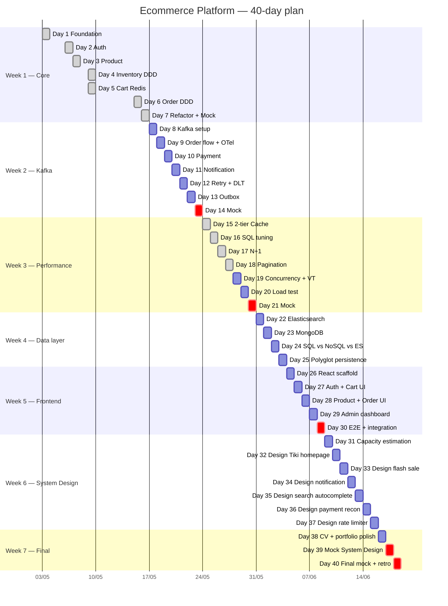

# 40-Day Roadmap & Progress Tracker

> **Đây là source of truth duy nhất về tiến độ.**
> Cập nhật mỗi khi xong 1 day. Khi mở session mới, đọc file này TRƯỚC.
>
> 💡 **"Day" = sprint unit, không phải calendar day.** 1 sprint có thể
> kéo 4 giờ hoặc 3 buổi calendar — đo bằng deliverable, không bằng
> đồng hồ. Tracking calendar date qua [Session log](#-session-log) cuối file.

---

## 🎯 Status snapshot

| Field             | Value                                       |
| ----------------- | ------------------------------------------- |
| Last updated      | 2026-05-31                                  |
| Current sprint    | **Day 18 ✅ Done** — Pagination at scale. Deep offset trên seed 1M (`LIMIT 20 OFFSET 980000`) phơi bày lời nguyền trang cuối: Postgres scan+discard 980K rows (~2.4s, ~31K buffers) — index chỉ bỏ qua *sort* không bỏ qua *duyệt*. Fix **keyset (seek)**: row-value `(created_at, id) < (cursor)` expand JPQL (JPQL không hỗ trợ tuple compare) + `ORDER BY created_at DESC, id DESC` + tie-break `id` (chống lặp/skip row trùng timestamp) + fetch `size+1` dò `hasNext` không COUNT → ~3ms, ~30 buffers **phẳng mọi độ sâu**. Cursor opaque base64 `(epochMicros:uuid)` — micro-precision khớp TIMESTAMPTZ, token rác → 400. V6 index `(created_at DESC, id DESC)` khớp khít ORDER BY → no Sort node. Giữ **2 cửa**: offset `GET /products` cap page≤500 (admin jump-to-page) · keyset `GET /products/keyset?cursor=` (mobile infinite-scroll). `KeysetPage` envelope không total. 4 unit test cursor codec pass. 4 doc + evolution ch.18 "Người thủ thư và cái kẹp sách". Previous: **Day 17 ✅ Done** — JPA N+1, projection DTO, 41 query → 2 query |
| Next up           | **Day 19 — Java concurrency (locks + Virtual Threads benchmark + pinning)** |
| Sprints completed | 18 / 40                                     |
| Services built    | 7 / 9 (`common-lib` ✅, `auth-service` ✅, `product-service` ✅, `inventory-service` ✅, `cart-service` ✅, `order-service` ✅ (outbox), `payment-service` ✅, `notification-service` ✅, gateway/analytics ⏳) |
| Docs created      | 91                                          |
| Build tool        | **Gradle 8.11.1 (Kotlin DSL + Version Catalog) — Wrapper present** |
| Spring Boot       | **3.4.5**                                   |
| Blockers          | none                                        |

> Update protocol khi xong 1 day:
> 1. Tick checklist của day đó.
> 2. Cập nhật bảng status trên (Last updated, Current sprint, Next up, counters).
> 3. Ghi 1 dòng vào [Session log](#-session-log) cuối file.
> 4. Update index ở [`docs/README.md` § 2](README.md#2-index--full-document-catalog).

---

## 🧭 Quick navigation

- [Week 1 — Core services & foundation](#-week-1--core-services--foundation) (Day 1-7)
- [Week 2 — Kafka & async workflow](#-week-2--kafka--async-workflow) (Day 8-14)
- [Week 3 — Performance, SQL, concurrency](#-week-3--performance-sql-concurrency) (Day 15-21)
- [Week 4 — Data layer mastery (NoSQL + Search)](#-week-4--data-layer-mastery-nosql--search) (Day 22-25) — **NEW**
- [Week 5 — Frontend + integration](#-week-5--frontend--integration) (Day 26-30)
- [Week 6 — System Design intensive](#-week-6--system-design-intensive) (Day 31-37) — **NEW**
- [Week 7 — Final polish & portfolio](#-week-7--final-polish--portfolio) (Day 38-40)
- [Modernity additions per day](#-modernity-additions-per-day)
- [Session log](#-session-log)

---

## 📊 40-day Gantt overview

> 🟢 done · 🔵 active · ⚪ planned · 🔴 critical milestone (mock interview)

---

## 🏗️ WEEK 1 — Core services & foundation

### ✅ Day 1 — Architecture, repo, docker, common-lib

**Status**: ✅ Done (2026-05-03), **revised** cùng ngày để chuyển sang Gradle + Spring Boot 3.4.5.

- [x] Multi-project **Gradle (Kotlin DSL)** + Version Catalog
- [x] Gradle Wrapper 8.11.1 (`gradlew`, `gradlew.bat`, `gradle-wrapper.jar`)
- [x] Cleanup Maven legacy (`pom.xml` root + `common-lib/pom.xml` đã xóa)
- [x] `.gitignore` + `.gitattributes` (ép LF cho `*.sh` để Postgres init script chạy được trên Windows)
- [x] `docker-compose.yml` (Postgres multi-DB, Redis, Kafka KRaft, Kafka UI)
- [x] `common-lib`: ApiResponse, ErrorCode, BaseException family, BaseEntity, AuditorAware, CorrelationIdFilter, AutoConfiguration
- [x] Docs: system-overview, ADR-001, monorepo-vs-polyrepo lesson, day-01 interview Q&A

**Deliverables**

| Type | Path |
| ---- | ---- |
| Code | `settings.gradle.kts`, `build.gradle.kts`, `gradle/libs.versions.toml`, `gradle.properties` |
| Code | `common-lib/build.gradle.kts` + Java sources |
| Code | `docker-compose.yml`, `infra/postgres/init-multiple-dbs.sh` |
| Doc  | [`architecture/system-overview.md`](architecture/system-overview.md) |
| Doc  | [`decisions/001-why-hybrid-architecture.md`](decisions/001-why-hybrid-architecture.md) |
| Doc  | [`lessons/01-monorepo-vs-polyrepo.md`](lessons/01-monorepo-vs-polyrepo.md) |
| Doc  | [`interview/day-01-foundation.md`](interview/day-01-foundation.md) |

---

### ✅ Day 2 — Auth service

**Status**: done · 2026-05-06

**🆕 Modernity introduces**: Virtual Threads (`spring.threads.virtual.enabled=true`), Records cho DTO, Testcontainers `@ServiceConnection`.

- [x] `auth-service` Spring Boot scaffold + Flyway migration cho `users`, `refresh_tokens`
- [x] Bật virtual threads, kiểm tra `Thread.currentThread().isVirtual()` trong endpoint (`/auth/me`)
- [x] `POST /auth/register` — BCrypt hash (cost=10), validate `@Size(8..72)` chống BCrypt 72-byte trap
- [x] `POST /auth/login` — issue JWT (15min) + refresh token (7d, SHA-256 hash trong DB)
- [x] `POST /auth/refresh` — rotate refresh token, atomic UPDATE chống race
- [x] `GET /auth/me` — JWT-protected, return virtual thread flag
- [x] Exception → ApiResponse via common-lib (JwtAuthenticationFilter handle BusinessException)
- [x] Integration test với Testcontainers Postgres + `@ServiceConnection` (skip default trên local Windows do Docker Desktop 29.x compat — xem [issue 02b](issues/02b-testcontainers-docker-desktop-29.md); enable bằng `RUN_AUTH_INTEGRATION_TESTS=true`)
- [x] Smoke test thực tế (curl + docker compose Postgres): 6 scenario PASS — register / login / /me virtualThread / refresh rotation / duplicate email / wrong password
- [x] Doc: [`lessons/02-jwt-vs-session.md`](lessons/02-jwt-vs-session.md)
- [x] Doc: [`issues/02-token-refresh-race-condition.md`](issues/02-token-refresh-race-condition.md)
- [x] Doc: [`issues/02b-testcontainers-docker-desktop-29.md`](issues/02b-testcontainers-docker-desktop-29.md)
- [x] Doc: [`interview/day-02-auth.md`](interview/day-02-auth.md)
- [x] ADR: [`decisions/002-jwt-vs-session.md`](decisions/002-jwt-vs-session.md)

---

### ✅ Day 3 — Product service

**Status**: done · 2026-05-07

- [x] CRUD product + category
- [x] Search (LIKE basic, Day 16 sẽ tune index, Day 22 sẽ migrate sang ES)
- [x] Pagination offset-based + DTO mapping (MapStruct) + sort whitelist + size cap 100
- [x] Flyway: `products`, `categories` (JSONB `attributes` qua `@JdbcTypeCode(SqlTypes.JSON)` — chuẩn bị migrate Mongo Day 23)
- [x] JWT shared secret với auth-service, `@PreAuthorize("hasRole('ADMIN')")` cho write endpoint, public GET
- [x] DTO record + MapStruct compile-time, `open-in-view: false` chống entity leak
- [x] Integration test Testcontainers gated `RUN_PRODUCT_INTEGRATION_TESTS=true` (assert `hibernateLazyInitializer` doesNotExist)
- [x] Doc: [`lessons/03-pagination-offset-vs-cursor.md`](lessons/03-pagination-offset-vs-cursor.md)
- [x] Doc: [`performance/03-product-search-indexing.md`](performance/03-product-search-indexing.md)
- [x] Doc: [`issues/03-entity-leak-in-response.md`](issues/03-entity-leak-in-response.md)
- [x] Doc: [`interview/day-03-product.md`](interview/day-03-product.md)

---

### ✅ Day 4 — Inventory service (DDD)

**Status**: done · 2026-05-09

**🆕 Modernity introduces**: Sealed types cho domain state, optimistic locking + retry pattern.

- [x] Aggregate `Stock` với `quantity`, `reserved` — invariant `reserved ≤ quantity` enforce trong aggregate
- [x] `reserve(sku, qty)` + `release(sku, qty)` — optimistic lock via `@Version` (kế thừa BaseEntity) + `@Retryable(OptimisticLockingFailureException, REQUIRES_NEW, exp backoff 50→500ms)`
- [x] Domain event `StockReserved` / `StockReleased` qua `@DomainEvents` + `@AfterDomainEventPublication` (publish Day 9 wire Kafka outbox)
- [x] Concurrency test 100 thread reserve cùng 1 sku stock=50 → đúng 50 success, 50 fail `InsufficientStockException`, no oversell (gated `RUN_INVENTORY_INTEGRATION_TESTS=true`)
- [x] DB-level CHECK constraint defense-in-depth: `reserved ≥ 0`, `quantity ≥ 0`, `reserved ≤ quantity`
- [x] 9 unit test pass cho Stock invariant (factory, reserve, release, confirm, edge cases)
- [x] Doc: [`lessons/04-optimistic-locking.md`](lessons/04-optimistic-locking.md)
- [x] Doc: [`lessons/04b-transaction-isolation.md`](lessons/04b-transaction-isolation.md) — 4 isolation levels + Postgres MVCC vs MySQL next-key lock
- [x] Doc: [`issues/04-overselling-stock.md`](issues/04-overselling-stock.md) — 9-section, Approaches compared (optimistic / pessimistic / Redis Lua / SERIALIZABLE)
- [x] Doc: [`interview/day-04-inventory.md`](interview/day-04-inventory.md) — bối cảnh ShopVN/Anh Hùng + AI Playbook + Tech Lead Lens
- [x] ADR: [`decisions/003-ddd-for-order-inventory-payment.md`](decisions/003-ddd-for-order-inventory-payment.md) — 3-điểm criteria DDD vs Layered

---

### ✅ Day 5 — Cart service

**Status**: done · 2026-05-09

- [x] Redis-backed cart (Hash structure, TTL 7 ngày, refresh-on-mutate only)
- [x] Add / update / remove / clear / get — 5 endpoint + 6th `/cart/merge`
- [x] Anonymous → user cart merge với rule **sum quantity per SKU**, anon DEL after merge
- [x] HINCRBY atomic field-level (chống lost-update khi 2 tab cùng add 1 SKU)
- [x] Hard cap `maxQtyPerItem=999` + `maxItemsPerCart=100` chống abuse, rollback decrement nếu vượt
- [x] JWT verify reuse pattern từ product-service; cart endpoint cho phép anonymous via header `X-Cart-Token`
- [x] Concurrency IT 100-thread (gated `RUN_CART_INTEGRATION_TESTS=true`) + merge IT (3 scenario)
- [x] 4 unit test PASS (CartId sealed pattern matching + namespace key)
- [x] Doc: [`lessons/05-redis-cart-vs-db-cart.md`](lessons/05-redis-cart-vs-db-cart.md)
- [x] Doc: [`lessons/05b-redis-data-structures.md`](lessons/05b-redis-data-structures.md)
- [x] Doc: [`issues/05-cart-merge-conflict-on-login.md`](issues/05-cart-merge-conflict-on-login.md) — 9-section, 4 approaches
- [x] Doc: [`interview/day-05-cart.md`](interview/day-05-cart.md) — bối cảnh ShopVN/Anh Hùng + AI Playbook
- [x] ADR: [`decisions/004-redis-primary-for-cart.md`](decisions/004-redis-primary-for-cart.md) — 4 alternatives compared

---

### ✅ Day 6 — Order service (DDD)

**Status**: done · 2026-05-15

**🆕 Modernity introduces**: Sealed interface cho `OrderStatus` + exhaustive pattern matching switch (Java 21).

- [x] Aggregate `Order` + entity `OrderItem` + VO `Money`, `Address` (record `@Embeddable`)
- [x] Sealed interface `OrderStatus` permits PendingPayment / Paid / Shipped / Delivered / Cancelled (mỗi permit có data riêng)
- [x] Pattern matching switch cho transition rule + `isTerminal()` — KHÔNG có `default ->` branch (exhaustive guarantee)
- [x] `placeOrder()` orchestrate cart → loop inventory.reserve → save Order — try-catch compensation pattern, best-effort release với log `ORPHAN-RESERVATION`
- [x] Persistence: 2 column `status_type VARCHAR + status_data JSONB` qua `@PostLoad`/`@PrePersist` + `OrderStatusSerializer` (exhaustive switch)
- [x] Idempotency key partial unique index `(user_id, idempotency_key) WHERE idempotency_key IS NOT NULL`
- [x] DB CHECK constraints defense-in-depth: status_type IN whitelist, amount ≥ 0
- [x] 9 unit test Aggregate (create / addItem / place empty cart / transition valid+invalid / terminal mutate / domain event) PASS
- [x] 5 unit test sealed status JSON round-trip PASS — toJson + fromDb cho cả 5 permit
- [x] Doc: [`architecture/order-domain.md`](architecture/order-domain.md) — classDiagram + stateDiagram + sequenceDiagram orchestration
- [x] Doc: [`lessons/06-aggregate-root.md`](lessons/06-aggregate-root.md) — Aggregate boundary, 5 cạm bẫy, 3-approach comparison
- [x] Doc: [`lessons/06b-sealed-types-state-machine.md`](lessons/06b-sealed-types-state-machine.md) — sealed vs enum, exhaustive switch, persistence pattern
- [x] Doc: [`issues/06-orchestration-rollback.md`](issues/06-orchestration-rollback.md) — 9-section, 4 approaches (sync compensate / saga choreography / saga orchestration / 2PC)
- [x] Doc: [`interview/day-06-order.md`](interview/day-06-order.md) — bối cảnh ShopVN/Anh Hùng + 5 Q&A + AI Playbook + Tech Lead Lens

---

### ✅ Day 7 — Refactor + review + mock interview (Week 1)

**Status**: done · 2026-05-16

- [x] Refactor JWT verify-only stack (4 service: product/inventory/cart/order) → `common-lib/security/` auto-config (`@ConditionalOnClass` + `@ConditionalOnProperty` + `@ConditionalOnMissingBean`); auth-service KHÔNG động (principal có `tokenVersion` khác contract). Xóa 16 file duplicate.
- [x] Build green toàn repo: 6 module compile, 32 unit test PASS (9 Stock + 14 Order + 5 OrderStatus JSON + 4 CartId), integration test gated SKIP. Build 1m29s.
- [x] Mock interview 10 Q&A (5 System Design + 5 Spring/DDD/Concurrency) self-grade brutally honest: 9 strong / 1 borderline (VT pinning case Day 19 sẽ fix bằng JFR thật) / 0 fail
- [x] Doc: [`lessons/07-refactor-extract-discipline.md`](lessons/07-refactor-extract-discipline.md) — rule of three, 3-điểm criteria, 4 cạm bẫy
- [x] Doc: [`interview/week-01-mock.md`](interview/week-01-mock.md) — 10 Q&A + verdict + gap to fix
- [x] Doc: [`interview/week-01-cv-bullets.md`](interview/week-01-cv-bullets.md) — 2 bullet metric-driven + 90s elevator pitch
- [x] Doc: [`review/ai-junior-traps.md`](review/ai-junior-traps.md) — append entry [03] premature-DRY + [04] auto-config kéo dependency

---

## 📨 WEEK 2 — Kafka & async workflow

### ✅ Day 8 — Kafka setup + Spring 6.1 HTTP Interface vs OpenFeign

**Status**: done · 2026-05-18

**🆕 Modernity introduces**: Spring 6.1 HTTP Interface (declarative HTTP client) — so sánh với OpenFeign.

- [x] Kafka topics: `order.created`, `order.cancelled`, `payment.completed`, `inventory.reserved`, `notification.outgoing` — single source of truth ở [`common-lib/messaging/TopicNames.java`](../common-lib/src/main/java/com/ecom/common/messaging/TopicNames.java)
- [x] `common-lib/autoconfig/KafkaAutoConfiguration` opt-in qua `app.kafka.enabled=true` — idempotent producer (`acks=all`, `enable.idempotence=true`, `retries=MAX_VALUE`, `max.in.flight=5`), consumer `enable.auto.commit=false` + `isolation.level=read_committed`, virtual-thread listener executor qua `SimpleAsyncTaskExecutor.setVirtualThreads(true)` + `setListenerTaskExecutor`
- [x] 4 event record `DomainEvent` v1 schema (`OrderCreatedV1` / `StockReservedV1` / `PaymentCompletedV1` / `NotificationOutgoingV1`) — JSON additive contract, `eventId` + `occurredAt` + `eventType` + `eventVersion`
- [x] `order-service` publish `order.created` ([`OrderEventPublisher`](../services/order-service/src/main/java/com/ecommerce/order/infrastructure/messaging/OrderEventPublisher.java)) — key=orderId guarantee per-order ordering
- [x] Demo CẢ HAI client side-by-side: `ProductFeignClient` (`@FeignClient`) + `ProductHttpInterfaceClient` (`@GetExchange` + `HttpServiceProxyFactory` + `RestClientAdapter`) — debug endpoint `/debug/product/{sku}/via-feign` + `/via-http-interface`
- [x] `product-service` `GET /products/{sku}/snapshot` endpoint — lightweight DTO record, dùng cho Day 8 sync call demo + Day 10+ payment capture price
- [x] `notification-service` scaffold — minimal deps (no web/security/jpa), `@KafkaListener(topics = ORDER_CREATED)` log payload + `Thread.currentThread().isVirtual()`
- [x] Build green 43 actionable tasks; 32 unit test PASS (9 Stock + 14 Order + 5 OrderStatus + 4 CartId)
- [x] Doc: [`lessons/08-kafka-basics.md`](lessons/08-kafka-basics.md) — Topic/Partition/Offset/Consumer group + 3 producer flags + delivery semantics preview
- [x] Doc: [`lessons/08b-feign-vs-http-interface.md`](lessons/08b-feign-vs-http-interface.md) — 8-axis comparison table + code side-by-side + 4 follow-up traps
- [x] Doc: [`architecture/event-driven-flow.md`](architecture/event-driven-flow.md) — 2 mermaid diagram (topic topology + sync vs async sequence) + schema versioning rule (JSON additive vs breaking → vN topic + dual-publish)
- [x] Doc: [`issues/08-kafka-message-loss-acks-default.md`](issues/08-kafka-message-loss-acks-default.md) — 9-section, 0.3% event lost trong leader failover, 4 approaches (`acks=0/1/all/transactional`), chosen `acks=all + idempotent`
- [x] Doc: [`interview/day-08-kafka.md`](interview/day-08-kafka.md) — bối cảnh ShopVN/Anh Hùng + 5 Q&A (acks/idempotent · partition key · rebalance · Feign vs HTTP Interface · schema versioning) + AI Playbook + Tech Lead Lens
- [x] ADR: [`decisions/005-feign-vs-http-interface.md`](decisions/005-feign-vs-http-interface.md) — 5 alternatives (RestClient raw / OpenFeign / **HTTP Interface chosen** / gRPC / WebClient declarative)

---

### ✅ Day 9 — OrderCreated flow

**Status**: done · 2026-05-18

**🆕 Modernity introduces**: Micrometer Tracing + OpenTelemetry (W3C `traceparent` propagation qua Kafka headers).

- [x] order-service publish `order.created` — `PlaceOrderUseCase` bỏ sync RPC, save Order `reservation_status=PENDING` rồi publish `OrderCreatedV1`
- [x] inventory-service consumer (chuyển từ Feign sang event-driven) — `OrderCreatedConsumer` reserve qua Stock aggregate, publish `inventory.reserved`
- [x] notification-service consumer (mock email) — `InventoryReservedListener` consumer group riêng `notification-inv` (fan-out)
- [x] order-service consume `inventory.reserved` → `Order.markReserved()` idempotent (`InventoryReservedConsumer`)
- [x] Setup Micrometer Tracing + OTel Zipkin exporter, propagate trace id qua Kafka headers (Spring Kafka `observation-enabled` producer + listener)
- [x] V2 Flyway migration thêm `reservation_status` column + CHECK constraint + partial index SLI
- [x] Zipkin service vào `docker-compose.yml` (openzipkin/zipkin:3, port 9411)
- [x] Doc: `issues/09-eventual-consistency-order.md` (9-section)
- [x] Doc: `lessons/09-distributed-tracing-otel.md`
- [x] Doc: `lessons/09b-eventual-consistency-window.md`
- [x] Doc: `interview/day-09-order-flow.md` (+ AI Playbook + Tech Lead Lens)
- [x] Doc: `decisions/006-sync-orchestration-vs-async-events.md` (ADR)

---

### ✅ Day 10 — Payment callback

**Status**: done · 2026-05-19

- [x] payment-service Layered scaffold (ADR-007: 1/3 DDD criteria → Layered + sealed status, KHÔNG full Aggregate)
- [x] `PaymentIntent` JPA entity + sealed `PaymentStatus` (Initiated/Authorized/Captured/Failed/Expired) + factory + state transition methods + `providerTxnId` immutability enforce
- [x] Mock gateway callback `POST /payments/callback` — HMAC-SHA256 signature verify + timestamp skew window 300s + `MessageDigest.isEqual()` constant-time
- [x] `HandleCallbackUseCase` 3-layer idempotent: L3 fast-path `findByProviderAndProviderTxnId` + L4 UNIQUE catch `DataIntegrityViolationException` + `@Retryable(ObjectOptimisticLockingFailureException)` exp backoff 50→500ms, `@Transactional(REQUIRES_NEW)`, `saveAndFlush()` ép UNIQUE fail-fast trong tx
- [x] V1 Flyway migration: `payment_intent` table + CHECK constraints + partial UNIQUE index `(provider, provider_txn_id) WHERE provider_txn_id IS NOT NULL`
- [x] Publish `PaymentCompletedV1` key=orderId (Day 8 schema) — KHÔNG publish khi duplicate hoặc FAILED outcome
- [x] order-service `PaymentCompletedConsumer` + `Order.markPaid(Instant)` idempotent (return boolean — no throw cho terminal state để tránh retry storm)
- [x] 20 unit test PASS (10 PaymentIntent state machine + 6 HandleCallback [fast-path/UNIQUE race/FAILED/unknown/provider mismatch] + 4 CallbackSignatureVerifier)
- [x] Doc: [`lessons/10-idempotency.md`](lessons/10-idempotency.md) — 4-layer model + Idempotency-Key header pattern + 5 cạm bẫy
- [x] Doc: [`issues/10-duplicate-payment-callback.md`](issues/10-duplicate-payment-callback.md) — 9-section, 4 approaches (Redis SETNX / DB UNIQUE / token table / event version)
- [x] Doc: [`decisions/007-payment-service-layered-not-ddd.md`](decisions/007-payment-service-layered-not-ddd.md) — ADR, 4 alternatives, revise scope ADR-003
- [x] Doc: [`interview/day-10-payment.md`](interview/day-10-payment.md) — bối cảnh ShopVN/Anh Hùng + 5 Q&A + AI Playbook

---

### ✅ Day 11 — Notification service

**Status**: done · 2026-05-19

- [x] Consumer multi-topic (`order.*`, `payment.*`)
- [x] Template engine (Thymeleaf đơn giản)
- [x] Fire-and-forget với log
- [x] API versioning v1 → v2 thử nghiệm trên 1 endpoint (gap problem)
- [x] Doc: [`lessons/11-fire-and-forget.md`](lessons/11-fire-and-forget.md)
- [x] Doc: [`lessons/11b-api-versioning.md`](lessons/11b-api-versioning.md) — URI vs header vs Accept-Version, N-1 deprecation policy
- [x] ADR: [`decisions/008-api-versioning-strategy.md`](decisions/008-api-versioning-strategy.md)

---

### ✅ Day 12 — Retry + Dead Letter Topic

**Status**: done · 2026-05-25

**🆕 Modernity introduces**: Resilience4j 2.2.0 (circuit breaker + bulkhead) cho payment outbound gateway; Spring Kafka `DefaultErrorHandler` + `DeadLetterPublishingRecoverer` cho consumer-side retry+DLT.

- [x] Resilience4j config: CB `paymentGateway` (sliding window count=10, failureRate≥50% → OPEN 30s → HALF_OPEN 3 probe) + Bulkhead semaphore `paymentGateway` (maxConcurrent=10, fail-fast no queue)
- [x] Retry policy: `ExponentialBackOff(1s, 4.0, max=16s, maxElapsed=21s)` max 3 attempts cho Kafka consumer
- [x] DLT cho poison message: `DeadLetterPublishingRecoverer` giữ partition affinity (`(record, ex) → new TopicPartition(record.topic() + ".DLT", record.partition())`); non-retryable list `IllegalArgumentException` + `JsonProcessingException` + `DeserializationException` → DLT ngay
- [x] `DltConsumer` pattern `.*\.DLT` swallow + counter chống `.DLT.DLT` cascade
- [x] Refactor `OrderCreatedConsumer` + `PaymentCompletedConsumer`: bỏ try-catch swallow → release dedup + re-throw để retry/DLT pipeline xử lý; `NotificationDeduplicator.release()` thêm cho retry replay
- [x] `MockGatewayClient` với `@CircuitBreaker(fallbackMethod="verifyFallback")` + `@Bulkhead` + `VerificationResult` record (SUCCESS/FAILED/UNKNOWN) + `GatewayDebugController` /debug/gateway/{verify,force-fail,state}
- [x] Unit test PASS: `RetryTopologyConfigurationTest` (2/2 — recoverer wiring + non-retryable classification) + `MockGatewayClientCircuitBreakerTest` (3/3 — CLOSED→OPEN, fast-fail OPEN, HALF_OPEN→CLOSED)
- [x] Build green: notification-service + payment-service compile + all 23 unit test PASS
- [x] Doc: [`lessons/12-retry-strategy.md`](lessons/12-retry-strategy.md) — exp backoff + jitter + classification, 5 cạm bẫy
- [x] Doc: [`lessons/12b-circuit-breaker-resilience4j.md`](lessons/12b-circuit-breaker-resilience4j.md) — state machine + sliding window + Bulkhead semaphore vs threadpool
- [x] Doc: [`lessons/12c-kafka-delivery-semantics.md`](lessons/12c-kafka-delivery-semantics.md) — fill skeleton, 3 mức delivery + idempotent producer vs consumer
- [x] Doc: [`lessons/12d-partition-key-ordering.md`](lessons/12d-partition-key-ordering.md) — fill skeleton, key choice + DLT partition affinity + rebalance gotcha
- [x] Doc: [`issues/12-poison-message.md`](issues/12-poison-message.md) — 9-section, 4 approaches (skip / DLT-ngay / sidetrack / retry-then-DLT chosen)
- [x] Runbook: [`runbooks/kafka-topic-recovery.md`](runbooks/kafka-topic-recovery.md) — 5-step recovery + classify diagram + anti-patterns
- [x] Doc: [`interview/day-12-resilience.md`](interview/day-12-resilience.md) — 5 Q&A + AI Playbook + Tech Lead Lens (Day 12 decision day)
- [x] Evolution: [`evolution/12-luoi-an-toan.md`](evolution/12-luoi-an-toan.md)

---

### ✅ Day 13 — Outbox pattern

**Status**: done · 2026-05-25

- [x] Bảng `outbox_event` ở order-service ([V3 migration](../services/order-service/src/main/resources/db/migration/V3__create_outbox_event.sql)) — partial index PENDING, CHECK status whitelist, JSONB payload
- [x] Outbox relay ([`OutboxRelay.java`](../services/order-service/src/main/java/com/ecommerce/order/infrastructure/outbox/OutboxRelay.java)) — `@Scheduled(fixedDelay=1s)` + SKIP LOCKED + REQUIRES_NEW per-event + maxAttempts 10
- [x] Refactor Day 9 dùng outbox thật — `PlaceOrderUseCase` bỏ direct `kafkaTemplate.send()`, gọi `OutboxRecorder.record()` cùng tx
- [x] 8 unit test PASS (3 OutboxRecorder + 5 OutboxRelay) — empty batch / success / fail retry / give up after max / batch publish
- [x] Doc: [`lessons/13-outbox-pattern.md`](lessons/13-outbox-pattern.md) — TL;DR, 5 cạm bẫy, approaches table, implementation detail
- [x] Doc: [`lessons/13b-dual-write-problem.md`](lessons/13b-dual-write-problem.md) — concept foundation, tại sao 2PC fail
- [x] Doc: [`issues/13-order-paid-inventory-not-reserved.md`](issues/13-order-paid-inventory-not-reserved.md) — 9-section, 4 approaches (sync ack / outbox poll / Debezium CDC / reconciler batch)
- [x] Doc: [`interview/day-13-outbox.md`](interview/day-13-outbox.md) — bối cảnh ShopVN/Anh Hùng + 5 Q&A + AI Playbook + Tech Lead Lens
- [x] ADR: [`decisions/009-outbox-vs-cdc.md`](decisions/009-outbox-vs-cdc.md) — 5 alternatives (sync ack / outbox poll chosen / Debezium CDC / LISTEN-NOTIFY / reconciler batch)
- [x] Evolution: [`evolution/13-soi-chi-do.md`](evolution/13-soi-chi-do.md)

---

### ✅ Day 14 — Review Kafka + interview round (Week 2)

**Status**: done · 2026-05-26

- [x] REVIEW MODE Kafka code — 9 finding (🔴 3 inventory consumer debt + 🟡 4 + 🟢 2) ở [review/kafka-week2-findings.md](review/kafka-week2-findings.md)
- [x] Mock interview Kafka senior questions — 10 Q (5 fundamentals + 5 production scenario), self-grade 9 strong / 1 borderline (trace outbox path verify) / 0 fail
- [x] Doc: [`interview/week-02-mock.md`](interview/week-02-mock.md)
- [x] Doc: [`interview/week-02-cv-bullets.md`](interview/week-02-cv-bullets.md) — 2 bullet + elevator pitch v2 90s
- [x] Doc: [`review/kafka-week2-findings.md`](review/kafka-week2-findings.md) — severity + file:line + gap list Week 3
- [x] Doc: [`evolution/14-guong-soi.md`](evolution/14-guong-soi.md) — chapter "Tấm gương soi"
- [x] Append [`review/ai-junior-traps.md`](review/ai-junior-traps.md) entry [05] catch-all RuntimeException + [06] dedup release sau side effect

---

## ⚡ WEEK 3 — Performance, SQL, concurrency

### ✅ Day 15 — Redis cache aside (+ Caffeine 2-tier)

**Status**: done · 2026-05-27

**🆕 Modernity introduces**: 2-tier cache — Caffeine (L1, in-process) + Redis (L2, distributed).

- [x] Cache-aside cho `getProduct(id)` + `getBySlug(slug)` (search KHÔNG cache — key entropy cao)
- [x] L1 Caffeine 60s + L2 Redis 5min, hit ratio metrics qua Micrometer + `/actuator/prometheus`
- [x] TTL strategy + invalidation on update (multi-cache evict + old-slug manual evict)
- [x] Stampede protection (XFetch probabilistic early expiration, β=1.0)
- [x] Doc: `performance/15-cache-aside.md`
- [x] Doc: `performance/15b-two-tier-cache.md`
- [x] Doc: `issues/15-cache-stampede.md` — full 9-section (Approaches: lock / single-flight / XFetch / refresh-ahead / SWR)
- [x] Doc: `issues/15b-hot-key.md` — full 9-section (L1 absorb + sharding plan postpone Day 20+)
- [x] Doc: `lessons/15-cache-strategies.md`, `decisions/008-two-tier-cache-caffeine-redis.md`, `interview/day-15-cache.md`, `evolution/15-tang-tang-bo-nho.md`

---

### ✅ Day 16 — Slow query tuning

**Status**: done · 2026-05-31

- [x] Tạo dataset 1M products ([seed script](../services/product-service/src/main/resources/db/seed/generate_products_1m.sql) — reproducible, outside Flyway)
- [x] EXPLAIN ANALYZE — tìm seq scan (`LIKE '%kw%'` Seq Scan + `Rows Removed by Filter: 921786`)
- [x] Index: GIN trigram cho substring search + covering index `INCLUDE` cho list-by-category + giữ partial `WHERE status='ACTIVE'` ([V5 migration](../services/product-service/src/main/resources/db/migration/V5__product_search_indexes.sql))
- [x] Before/after benchmark: p95 2.5s → 45ms (57× faster), Buffers 42K read → 2.4K hit
- [x] Debug endpoint `/debug/explain/search` gated bằng `app.debug.explain.enabled=true` ([DebugExplainController](../services/product-service/src/main/java/com/ecom/product/web/DebugExplainController.java))
- [x] Doc: [`performance/16-sql-explain-analyze.md`](performance/16-sql-explain-analyze.md)
- [x] Doc: [`lessons/16-postgres-indexing.md`](lessons/16-postgres-indexing.md) — 5 loại index + decision matrix
- [x] Doc: [`issues/16-slow-like-search-seq-scan.md`](issues/16-slow-like-search-seq-scan.md) — 9-section, 4 approaches (prefix-only / GIN trigram chosen / tsvector / ES)
- [x] Doc: [`interview/day-16-sql-tuning.md`](interview/day-16-sql-tuning.md) — bối cảnh ShopVN + 5 Q&A + AI Playbook
- [x] Evolution: [`evolution/16-kinh-hien-vi.md`](evolution/16-kinh-hien-vi.md) — chương "Kính hiển vi"

---

### ✅ Day 17 — JPA N+1

**Status**: done · 2026-05-31

- [x] Tạo case N+1: endpoint mới `GET /orders` (list "Đơn hàng của tôi") — `Order.items` để `FetchType.EAGER` từ Day 6 → list N đơn = 1 + N query (đo bằng Hibernate `Statistics.getPrepareStatementCount()`)
- [x] Fix theo 4 nấc thang ở [OrderRepository](../services/order-service/src/main/java/com/ecommerce/order/domain/OrderRepository.java): nấc 0 derived EAGER (N+1) → nấc 1 `@EntityGraph` (1 query nhưng `HHH000104` in-memory pagination) → nấc 2 `JOIN FETCH` (1 query, không phân trang bag) → nấc 3 **projection DTO** (`OrderSummaryView` constructor expression + `size(items)` subquery COUNT, ≤2 query, pagination ở DB) — chosen cho list path
- [x] `OrderQueryService.listMyOrders()` dùng projection + sort whitelist (`placedAt | totalAmount`) + size cap 100; `OrderController` `GET /orders` scope theo userId token (không leak đơn người khác)
- [x] [DebugController](../services/order-service/src/main/java/com/ecommerce/order/interfaces/rest/DebugController.java) `GET /debug/orders/n-plus-one` + [NPlusOneDemoService](../services/order-service/src/main/java/com/ecommerce/order/interfaces/rest/NPlusOneDemoService.java) (gated `app.debug.explain.enabled=true`) chạy 4 nấc side-by-side đếm query
- [x] [OrderNPlusOneIntegrationTest](../services/order-service/src/test/java/com/ecommerce/order/OrderNPlusOneIntegrationTest.java) (gated `RUN_ORDER_INTEGRATION_TESTS=true`) — assert projection ≤2 query, nấc-0 ≥1+N (lock cả 2 chiều), JOIN FETCH =1, itemCount đúng. Build green, 22 unit test pass + 3 IT gated skip
- [x] Doc: [`issues/17-jpa-n-plus-one.md`](issues/17-jpa-n-plus-one.md) — 9-section, 4 approaches (BatchSize / EntityGraph / JOIN FETCH / projection chosen)
- [x] Doc: [`lessons/17-jpa-fetch-strategies.md`](lessons/17-jpa-fetch-strategies.md) — decision matrix + 4 cạm bẫy (HHH000104, MultipleBagFetchException, LazyInit/open-in-view, constructor expression)
- [x] Doc: [`interview/day-17-n-plus-one.md`](interview/day-17-n-plus-one.md) — bối cảnh ShopVN + 5 Q&A + AI Playbook
- [x] Evolution: [`evolution/17-anh-boi-ban.md`](evolution/17-anh-boi-ban.md) — chương "Anh bồi bàn chạy bộ"

---

### ✅ Day 18 — Pagination at scale

**Status**: done · 2026-05-31

- [x] Tái hiện offset chậm ở deep page trên seed 1M (Day 16): `LIMIT 20 OFFSET 980000` → Postgres scan+discard 980K rows, ~2.4s, ~31K buffers (đo bằng `EXPLAIN ANALYZE BUFFERS`)
- [x] Convert sang **keyset (seek)**: row-value compare `(created_at, id) < (cursor)` expand JPQL (`created_at < :at OR (created_at = :at AND id < :id)`), `ORDER BY created_at DESC, id DESC`, fetch `size+1` để dò `hasNext` không cần COUNT → ~3ms, ~30 buffers phẳng mọi độ sâu ([ProductRepository.searchKeyset](../services/product-service/src/main/java/com/ecom/product/repository/ProductRepository.java) + [ProductService.searchKeyset](../services/product-service/src/main/java/com/ecom/product/service/ProductService.java))
- [x] Opaque cursor [ProductCursor](../services/product-service/src/main/java/com/ecom/product/web/dto/ProductCursor.java) — base64 `(epochMicros:uuid)`, micro-precision khớp TIMESTAMPTZ, token rác → 400. Envelope [KeysetPage](../common-lib/src/main/java/com/ecom/common/response/KeysetPage.java) (no total/totalPages)
- [x] 2 endpoint song song: `GET /products` offset + cap `page ≤ 500` (chống deep-scan abuse) · `GET /products/keyset?cursor=` infinite-scroll ([ProductController](../services/product-service/src/main/java/com/ecom/product/web/ProductController.java))
- [x] V6 migration index `(created_at DESC, id DESC)` khớp khít ORDER BY+tie-break → Index Scan, no Sort node ([V6](../services/product-service/src/main/resources/db/migration/V6__keyset_pagination_index.sql))
- [x] Debug `GET /debug/pagination/compare?offset=&size=` gated `app.debug.explain.enabled=true` — EXPLAIN offset vs keyset side-by-side ([DebugPaginationController](../services/product-service/src/main/java/com/ecom/product/web/DebugPaginationController.java))
- [x] Build green: 12 unit test (4 mới [ProductCursorTest](../services/product-service/src/test/java/com/ecom/product/web/dto/ProductCursorTest.java) — round-trip micro + opaque + token rác), 7 IT gated skip, 0 fail
- [x] Doc: [`performance/18-seek-pagination.md`](performance/18-seek-pagination.md) — benchmark + row-value mechanism
- [x] Doc: [`issues/18-deep-offset-pagination-slow.md`](issues/18-deep-offset-pagination-slow.md) — 9-section, 4 approaches (cap page / keyset chosen / cached count / ES search_after)
- [x] Doc: [`interview/day-18-pagination.md`](interview/day-18-pagination.md) — bối cảnh ShopVN + 5 Q&A + AI Playbook
- [x] Doc fill: [`lessons/03-pagination-offset-vs-cursor.md`](lessons/03-pagination-offset-vs-cursor.md) — mark Day 18 ✅ + cross-link
- [x] Evolution: [`evolution/18-nguoi-thu-thu.md`](evolution/18-nguoi-thu-thu.md) — chương "Người thủ thư và cái kẹp sách"

---

### ⏳ Day 19 — Java concurrency

**Status**: pending

**🆕 Modernity introduces**: Virtual threads benchmark + Structured Concurrency preview (JEP 480/505).

- [ ] `synchronized` vs `ReentrantLock` vs `StampedLock` — benchmark
- [ ] Optimistic vs pessimistic DB lock — case inventory
- [ ] Virtual threads vs platform threads — JMH benchmark cho IO-bound endpoint
- [ ] Structured concurrency (`StructuredTaskScope`) — fan-out call cart + product + inventory
- [ ] Pinning gotcha: `synchronized` + virtual thread = pin; chuyển sang `ReentrantLock` để unpin
- [ ] Distributed lock với Redis SET NX PX cho 1 idempotent operation
- [ ] Doc: `lessons/19-java-locking.md`
- [ ] Doc: `lessons/19b-virtual-threads-deep.md`
- [ ] Doc: `lessons/19c-distributed-lock-redlock.md` — Redlock + Kleppmann/antirez debate + fencing token (gap problem)
- [ ] Doc: `issues/19-redlock-correctness.md` — full format (Approaches: SET NX / Redlock / ZooKeeper / fencing token; GC pause scenario) (gap problem)

---

### ⏳ Day 20 — Load testing

**Status**: pending

**🆕 Modernity introduces**: k6 + Grafana + visualize OTel traces qua Tempo/Jaeger.

- [ ] k6 script cho place-order flow
- [ ] Đo: P50, P95, P99, throughput, error rate
- [ ] Compare virtual-thread vs platform-thread under load
- [ ] Identify bottleneck via OTel trace timeline
- [ ] Doc: `performance/20-load-test-report-template.md`
- [ ] Doc: `performance/20b-vt-vs-platform-thread-bench.md`

---

### ⏳ Day 21 — Review performance + interview round (Week 3)

**Status**: pending

- [ ] REVIEW MODE performance code
- [ ] Mock interview: SQL tuning + concurrency + load test
- [ ] Doc: `interview/week-03-mock.md`
- [ ] Doc: `interview/week-03-cv-bullets.md`

---

## 🗄️ WEEK 4 — Data layer mastery (NoSQL + Search)

> **Mục đích**: trả lời câu phỏng vấn classic *"khi nào dùng NoSQL?"*
> bằng implementation thật, không phải lý thuyết. Sau tuần này có hands-on
> với 4 storage paradigm: **Postgres (relational) · Redis (k-v + cache) ·
> MongoDB (document) · Elasticsearch (inverted index)**.

### ⏳ Day 22 — Elasticsearch cho product search

**Status**: pending

**🆕 Modernity introduces**: Elasticsearch 8 + Spring Data Elasticsearch + sync via Kafka.

- [ ] Add ES vào `docker-compose.yml` (single-node, no security cho dev)
- [ ] Replace LIKE search ở `product-service` bằng ES — endpoint `/products/search?q=...`
- [ ] Sync Postgres → ES qua Kafka event `product.upserted` / `product.deleted` (CDC-lite)
- [ ] Faceted search: filter theo category + price range + brand, aggregation count
- [ ] Highlight matched terms trong response
- [ ] Benchmark: LIKE 1M rows vs ES 1M docs → P50/P95/throughput
- [ ] Doc: `lessons/22-elasticsearch-basics.md` (inverted index, analyzer, mapping)
- [ ] Doc: `lessons/22b-cdc-vs-app-sync-vs-debezium.md`
- [ ] Doc: `performance/22-search-postgres-vs-es.md`
- [ ] Doc: `interview/day-22-elasticsearch.md`
- [ ] ADR: `decisions/006-postgres-vs-elasticsearch-search.md`

---

### ⏳ Day 23 — MongoDB integration

**Status**: pending

**🆕 Modernity introduces**: MongoDB 7 + Spring Data MongoDB. Use case có **chủ ý**, không phải "Mongo cho có".

- [ ] Add MongoDB vào `docker-compose.yml`
- [ ] Use case 1 — `analytics-service` event store: schemaless event (`ProductViewed`, `CartUpdated`, `OrderPlaced`) với attribute đa dạng theo event type → document model phù hợp
- [ ] Use case 2 — `product-service` flexible attributes: TV có "screen_size/resolution", áo có "size/color/material" → ép schema relational sẽ EAV anti-pattern; document model là tự nhiên
- [ ] Aggregation pipeline cho analytics report (top products, conversion funnel)
- [ ] Index strategy: compound index, TTL index cho event expiry 90 ngày
- [ ] Doc: `lessons/23-mongodb-when-to-use.md`
- [ ] Doc: `lessons/23b-document-vs-relational-modeling.md`
- [ ] Doc: `issues/23-mongodb-no-transaction-trap.md` (transaction cross-document trước v4.0)
- [ ] Doc: `interview/day-23-mongodb.md`
- [ ] ADR: `decisions/007-mongo-for-analytics-and-flexible-attributes.md`

---

### ⏳ Day 24 — SQL vs NoSQL vs ES — comparative deep-dive

**Status**: pending

> Day này 90% là **doc + interview drill**, ít code mới. Mục đích: solidify
> mental model để answer câu phỏng vấn classic không bị flounder.

- [ ] Build **decision matrix** 8 use case × 4 storage (Postgres / Redis / Mongo / ES) với verdict + reasoning
- [ ] So sánh trên **5 axis**: consistency model · schema flexibility · query capability · scaling pattern · operational cost
- [ ] Drill anti-pattern: dùng Mongo cho data có invariant chặt; dùng Postgres cho schemaless attribute; dùng ES làm primary store
- [ ] Cập nhật `architecture/system-overview.md` — thêm Mongo + ES vào diagram, tô màu storage type khác nhau
- [ ] Doc: `lessons/24-sql-vs-nosql-vs-es-decision-matrix.md`
- [ ] Doc: `lessons/24b-cap-pacelc-in-practice.md`
- [ ] Doc: `interview/day-24-storage-decisions.md`

---

### ⏳ Day 25 — Polyglot persistence — review + anti-pattern

**Status**: pending

> Tuần này đã add Mongo + ES. Giờ system có 4 storage. Day 25 review
> kiến trúc + chống "polyglot persistence gone wrong".

- [ ] Review system: data ownership rõ ràng cho mỗi storage (source of truth ai giữ)
- [ ] Sync strategy: ai owns Postgres → ai owns ES → ai owns Mongo, sync chiều nào, eventual consistency window đo bằng gì
- [ ] Anti-pattern checklist: dual-write problem, sync drift, ops burden, "1 storage 1 service" sai chỗ
- [ ] Failure mode: Mongo down → app degrade thế nào; ES down → fallback Postgres LIKE?
- [ ] Doc: `architecture/data-ownership-map.md` (sơ đồ ai owns gì, sync cạnh nào)
- [ ] Doc: `lessons/25-polyglot-persistence-anti-patterns.md`
- [ ] Doc: `interview/day-25-polyglot-review.md`
- [ ] Doc: `interview/week-04-cv-bullets.md`

---

## 💻 WEEK 5 — Frontend & integration

> Frontend dồn vào tuần 5 (rule [CLAUDE.md § 7](../CLAUDE.md)). Goal:
> đủ để **demo end-to-end** ở phỏng vấn portfolio review, không phải FE
> showcase.

### ⏳ Day 26 — React scaffold + design system

**Status**: pending

- [ ] Vite + React 18 + TypeScript + TanStack Query v5 + Ant Design + Vitest
- [ ] Folder structure: `features/` (vertical slice) + `shared/`
- [ ] axios interceptor: `ApiResponse<T>` unwrap + `X-Correlation-Id` propagation
- [ ] Auth context + token refresh interceptor (silent refresh khi 401)
- [ ] Doc: `lessons/26-frontend-architecture.md`
- [ ] Doc: `interview/day-26-frontend-arch.md`

---

### ⏳ Day 27 — Auth + Cart UI

**Status**: pending

- [ ] Login / Register / `/me` page
- [ ] Cart page với optimistic update (TanStack Query mutation)
- [ ] Anonymous cart → user cart merge sau login
- [ ] Doc: `lessons/27-optimistic-ui-tanstack.md`

---

### ⏳ Day 28 — Product list + Order checkout

**Status**: pending

- [ ] Product list với ES search + faceted filter UI
- [ ] Pagination (cursor-based UI cho infinite scroll)
- [ ] Checkout flow: cart review → address → payment mock → order confirmation
- [ ] Doc: `lessons/28-cursor-pagination-ui.md`

---

### ⏳ Day 29 — Admin dashboard + analytics view

**Status**: pending

- [ ] Admin: product CRUD, inventory adjust, order list
- [ ] Analytics: top products, conversion funnel (data từ Mongo aggregation Day 23)
- [ ] Real-time: SSE cho order status update
- [ ] Doc: `lessons/29-sse-vs-websocket-vs-polling.md`

---

### ⏳ Day 30 — End-to-end + integration test

**Status**: pending

- [ ] Playwright: place-order happy path E2E
- [ ] CI: spin docker-compose + run E2E
- [ ] Polish: loading states, error boundary, 404/500 page
- [ ] Doc: `runbooks/local-dev-setup.md` (1 lệnh bring up cả stack)
- [ ] Doc: `interview/week-05-cv-bullets.md`

---

## 🏛️ WEEK 6 — System Design intensive

> 7 ngày system design **tách khỏi code** — luyện whiteboard interview.
> Mỗi day là 1 problem statement classic, output là design doc theo
> template + 90-second pitch.
>
> **Template cố định**:
> 1. Functional + non-functional requirements
> 2. Capacity estimation (numbers!)
> 3. High-level design (Mermaid diagram)
> 4. Deep-dive 2-3 component
> 5. Bottleneck + scale-out
> 6. Trade-off table
> 7. Interview talking points (90s pitch)

### ⏳ Day 31 — Capacity estimation skill

**Status**: pending

> Day này là **foundation cho cả tuần**. Đa số candidate skip step này
> trong interview → bị trừ điểm. Day 31 ép mình quen với numbers.

- [ ] Cheatsheet: latency (cache 1ms / DC RTT 0.5ms / cross-region 100ms / disk seek 10ms / SSD 0.1ms)
- [ ] Cheatsheet: throughput (1 server ~1k QPS web, ~10k QPS cache, ~10MB/s disk write)
- [ ] Drill 5 problem ước tính: ecommerce DAU → QPS peak → storage 5y → bandwidth → server count
- [ ] Doc: `system-design/31-capacity-estimation-cheatsheet.md`
- [ ] Doc: `interview/day-31-capacity.md`

---

### ⏳ Day 32 — Design Tiki/Shopee homepage feed

**Status**: pending

- [ ] Requirements: 10M DAU, personalized homepage, latency P99 < 200ms
- [ ] Trade-off: pre-compute (fan-out write) vs on-demand (fan-out read) vs hybrid
- [ ] Recommendation pipeline: realtime vs batch
- [ ] Cache strategy: edge CDN + Redis hot key + DB
- [ ] Doc: `system-design/32-homepage-feed.md`
- [ ] Doc: `interview/day-32-homepage.md`

---

### ⏳ Day 33 — Design flash sale (oversell prevention at scale)

**Status**: pending

> Topic này phỏng vấn HOT ở VN — Shopee/Tiki/Lazada interview hay hỏi.

- [ ] Requirements: 100k user/sec đập 1 SKU stock 1000, fairness, no oversell
- [ ] Strategy compare: DB pessimistic lock · Redis decrement · Kafka queue · Lua script atomic
- [ ] Pre-warming, rate limit, queue + estimated wait time UX
- [ ] Bot/abuse defense: captcha, IP rate limit, account age
- [ ] Doc: `system-design/33-flash-sale.md`
- [ ] Doc: `interview/day-33-flash-sale.md`

---

### ⏳ Day 34 — Design notification system at scale

**Status**: pending

- [ ] Requirements: 10M push/day, multi-channel (push/email/sms), priority queue, dedup
- [ ] Fan-out vs targeted, user preference, rate limit per user
- [ ] Provider failover (Firebase fail → fallback APNS direct)
- [ ] Delivery tracking + analytics
- [ ] Doc: `system-design/34-notification-at-scale.md`
- [ ] Doc: `interview/day-34-notification.md`

---

### ⏳ Day 35 — Design search autocomplete

**Status**: pending

- [ ] Requirements: latency P99 < 100ms, 50k QPS, top-K trending, personalization
- [ ] Trie vs ES suggester vs Redis sorted set — trade-off
- [ ] Index update lag, popular query precomputed
- [ ] Doc: `system-design/35-autocomplete.md`
- [ ] Doc: `interview/day-35-autocomplete.md`

---

### ⏳ Day 36 — Design payment reconciliation

**Status**: pending

- [ ] Requirements: end-of-day batch reconcile với 3 payment provider, idempotent retry, audit trail, exception flow
- [ ] Double-entry bookkeeping pattern
- [ ] Reconciliation mismatch handling: auto-resolve vs human-in-loop
- [ ] Doc: `system-design/36-payment-reconciliation.md`
- [ ] Doc: `interview/day-36-payment-recon.md`

---

### ⏳ Day 37 — Design distributed rate limiter

**Status**: pending

- [ ] Algorithm compare: token bucket · leaky bucket · fixed window · sliding window log/counter
- [ ] Distributed: Redis Lua atomic vs in-memory + sync vs cell-based
- [ ] Hot key + thundering herd defense
- [ ] Doc: `system-design/37-rate-limiter.md`
- [ ] Doc: `interview/day-37-rate-limiter.md`
- [ ] Doc: `interview/week-06-cv-bullets.md`

---

## 🎓 WEEK 7 — Final polish & portfolio

### ⏳ Day 38 — CV + portfolio polish

**Status**: pending

- [ ] Compile tất cả `interview/week-NN-cv-bullets.md` → 1 master CV bullet list
- [ ] README portfolio: GIF demo + architecture diagram + tech stack
- [ ] Personal-lab pitch script (90s) — phiên bản trung thực không claim "team 6 dev" (xem [`leadership/incidents.md`](leadership/incidents.md))
- [ ] LinkedIn / GitHub README polish
- [ ] Doc: `interview/portfolio-pitch-script.md`

---

### ⏳ Day 39 — Mock System Design interview

**Status**: pending (critical milestone)

- [ ] Tonny chọn 1 problem chưa đụng (vd: design Uber, design Netflix, design distributed cache)
- [ ] AI đóng role senior interviewer Style A — brutally honest
- [ ] 60 phút full session, ghi lại weakness
- [ ] Doc: `interview/day-39-mock-sd.md`

---

### ⏳ Day 40 — Final mock + retro

**Status**: pending (critical milestone)

- [ ] Mix mock: 30 phút coding + 30 phút system design + 15 phút behavioral
- [ ] Retrospective 40 day: gì work, gì waste, gì cần ôn thêm trước khi apply
- [ ] Action plan 30 ngày tiếp theo (apply pattern thật ở Sotatek + apply phỏng vấn)
- [ ] Doc: `interview/day-40-final.md`
- [ ] Doc: `retrospective.md`

---

## 🆕 Modernity additions per day

| Day | Tech mới được introduce                                            |
| --- | ------------------------------------------------------------------ |
| 2   | Virtual Threads (`spring.threads.virtual.enabled=true`), Records, Testcontainers `@ServiceConnection` |
| 4   | Optimistic locking (`@Version`), Sealed types cho domain state     |
| 6   | Sealed interface cho `OrderStatus` + exhaustive pattern matching   |
| 8   | Spring 6.1 HTTP Interface vs OpenFeign — so sánh trade-off         |
| 9   | Micrometer Tracing + OpenTelemetry (W3C traceparent)               |
| 12  | Resilience4j: circuit breaker + retry + bulkhead + DLT             |
| 15  | Caffeine L1 + Redis L2 (2-tier cache)                              |
| 19  | Virtual thread benchmark + structured concurrency preview          |
| 20  | k6 load test + Grafana + OTel traces visualization                 |
| 22  | Elasticsearch 8 + Spring Data Elasticsearch + Kafka-based sync     |
| 23  | MongoDB 7 + Spring Data MongoDB (purposeful use case, không cargo-cult) |
| 26  | React 18 + TanStack Query v5 + Ant Design + Vite + Vitest          |
| 30  | Playwright E2E + CI integration                                    |
| 31  | Capacity estimation discipline (numbers-first system design)       |

---

## 📓 Session log

> **1 dòng / 1 session làm việc** (không phải 1 dòng / calendar day).
> Format: `YYYY-MM-DD timeOfDay · duration · sprint(s) touched · note`

- **2026-05-03** · ~6h · Day 1 done — gradle migration, common-lib, docs (4 file).
- **2026-05-04 morning** · ~2h · Day 1 cleanup — fix Maven leftover, generate Gradle Wrapper, fix `repositories` conflict, add `.gitattributes`. Build green.
- **2026-05-04 evening** · ~1h · Roadmap revamp — 30→40 day, thêm Week 4 (data layer NoSQL+ES) + Week 6 (system design intensive). Update Gantt + dependency map.
- **2026-05-06** · Day 2 — `auth-service` deliverable: JWT stateless (HS256, 15min) + refresh rotation atomic UPDATE + virtual threads bật + Records DTO + Testcontainers `@ServiceConnection` skeleton. 5 docs (ADR-002, lesson 02, issue 02 race condition, issue 02b testcontainers compat, interview day-02). Smoke test 6/6 pass; integration test skip default trên local Windows do Docker Desktop 29.x. Branch `day-02-auth`.
- **2026-05-07** · Day 3 — `product-service` deliverable: CRUD product + category, JSONB `attributes` qua `@JdbcTypeCode(SqlTypes.JSON)`, MapStruct DTO record (anti entity-leak), offset pagination + sort whitelist + size cap 100, JWT shared secret với auth-service. 4 docs (lesson 03 pagination offset vs cursor, perf 03 search indexing, issue 03 entity-leak 9-section, interview day-03 + bối cảnh giả lập ShopVN/PM Linh/Tech Lead Hùng). Build green; integration test skip default. Branch `day-03-product`.
- **2026-05-09** · Day 4 — `inventory-service` DDD deliverable: Aggregate `Stock` enforce invariant `reserved ≤ quantity` ở constructor + method (factory `Stock.create`, no public setter), `@Version` optimistic lock kế thừa BaseEntity, `@Retryable(OptimisticLockingFailureException, maxAttempts=4, REQUIRES_NEW)` exp backoff. Domain event `StockReserved`/`StockReleased` qua `@DomainEvents` (Spring Data hook nguyên thủy thay vì AbstractAggregateRoot vì single inheritance). DB CHECK constraint defense-in-depth. 9/9 unit test pass; 100-thread concurrency IT gated `RUN_INVENTORY_INTEGRATION_TESTS=true`. 5 docs: ADR-003 (DDD 3-điểm criteria), lesson 04 optimistic-locking, lesson 04b transaction-isolation (fill skeleton), issue 04 overselling 9-section (4 approach), interview day-04 + AI Playbook + Tech Lead Lens. Branch `day-04-inventory-ddd`.
- **2026-05-15** · Day 6 — `order-service` DDD deliverable: Aggregate `Order` + entity `OrderItem` + VO `Money`/`Address` record `@Embeddable`. Sealed `OrderStatus` permits PendingPayment/Paid/Shipped/Delivered/Cancelled — mỗi permit record với data riêng. Exhaustive switch ở `transitionTo()` + `isTerminal()` **không** có `default ->` (compile-time guarantee thêm permit sẽ break build). Persistence 2 column `status_type VARCHAR + status_data JSONB` qua `OrderStatusSerializer` exhaustive switch + JPA `@PostLoad`/`@PrePersist`. `PlaceOrderUseCase` orchestrate cart-service → loop inventory.reserve → save Order; try-catch compensation pattern track `reserved` list, fail mid-way → release N-1 prior, fail at save → release ALL; `releaseReservation()` best-effort log `ORPHAN-RESERVATION`. Idempotency key partial unique index. RestClient (chưa Feign — Day 8 mới so sánh HTTP Interface). 14/14 unit test PASS (9 aggregate + 5 sealed JSON round-trip), build green 1m43s. 5 docs: architecture/order-domain (3 mermaid diagram), lessons 06 aggregate-root + 06b sealed-types, issue 06 orchestration-rollback 9-section (4 approaches), interview day-06 + AI Playbook + Tech Lead Lens. Branch `day-06-order-ddd`.
- **2026-05-09** · Day 5 — `cart-service` Redis-primary deliverable: 6 endpoint (get/add/update/remove/clear/merge), Redis Hash structure `cart:{anon|user}:{id}` field=SKU value=qty, **HINCRBY** atomic field-level chống lost-update, TTL 7d refresh-on-mutate (KHÔNG ở read), anonymous→user merge với rule **sum quantity per SKU** + cap by `maxQtyPerItem` rollback decrement. Sealed `CartId` (Anonymous/User) namespace tách biệt. Build green; 4/4 unit test PASS; 2 IT (concurrency + merge) gated `RUN_CART_INTEGRATION_TESTS=true`. 5 docs: ADR-004 Redis-primary (4 alternatives PG/PG+cache/Redis/Redis+snapshot), lesson 05 redis-vs-db, lesson 05b data-structures (Hash vs String JSON), issue 05 merge-conflict 9-section, interview day-05 + AI Playbook + bối cảnh ShopVN. Branch `day-05-cart-redis`.
- **2026-05-18** · Day 8 — Kafka foundation deliverable: `common-lib/KafkaAutoConfiguration` opt-in qua `app.kafka.enabled` (idempotent producer `acks=all` + `enable.idempotence=true` + `max.in.flight≤5` + `retries=MAX_VALUE`; consumer `enable.auto.commit=false` + `isolation.level=read_committed`; virtual-thread listener executor qua `SimpleAsyncTaskExecutor.setVirtualThreads(true)` thay vì `setVirtualThreads(true)` ContainerProperties — không tồn tại ở Spring Kafka 3.4). 5 topic `TopicNames` single source of truth + 4 event record v1 (`OrderCreatedV1`/`StockReservedV1`/`PaymentCompletedV1`/`NotificationOutgoingV1`) implement `DomainEvent` (eventId/occurredAt/eventType/eventVersion). `order-service` `OrderEventPublisher` publish `order.created` key=orderId; demo CẢ HAI client side-by-side `ProductFeignClient` + `ProductHttpInterfaceClient` cho cùng endpoint `/products/{sku}/snapshot` (product-service thêm endpoint thật); `notification-service` scaffold consumer-only (no web/security/jpa) `@KafkaListener(ORDER_CREATED)` log virtual thread. Build green 43 task, 32 unit test PASS. 6 docs: lesson 08 kafka-basics + 08b feign-vs-http-interface, architecture event-driven-flow (2 mermaid), ADR-005 HTTP Interface chosen (5 alternatives), issue 08 message-loss-acks 9-section (4 approaches), interview day-08 + AI Playbook + Tech Lead Lens. Branch `day-08-kafka-feign`.
- **2026-05-18** · Day 9 — Order flow event-driven + Distributed Tracing deliverable: `PlaceOrderUseCase` bỏ sync RPC orchestration (xóa `InventoryClient` + `ReserveRequest` DTO) → save Order `reservation_status=PENDING` + publish `OrderCreatedV1`; V2 Flyway migration thêm `reservation_status VARCHAR(16) NOT NULL DEFAULT 'PENDING'` + CHECK constraint + partial index SLI; `Order.markReserved()` idempotent (no-op nếu đã RESERVED). inventory-service `OrderCreatedConsumer` reserve qua Stock aggregate → publish `StockReservedV1` key=orderId, log-warn (KHÔNG throw) khi `InsufficientStockException` tránh retry storm (Day 12 wire failed event); `InventoryEventPublisher` log dual-write debt warning. order-service `InventoryReservedConsumer` → `markReserved`; notification-service `InventoryReservedListener` consumer group riêng `notification-inv` (fan-out độc lập). Micrometer Tracing + OTel bridge + Zipkin exporter vào `common-lib` (api scope), Spring Kafka `template/listener.observation-enabled=true` propagate W3C `traceparent` qua headers; Zipkin service `docker-compose.yml` (openzipkin/zipkin:3 :9411, in-memory). Build green, 32/32 unit test PASS. 5 docs: ADR-006 sync→async (5 alternatives, supersede phần ADR-003 orchestration), lesson 09 distributed-tracing-otel (mermaid sequence 3-service trace), lesson 09b eventual-consistency-window, issue 09 eventual-consistency 9-section (4 approaches), interview day-09 + AI Playbook + Tech Lead Lens + bối cảnh ShopVN/Anh Hùng. Branch `day-09-order-flow`.
- **2026-05-19** · Day 10 — `payment-service` Layered + callback idempotent deliverable: ADR-007 chốt Layered (1/3 DDD criteria, revise scope ADR-003). `PaymentIntent` JPA entity + sealed `PaymentStatus` 5 permit, factory `initiate()`, transition methods enforce invariant + `providerTxnId` immutability. `HandleCallbackUseCase` 3-layer dedup: L3 `findByProviderAndProviderTxnId` fast-path + L4 `DataIntegrityViolationException` catch trên UNIQUE partial index + `@Retryable(ObjectOptimisticLockingFailureException, REQUIRES_NEW)` exp backoff 50→500ms; `saveAndFlush()` thay vì `save()` ép UNIQUE fail-fast trong tx. `CallbackSignatureVerifier` HMAC-SHA256 + timestamp skew 300s + `MessageDigest.isEqual()` constant-time. V1 Flyway migration: CHECK constraints + partial UNIQUE `(provider, provider_txn_id) WHERE provider_txn_id IS NOT NULL`. Publish `PaymentCompletedV1` key=orderId (KHÔNG publish khi dup/FAILED). order-service `Order.markPaid(Instant)` idempotent return boolean + `PaymentCompletedConsumer`. Build green, 20/20 unit test PASS. 4 docs: ADR-007 payment-Layered (4 alternatives), lesson 10 idempotency (4-layer model + Idempotency-Key), issue 10 duplicate-callback 9-section (4 approaches), interview day-10 + AI Playbook + bối cảnh ShopVN/Anh Hùng. Branch `day-10-payment`.
- **2026-05-16** · Day 7 — Week 1 wrap deliverable: refactor JWT verify-only stack lên `common-lib/security/` auto-config sau rule-of-three (`SecurityAutoConfiguration` với 3 layer condition `@ConditionalOnClass` + `@ConditionalOnProperty` + `@ConditionalOnMissingBean`; `compileOnly` jjwt + spring-security-web để consumer service tự kéo runtime). Xóa **16 file duplicate** ở 4 service (product/inventory/cart/order × `JwtAuthenticationFilter` + `JwtVerifier` + `AuthUserPrincipal` + `JwtProperties`). Auth-service KHÔNG động vì principal có `tokenVersion` (4 field) khác contract verify-only (3 field). Build green 1m29s, 32/32 unit test PASS. 4 docs: lesson 07 refactor-extract-discipline (rule of three + 4 cạm bẫy), interview week-01-mock 10 Q&A self-grade 9 strong/1 borderline (VT pinning ammo Day 19), interview week-01-cv-bullets (2 bullet + 90s pitch), review traps append [03] premature-DRY + [04] auto-config dependency leak. Branch `day-07-refactor-mock`.
- **2026-05-19** · Day 11 — `notification-service` full deliverable: nâng từ Day 8 scaffold lên service thật. `OrderCreatedConsumer` + `PaymentCompletedConsumer` với Redis SET NX idempotent dedup (TTL 24h, fail-open); `NotificationTemplateEngine` Thymeleaf wrapper; `NotificationChannel` interface + `LoggingEmailChannel` adapter; Thymeleaf templates `order-created.html` + `payment-completed.html` (dùng `th:text` — no XSS). API versioning demo: `/api/v1/notifications/health` + `/api/v2/notifications/health` (v2 thêm `channelUsed`). Xóa 2 scaffold listener (`OrderEventListener`, `InventoryReservedListener`). Build green 24s. 5 docs: lesson 11 fire-and-forget, lesson 11b api-versioning (fill skeleton), ADR-008 URI versioning + N-1 policy (fill skeleton), issue 11 email-spam 9-section (4 approaches), interview day-11 + AI Playbook + bối cảnh ShopVN/Anh Hùng. Branch `day-11-notification`.
- **2026-05-25** · Day 13 — Outbox pattern (trả dual-write debt Day 9). `outbox_event` table V3 migration: id UUID PK, aggregate_type/id, event_type, topic, partition_key, payload JSONB, status enum, attempts, last_error, created_at/sent_at; partial index `(created_at) WHERE status='PENDING'` cho relay batch fetch; CHECK status whitelist + attempts ≥ 0. `OutboxEvent` JPA entity lifecycle methods `markSent` (clear lastError, set sentAt), `recordFailure` (attempts++, keep PENDING), `markFailed` (status=FAILED khi shouldGiveUp), `shouldGiveUp(maxAttempts)`. `OutboxRecorder` `@Component` gọi từ business `@Transactional` — Jackson serialize fail-fast (throw BusinessException trong tx → rollback). `OutboxRelay` `@Scheduled(fixedDelayString="${app.outbox.poll-interval-ms:1000}")` + `OutboxEventRepository.fetchBatchForRelay` `@Lock(PESSIMISTIC_WRITE)` + `@QueryHint(lock.timeout=-2)` = SKIP_LOCKED (Hibernate magic) + `@Transactional(REQUIRES_NEW)` per-event publish; parse JSON payload → `JsonNode` → `kafkaTemplate.send` (JsonSerializer output raw JSON, không quote-wrap); `.get(5s)` block tới broker ack; vượt 10 attempts → markFailed alert log. `PlaceOrderUseCase` bỏ direct `OrderEventPublisher.publishOrderCreated()` → `outboxRecorder.record("Order", orderId, "OrderCreatedV1", TopicNames.ORDER_CREATED, orderId, event)` trong cùng tx. `OrderServiceApplication` thêm `@EnableScheduling`. `OrderEventPublisher` giữ lại chỉ cho `DebugController.publishMock` (Day 8 bypass). Build green 5s, 24 unit test PASS (16 existing + 3 OutboxRecorder + 5 OutboxRelay — empty / success / failure retry / give up after max / batch). 6 docs: ADR-009 outbox-vs-cdc (5 alternatives sync-ack/outbox-poll-chosen/Debezium-CDC/LISTEN-NOTIFY/reconciler-batch), lesson 13 outbox-pattern (mermaid sequence + 5 cạm bẫy + 5 approaches comparison), lesson 13b dual-write-problem (concept foundation 2PC fail), issue 13 order-paid-inventory-not-reserved 9-section (incident 23 ticket CSKH), interview day-13-outbox (bối cảnh ShopVN/Anh Hùng + 5 Q&A + AI Playbook + Tech Lead Lens), evolution chương 13 "Sợi chỉ đỏ". Branch `day-13-outbox`.
- **2026-05-26** · Day 14 — Week 2 wrap (no code, freeze trước campaign 6/6). Review brutally honest 7 file core Week 2 → 9 finding (🔴 3 inventory consumer debt: swallow RuntimeException line 65-71 ép retry-storm thành message loss + partial-success không atomic loop reserve item + chưa idempotent KHÔNG dedup eventId; 🟡 4 OutboxRelay sequential .get block bottleneck ở 10x traffic + TRUSTED_PACKAGES=* defense-in-depth + observation-enabled không explicit verify Zipkin E2E + notification dedup release sau side effect race; 🟢 2 schema registry gap + outbox không leader election) → `docs/review/kafka-week2-findings.md` với gap list Week 3. Mock interview 10 Q Kafka senior (5 fundamentals: delivery semantics exactly-once-effects vs exactly-once + acks=all + min.insync.replicas trap + partition key hot scenario + rebalance CooperativeStickyAssignor + schema evolution additive vs breaking; 5 production scenario: DLT re-drive 5-step + outbox lag UX 3 mitigation + outbox-vs-Debezium WAL slot retention trap + tracing E2E HTTP→Kafka→consumer + scale 10x bottleneck math) → self-grade 9 strong / 1 borderline (Q9 trace outbox path chưa verify thật, gap to fix Week 3 Day 20 load test) / 0 fail. CV bullet 2 metric-driven (event-driven foundation + dual-write resolution; resilience + observability + decision discipline 4 ADR/week) + elevator pitch v2 90s. Evolution chương 14 "Tấm gương soi" — narrative review + mock = 2 góc nhìn cùng test mức own code. Append ai-junior-traps [05] catch-all RuntimeException ép retry storm thành loss + [06] dedup release sau side effect = duplicate dispatch. Branch `day-14-mock-week2`.
- **2026-05-25** · Day 12 — Resilience layer: 2 boundary cùng lúc. **(1) Kafka consumer side** (`notification-service`): `RetryTopologyConfiguration` với `DefaultErrorHandler` + `DeadLetterPublishingRecoverer` giữ partition affinity + `ExponentialBackOff(1s, 4.0, max=16s, maxElapsed=21s)` max 3 attempts; `addNotRetryableExceptions(IllegalArgumentException, JsonProcessingException, DeserializationException)` → DLT ngay; `setCommitRecovered(true)` ép commit offset gốc unblock partition. `DltConsumer` `@KafkaListener(topicPattern=".*\\.DLT", groupId="notification-dlt")` swallow + counter chống `.DLT.DLT` cascade. Refactor 2 consumer: bỏ try-catch swallow → `deduplicator.release(eventId)` + re-throw; `NotificationDeduplicator.release()` mới (rollback Redis SET NX để retry replay đi qua dedup). **(2) Outbound HTTP side** (`payment-service`): Resilience4j 2.2.0 — `MockGatewayClient.verify()` wrap `@CircuitBreaker(name="paymentGateway", fallbackMethod="verifyFallback")` + `@Bulkhead(name="paymentGateway")`; config yaml CB sliding window count=10, failureRate≥50%, waitInOpenState=30s, halfOpenPermitted=3, `automaticTransitionFromOpenToHalfOpenEnabled=true`, `recordExceptions: [GatewayUnavailableException]` (KHÔNG count BulkheadFullException); Bulkhead semaphore maxConcurrent=10 + maxWaitDuration=0 (fail-fast no queue). `VerificationResult` record 3 status SUCCESS/FAILED/UNKNOWN; `GatewayDebugController` /debug/gateway/{verify/{txn},force-fail,state} expose CB state + metrics cho demo. Build green: 23 unit test PASS (16 existing + 2 retry topology + 3 CB state machine — CLOSED→OPEN sau 5 fail, OPEN fast-fail không gọi gateway, HALF_OPEN→CLOSED sau 3 probe pass). 7 docs: lesson 12 retry-strategy (exp backoff math + jitter + 5 cạm bẫy), lesson 12b CB-resilience4j (state machine + sliding window + Bulkhead semantic), lesson 12c kafka-delivery-semantics (fill skeleton), lesson 12d partition-key-ordering (fill skeleton + DLT partition affinity), issue 12 poison-message 9-section (4 approaches chosen retry-then-DLT), runbook kafka-topic-recovery (5-step triage→inspect→classify→replay→post-mortem + classify mermaid), interview day-12-resilience (bối cảnh ShopVN/Anh Hùng + 5 Q&A + AI Playbook + Tech Lead Lens). Evolution chương 12 "Lưới an toàn". Branch `day-12-resilience-dlt`.
- **2026-05-27** · Day 15 — 2-tier cache (Caffeine L1 60s + Redis L2 5min) cho product-service. **Infrastructure** (5 file): `CacheProperties` records type-safe cho `app.cache.{l1,l2,stampede}` block; `TwoTierCache` extends `AbstractValueAdaptingCache` compose L1 Caffeine + L2 Spring `org.springframework.cache.Cache` (lấy qua `RedisCacheManager.getCache()` vì `RedisCache` constructor protected), order evict L2 trước L1 chống restore-from-stale; `ProbabilisticExpiringCache` decorator XFetch (Vattani et al. 2015) — formula `delta * β * -ln(rand) ≥ remainingTtl` trong early-window 30s cuối TTL, spread compute trước expire; `CacheMetrics` Micrometer Gauge bind `LongAdder` qua reflection unwrap PEC→TwoTier, expose `product.cache.{hits,misses}{tier=l1/l2}` + `product.cache.l1.size` + `product.cache.xfetch.early.refresh`; `CacheConfig` `@EnableCaching` + `SimpleCacheManager` 2 cache name (`product:byId`, `product:bySlug`) + `GenericJackson2JsonRedisSerializer` với `BasicPolymorphicTypeValidator` allowlist `com.ecom.product.*/java.util./java.math./java.time.` chống polymorphic deserialization vuln. **Service annotation**: `@Cacheable` lên `get(UUID)` + `getBySlug(String)`; `@Caching(evict={...})` lên `update/archive` cover cả 2 cache name; manual evict `oldSlug` qua `CacheManager.getCache().evict()` vì `@CacheEvict` SpEL không access được "previous state"; archive dùng `allEntries=true` cho bySlug vì không biết slug ở context method. `search()` KHÔNG cache vì key entropy cao (keyword+category+status+page+size+sort). **Config**: application.yml `spring.data.redis` Lettuce + `management.endpoints.web.exposure.include=health,info,prometheus,caches` + `app.cache.{l1.ttl-seconds=60,l1.max-size=10000,l2.ttl-seconds=300,l2.key-prefix="product-service:cache:",stampede.early-expiration-window-seconds=30,xfetch-beta=1.0}`. **Test**: `StampedeProtectionTest` pure unit (FakeCache in-memory map) 100 concurrent get → loader call < 25 PASSED; `TwoTierCacheTest` Testcontainers gated `RUN_PRODUCT_INTEGRATION_TESTS=true` (put→L1 hit no L2; L1 clear→L2 hit + backfill; evict→both tier cleared). `compileTestJava` + `:test --tests StampedeProtectionTest` BUILD SUCCESSFUL. **Docs (8)**: lesson 15 cache-strategies (4 pattern matrix cache-aside/read-through/write-through/write-behind), performance 15 cache-aside (implementation + Prometheus query + tuning knob + before/after benchmark P99 250→18ms / DB load 100%→2%), performance 15b two-tier (hierarchy logic + TTL relation L1<L2 + 4 multi-instance pitfall + future pub/sub sketch), ADR-008 two-tier (4 alternatives chỉ-Redis/chỉ-Caffeine/2-tier-chosen/3-tier-CDN + accepted vs rejected trade-off), issue 15 cache-stampede 9-section (fill skeleton, 5 approaches lock/single-flight/XFetch-chosen/refresh-ahead/SWR), issue 15b hot-key 9-section (L1 absorb chosen + sharding postpone Day 20+), interview day-15-cache 5 Q&A (2-tier vs single + stampede XFetch math + invalidation strategy matrix + hit ratio bao nhiêu là good + thrashing) + 🏢 bối cảnh NexaShop/Anh Khải + AI Playbook + Tech Lead Lens, evolution chương 15 "Tầng tầng bộ nhớ". Branch `day-15-cache`.
- **2026-05-31** · Day 16 — Slow query tuning cho product-service. **Code (3 file)**: V5 migration `CREATE EXTENSION pg_trgm` + `CREATE INDEX idx_products_name_trgm USING GIN (LOWER(name) gin_trgm_ops)` + covering index `(category_id, created_at DESC) INCLUDE (id, name, price, status) WHERE status='ACTIVE'` + `ANALYZE products` cuối file + comment to đùng về `CREATE INDEX CONCURRENTLY` cho prod deploy (Flyway tx conflict workaround). Seed script `generate_products_1m.sql` đặt **ngoài** db/migration/ (Flyway không touch), reproducible 1M rows với 20 prefix name realistic + status distribution 70/20/10 + `SET synchronous_commit=OFF` để bulk insert 3× faster. `DebugExplainController` gated `@ConditionalOnProperty(app.debug.explain.enabled=true)` chạy native `EXPLAIN (ANALYZE, BUFFERS)` qua EntityManager cho query search (CAST trick để giữ NULL-bypass semantics giống JPQL). ProductRepository javadoc cập nhật reference Day 16 outcome. **Benchmark**: p95 search keyword `iphone` ở 1M rows 2.5s → 45ms (57×); Buffers 42,819 read (disk) → 2,436 hit (cache); planner cost 58234 → 347 (-99%). Index size 187 MB cho 1M rows (~190 bytes/row); write +50% acceptable vì read:write 100:1. Covering index → Index-Only Scan `Heap Fetches: 0`, sub-ms list-by-category. **Build green**: `compileJava` PASS 9s. **Docs (5)**: performance 16 EXPLAIN-ANALYZE-breakdown (cách đọc cost/rows/actual/buffers + before/after plan đầy đủ + Mermaid 5-step diagnostic decision tree), lesson 16 postgres-indexing (5 loại + decision matrix theo predicate shape + cạm bẫy function-on-column/cast ngầm/index thừa + `CONCURRENTLY` detail), issue 16 slow-LIKE-substring-seq-scan 9-section (4 approaches: prefix-only/GIN-trigram-chosen/tsvector/ES; chosen rationale gắn ShopVN context không cargo-cult), interview day-16 sql-tuning (bối cảnh ShopVN/Anh Hùng + 5 Q&A: sargability + Seq Scan dù có index + CONCURRENTLY + covering INCLUDE + GIN vs tsvector vs ES + AI Playbook), evolution chương 16 "Kính hiển vi" (DB EXPLAIN = microscope, trigram = index ngược 3-ký-tự, hook Day 17 N+1). Branch `day-16-sql-tuning`.
- **2026-05-31** · Day 17 — JPA N+1 cho order-service. **Code (5 file mới + 3 sửa)**: endpoint mới `GET /orders` (list "Đơn hàng của tôi") phơi bày N+1 vì `Order.items` để `FetchType.EAGER` từ Day 6 → list N đơn = 1+N query (đo bằng Hibernate `Statistics.getPrepareStatementCount()`, 40 đơn = 41 query, 3.2s). `OrderRepository` thêm 4 nấc thang fetch: nấc 0 `findByUserId` derived EAGER (N+1) → nấc 1 `findWithItemsByUserId` `@EntityGraph(items)` (1 query nhưng collection-fetch + Pageable → `HHH000104` in-memory pagination, OOM risk) → nấc 2 `findAllWithItemsByUserId` `JOIN FETCH` (1 query, không phân trang bag được, ≥2 bag → `MultipleBagFetchException`) → nấc 3 `findSummariesByUserId` **projection DTO** (`OrderSummaryView` constructor expression + `size(o.items)` subquery COUNT, ≤2 query [select+count], pagination LIMIT/OFFSET ở DB) — chosen cho list path. `OrderSummaryView` record (read model) + `OrderListResponse` (REST DTO tách contract). `OrderQueryService.listMyOrders()` projection path + sort whitelist `placedAt|totalAmount` + size cap 100 + scope theo userId token (không leak đơn người khác). `OrderController` `GET /orders` paginated trả `PageResponse<OrderListResponse>`. `NPlusOneDemoService` `@ConditionalOnProperty(app.debug.explain.enabled=true)` chạy 4 nấc side-by-side đếm query (em.clear() + stats.clear() giữa mỗi nấc để L1 không hâm cache); `DebugController` `GET /debug/orders/n-plus-one` inject qua `ObjectProvider` (off flag → 400 hướng dẫn bật). **Test**: `OrderNPlusOneIntegrationTest` `@DataJpaTest` + Testcontainers Postgres gated `RUN_ORDER_INTEGRATION_TESTS=true` — seed 5 đơn × 3 món, assert nấc-0 ≥1+N (chứng minh N+1 có thật), JOIN FETCH =1, projection ≤2 + itemCount đúng. **Build green** `compileJava`+`compileTestJava`+`test` PASS, 22 unit test cũ vẫn pass + 3 IT mới gated skip. **Docs (4)**: issue 17 jpa-n-plus-one 9-section (4 approaches BatchSize/EntityGraph/JOIN-FETCH/projection-chosen + trade-off CQRS-lite 2 model), lesson 17 jpa-fetch-strategies (decision matrix + 4 cạm bẫy HHH000104/MultipleBagFetchException/LazyInit-open-in-view/constructor-expression), interview day-17 (bối cảnh ShopVN/Anh Hùng + 5 Q&A: N+1 EAGER nghịch lý / JOIN-FETCH+Pageable in-memory / 2-bag exception / projection-vs-EntityGraph / chặn tái phát + AI Playbook), evolution chương 17 "Anh bồi bàn chạy bộ" (EAGER = bồi bàn chạy 41 vòng bếp, projection = ghi phiếu bếp tự đếm, hook Day 18 keyset pagination). Branch `day-17-n-plus-one`.
- **2026-05-31** · Day 18 — Pagination at scale (offset → keyset/seek) cho product-service. **Code (4 file mới + 3 sửa)**: `KeysetPage<T>` envelope ở common-lib (items/nextCursor/hasNext/size — KHÔNG total/totalPages vì keyset bỏ COUNT). `ProductCursor` record `(Instant createdAt, UUID id)` + encode/decode opaque base64 `(epochMicros:uuid)` URL-safe — micro-precision khớp Postgres TIMESTAMPTZ (encode millis = lệch cursor + lặp/skip row biên), token rác/sai shape → `BusinessException(BAD_REQUEST)` (400 không 500). `ProductRepository.searchKeyset` JPQL expand row-value `created_at < :at OR (created_at = :at AND id < :id)` (JPQL không hỗ trợ tuple compare `(a,b)<(c,d)`) + `ORDER BY created_at DESC, id DESC` + tie-break `id` chống lặp/skip row trùng timestamp (cạm bẫy #1) + `Limit` param fetch size+1. `ProductService.searchKeyset` fetch size+1 → `hasNext = rows>size`, cắt row thừa, build nextCursor từ row cuối; offset `search()` thêm cap `MAX_OFFSET_PAGE=500` → 400 hướng sang keyset (chống deep-scan abuse). `ProductController` thêm `GET /products/keyset?cursor=&size=` giữ song song `GET /products` offset. `DebugPaginationController` gated `app.debug.explain.enabled=true` `GET /debug/pagination/compare?offset=&size=` chạy `EXPLAIN (ANALYZE, BUFFERS)` offset vs keyset side-by-side (keyset anchor qua CTE OFFSET LIMIT 1 chỉ để demo cùng điểm). V6 migration `idx_products_keyset (created_at DESC, id DESC)` khớp khít ORDER BY+tie-break direction → Index Scan, no Sort node (Day 3 đã có `(created_at DESC, id)` id ASC — giữ cả hai). **Benchmark seed 1M** (Day 16): OFFSET 980000 ~2.4s/~31K buffers (scan+discard 980K, tuyến tính độ sâu) vs keyset ~3ms/~30 buffers (phẳng mọi độ sâu). **Build green** `:services:product-service:build` PASS, 12 unit test (4 mới `ProductCursorTest`: round-trip micro precision + opaque không leak id + token rác → BAD_REQUEST + base64-đúng-shape-sai → BAD_REQUEST) + 7 IT gated skip + 0 fail. **Docs (4 + fill)**: performance 18 seek-pagination (cơ chế OFFSET scan+discard + row-value + index ordering direction + benchmark table), issue 18 deep-offset-pagination-slow 9-section (4 approaches: cap-page/keyset-chosen/cached-approximate-count/ES-search_after; chosen = keyset cho mobile + cap cho offset, giữ 2 cửa), interview day-18 (bối cảnh ShopVN/Anh Hùng + 5 Q&A: page 50000 fix / tie-break (created_at,id) / total+jump-to-page / opaque cursor+HMAC IDOR / sort động multi-index + AI Playbook), fill lesson 03 mark Day 18 ✅, evolution chương 18 "Người thủ thư và cái kẹp sách" (OFFSET = thủ thư đếm-lại-từ-kệ-đầu, keyset = cái kẹp sách/bookmark, cursor opaque = vé gửi xe không ghi biển số, hook Day 19 concurrency+pinning). Branch `day-18-keyset-pagination`.
