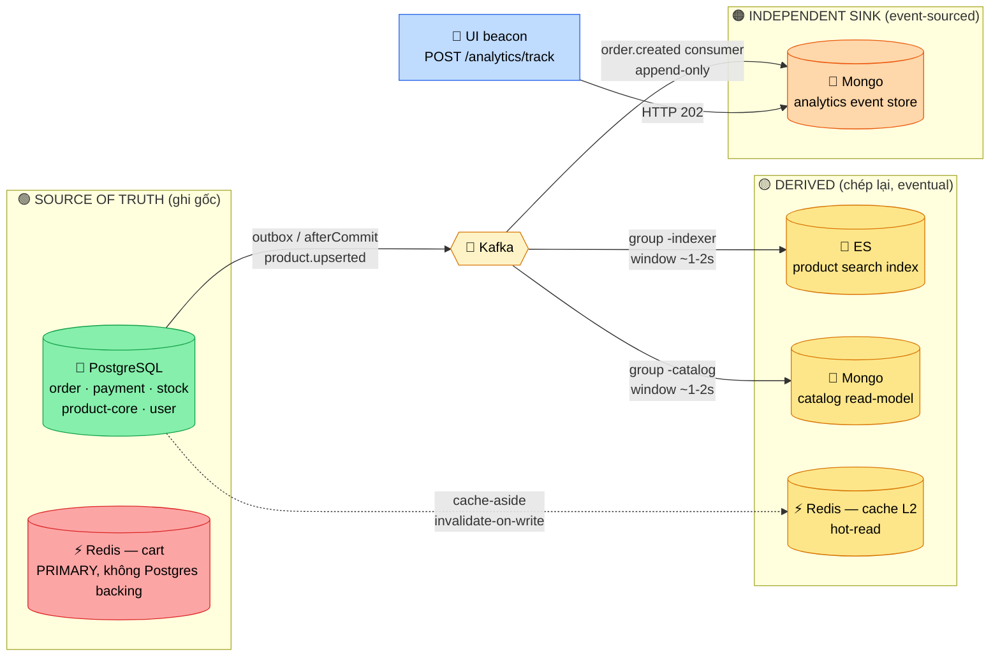
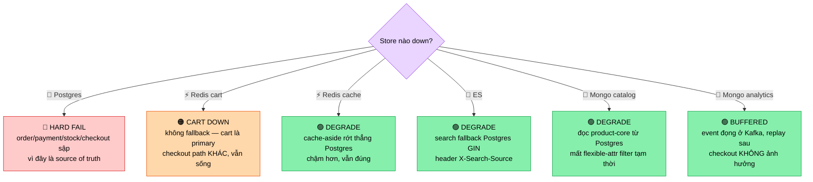

# Data Ownership Map — ai làm chủ dữ liệu nào

> **Mục đích**: 1 trang để trả lời 3 câu mà mọi architecture review hỏi về polyglot persistence:
> (1) **Ai là source of truth** cho mỗi mẩu data? (2) Store nào **derived**, sync **chiều nào**,
> **trễ bao lâu**, đo bằng gì? (3) Store nào **chết** thì hệ degrade ra sao?
>
> Đây là output chốt Week 4 — sau khi thêm ES (Day 22) + Mongo (Day 23) hệ có **4 storage paradigm**.
> Nối tiếp [lesson 24 decision matrix](../lessons/24-sql-vs-nosql-vs-es-decision-matrix.md) (vì sao chọn) →
> doc này trả lời *ai owns gì sau khi đã chọn* → [lesson 25 anti-patterns](../lessons/25-polyglot-persistence-anti-patterns.md) (đừng để hỏng).

---

## 🗺️ 1. Bản đồ chủ quyền



> 🟢 source of truth · 🔴 Redis-cart là **primary** (đặc biệt — không derived, không có Postgres backing) ·
> 🟡 derived (sync async, eventual) · 🟠 independent sink (truth = chính event stream, không phải bảng Postgres nào).

⚠️ **Điểm dễ sai nhất khi đọc bản đồ**: không phải mọi thứ "ngoài Postgres" đều là cache/derived.
**Cart trên Redis là primary** — không có bảng `cart` ở Postgres để fallback. **Analytics trên Mongo là sink**
— không chép từ bảng Postgres nào, mà tự sinh từ event stream. Gộp cả 2 vào nhóm "derived/cache" là lỗi
phân loại làm sập triage khi sự cố (xem §4).

---

## 📋 2. Bảng ownership chi tiết

| Data | Owner (truth) | Store vật lý | Derived? | Sync từ → đến | Cơ chế | Consistency window | Đo drift bằng |
| --- | --- | --- | --- | --- | --- | --- | --- |
| Order / OrderItem | order-service | 🐘 Postgres | ❌ truth | — | — (ACID local) | 0 (strong) | — |
| Payment intent | payment-service | 🐘 Postgres | ❌ truth | — | — (ACID local) | 0 (strong) | — |
| Stock / reservation | inventory-service | 🐘 Postgres | ❌ truth | — | — (`@Version` optimistic) | 0 (strong) | — |
| Product core (giá, status, attributes JSONB) | product-service | 🐘 Postgres | ❌ truth | — | — | 0 (strong) | — |
| User / refresh-token | auth-service | 🐘 Postgres | ❌ truth | — | — | 0 (strong) | — |
| **Cart** | cart-service | ⚡ **Redis** | ❌ **primary** | — | HINCRBY atomic, TTL 7d | 0 (strong, single-node) | — (mất là mất) |
| Product **search** index | product-service | 🔎 ES | ✅ derived | Postgres → ES | Kafka `product.upserted/deleted`, `afterCommit`, key=productId, consumer group `-indexer` | ~1-2s (consumer lag) | `GET /admin/search/drift` + reindex |
| Product **catalog** read-model | product-service | 🍃 Mongo | ✅ derived | Postgres → Mongo | **Cùng event** `product.upserted`, fan-out consumer group `-catalog` | ~1-2s (consumer lag) | so id-set Postgres ↔ Mongo |
| Hot-read **cache** | (nhiều service) | ⚡ Redis L2 | ✅ derived | Postgres → Redis | cache-aside, invalidate-on-write, TTL | ≤ TTL | hit-ratio + manual evict |
| **Analytics** event | analytics-service | 🍃 Mongo | ⭕ sink | Kafka + HTTP beacon → Mongo | `order.created` consumer (N item → N doc) + `POST /analytics/track`, append-only, TTL 90d | ~giây (đếm xấp xỉ, chấp nhận) | KHÔNG reconcile (xem ghi chú) |

> ⭕ **Analytics là "sink" không phải "derived"**: nó không chép lại một bảng Postgres cụ thể để
> giữ khớp 1-1. Truth của analytics **chính là event stream** (append-only). Vì thế nó **không cần
> reconcile** — mất vài event = đếm lệch chút, chấp nhận được (đã chốt Day 23: "analytics chịu đếm xấp xỉ").
> Đây là khác biệt quan trọng: derived store (ES/catalog) **phải** đo drift + reconcile được; sink thì không.

---

## 🔁 3. Sync edges — tại sao KHÔNG dual-write

Mọi edge từ Postgres → derived store đều đi qua **một nhịp async** (Kafka), KHÔNG ghi thẳng 2 nơi:

```
❌ Dual-write (cái bẫy):                    ✅ Outbox / afterCommit (cách đã làm):
   save(Postgres)                              save(Postgres)  ─┐ cùng 1 tx
   esClient.index()   ← KHÔNG atomic           record(outbox)  ─┘
   // crash giữa 2 dòng = drift vĩnh viễn       └→ relay/afterCommit → Kafka → ES/Mongo
```

| Edge | Cơ chế cụ thể | Vì sao chọn | Ngưỡng đảo chiều |
| --- | --- | --- | --- |
| Postgres → Kafka (order) | **Outbox** (`OutboxRelay` `@Scheduled 1s` + `SKIP LOCKED`, REQUIRES_NEW per-event) | Atomic với business tx — chống dual-write giữa DB và Kafka (Day 13) | volume tăng → Debezium CDC đọc WAL thay polling |
| Postgres → Kafka (product) | **afterCommit publish** (`ProductEventPublisher`, key=productId) | Đơn giản, đủ cho product (low write rate); thừa nhận có drift nhỏ nếu crash sau commit trước publish | nếu mất event không chấp nhận được → chuyển sang outbox như order |
| Kafka → ES | `ProductIndexer` `@KafkaListener` group `-indexer`, idempotent `save/deleteById` | App-level sync, fan-out độc lập (Day 22) | scale → Debezium CDC (ADR-010) |
| Kafka → Mongo catalog | `ProductCatalogIndexer` group `-catalog` — **cùng event**, consumer group riêng | 1 event nuôi 2 derived store, mỗi consumer fail/replay độc lập | — |
| Postgres → Redis cache | cache-aside, invalidate-on-write | Đơn giản, lazy-load (Day 15) | write-heavy → write-through |

> 💡 **Bài học xuyên Week 2-4**: cái đau dual-write (Day 13 outbox) → drift ES (Day 22) → drift catalog (Day 23)
> đều là **một bài**: bạn không thể ghi atomic vào 2 hệ thống khác nhau. Chọn 1 nơi làm truth, mọi nơi khác
> chép lại qua **một** kênh async đo được. Đó là xương sống của polyglot làm đúng.

---

## 🔥 4. Failure-mode matrix — store nào chết thì sao

Phân loại owner ở §1 quyết định degrade behavior. **Chỉ store giữ truth mới gây hard-fail.**



| Store down | Blast radius | Degrade | Tự phục hồi? |
| --- | --- | --- | --- |
| 🐘 Postgres | **Toàn hệ write path** | Hard fail — không che giấu được (đúng: truth không có bản sao để serve) | cần HA: Multi-AZ RDS + failover |
| ⚡ Redis (cart) | Chỉ cart | Cart trống/lỗi; user mất giỏ. **Không fallback** vì không có Postgres backing | TTL 7d vốn dĩ đã ephemeral; user thêm lại |
| ⚡ Redis (cache L2) | Latency | Cache miss → query thẳng Postgres (chậm hơn, đúng) | tự ấm lại khi Redis lên |
| 🔎 ES | Chỉ search | `catch DataAccessException` → Postgres GIN, set `X-Search-Source=postgres` (Day 22) | reindex khi ES lên (`/admin/search/reindex`) |
| 🍃 Mongo (catalog) | Chỉ catalog filter | Đọc product-core trực tiếp Postgres; mất filter động `attributes.<key>` tạm | re-consume event khi Mongo lên |
| 🍃 Mongo (analytics) | Chỉ báo cáo | Event **đọng ở Kafka** (consumer offset không tiến); replay khi lên | tự catch-up qua consumer lag |

> ⚠️ **Trap phỏng vấn**: "Redis chết thì sao?" — câu trả lời phụ thuộc Redis đang đóng **vai gì**.
> Redis-cache chết = degrade nhẹ (rớt về Postgres). Redis-cart chết = mất data (primary, không fallback).
> Cùng một công nghệ, hai vai, hai blast radius khác hẳn. Senior phải tách được.

---

## 🧭 5. Quy tắc chủ quyền (rút gọn để dán tường)

1. **Một mẩu data — một owner.** Postgres giữ mọi thứ có invariant/tiền/quan hệ. Đừng để 2 nơi cùng nhận là "gốc".
2. **Derived store là read-optimized view, KHÔNG bao giờ ghi gốc.** ES/catalog chỉ phục vụ đọc; ghi luôn vào Postgres trước.
3. **Mọi sync Postgres → derived đi qua MỘT kênh async đo được** (outbox/event). Không dual-write.
4. **Mọi derived store là EL** (PACELC, [lesson 24b](../lessons/24b-cap-pacelc-in-practice.md)) → có consistency window → **phải đo + reconcile được**.
5. **Phân loại đúng để degrade đúng**: truth → hard-fail có HA; derived → graceful fallback; primary-non-Postgres (cart) → ephemeral, chấp nhận mất; sink (analytics) → buffer + replay.
6. **Thêm store mới = +1 failure mode + 1 sync edge.** Chỉ thêm khi access pattern thật sự khác — không vì CV ([issue 24](../issues/24-cargo-cult-storage-migration.md)).

---

## 🔗 Related

- Architecture: [system-overview](system-overview.md) (bức tranh service + storage tổng) · [event-driven-flow](event-driven-flow.md)
- Lesson: [24 — Decision matrix](../lessons/24-sql-vs-nosql-vs-es-decision-matrix.md) · [24b — CAP/PACELC](../lessons/24b-cap-pacelc-in-practice.md) · [25 — Polyglot anti-patterns](../lessons/25-polyglot-persistence-anti-patterns.md)
- Issue: [13 — dual-write / outbox](../issues/13-order-paid-inventory-not-reserved.md) · [22 — ES/Postgres sync drift](../issues/22-es-postgres-sync-drift.md) · [24 — cargo-cult migration](../issues/24-cargo-cult-storage-migration.md)
- Interview: [day-25 — Polyglot review](../interview/day-25-polyglot-review.md)
- ADR: [010 — Postgres vs ES search](../decisions/010-postgres-vs-elasticsearch-search.md) · [011 — Mongo for analytics & attributes](../decisions/011-mongo-for-analytics-and-flexible-attributes.md)
</content>
</invoke>
