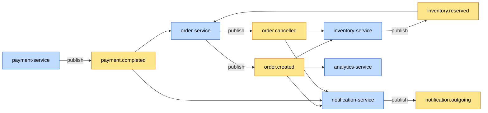
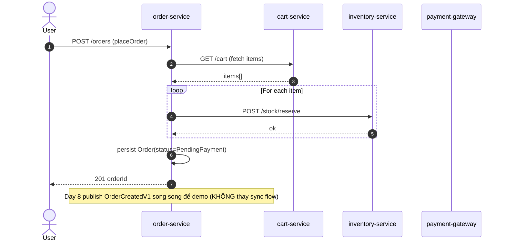
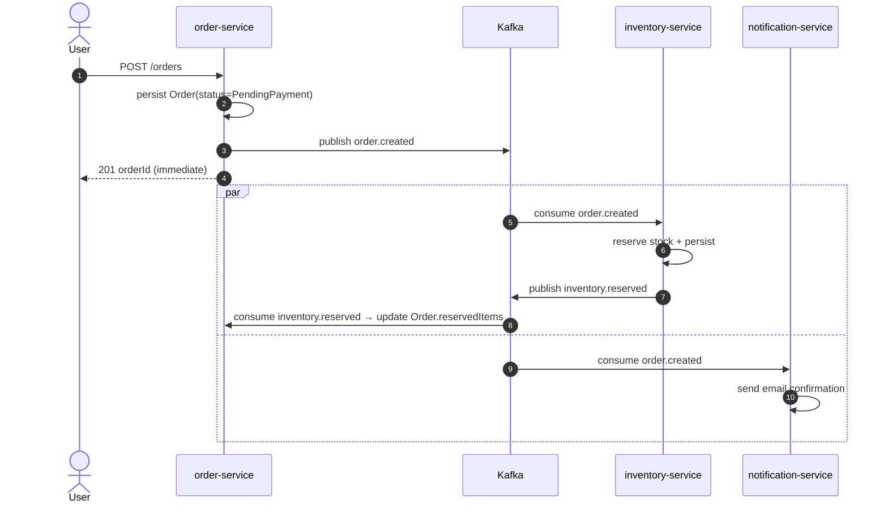

# 🏗️ Architecture — Event-driven flow (Week 2)

> Snapshot kiến trúc async sau khi Week 2 hoàn thành. Day 8 mới setup
> Kafka foundation + schema; Day 9 chuyển order flow từ sync (Day 6
> RestClient orchestration) sang async event-driven; Day 13 sẽ thêm
> outbox để giải dual-write.

## 🎯 Goals

- Decouple order-service khỏi inventory/notification — order publish event, downstream tự react.
- Buffer giữa producer (peak load) và consumer (slow downstream — vd SMTP, SMS gateway).
- Cho phép replay event cho service mới (vd analytics-service Day 23 join cluster, đọc history từ retention window).

## 📊 Topic topology (Day 8 foundation)

🟡 yellow = topic · 🔵 blue = service

5 topic foundation Day 8 setup (xem [`TopicNames.java`](../../common-lib/src/main/java/com/ecom/common/messaging/TopicNames.java)):
- `order.created` — Order place success
- `order.cancelled` — User cancel hoặc auto-cancel sau timeout
- `inventory.reserved` — Stock reserve thành công
- `payment.completed` — Gateway callback success (Day 10)
- `notification.outgoing` — Multi-channel dispatch (Day 11)

## 🔄 Order placement flow — sync (Day 6) vs async (Day 9 preview)

### Sync orchestration (Day 6 hiện tại)

**Vấn đề** (issue 06 — orchestration rollback):
- Mỗi step block — P99 = Σ(downstream P99).
- Inventory call fail giữa chừng → manual compensation (release reservation), nếu service crash giữa compensation thì orphan reservation.
- 5 downstream service → 5 điểm fail; coupling tight.

### Async event-driven (Day 9 sẽ chuyển)

**Đổi lại được**:
- Order place P99 = chỉ DB write + Kafka send (~10ms). KHÔNG block chờ inventory/notification.
- Inventory/notification fail không impact user (sẽ retry async qua DLT Day 12).
- Decouple — analytics-service Day 23 join group mới, đọc history.

**Mới phải xử**:
- **Eventual consistency**: order tạo "PendingReservation" trước; UI cần show pending state cho đến khi `inventory.reserved` consume xong.
- **Dual-write problem**: order DB commit + Kafka publish không atomic. Day 13 outbox.
- **Idempotent consumer**: replay event → handler phải dedup theo `eventId` (Day 10).

## 📦 Schema versioning strategy

Mọi event implement [`DomainEvent`](../../common-lib/src/main/java/com/ecom/common/event/DomainEvent.java) với 4 metadata field: `eventId` · `occurredAt` · `eventType` · `eventVersion`.

### Quy ước

- **Additive change** (thêm field mới có default): KHÔNG bump version. Jackson `FAIL_ON_UNKNOWN_PROPERTIES=false` → consumer cũ ignore field mới.
- **Breaking change** (xoá field / đổi type / đổi nghĩa): tạo `OrderCreatedV2` + topic mới `order.created.v2`. Producer publish CẢ HAI topic trong migration window. Consumer migrate sang v2 trước; producer drop v1 sau khi confirm 0 consumer lag.

### Vì sao JSON không Avro/Protobuf

- Project 9 service, frequency breaking change thấp → JSON đủ.
- Avro/Protobuf cần Schema Registry (Confluent license / Apicurio ops cost).
- Trade-off: JSON breaking change phát hiện **runtime** (deserialize fail) thay vì compile-time. Bù lại bằng contract test trong CI (Day 14 sẽ wire).
- Scale 10x (50+ service): migrate Avro + Schema Registry. ADR sẽ tạo khi đụng ngưỡng.

## 🔗 Related

- Source: [`TopicNames`](../../common-lib/src/main/java/com/ecom/common/messaging/TopicNames.java) · [`DomainEvent`](../../common-lib/src/main/java/com/ecom/common/event/DomainEvent.java) · [`OrderCreatedV1`](../../common-lib/src/main/java/com/ecom/common/event/OrderCreatedV1.java) · [`KafkaAutoConfiguration`](../../common-lib/src/main/java/com/ecom/common/autoconfig/KafkaAutoConfiguration.java)
- Lesson: [08 — kafka-basics](../lessons/08-kafka-basics.md) · [08b — feign-vs-http-interface](../lessons/08b-feign-vs-http-interface.md)
- Issue: [08 — kafka-message-loss-acks-default](../issues/08-kafka-message-loss-acks-default.md)
- System overview: [system-overview.md](system-overview.md)
- Day 9 chain: order flow event-driven + OpenTelemetry trace propagation
- Day 13 chain: outbox pattern fix dual-write
