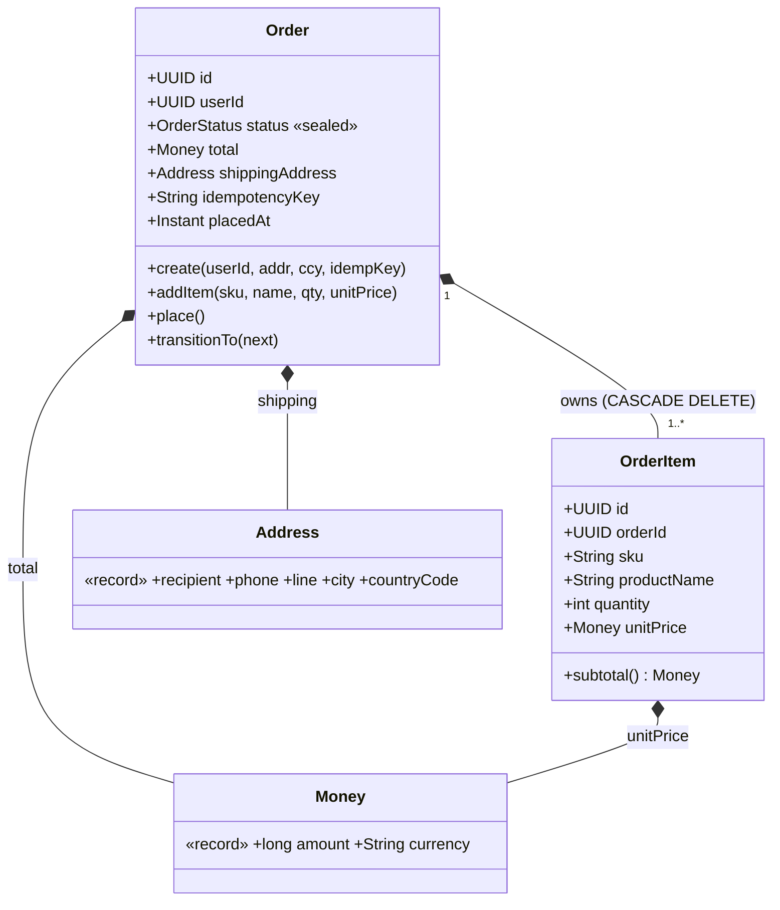
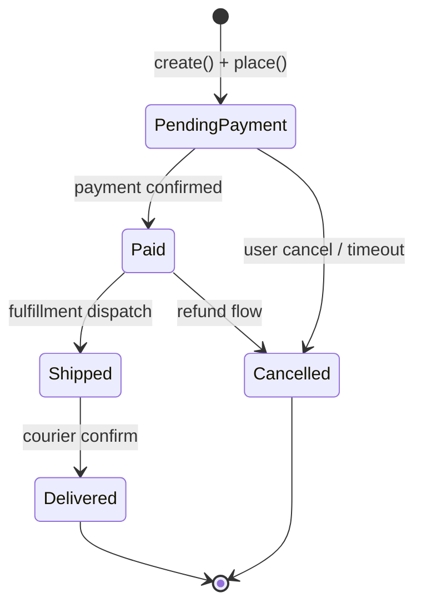
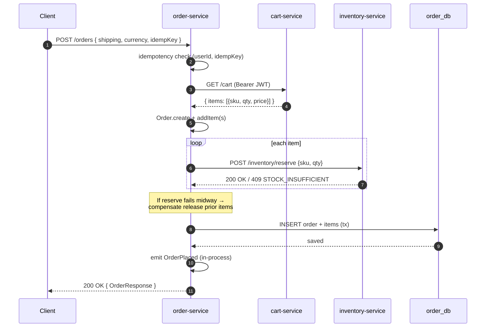

# 🏗️ Order Domain — Aggregate + Sealed State Machine

> **Day 6 deliverable.** Diagram-first doc — đọc 5 phút hiểu boundary
> + lifecycle + sync orchestration flow.

## 🎯 Aggregate boundary

**Aggregate root**: `Order`. **OrderItem** là entity bên trong — KHÔNG có
repository riêng, lifecycle gắn `Order`. **Money** + **Address** là Value
Object (record).

### Invariants enforce trong aggregate

| # | Invariant | Where |
|---|-----------|-------|
| 1 | `items.size() ≥ 1` tại `place()` | `Order.place()` throws `EmptyCartException` |
| 2 | `total = Σ(item.subtotal)` | `Order.recomputeTotal()` mỗi addItem |
| 3 | `quantity > 0` per item | `OrderItem` constructor |
| 4 | `unitPrice.amount ≥ 0` | `Money` record constructor |
| 5 | Lifecycle transition hợp lệ | `Order.transitionTo()` exhaustive switch |
| 6 | Terminal state không mutate thêm | `requireMutable()` guard |

### Rule cốt lõi DDD

1. **One transaction = one aggregate.** `PlaceOrderUseCase` ghi 1 `Order` /
   1 tx. Cart + Inventory ở service khác (DB-per-service) — eventual
   consistency, không cross-service `@Transactional`.
2. **Reference other aggregate by ID, not object.** `OrderItem.sku` là
   `String`, KHÔNG hold `Stock` object hay `Product` object.
3. **Invariant enforce inside, không leak ra service.** `Order.addItem`
   không cho phép set total bậy.

---

## 🔄 Sealed state machine

**Permits** (xem [`OrderStatus.java`](../../services/order-service/src/main/java/com/ecommerce/order/domain/OrderStatus.java)):

| Permit | Data |
|--------|------|
| `PendingPayment` | (none) |
| `Paid` | `paidAt` |
| `Shipped` | `trackingNumber`, `shippedAt` |
| `Delivered` | `deliveredAt` |
| `Cancelled` | `reason`, `cancelledAt` |

**Tại sao sealed thay vì enum** — xem [`lessons/06b-sealed-types-state-machine.md`](../lessons/06b-sealed-types-state-machine.md).

**Persistence**: 2 column `status_type VARCHAR + status_data JSONB`. Sealed
serialize qua [`OrderStatusSerializer`](../../services/order-service/src/main/java/com/ecommerce/order/infrastructure/persistence/OrderStatusSerializer.java) — exhaustive switch, JPA `@PostLoad`/`@PrePersist` callback.

---

## 🔁 Place-order orchestration (Day 6 sync)

### Failure modes + handling

| Failure | Handling |
|---------|----------|
| Cart empty | 400 `CART_EMPTY` — throw `EmptyCartException` |
| Inventory 409 mid-reserve | Compensate release N prior items, rethrow 409 |
| Inventory timeout | 500 `INTERNAL_ERROR`, compensate, log loud |
| DB save fail SAU reserve | Compensate release ALL items, throw 500 |
| Crash giữa compensate | **Orphan reservation** — log `ORPHAN-RESERVATION` cho ops triage. Day 13 outbox sẽ giải quyết. |

> ⚠️ Trade-off accepted Day 6: sync orchestration latency cộng dồn (cart
> ~30ms + inventory N×~20ms + DB ~30ms ≈ 100-300ms P99). Acceptable cho
> MVP. Day 9 wire Kafka event-driven; Day 13 outbox cho true reliability.

---

## 🔗 Related

- ADR [`003-ddd-for-order-inventory-payment.md`](../decisions/003-ddd-for-order-inventory-payment.md) — 3-điểm criteria DDD vs Layered
- Lesson [`06-aggregate-root.md`](../lessons/06-aggregate-root.md) — Aggregate boundary, transactional consistency
- Lesson [`06b-sealed-types-state-machine.md`](../lessons/06b-sealed-types-state-machine.md) — sealed vs enum cho state machine
- Issue [`06-orchestration-rollback.md`](../issues/06-orchestration-rollback.md) — 4 approaches saga vs sync compensation
- Interview [`day-06-order.md`](../interview/day-06-order.md) — Q&A + Tech Lead Lens
- Code: [`Order.java`](../../services/order-service/src/main/java/com/ecommerce/order/domain/Order.java), [`OrderStatus.java`](../../services/order-service/src/main/java/com/ecommerce/order/domain/OrderStatus.java), [`PlaceOrderUseCase.java`](../../services/order-service/src/main/java/com/ecommerce/order/application/PlaceOrderUseCase.java)
