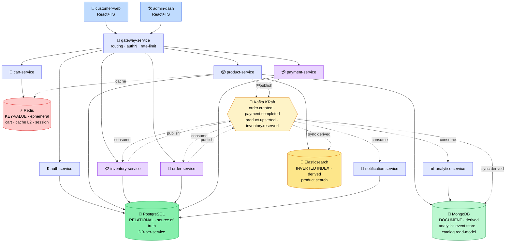
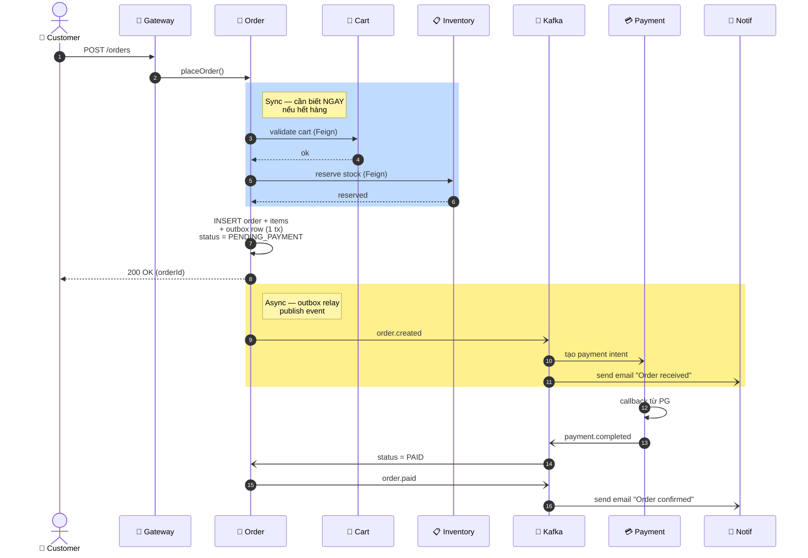
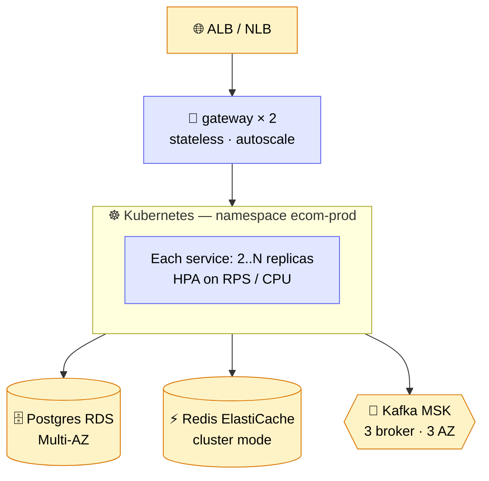

# System Overview — Ecommerce Platform

> **Mục đích**: Bức ảnh tổng quan để onboarding 1 dev mới trong 30 phút,
> và để chính bạn ôn lại trước phỏng vấn.

---

## 🏗️ 1. Bức tranh toàn cảnh

> 🔵 client · 🟦 Layered service · 🟣 DDD service
> **Storage paradigm** (Day 24 decision matrix): 🟢 Postgres = relational *source of truth* ·
> 🔴 Redis = key-value *ephemeral* · 🟩 Mongo = document *derived* · 🟡 ES = inverted-index *derived*
> Solid arrow = sync (HTTP/Feign/direct) · Dashed arrow = async (Kafka). Mọi derived store
> sync từ Postgres qua Kafka — xem [lesson 24](../lessons/24-sql-vs-nosql-vs-es-decision-matrix.md).

---

## 🧩 2. Services & Responsibilities

| Service              | Style    | Owns                              | Sync deps              | Async (Kafka)                  |
| -------------------- | -------- | --------------------------------- | ---------------------- | ------------------------------ |
| gateway-service      | Layered  | routing, JWT validation, rate-limit | (none — stateless)    | —                              |
| auth-service         | Layered  | user, password, refresh-token     | —                      | publishes `user.registered`    |
| product-service      | Layered  | product, category, search index   | —                      | —                              |
| inventory-service    | **DDD**  | stock, reservation                | —                      | consumes `order.created`, publishes `inventory.reserved/released` |
| cart-service         | Layered  | cart (Redis), cart items          | product (read-only)    | —                              |
| order-service        | **DDD**  | order aggregate, order items      | inventory (reserve)    | publishes `order.created`, consumes `payment.completed` |
| payment-service      | **DDD**  | payment intent, callbacks         | —                      | consumes `order.created`, publishes `payment.completed` |
| notification-service | Layered  | email/sms outbox                  | —                      | consumes `order.*`, `payment.*` |
| analytics-service    | Layered  | event store, KPIs                 | —                      | consumes everything (read-only)|

> **Quy tắc cứng**: KHÔNG có service nào trực tiếp truy vấn DB của
> service khác. Cross-service data → Feign (sync) hoặc Kafka (async).

---

## 🔁 3. Data flow chính: "Place Order"

Đây là happy path quan trọng nhất — cả Day 6, Day 9, Day 10 sẽ build dần.

> 🔵 sync block · 🟡 async (Kafka) block

Lý do **synchronous** cho reserve stock (3b) thay vì Kafka:
- Cần biết NGAY nếu hết hàng để báo user.
- Eventual consistency ở đây = tệ trải nghiệm.

Lý do **async** cho payment:
- PG có thể chậm/timeout → không nên block place-order.
- Idempotent retry dễ hơn khi async.

Chi tiết Saga + outbox: xem `docs/lessons/outbox-pattern.md` (Day 13).

---

## ☁️ 4. Deployment topology (production target)

**Why DB-per-service?** Microservices không share schema — đó là rule
cứng. Nếu share, mọi schema migration đều cần coordinate giữa các team
→ mất hết lợi ích của microservice. Trade-off: data join phải làm ở
application layer (composition) hoặc qua read model.

---

## 🧰 5. Cross-cutting concerns — đều ở `common-lib`

| Concern              | Triển khai                                              |
| -------------------- | ------------------------------------------------------- |
| Response envelope    | `ApiResponse<T>` — tất cả service trả cùng format       |
| Exception → HTTP map | `GlobalExceptionHandler` — `@RestControllerAdvice`      |
| Audit                | `BaseEntity` (created/updated, audit, `@Version`)       |
| Trace correlation    | `CorrelationIdFilter` → MDC `traceId` → log pattern     |
| Auth principal       | Gateway forward `X-User-Id` header sau khi verify JWT   |

---

## 📈 6. Scaling plan (theo tải dự kiến)

| Stage   | RPS    | Bottleneck dự đoán                | Hành động                                    |
| ------- | ------ | --------------------------------- | -------------------------------------------- |
| MVP     | < 100  | Không có                          | 1 replica/service, monolith DB OK           |
| Growth  | 1–10k  | Product search, hot product cache | Read replica, Redis cache-aside (Day 15)    |
| Scale   | 10–50k | Order write, inventory contention | Sharding order_db theo customerId, optimistic locking + retry (Day 4) |
| Hyper   | 50k+   | Kafka consumer lag, search        | Kafka partitions ≥ consumer count, Elastic for search |

---

## 🚫 7. What this document is NOT

- KHÔNG phải spec đầy đủ — xem từng `docs/architecture/<domain>.md`.
- KHÔNG phải runbook — xem `docs/runbooks/`.
- KHÔNG cố gắng so sánh với competitor / không phải "comprehensive
  ecommerce blueprint". Chỉ đủ để 1 senior dev mới ramp-up trong 30
  phút và để bạn trả lời câu hỏi "design 1 ecommerce platform" ở vòng
  System Design (Day 22).

---

## Related

- ADR: [`decisions/001-why-hybrid-architecture.md`](../decisions/001-why-hybrid-architecture.md)
- Storage choice: [`lessons/24-sql-vs-nosql-vs-es-decision-matrix.md`](../lessons/24-sql-vs-nosql-vs-es-decision-matrix.md) (vì sao 4 storage, cái nào source of truth) · [`lessons/24b-cap-pacelc-in-practice.md`](../lessons/24b-cap-pacelc-in-practice.md)
- Domain detail (sẽ build dần):
  - `architecture/order-domain.md` (Day 6)
  - `architecture/event-driven-flow.md` (Day 8)
- Code: `common-lib/src/main/java/com/ecom/common/`
