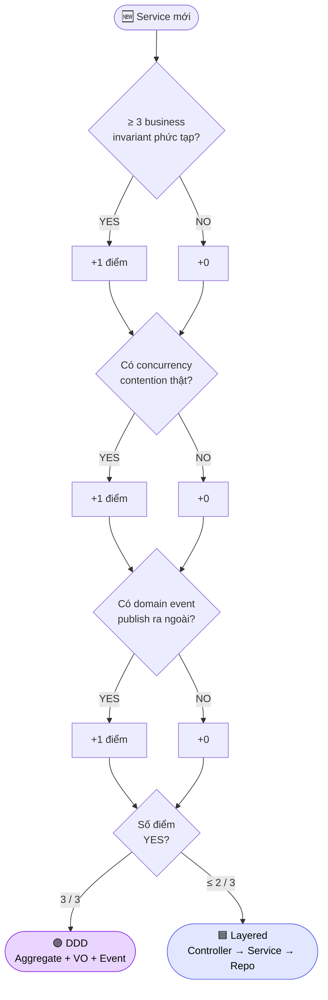

# ADR-001 — Hybrid Architecture: Layered + Selective DDD

- **Status**: Accepted
- **Date**: 2026-05-03
- **Deciders**: Tonny (solo, with AI)
- **Supersedes**: —

---

## 🎯 Decision

Áp dụng **kiến trúc lai** trên platform:

- **Layered (Controller → Service → Repository)** cho service đơn giản,
  CRUD-heavy, ít business invariant: `auth-service`, `product-service`,
  `cart-service`, `notification-service`, `analytics-service`,
  `gateway-service`.
- **Domain-Driven Design (Aggregate, Value Object, Domain Service,
  Domain Event)** cho service có nhiều business rule và invariant phức
  tạp: `order-service`, `inventory-service`, `payment-service`.

---

## 🧭 Context

Đây là project portfolio + ôn phỏng vấn Senior Fullstack (backend
heavy). Có 2 áp lực ngược nhau:

1. **Phải production-grade** — Senior interviewer sẽ hỏi sâu về
   modeling, concurrency, eventual consistency. Code phải chịu được
   câu "tại sao chỗ này không dùng aggregate?".
2. **Phải build xong trong 30 ngày** — không có thời gian áp DDD đầy
   đủ cho 9 services.

Hai cực thường gặp:

- **DDD-everywhere**: học liệu hay, nhưng over-engineer cho service
  CRUD đơn giản (vd `notification-service` chỉ là dispatcher).
- **Layered-everywhere**: tốn ít thời gian, nhưng khi domain phức tạp
  (vd `order` có 6+ invariant) → service class biến thành
  "transaction script 800 dòng" → bug, khó test.

---

## 🔀 Alternatives considered

### Option A — DDD cho TẤT CẢ services
- ✅ Nhất quán, dễ giải thích.
- ❌ Tốn 2x thời gian. `notification-service` chỉ cần 1 method
  `send(template, recipient)` mà phải có Aggregate, Repository,
  Domain Event là quá lố.
- ❌ Phỏng vấn sẽ bị challenge: *"vì sao Notification cần aggregate?"*

### Option B — Layered cho TẤT CẢ services
- ✅ Build nhanh, đồng đều.
- ❌ `order-service` sẽ có service class kiểu `OrderService.placeOrder()`
  500–800 dòng, đụng inventory, payment, cart, audit...
- ❌ Mất cơ hội nói về Aggregate, Value Object, invariant ở vòng phỏng
  vấn — đúng phần Senior thường được hỏi.

### Option C — Hexagonal / Clean Architecture cho tất cả
- ✅ Trendy, nhiều material.
- ❌ Học cost cao, abstraction cost cao. Trong 30 ngày không kịp.
- ❌ Cho service CRUD = over-engineering rõ rệt.

### Option D (chosen) — Hybrid: Layered + Selective DDD
- ✅ Tận dụng đúng chỗ. DDD cho nơi cần — invariant phức tạp.
- ✅ Phỏng vấn dễ kể chuyện: *"Tôi chọn DDD CHỈ ở 3 services có
  invariant phức tạp — đó là pragmatism, không phải bias."*
- ⚠️ Nhược: 2 phong cách trong 1 codebase → cần tài liệu (ADR này) để
  rõ ranh giới.

---

## ✅ Chosen — Rationale

### Tiêu chí để 1 service đáng dùng DDD

1. **≥ 3 business invariant không-được-vi-phạm**.
   Ví dụ với `order`:
   - Tổng tiền order = Σ (price × quantity)
   - Order status chỉ chuyển theo state machine: PENDING → PAID → SHIPPED → DELIVERED hoặc CANCELLED
   - Không thể cancel order đã SHIPPED
2. **Có concurrency contention thật sự**.
   Ví dụ `inventory.reserve`: 100 người mua cùng 1 sản phẩm còn 2.
3. **Có domain event được publish ra ngoài**.
   `order.created`, `payment.completed` — outbox pattern dễ map vào
   aggregate.

`auth-service` chỉ pass tiêu chí #1 yếu (1 invariant: password hash),
không đáng DDD → Layered.

### 🌳 Decision tree — chọn style cho 1 service mới

> ⚠️ **Trap**: 2 / 3 điểm → vẫn Layered. Không "DDD lite" cho qua. Khi
> nào pass đủ 3 thì migrate, không tự thuyết phục bản thân là "gần đủ".

### Mapping ranh giới

| Service              | Vì sao chọn style này                                         |
| -------------------- | ------------------------------------------------------------- |
| auth-service         | CRUD users + JWT. Không có invariant phức tạp. → Layered      |
| product-service      | CRUD + search. → Layered                                      |
| inventory-service    | Reserve/release với race condition. Aggregate `Stock`. → DDD  |
| cart-service         | Redis-backed, ephemeral. → Layered                            |
| order-service        | Aggregate `Order` với items + state machine. → DDD            |
| payment-service      | Idempotent callback, transition states. Aggregate `Payment`. → DDD |
| notification-service | Dispatcher. → Layered                                         |
| analytics-service    | Read-only consumer. → Layered                                 |
| gateway-service      | Routing. → Layered                                            |

---

## ⚖️ Trade-offs

### Tradeoff được nhận

- 2 phong cách = 2 mental model. Dev mới có thể lạc khi nhảy giữa
  service. Mitigated bằng:
  - ADR này.
  - Cấu trúc package nhất quán cho từng style (xem
    `docs/lessons/aggregate-root.md` — Day 6).
- Có thể có trùng lặp nhẹ ở mapping DTO/Entity giữa 2 style. Chấp
  nhận để giữ độc lập service.

### Tradeoff KHÔNG nhận

- KHÔNG bị "DDD lite" — nếu đã quyết DDD cho `order-service`, sẽ
  full-blown: Aggregate Root, Value Object (Money, Address),
  Repository giấu JPA, Domain Event publish qua outbox. Không "DDD ở
  package name nhưng code vẫn là transaction script".

---

## 🔮 Consequences

- Hiệu ứng tích cực:
  - Câu phỏng vấn *"Khi nào em dùng DDD?"* — có câu trả lời cụ thể,
    không sách vở.
  - Code `order-service` sẽ là showcase đẹp khi review portfolio.
- Hiệu ứng tiêu cực:
  - 30% thời gian Day 4, 6, 10 sẽ tốn nhiều hơn so với Layered
    thuần.
  - Phải viết docs/lessons về Aggregate, VO — nhưng đây là feature
    chứ không phải bug (đúng mục tiêu khoá học 30 ngày).

---

## 🔗 Related

- Code (sẽ có dần):
  - `services/order-service/src/main/java/com/ecom/order/domain/`
  - `services/inventory-service/src/main/java/com/ecom/inventory/domain/`
- Lessons:
  - `docs/lessons/aggregate-root.md` (Day 6)
  - `docs/lessons/optimistic-locking.md` (Day 4)
- Architecture:
  - `docs/architecture/order-domain.md` (Day 6)
