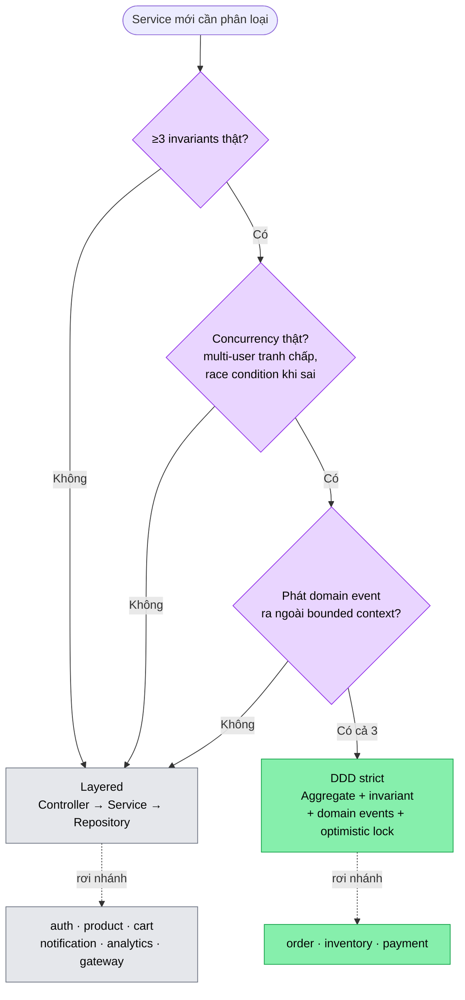

# ADR-003 — DDD selective cho `inventory`, `order`, `payment`; Layered cho phần còn lại

- **Status**: Accepted
- **Date**: 2026-05-09
- **Deciders**: Tonny (Tech Lead)
- **Supersedes**: làm rõ ADR-001 §"Hybrid: Layered + Selective DDD"
- **Revised-by**: [ADR-007](007-payment-service-layered-not-ddd.md) — phần `payment-service` được **revise sang Layered** (Day 10, sau khi rà lại 3-điểm criteria chỉ đạt 1/3). Phần `inventory`/`order` của ADR này vẫn nguyên hiệu lực.

## 🏗️ Decision

3 service `inventory-service`, `order-service`, `payment-service` đi **DDD strict**: Aggregate root đóng gói invariant + domain events + optimistic locking. 6 service còn lại (`auth`, `product`, `cart`, `notification`, `analytics`, `gateway`) đi **Layered** thuần (Controller → Service → Repository) — KHÔNG ép DDD.

Áp dụng **3-điểm criteria**: chọn DDD chỉ khi cả 3 đúng — (1) ≥3 invariants thật; (2) concurrency thật, có race condition khi sai; (3) phát domain event ra ngoài bounded context. Thiếu 1 → Layered.

## 📚 Context

Day 4 build `inventory-service` đầu tiên trong nhóm DDD. Trước đó Day 2 (`auth`) và Day 3 (`product`) đi Layered. Cần một quyết định rõ ràng + có tiêu chí khách quan để 6 tháng sau hoặc team mới đọc lại không bị "tại sao service này khác service kia?".

Bối cảnh thực: Tonny là Tech Lead 6 dev, không phải solo. Nếu áp DDD đồng bộ cho 9 service, junior dev sẽ:
- Tạo Aggregate giả (entity bọc anemic + getter/setter) → DDD theo hình thức, không có invariant.
- Phình code 4 layer cho service không cần (`notification` chỉ wrap Kafka consumer + email template).

Constraint:
- Codebase mục đích **ôn phỏng vấn Senior/Tech Lead** → phải nói được "khi nào dùng DDD, khi nào không" với criteria cụ thể.
- 40-day timebox → không over-engineer.

## 🆚 Alternatives considered

| # | Approach | Pros | Cons |
| - | -------- | ---- | ---- |
| A | **DDD đồng bộ 9 service** | Pattern thống nhất, junior học 1 lần | Over-engineer cho `cart` (CRUD Redis), `notification` (Kafka consumer), `analytics` (read-mostly aggregation). Code phình ~30%, junior viết Aggregate giả mà không có invariant thật. |
| B | **Layered đồng bộ 9 service** | Đơn giản, tốc độ build nhanh | `inventory.reserve()` race condition, `order` state machine sai, `payment` idempotency thiếu — đã thấy ở các project Sotatek không dùng DDD. Lỗi production có pattern lặp. |
| C ✅ | **Hybrid: DDD selective theo 3-điểm criteria** | DDD ở chỗ ROI cao (invariant + concurrency); Layered chỗ rule đơn giản. Junior có criteria rõ. | Cần documented rule (ADR này), và ép tự kỷ luật đánh giá 3-điểm khi add service mới. Không tự làm → drift. |
| D | **Hexagonal/Onion full-stack** | Test domain isolated, port/adapter rõ | Boilerplate cao (3 layer extra: port, adapter, domain mapper). Project 40-day không kham. Khi cần test domain isolated, có thể refactor service bị ảnh hưởng — không cần ép cả repo. |

## ✅ Chosen — Rationale (C)

3-điểm criteria mapping:

| Service | Invariants ≥3 | Concurrency thật | Domain events | → Verdict |
| ------- | ------------- | ---------------- | ------------- | --------- |
| `inventory` | reserved≤quantity, qty≥0, reserved≥0, reserve>0 | 100 user grab 1 SKU | `StockReserved`/`Released` ra Kafka | **DDD** |
| `order` | state machine 5 trạng thái, total=Σitem, không cancel-paid | 1 user nhiều click "place" | `OrderCreated`/`Paid`/`Shipped` | **DDD** |
| `payment` | idempotent theo txId, status FSM, amount=order.amount | callback duplicate from gateway | `PaymentCompleted`/`Failed` | ~~DDD~~ → **Layered** (revise: [ADR-007](007-payment-service-layered-not-ddd.md)) |
| `auth` | password hash, refresh rotation | login race | KHÔNG public domain event | Layered (refresh rotation đã giải quyết bằng atomic UPDATE Day 2, không cần Aggregate) |
| `product` | sku unique, slug unique | rare write contention | KHÔNG | Layered |
| `cart` | TTL 7d | merge anonymous→user (1 user) | KHÔNG | Layered |
| `notification` | KHÔNG có invariant | KHÔNG | consume only | Layered |
| `analytics` | read-only aggregation | KHÔNG | consume only | Layered |
| `gateway` | routing | KHÔNG | KHÔNG | Layered |

3-điểm criteria chạy tuần tự như gate — thiếu **bất kỳ** gate nào là rớt thẳng về Layered, không cộng dồn "2/3 cũng được":

Lý do KHÔNG chọn:
- **(A)** Đồng bộ DDD: ép `notification` (consume Kafka → render Thymeleaf → SMTP) phải có Aggregate là cargo-cult. Junior + AI generate code sẽ tạo `NotificationAggregate` rỗng → code rác.
- **(B)** Đồng bộ Layered: ép `inventory.reserve` không có Aggregate → invariant rớt vào `InventoryService.reserve()` (procedural). Concurrent update cùng SKU sẽ vi phạm — đã chứng minh ở [issue 04](../issues/04-overselling-stock.md).
- **(D)** Hexagonal full: project size MVP không kham 3 layer extra. Refactor sau khi cần — không phải up-front.

## ⚖️ Trade-offs

**Accepted**:
- Codebase **không đồng nhất pattern** giữa 9 service. Onboarding dev mới tốn 30 phút đọc ADR-001 + ADR-003. Chấp nhận — pattern thống nhất giả tạo còn tệ hơn pattern đa dạng có lý do.
- Khi 1 Layered service "lớn lên" (vd: `cart` thêm gift-card, voucher → có invariant), phải refactor sang DDD. Cost: ước ~1-2 ngày cho 1 service. Chấp nhận vì refactor có-lý-do tốt hơn over-engineer up-front.
- DDD service phải đính kèm 1 file `domain/` separate package + Aggregate root + domain events — boilerplate ~5 file nhiều hơn Layered tương đương.

**Rejected**:
- Áp DDD đồng bộ → từ chối, lý do trên.
- Áp Hexagonal port/adapter → từ chối, ROI thấp ở 40-day MVP.

## 📊 Consequences

**Positive**:
- Day 4 inventory-service: invariant `reserved ≤ quantity` enforce trong `Stock.reserve()` — concurrency test 100 thread chứng minh no oversell ([code](../../services/inventory-service/src/main/java/com/ecom/inventory/domain/Stock.java)).
- Domain events `StockReserved` / `StockReleased` đã có skeleton — Day 9 wire Kafka outbox không phải refactor.
- Câu phỏng vấn "khi nào em dùng DDD?" có answer cụ thể với 3-điểm criteria, không lý thuyết.

**Negative**:
- Phải maintain 2 pattern song song (DDD + Layered). Code review checklist khác nhau cho 2 nhóm — đã add vào [`docs/review/ai-junior-traps.md`](../review/ai-junior-traps.md) (sẽ tích lũy theo day).
- Khi scale 10x: nếu thêm service mới (vd: `subscription-service`), phải quyết định DDD/Layered bằng 3-điểm. Không ai gác cổng → drift.

**Mitigation**: ADR mới mỗi khi add service quan trọng (Day 10 sẽ có ADR cho payment-service, Day 6 cho order).

## 🔗 Related

- [ADR-001 — Hybrid architecture](001-why-hybrid-architecture.md) — quyết định gốc
- [Lesson 04 — Optimistic locking](../lessons/04-optimistic-locking.md)
- [Lesson 04b — Transaction isolation](../lessons/04b-transaction-isolation.md)
- [Issue 04 — Overselling stock](../issues/04-overselling-stock.md)
- [Interview Day 04](../interview/day-04-inventory.md)
- Code: [`Stock.java`](../../services/inventory-service/src/main/java/com/ecom/inventory/domain/Stock.java), [`InventoryService.java`](../../services/inventory-service/src/main/java/com/ecom/inventory/application/InventoryService.java)
