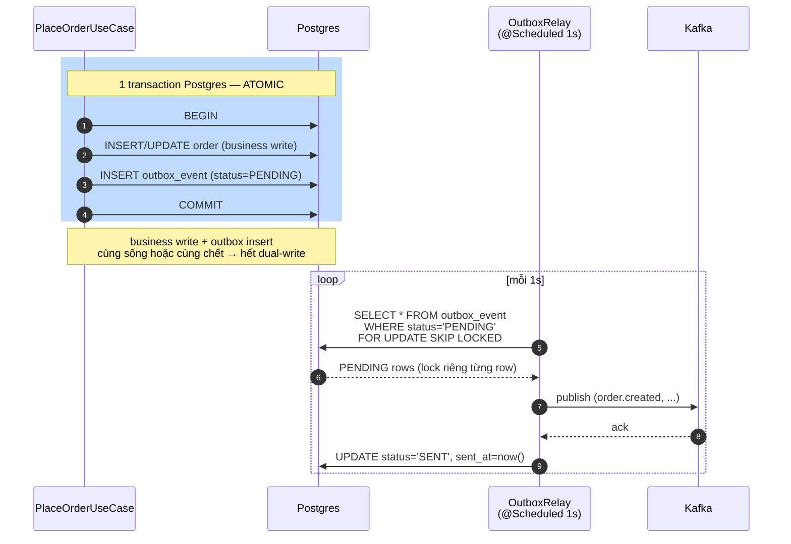

# ADR-009 — 📦 Transactional Outbox (Polling Relay) for DB→Kafka Event Delivery

- **Status**: Accepted
- **Date**: 2026-05-25
- **Deciders**: Tonny (Tech Lead), Anh Hùng (EM, ex-Tiki), Senior DBA
- **Supersedes**: none. Refines [ADR-006 sync vs async](006-sync-orchestration-vs-async-events.md) bằng cách giải quyết dual-write debt mà ADR-006 nêu.

---

## Decision

Dùng **transactional outbox pattern với scheduled polling relay** để publish
event từ order-service sang Kafka. Recorder ghi event vào `outbox_event` table
trong cùng tx Postgres với business write; relay process poll PENDING rows
mỗi 1s, publish Kafka, mark SENT.

---

## Context

Day 9 wired event-driven order flow (order-service publish `order.created`
→ inventory-service consume). Implementation Day 9 publish trực tiếp trong
`PlaceOrderUseCase`:

```java
orderRepository.save(order);              // DB commit
orderEventPublisher.publishOrderCreated(event);  // Kafka send — KHÔNG atomic
```

Hậu quả: dual-write problem ([lesson 13b](../lessons/13b-dual-write-problem.md))
manifest production 2026-05-24 — Kafka broker restart 90s, 23 order DB commit
OK nhưng publish fail → silent inconsistency, customer paid không có hàng
([issue 13](../issues/13-order-paid-inventory-not-reserved.md)).

Constraint dự án:
- DBA chưa cho phép `wal_level=logical` (ops cost WAL slot quản lý).
- Volume hiện tại 50k orders/day (~0.5 event/s).
- Team size 6 (1 EM + 5 dev), ops bandwidth giới hạn.
- Consumer idempotent đã có (Day 12 NotificationDeduplicator + Day 10 4-layer payment idempotency).

---

## Alternatives considered

### A. Sync ack `kafkaTemplate.send().get(timeout)` trong business tx
- ✅ Đơn giản, không thêm table.
- ❌ Tx hold DB connection chờ Kafka network → connection pool exhaust peak.
- ❌ Vẫn race: Kafka ack OK nhưng tx rollback (vd lỗi sau Kafka send trong tx) → Kafka có event ma.
- ❌ Tx-aware Kafka producer (KafkaTransactionManager + ChainedTransactionManager) khả thi nhưng phức tạp + nhiều footgun.

### B. Transactional outbox + scheduled polling (CHOSEN)
- ✅ Atomic DB-side: 1 tx Postgres bao cả business write + outbox insert.
- ✅ Audit log built-in (outbox table là source of truth event history).
- ✅ Pluggable: relay có thể switch sang Debezium sau (outbox vẫn là table).
- ✅ Debug dễ: SELECT outbox_event WHERE status='FAILED' xem ngay.
- ❌ Polling lag 1-2s.
- ❌ Table bloat cần cleanup (cron DELETE SENT > 7d).

### C. Debezium CDC qua Postgres WAL logical replication
- ✅ Sub-second latency, push-based.
- ✅ Không polling overhead.
- ❌ DBA phải enable `wal_level=logical` + tạo replication slot.
- ❌ Ops cost: Kafka Connect cluster, monitor connector health, lag.
- ❌ Schema evolution của CDC stream phức tạp (ép dùng Avro + Schema Registry).
- ❌ Slot bloat nếu connector down → WAL không recycle → disk full risk.

### D. Postgres LISTEN/NOTIFY trigger
- ✅ Latency < 100ms, real-time.
- ✅ Native Postgres, no extra infra.
- ❌ NOTIFY payload limit 8KB (sufficient cho order metadata nhưng không cho lớn).
- ❌ Nếu listener disconnect khi NOTIFY fire → mất event (no replay). Phải combine với outbox để recover → quay về B + overhead.
- ❌ Single Postgres listener, không scale horizontally tự nhiên.

### E. Reconciler batch hourly (no realtime publish)
- ✅ Đơn giản nhất.
- ❌ Lag 1h KHÔNG acceptable cho order UX.
- ❌ Vẫn cần outbox-like table để track "đã publish chưa".

---

## Chosen — Rationale

**B. Outbox + polling relay** vì:

1. **Atomic guarantee** giải quyết root cause issue 13 — đây là requirement chính.
2. **Ops cost thấp**: 1 scheduled bean + 1 table. Team 6 người ops được.
3. **Constraint DBA**: không cần WAL logical, không cần Kafka Connect.
4. **Volume phù hợp**: 0.5 event/s × polling 1s = 0.5 row/tick. Có headroom 1000x.
5. **Migration path**: outbox là pre-condition của Debezium "Outbox Event Router" — switch CDC sau không phải vứt code.

Lag 1-2s acceptable vì:
- Frontend Day 9 đã show banner "Đang giữ hàng..." trong window eventual consistency.
- Inventory reserve không phải sync với order placement (Day 6 đã refactor sang event-driven).

Happy path: business write + `outbox_event` insert nằm **trong cùng 1 transaction Postgres** (atomic — commit cả hai hoặc không gì cả); relay poll **sau** khi tx đã COMMIT, publish Kafka ngoài tx. `rect` dưới đây là ranh giới atomic phải nắm:



`FOR UPDATE SKIP LOCKED` cho phép chạy nhiều relay instance song song mà không double-publish: row đã bị instance khác lock thì instance này skip qua. Publish Kafka nằm **ngoài** tx business — đó là điểm khác biệt cốt lõi so với sync ack (alt A) nơi Kafka send bị kéo vào trong tx.

---

## Trade-offs

### Accepted

- **Latency tail**: 99% event delivery < 2s, p99 worst case 30s (broker outage retry). Cho ecommerce order flow OK.
- **Code complexity**: thêm 4 file infra. Trade-off cho atomic guarantee.
- **DB load**: +1 INSERT per order + 1 SELECT/s relay. Estimate 0.5% extra QPS.
- **Table bloat**: cần cleanup cron (Day 20 sẽ wire).

### Rejected

- **Sub-second event delivery**: cần thì migrate Debezium. Hiện tại không cần.
- **Global ordering**: outbox FIFO + Kafka per-partition ordering = per-aggregate ordering. Cross-aggregate ordering không guarantee — đó là design Kafka, không riêng outbox.

---

## Consequences

- `PlaceOrderUseCase` không call `kafkaTemplate.send()` direct nữa. Bất kỳ Kafka send nào trong `@Transactional` business = PR review reject.
- Cần SLI alert `outbox.pending.age > 30s` (Day 20 wire Micrometer).
- Cần runbook `outbox-stuck-events.md` (Day 14): triage `FAILED` rows, replay (UPDATE status=PENDING).
- Cleanup cron: `DELETE FROM outbox_event WHERE status='SENT' AND sent_at < now() - interval '7 days'` (Day 20).
- Volume tăng > 10k events/s hoặc latency budget < 500ms → re-evaluate sang Debezium (cần ADR mới).
- Pattern này sẽ áp dụng cho payment-service (Day 14 review) + analytics-service (Day 23+).

---

## Related

- Issue: [13 — Order paid inventory not reserved](../issues/13-order-paid-inventory-not-reserved.md)
- Lessons: [13 outbox](../lessons/13-outbox-pattern.md), [13b dual-write](../lessons/13b-dual-write-problem.md)
- Interview: [day-13](../interview/day-13-outbox.md)
- Code: [`OutboxRelay.java`](../../services/order-service/src/main/java/com/ecommerce/order/infrastructure/outbox/OutboxRelay.java) · [`V3__create_outbox_event.sql`](../../services/order-service/src/main/resources/db/migration/V3__create_outbox_event.sql)
- Prior ADR: [006 sync vs async](006-sync-orchestration-vs-async-events.md)
