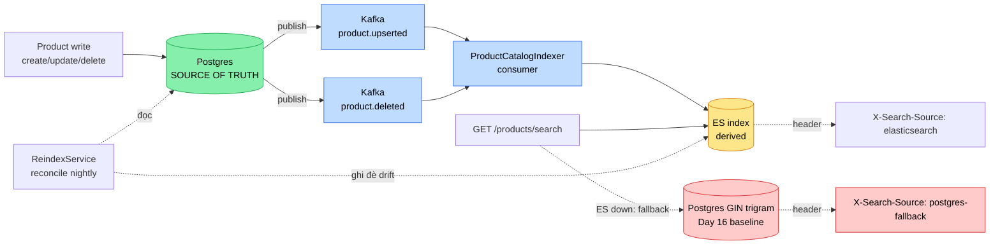

# ADR-010 — Elasticsearch cho product search (app-level sync, Postgres giữ source of truth)

- **Status**: Accepted
- **Date**: 2026-06-01
- **Deciders**: Tonny (Tech Lead), Anh Khải (Principal — reviewer)
- **Supersedes**: none (bổ sung search layer cho `product-service`, không thay
  [ADR-001 hybrid architecture](001-why-hybrid-architecture.md))

---

## Decision

Dùng **Elasticsearch 8** làm **search index** cho product, expose endpoint
`/products/search` (relevance + fuzzy + faceted). **Postgres vẫn là source of truth**;
ES sync qua **app-level dual-write trên Kafka** (`product.upserted` / `product.deleted`),
với **nightly reconcile** sửa drift. Giữ nguyên GIN trigram (Day 16) làm **fallback**
khi ES down.

## Context

Day 16 đã tune Postgres search xuống p95 45ms (GIN trigram) trên 1M rows — đủ nhanh.
Nhưng nó là **substring match**: gõ "iphon" (typo) ra 0 kết quả, không rank theo độ
liên quan, không faceted count real-time. Với TMĐT, search là value driver — typo
tolerance + relevance + facet trực tiếp ảnh hưởng conversion (NexaShop: peak sale mất
đơn vì search yếu). Cần nâng capability search mà KHÔNG biến search thành điểm lỗi
single-point và KHÔNG mất tính source-of-truth của Postgres.

## Alternatives considered

### 1. Giữ nguyên Postgres GIN trigram (+ thêm `tsvector` full-text)
- ✅ Không thêm hạ tầng; không sync; ACID; đã 45ms.
- ❌ Không relevance tuning (BM25/boost), fuzzy yếu, faceted aggregation phải query
  riêng + không real-time tốt. `tsvector` cải thiện full-text nhưng vẫn thua ES về
  ranking + facet + fuzzy.

### 2. Elasticsearch + app-level dual-write sync — **CHOSEN**
- ✅ Relevance (BM25 + `name^3` boost), fuzzy AUTO, faceted aggregation + highlight
  trong 1 round-trip. Sync đơn giản (Kafka event + 1 consumer). Tách tải search khỏi
  OLTP.
- ❌ Dual-write → drift (sửa bằng reconcile). Thêm 1 storage vận hành.

### 3. Elasticsearch + Debezium CDC sync
- ✅ Bắt mọi thay đổi Postgres (kể cả SQL tay), app không lo sync, không mất event.
- ❌ Ops nặng: Kafka Connect + Debezium + replication slot (bỏ quên = WAL phình =
  disk đầy). Over-engineer cho ~50k product + vài chục update/ngày.

### 4. Managed search (Algolia / Meilisearch Cloud)
- ✅ Không vận hành cluster; relevance + typo tốt out-of-box; nhanh launch.
- ❌ Chi phí theo record/search (TMĐT scale → đắt); data ra ngoài (vendor lock +
  compliance); mục tiêu project là **học** ES self-hosted để phỏng vấn, không phải
  outsource.

## Chosen — Rationale

Chọn (2) vì cân bằng **capability cao** (đủ relevance/fuzzy/facet để thắng GIN ở đúng
chỗ search là value driver) với **chi phí sync thấp** (app-level + reconcile, không
kéo Debezium ops vào catalog service đơn giản). (1) thua về capability — lý do chính
migrate. (3) đúng kỹ thuật nhưng over-engineer ở volume hiện tại, để dành làm đường
nâng cấp. (4) trái mục tiêu học + lock-in.

Mấu chốt: **ES là derived search index, Postgres là source of truth.** Search non-
critical → eventual consistency + drift-rồi-reconcile chấp nhận được. Giữ GIN làm
fallback → ES down không làm search 500.

Topology dưới đây show 3 đường: (1) sync chính qua Kafka, (2) fallback khi ES down xuống GIN trigram (đánh dấu bằng header `X-Search-Source`), (3) reconcile loop nightly sửa drift do dual-write:

ES nằm ở vị trí **derived** (không phải single point trên đường ghi — mất ES chỉ mất capability search nâng cao, không mất data); query degrade tự nhiên xuống GIN trigram, client biết qua `X-Search-Source`. `ReindexService.reindexAll()` đọc lại từ Postgres sửa drift do app-level dual-write không atomic.

## Trade-offs

**Accepted (chấp nhận hy sinh)**:
- Drift tạm thời giữa 2 lần reconcile (dual-write không atomic).
- Strong consistency đọc-sau-ghi của search (ES refresh ~1s + Kafka lag).
- Thêm 1 storage + sync pipeline phải monitor.

**Rejected (từ chối hy sinh)**:
- KHÔNG hy sinh source-of-truth: Postgres vẫn own data, ES không bao giờ là primary.
- KHÔNG hy sinh availability search: giữ GIN fallback.

## Consequences

- `product-service` thêm: ES starter + Kafka (producer + consumer), `ProductDocument`,
  `ProductSearchService` (NativeQuery), `ProductIndexer`, `ProductEventPublisher`,
  `ReindexService`, `/products/search` + `/admin/search/*`.
- `common-lib` thêm topic `product.upserted`/`product.deleted` + event records.
- `docker-compose` thêm ES 8 single-node.
- **Ngưỡng nâng cấp** (Day 25 review): nếu drift trung bình > 0.1% hoặc update rate
  tăng cao → chuyển app-level → **outbox** (như order Day 13). Nếu volume > 10M / nhiều
  nguồn ghi → **Debezium CDC**.
- Day 24 sẽ đưa ES vào decision matrix 4-storage (SQL/Redis/Mongo/ES).

## Related

- Lessons: [22 ES basics](../lessons/22-elasticsearch-basics.md) ·
  [22b sync strategies](../lessons/22b-cdc-vs-app-sync-vs-debezium.md)
- Performance: [22 Postgres vs ES](../performance/22-search-postgres-vs-es.md) ·
  [16 GIN baseline](../performance/16-sql-explain-analyze.md)
- Issue: [22 sync drift](../issues/22-es-postgres-sync-drift.md)
- Prior art sync: [ADR-009 outbox-vs-cdc](009-outbox-vs-cdc.md) ·
  [lesson 13 outbox](../lessons/13-outbox-pattern.md)
- Code: [`ProductSearchService`](../../services/product-service/src/main/java/com/ecom/product/search/ProductSearchService.java)
