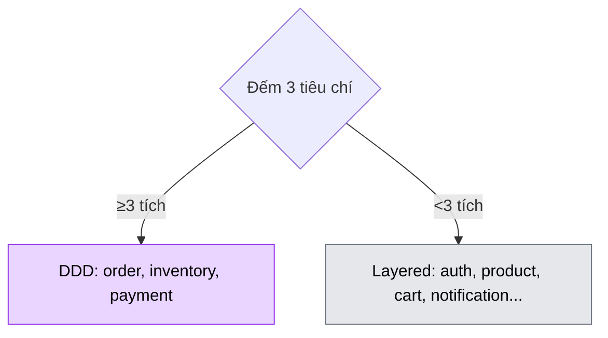

# Chương 1 · 🧱 Ngày khai thiên lập địa

**Day 1 — Architecture, Repo, Docker, Common-lib**

---

> *"Trước khi xây nhà, người thợ giỏi không đi mua gạch. Họ ngồi xuống và vẽ bản thiết kế — vì một nét bút sai ở đây, ba tháng sau là một bức tường phải đập."*

---

> 🎬 **Chương này có gì:** một kiến trúc sư đứng trước thư mục trống, bốn nét bút đặt nền móng vô hình, một tiêu chí 3-điểm để khỏi cãi nhau chuyện DDD, và một cảnh phim lúc 2h sáng chứng minh vì sao "1 dòng sửa thay vì 9 file" không phải lý thuyết suông. ✏️

---

## 🎬 Bối cảnh: kiến trúc sư trước tờ giấy trắng

Một thư mục trống. Một terminal nhấp nháy 🖥️. Con trỏ chớp đều như nhịp tim của một dự án chưa kịp chào đời.

Và một câu hỏi nguy hiểm treo lơ lửng:

> *"Nếu được build lại từ đầu — biết những gì mình biết sau 6 năm viết microservice — mình sẽ làm khác thế nào?"*

Đây là ngày của **người kiến trúc sư**, không phải người thợ hồ. Người thợ hồ thấy đất trống là muốn trộn xi măng ngay. Người kiến trúc sư thì ngồi xuống, mở bản vẽ, và biết một sự thật phũ phàng: **những nét bút hôm nay vô hình, nhưng 39 ngày nữa cả toà nhà sẽ tựa vào chúng.**

Ngày đầu tiên không có một dòng business logic. Không endpoint. Không database table. Không có gì để demo, không có gì để khoe sếp. Chỉ có **những quyết định** — loại quyết định mà 6 tháng sau, khi hệ thống có 9 service và 50 Kafka consumer, bạn sẽ hoặc thầm cảm ơn, hoặc nguyền rủa chính mình lúc 2h sáng.

Kiến trúc sư của chúng ta cầm bút lên. Bốn nét.

---

## ✏️ Nét bút 1: một sổ cái version cho cả vương quốc

Nét đầu tiên không phải vẽ tường, mà là **chọn loại giấy và bút**: build system.

Không Maven. Không `pom.xml` 500 dòng copy-paste qua lại giữa các module như trò "tam sao thất bản". Thay vào đó: **Gradle Kotlin DSL + Version Catalog** — một file `gradle/libs.versions.toml` duy nhất, **single source of truth** cho mọi dependency version trong toàn bộ monorepo.

```toml
[versions]
spring-boot = "3.4.5"
postgres    = "16"

[libraries]
spring-boot-starter-web = { module = "org.springframework.boot:spring-boot-starter-web", version.ref = "spring-boot" }
```

Nghe có vẻ là chi tiết nhỏ nhặt của một mọt build script. Cho đến cái đêm nó cứu mạng bạn.

> 🎬 **Cảnh phim — 6 tháng sau, 2h07 sáng.** Slack nổ đỏ lòm. Một CVE critical vừa được công bố cho Spring Boot. Cả team trên dưới 9 service đang dùng. Bạn dụi mắt, mở laptop. Nếu mỗi service tự khai version trong `build.gradle` riêng — bạn phải mở 9 file, sửa 9 chỗ, nơm nớp sợ sót một thằng. Nhưng vì kiến trúc sư đã đặt nét bút này từ Day 1, bạn mở **đúng một file** `libs.versions.toml`, sửa **đúng một dòng** `spring-boot = "3.4.5"` → `"3.4.6"`, chạy build, đi ngủ tiếp lúc 2h11. 😴

Và khi junior hỏi *"service X dùng Spring version mấy anh?"*, câu trả lời mãi mãi là một câu: **"Mở `libs.versions.toml`."**

> 💡 **Ăn điểm phỏng vấn:** Version Catalog không phải "cho đẹp". Nó biến việc bump version từ thao tác **O(n) theo số service** thành **O(1)**. Nói được câu này, interviewer biết bạn từng đau vì dependency drift thật.

---

## ✏️ Nét bút 2: cả vũ trụ trong một lệnh

Nét thứ hai: hạ tầng chạy local. Kiến trúc sư không muốn ngày mai mỗi dev mất nửa buổi cài Postgres, Redis, Kafka thủ công rồi mỗi máy một version. Một file `docker-compose.yml`, một lệnh:

```yaml
# Một lệnh duy nhất dựng cả vũ trụ
docker compose up -d
```

Trong cái vũ trụ đó có ba chi tiết được vẽ rất có chủ đích:

| 🧩 Thành phần | Quyết định | Vì sao đặt từ Day 1 |
| --- | --- | --- |
| 🐘 **Postgres multi-DB** | Mỗi service một database riêng | **DB-per-service** là nguyên tắc, không phải afterthought lúc đã có 50 table chen trong 1 schema |
| 🔴 **Redis** | Có sẵn từ đầu | Day 15 cache 2-tier sẽ cần, đặt trước cho khỏi vá víu |
| 🟣 **Kafka KRaft** | KRaft mode, không Zookeeper | Zookeeper deprecated từ Kafka 3.3 — sống ở hiện tại, không ở quá khứ |

Cái dòng "DB-per-service từ ngày đầu" là một nét bút trông vô hại nhưng cứng như thép. Nó tuyên bố: **không service nào được thò tay vào database của service khác.** Sau này muốn tách service, scale riêng, đổi schema riêng — đều dễ, vì ranh giới đã kẻ từ trang giấy đầu tiên.

> 💡 **Ăn điểm phỏng vấn:** khi được hỏi "sao dùng KRaft?", đừng đáp "vì nó mới". Đáp: *"Zookeeper deprecated từ Kafka 3.3, KRaft bỏ được một moving part trong ops — ít component, ít thứ hỏng lúc 3h sáng."* Đó là tư duy vận hành, không phải tư duy đú trend.

---

## ✏️ Nét bút 3: chọn DDD hay Layered — và tiêu chí để khỏi cãi nhau

Đây là nét bút **khó nhất** và **quan trọng nhất** của cả bản vẽ. Một quyết định mà nếu vẽ sai, hoặc toà nhà phình ra over-engineering, hoặc sập vì under-engineering.

Hai thái cực đều là cái bẫy:

- 🏰 **Full DDD cho mọi service?** Over-engineering. Cart-service mà bắt nó có Aggregate Root, Domain Event, Repository abstraction đủ lễ nghĩa — là khoác áo giáp đi mua rau.
- 📦 **Full Layered cho mọi service?** Under-engineering. Order-service có 5 trạng thái, một mớ invariant, domain event bay tứ phía — nhét hết vào Controller-Service-Repository là tự buộc dây vào cổ.

Kiến trúc sư từ chối cãi nhau bằng cảm tính. Thay vào đó, dựng một **tiêu chí 3-điểm** để mỗi service tự khai báo nó thuộc phe nào:

| 🎯 Tiêu chí | Hỏi gì | Tích? |
| --- | --- | --- |
| **Invariant** | Có ≥3 business invariant phức tạp không? | ☐ |
| **Concurrency** | Có race condition thật phải xử lý không? | ☐ |
| **Domain events** | Có publish domain event ra ngoài không? | ☐ |

**Luật chốt:** đếm tích — **≥3 tích → DDD**, **<3 tích → Layered**. Đơn giản. Rõ ràng. Defend được trong phỏng vấn 30 giây.



> 🧠 **Senior insight:** giá trị của tiêu chí 3-điểm không nằm ở chỗ nó *luôn đúng*. Nó nằm ở chỗ nó **chấm dứt tranh cãi cảm tính** trong team. Khi có người đòi "service này phải DDD cho xịn", bạn không cãi tay đôi — bạn chỉ tay vào checklist. Quyết định thành **objective**, không phải cuộc đấu khẩu ego.

> 📚 Chi tiết đầy đủ của quyết định này nằm ở [ADR-001 — Why Hybrid Architecture](../decisions/001-why-hybrid-architecture.md). Ở đây ta chỉ vẽ nét, không giảng lại cả lý thuyết.

---

## ✏️ Nét bút 4: `common-lib` — đứa con đầu lòng, và một anh hùng ngủ đông

Nét cuối cùng: `common-lib`. Và đây là chỗ kiến trúc sư phải có **kỷ luật của một người biết nói KHÔNG**.

Quy tắc khắc lên đá: `common-lib` **chỉ chứa cross-cutting infrastructure**. Không domain class. Không business logic. Không cái kiểu *"thôi tiện thể bỏ vào đây cho dễ import"* — vì cái "tiện thể" đó chính là hạt giống của một God-module mà 6 tháng sau ai cũng phụ thuộc và không ai dám sửa.

Ngày đầu, `common-lib` mang trong mình 5 món đồ nghề:

| 🧰 Thành phần | Vai trò | Vì sao cần từ Day 1 |
| --- | --- | --- |
| `ApiResponse<T>` | Mọi response cùng một format | Frontend parse một lần, dùng mãi |
| `ErrorCode` enum | Error có mã, message, HTTP status | Lỗi có danh tính, không phải string vô hồn |
| `BaseException` family | Throw có nghĩa, catch có chủ đích | Exception là tín hiệu, không phải tai nạn |
| `BaseEntity` | `id` + `createdAt` + `updatedAt` + `@Version` | Optimistic lock nạp đạn sẵn cho Day 4 |
| `CorrelationIdFilter` | Gắn trace ID vào **mọi** request | Anh hùng ngủ đông — xem dưới 👇 |

Bốn món đầu dễ hiểu. Món thứ năm mới là chỗ kiến trúc sư mỉm cười bí ẩn.

`CorrelationIdFilter` — một filter bé tí, nhét vào mỗi request một trace ID rồi đẩy nó vào MDC (Mapped Diagnostic Context) để mọi dòng log đều mang theo cái ID đó. Day 1 nó trông **vô dụng đến mức buồn cười**: cả hệ thống có mỗi một service, một request đi thẳng một mạch, cần gì trace?

```java
public class CorrelationIdFilter extends OncePerRequestFilter {
    @Override
    protected void doFilterInternal(HttpServletRequest req,
                                    HttpServletResponse res,
                                    FilterChain chain) throws IOException, ServletException {
        String correlationId = req.getHeader("X-Correlation-Id");
        if (correlationId == null || correlationId.isBlank()) {
            correlationId = UUID.randomUUID().toString();
        }
        MDC.put("correlationId", correlationId);   // mọi log dòng sau đều dính ID này
        try {
            res.setHeader("X-Correlation-Id", correlationId);
            chain.doFilter(req, res);
        } finally {
            MDC.clear();   // dọn sạch — virtual thread/thread pool tái dùng, không để rò ID sang request khác
        }
    }
}
```

> 🧠 **Senior insight:** anh hùng thật của Day 1 không phải món hào nhoáng nào, mà là cái filter nằm im này. Day 9, khi một request xuyên qua 3 service rồi bay tiếp qua Kafka, và bạn cần lần ngược một bug "đơn hàng biến mất", chính cái `correlationId` gieo từ hôm nay sẽ là sợi chỉ Ariadne dẫn bạn ra khỏi mê cung log. **Nền móng tốt là thứ bạn không thấy cho đến đúng lúc bạn cần nó nhất.**

> ⚠️ **Trap dễ mắc:** quên `MDC.clear()` trong `finally`. Thread pool (và virtual thread) tái sử dụng — không clear thì correlationId của request cũ dính sang request mới, log loạn ID, debug xong loạn não. Một dòng `finally` cứu cả buổi điều tra.

---

## 🏁 Kết thúc ngày 1

```
📊 Scorecard:
├── Services:        0 (không vội)
├── Endpoints:       0 (không vội)
├── Business logic:  0 dòng (KHÔNG VỘI — hôm nay vẽ bản thiết kế)
├── Decisions made:  4 nét bút (sẽ sống với chúng 39 ngày)
├── Docs:            4 (ADR-001, system-overview, lesson, interview Q&A)
└── Vibe:            "Toà nhà chưa có viên gạch nào. Nhưng móng đã vô hình mà chắc." 🧱
```

> 💡 **Bẫy phỏng vấn kinh điển:** *"Ngày đầu dự án bạn làm gì trước?"*
>
> **Strong answer:** Không vội code. Đặt 4 quyết định nền: build system một-nguồn-version (Version Catalog), hạ tầng một-lệnh (Docker Compose, DB-per-service), tiêu chí chọn kiến trúc (Hybrid 3-điểm), và cross-cutting lib có kỷ luật (`common-lib` không lậu domain). Lý do: nền móng sửa sau **đắt gấp bội** sửa lúc trống.
>
> 🪤 **Follow-up trap:** *"Vẽ nhiều thế không sợ over-plan, YAGNI à?"* → Phân biệt: đặt **ranh giới kiến trúc** (DB-per-service, common-lib boundary) là chống nợ kỹ thuật cấu trúc — cái này YAGNI không áp dụng. Còn viết sẵn feature chưa cần mới là vi phạm YAGNI. Day 1 chỉ kẻ ranh giới, không xây phòng thừa.

> 🧠 **Senior mindset:** Junior đo productivity bằng số dòng code viết được. Senior đo bằng số quyết định sai **không** phải đưa ra lần nữa.

---

*→ Bản vẽ đã có. Móng đã đổ. Nhưng một toà nhà mở toang mọi cửa thì khác gì cái sân. Ngày mai, ai sẽ đứng ở cổng và hỏi câu sống còn: "Ngươi là ai, và ngươi được phép vào không?"...* 🔐
