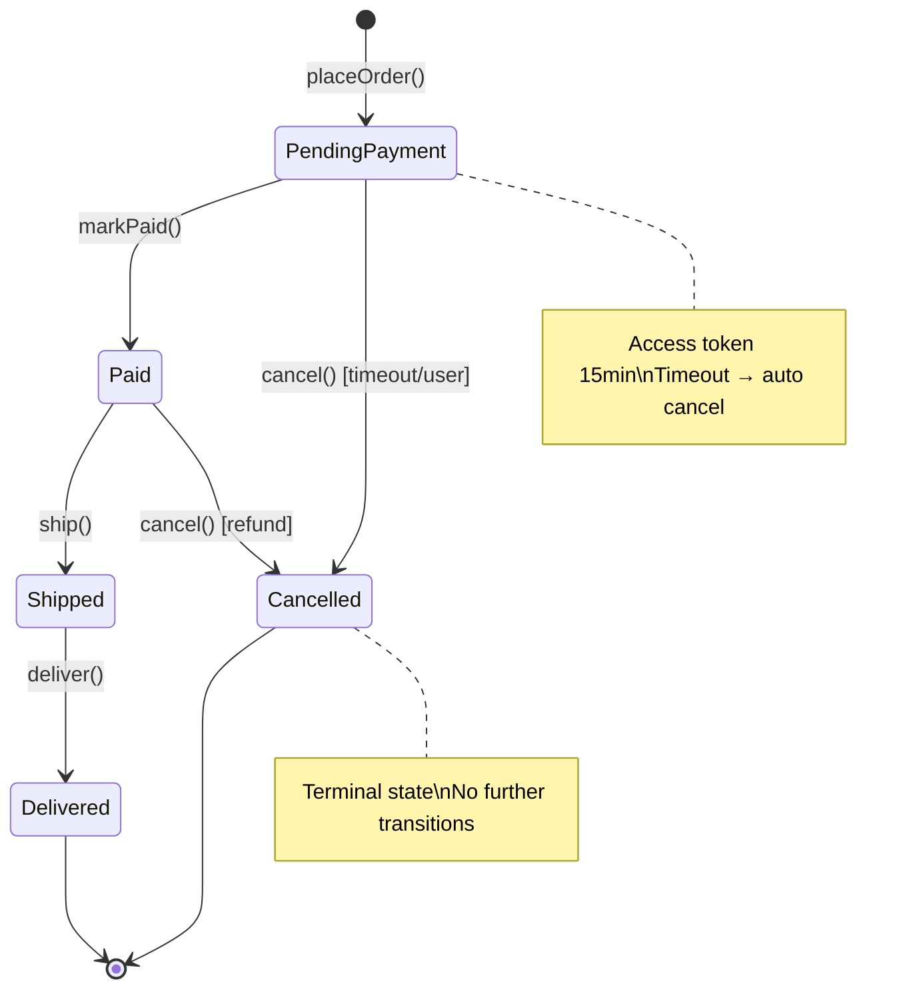
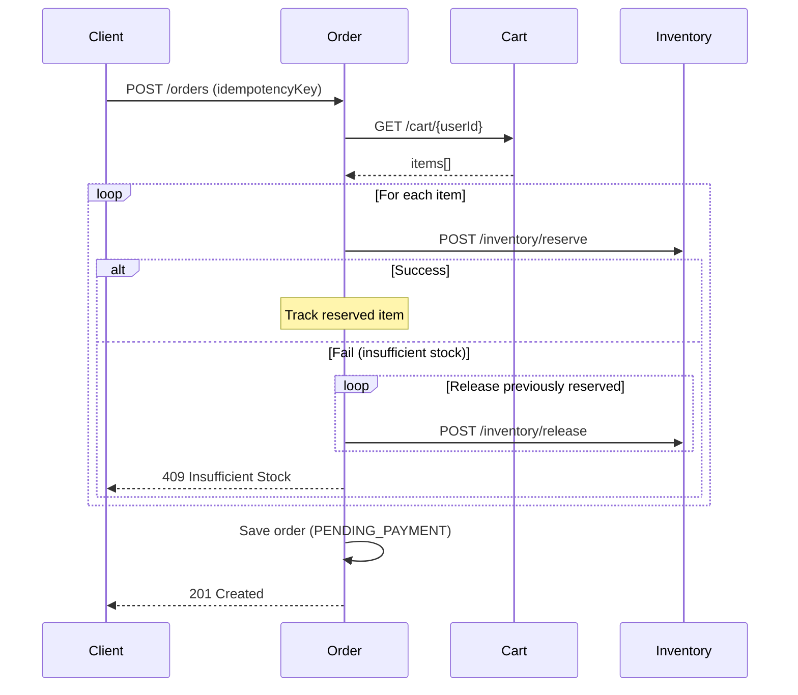

# Chương 6 · 📋 Trái tim hệ thống

**Day 6 — Order Service (DDD)**

---

> *"Nếu ecommerce là cơ thể, order là trái tim. Mọi mạch máu — inventory, payment, notification, shipping — đều chảy qua đây."*

---

## Bối cảnh

Order service là nơi mọi thứ hội tụ. Cart gửi items. Inventory reserve stock. Payment thu tiền. Notification gửi email. Shipping giao hàng. Tất cả xoay quanh **1 entity duy nhất: Order**.

Và Order có thứ mà ít entity khác có: **state machine phức tạp**. Một đơn hàng đi qua nhiều trạng thái, mỗi transition có rule riêng, mỗi trạng thái có data riêng. Đây là DDD territory.

---

## Sealed Interface — State Machine không có lỗ hổng

```java
public sealed interface OrderStatus permits
    PendingPayment, Paid, Shipped, Delivered, Cancelled {

    record PendingPayment() implements OrderStatus {}
    record Paid(Instant paidAt) implements OrderStatus {}
    record Shipped(String trackingNumber, Instant shippedAt) implements OrderStatus {}
    record Delivered(Instant deliveredAt) implements OrderStatus {}
    record Cancelled(String reason, Instant cancelledAt) implements OrderStatus {}
}
```

Mỗi trạng thái là một **type riêng** với data riêng. `Shipped` có `trackingNumber` — `PendingPayment` thì không. Không nullable field. Không "field này chỉ có giá trị khi status = X". Type system enforce.

### Transition rules — exhaustive switch, KHÔNG default

```java
public OrderStatus transitionTo(OrderStatus target) {
    return switch (this) {
        case PendingPayment p -> switch (target) {
            case Paid paid -> paid;           // ✅ valid
            case Cancelled c -> c;            // ✅ valid (timeout/user cancel)
            default -> throw new InvalidTransition(this, target);
        };
        case Paid p -> switch (target) {
            case Shipped s -> s;              // ✅ valid
            case Cancelled c -> c;            // ✅ valid (refund)
            default -> throw new InvalidTransition(this, target);
        };
        case Shipped s -> switch (target) {
            case Delivered d -> d;            // ✅ valid
            default -> throw new InvalidTransition(this, target);
        };
        case Delivered d -> throw new InvalidTransition(this, target);  // terminal
        case Cancelled c -> throw new InvalidTransition(this, target);  // terminal
    };
    // ← KHÔNG CÓ default ở outer switch. Compiler guarantee exhaustive.
}
```

Thêm trạng thái `Refunded` vào sealed interface? **Build break** ở mọi switch chưa handle. Không quên. Không miss. Không runtime `IllegalStateException` lúc 3 giờ sáng.

---

## State machine visualization



---

## Persistence trick: 2 columns thay 1

Sealed interface trong Java đẹp, nhưng JPA không hiểu sealed interface. Giải pháp:

```sql
-- 2 columns
status_type  VARCHAR(32)   -- 'PAID', 'SHIPPED', ...
status_data  JSONB         -- {"paidAt": "2024-01-15T10:30:00Z"}
```

```java
// Serialize: exhaustive switch (no default!)
public static Map<String, Object> toJson(OrderStatus status) {
    return switch (status) {
        case PendingPayment p -> Map.of();
        case Paid p -> Map.of("paidAt", p.paidAt().toString());
        case Shipped s -> Map.of("trackingNumber", s.trackingNumber(), "shippedAt", s.shippedAt().toString());
        case Delivered d -> Map.of("deliveredAt", d.deliveredAt().toString());
        case Cancelled c -> Map.of("reason", c.reason(), "cancelledAt", c.cancelledAt().toString());
    };
}
```

Cả hai thế giới: **type-safe trong Java, flexible trong DB**. Query vẫn dễ: `WHERE status_type = 'PAID'`. Data vẫn rich: JSONB chứa context của từng trạng thái.

---

## PlaceOrder — orchestration và compensation



**Compensation pattern**: Nếu item thứ 3 fail reserve, release item 1 và 2 đã reserve. Best-effort — nếu release cũng fail, log `ORPHAN-RESERVATION` (Day 9 sẽ giải quyết triệt để bằng async event).

---

## Idempotency key — chống duplicate order

User click "Đặt hàng" 2 lần (mạng lag, nút không disable). Không idempotency → 2 order. Có idempotency:

```sql
CREATE UNIQUE INDEX idx_order_idempotency
ON orders (user_id, idempotency_key)
WHERE idempotency_key IS NOT NULL;  -- partial index, không ảnh hưởng order cũ
```

Lần 2 gọi cùng `idempotencyKey` → UNIQUE violation → return order đã tạo. Không duplicate. Không side effect.

---

## Kết thúc ngày 6

```
📊 Scorecard:
├── Services:        5 (auth + product + inventory + cart + order)
├── DDD services:    2 (inventory + order)
├── State machine:   5 states, exhaustive transitions, zero default branch
├── Patterns:        Sealed interface, compensation, idempotency key
├── Tests:           14 unit (9 aggregate + 5 JSON round-trip)
├── Docs:            5 (architecture, 2 lessons, issue, interview)
└── Vibe:            "Trái tim đã đập. Nhưng mọi mạch máu vẫn là sync — 1 service down kéo cả chain."
```

> ⚠️ **Nợ kỹ thuật có ý thức**: PlaceOrder gọi sync tới Cart + Inventory. Nếu Inventory down 5 giây → Order timeout 5 giây → User thấy lỗi. Day 9 sẽ chuyển sang async event-driven để giải quyết coupling này.

---

*→ Trái tim đã đập. Nhưng sau 6 ngày build nhanh, code bắt đầu có mùi...*
