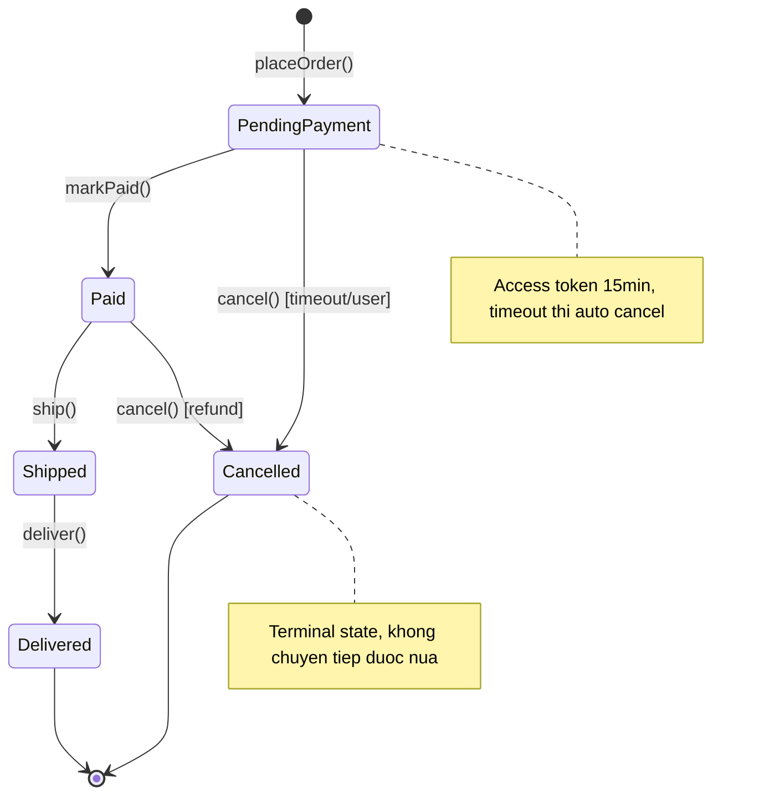
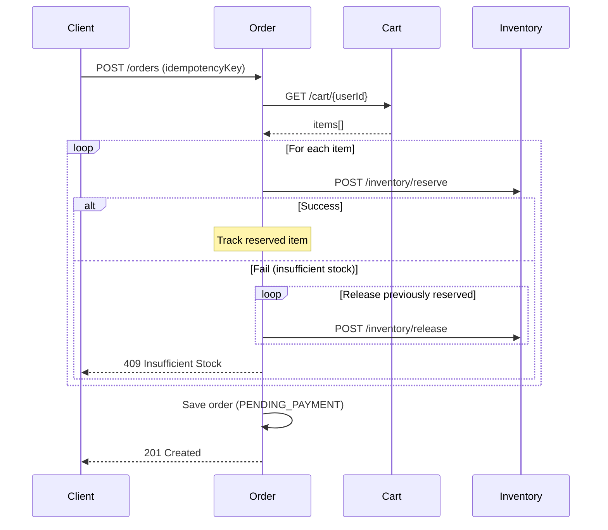

# Chương 6 · 📋 Trái tim hệ thống

**Day 6 — Order Service (DDD)**

---

> *"Nếu ecommerce là một cơ thể, order là trái tim. Mọi mạch máu — inventory, payment, notification, shipping — đều chảy qua đây. Tim đập sai một nhịp, cả cơ thể biết."*

---

> 🎬 **Chương này có gì:** một trái tim với năm nhịp đập, một anh lính canh compiler không cho tim loạn nhịp, một mẹo cất nhịp tim vào hai cái ngăn database, một ca cấp cứu lúc 3h sáng, và một van một chiều ngăn máu chảy ngược khi user bấm chuột hai lần. 🫀

---

## 🎬 Bối cảnh: mọi mạch máu đổ về một nơi

Chương trước, cái túi giỏ hàng chỉ là phòng chờ — nhẹ, nhanh, mất cũng chẳng sao. Nhưng đến khoảnh khắc anh khách bấm **"Đặt hàng"**, mọi món trong túi đổ ào về một nơi nghiêm túc hơn hẳn. Nơi đó là **trái tim** của hệ thống. 🫀

Order service là chỗ mọi thứ hội tụ. Cart bơm items về. Inventory reserve stock. Payment thu tiền. Notification gửi mail. Shipping giao hàng. Tất cả xoay quanh đúng **một entity duy nhất: Order** — và nếu hình dung hệ thống là một cơ thể sống, thì mỗi downstream service là một mạch máu, còn Order là quả tim bơm máu đi khắp nơi.

Trái tim này có một thứ mà ít entity khác có: **một nhịp đập phức tạp**. Một đơn hàng đi qua nhiều trạng thái, mỗi nhịp chuyển có luật riêng, mỗi trạng thái mang dữ liệu riêng. Tim không được phép đập loạn — từ "chờ thanh toán" không thể nhảy thẳng sang "đã giao" mà bỏ qua "đã trả tiền". Đây đúng là lãnh địa của DDD: nơi cần một state machine chặt chẽ, không khoan nhượng.

---

## 🫀 Năm nhịp đập: sealed interface OrderStatus

Trái tim đập theo đúng năm nhịp, không hơn. Và mỗi nhịp là một **type riêng**, mang đúng dữ liệu của riêng nhịp đó:

```java
public sealed interface OrderStatus permits
    PendingPayment, Paid, Shipped, Delivered, Cancelled {

    record PendingPayment() implements OrderStatus {}
    record Paid(Instant paidAt) implements OrderStatus {}
    record Shipped(String trackingNumber, Instant shippedAt) implements OrderStatus {}
    record Delivered(Instant deliveredAt) implements OrderStatus {}
    record Cancelled(String reason, Instant cancelledAt) implements OrderStatus {}
}
```

Để ý cái đẹp: `Shipped` mang `trackingNumber` — vì hàng đã đi thì phải có mã vận đơn. `PendingPayment` thì *không có gì cả* — vì chưa trả tiền thì lấy đâu ra dữ liệu giao hàng. Không có cái field nullable kiểu *"trackingNumber chỉ có giá trị khi status = SHIPPED"* — thứ field rác khiến mọi người phải đoán mò. Type system nói thẳng: nhịp nào mang máu nào.

### 👮 Luật chuyển nhịp: exhaustive switch, KHÔNG default

Đây là chỗ anh lính canh compiler bước vào canh trái tim — đảm bảo nó không bao giờ loạn nhịp:

```java
public OrderStatus transitionTo(OrderStatus target) {
    return switch (this) {
        case PendingPayment p -> switch (target) {
            case Paid paid -> paid;           // ✅ valid
            case Cancelled c -> c;            // ✅ valid (timeout/user cancel)
            default -> throw new InvalidTransition(this, target);
        };
        case Paid p -> switch (target) {
            case Shipped s -> s;              // ✅ valid
            case Cancelled c -> c;            // ✅ valid (refund)
            default -> throw new InvalidTransition(this, target);
        };
        case Shipped s -> switch (target) {
            case Delivered d -> d;            // ✅ valid
            default -> throw new InvalidTransition(this, target);
        };
        case Delivered d -> throw new InvalidTransition(this, target);  // terminal
        case Cancelled c -> throw new InvalidTransition(this, target);  // terminal
    };
    // ← KHÔNG CÓ default ở outer switch. Compiler guarantee exhaustive.
}
```

Bảng nhịp tim cho dễ tra — mỗi ô là một nhịp chuyển hợp lệ, ô trống là nhịp bị cấm:

| Từ \ Sang | Paid | Shipped | Delivered | Cancelled |
| --- | :---: | :---: | :---: | :---: |
| **PendingPayment** | ✅ | ❌ | ❌ | ✅ (timeout/user) |
| **Paid** | — | ✅ | ❌ | ✅ (refund) |
| **Shipped** | — | — | ✅ | ❌ |
| **Delivered** | — | — | — | ❌ (terminal) |
| **Cancelled** | — | — | — | ❌ (terminal) |

Cái chốt nằm ở chỗ **không có `default` ở outer switch**. Một ngày nào đó ai đó thêm nhịp `Refunded` vào sealed interface → **build break** ở mọi switch chưa xử lý nó. Compiler chỉ tay vào từng dòng: "anh quên nhịp này". Không quên, không miss, không có cú `IllegalStateException` nhảy ra lúc 3h sáng.

> 🧠 **Senior insight:** state machine bằng String + if-else thì *lỗi quên nhánh* chỉ lộ ra trên prod. State machine bằng sealed + exhaustive switch thì lỗi đó lộ ra lúc *compile*, trước khi code kịp chạy. Dịch một class lỗi từ runtime về compile-time — đó là toàn bộ giá trị của sealed types ở đây.



---

## 🗄️ Cất nhịp tim vào DB: 2 cột thay 1

Sealed interface đẹp trong Java, nhưng JPA *không hiểu* sealed interface — nó không biết phải nhét cái `record Paid(Instant paidAt)` vào cột nào. Mẹo: tách làm **hai cái ngăn**, một cho tên nhịp, một cho dữ liệu nhịp:

```sql
-- 2 columns
status_type  VARCHAR(32)   -- 'PAID', 'SHIPPED', ...
status_data  JSONB         -- {"paidAt": "2024-01-15T10:30:00Z"}
```

Và lúc serialize, lại là exhaustive switch (vẫn không `default`!) — compiler vẫn canh, kể cả ở tầng persistence:

```java
// Serialize: exhaustive switch (no default!)
public static Map<String, Object> toJson(OrderStatus status) {
    return switch (status) {
        case PendingPayment p -> Map.of();
        case Paid p -> Map.of("paidAt", p.paidAt().toString());
        case Shipped s -> Map.of("trackingNumber", s.trackingNumber(), "shippedAt", s.shippedAt().toString());
        case Delivered d -> Map.of("deliveredAt", d.deliveredAt().toString());
        case Cancelled c -> Map.of("reason", c.reason(), "cancelledAt", c.cancelledAt().toString());
    };
}
```

Được cả hai thế giới: **type-safe trong Java, flexible trong DB**. Query vẫn dễ — `WHERE status_type = 'PAID'` chạy nhanh, index được. Data vẫn giàu — JSONB ôm trọn context riêng của từng nhịp. Nhịp tim được lưu xuống mà không mất một chút thông tin nào.

---

## 🩸 Bơm máu đi khắp nơi: PlaceOrder và compensation

Khi anh khách bấm "Đặt hàng", trái tim co bóp một cái — và máu phải chảy qua từng mạch theo đúng thứ tự. Nhưng mạch máu có thể tắc giữa chừng: lỡ reserve được 2 món rồi món thứ 3 báo hết hàng thì sao? Không lẽ giữ lúng túng 2 món kia mãi?



Đây là **compensation pattern** — khi một mạch tắc, ta phải *rút máu ngược ra* khỏi những mạch đã bơm. Item thứ 3 fail reserve → release lại item 1 và 2 đã giữ. Best-effort: nếu release cũng fail, log `ORPHAN-RESERVATION` để xử lý sau (Day 9 sẽ giải quyết triệt để bằng async event, biến cái chuỗi sync mong manh này thành event-driven).

---

## 🔁 Van một chiều: idempotency chống tim đập đôi

Giờ đến ca cấp cứu cụ thể nhất chương này. Dựng cảnh:

> 🖱️ Anh khách bấm **"Đặt hàng"**. Mạng lag một nhịp, cái nút không kịp disable. Anh sốt ruột bấm thêm cái nữa. Hai request `POST /orders` cùng bay lên server — cùng một giỏ hàng, cùng một ý định, nhưng là **hai cú bơm**.

Không có gì chặn → trái tim đập đôi → **2 order** được tạo cho cùng một lần mua. Anh khách bị trừ tiền hai lần, và sáng hôm sau bộ phận CSKH nhận một cuộc gọi không vui. Đây chính là máu chảy ngược — thứ mà mọi trái tim khoẻ mạnh đều phải có **van một chiều** để ngăn.

Cái van đó là idempotency key, cài thẳng ở tầng database:

```sql
CREATE UNIQUE INDEX idx_order_idempotency
ON orders (user_id, idempotency_key)
WHERE idempotency_key IS NOT NULL;  -- partial index, không ảnh hưởng order cũ
```

Lần bấm thứ hai mang *cùng* `idempotencyKey` → đụng UNIQUE constraint → thay vì tạo order mới, hệ thống trả về order đã tạo ở lần đầu. Một cú bấm hay mười cú bấm, kết quả chỉ một order. Máu chỉ chảy một chiều. Van đóng lại, tim không đập đôi.

> ⚠️ **Trap kinh điển:** nhiều người chống duplicate bằng cách check ở application code (`if (orderExists) return`). Nhưng dưới concurrency thật, hai request cùng chạy `if` *cùng lúc*, cùng thấy "chưa có", cùng tạo. Chỉ có **UNIQUE constraint ở DB** mới là cái van thật — database serialize hai cú INSERT, một thắng một thua, không có khe hở phần nghìn giây nào lọt qua.

---

## 🏁 Kết thúc ngày 6

```
📊 Scorecard:
├── Services:        5 (auth + product + inventory + cart + order)
├── DDD services:    2 (inventory + order)
├── State machine:   5 states, exhaustive transitions, zero default branch
├── Patterns:        Sealed interface, compensation, idempotency key
├── Tests:           14 unit (9 aggregate + 5 JSON round-trip)
├── Docs:            5 (architecture, 2 lessons, issue, interview)
└── Vibe:            "Trái tim đã đập. Nhưng mọi mạch máu vẫn là sync — 1 service down kéo cả chain." 🫀
```

> ⚠️ **Nợ kỹ thuật có ý thức:** PlaceOrder gọi *sync* tới Cart + Inventory. Nếu Inventory tắc 5 giây → Order timeout 5 giây → user thấy lỗi. Trái tim đang nối cứng với mọi mạch máu — một mạch nghẽn, cả tim ngừng đập. Day 9 sẽ mổ tim để thay nối cứng bằng async event-driven, cho mỗi mạch tự chảy theo nhịp riêng.

---

*→ Trái tim đã đập, năm nhịp rõ ràng, van một chiều đã lắp. Nhưng sau 6 ngày bơm máu liên tục không nghỉ, người ta bắt đầu ngửi thấy thứ gì đó... 16 file JWT y hệt nhau đang nhìn chằm chằm. Code bắt đầu có mùi. Cuối tuần rồi — đến lúc dọn nhà...* 🧹
