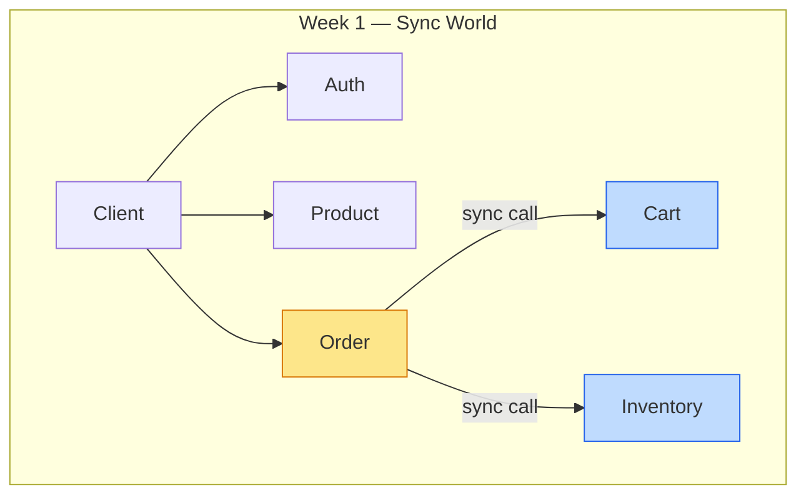

# Chương 7 · 🧹 Dọn nhà cuối tuần

**Day 7 — Refactor + Review + Mock Interview**

---

> *"Sai tên sản phẩm thì sửa. Code xấu thì còn ngậm ngùi cho qua. Nhưng cái tủ quần áo mà bạn nhét vội đồ suốt 6 ngày — đến cuối tuần mở ra, nó sẽ nhìn bạn chằm chằm như đòi nợ."*

---

> 🎬 **Chương này có gì:** một cuộc tổng vệ sinh cuối tuần, 16 món đồ trùng lặp nhét bừa trong 4 cái tủ, một quy tắc "đến cái thứ ba thì phải mua kệ", ba cái khoá tủ thông minh, một bài kiểm tra miệng 10 câu, và một bản tổng kết tuần đầu tiên. Mặc đồ lao động vào. 🧤

---

## 🏠 Bối cảnh: chủ nhật, mở tủ ra

Sáu ngày sprint vừa qua giống như sáu ngày đi làm về mệt: đồ cởi ra vắt đại lên ghế, chìa khoá quăng vào ngăn kéo nào gần nhất, hoá đơn nhét tạm sau cánh tủ. Mỗi ngày một ít. Code chạy, test pass, ai cũng vui. 🎉

Rồi chủ nhật tới. Bạn mở cái tủ lớn ra để tìm một cái áo — và cả đống đồ nhét vội suốt tuần đổ ụp xuống đầu. 🫠

Đó chính xác là cảm giác của hệ thống vào Day 7. Năm service đang chạy ngon lành. Nhưng dọn nhà một vòng thì lộ ra một đống đồ trùng đến phát hoảng:

> 🧦 **JWT verify logic — copy-paste y hệt ở 4 service.**

Cụ thể, mỗi cái tủ (service) đều nhét cùng một bộ đồ:

- 📦 `product-service`: có `JwtAuthenticationFilter` + `JwtVerifier` + `AuthUserPrincipal` + `JwtProperties`.
- 📦 `inventory-service`: y hệt.
- 📦 `cart-service`: y hệt.
- 📦 `order-service`: y hệt.

**16 file. Cùng một logic. 4 bản photocopy.** 🖨️

Vấn đề không phải là tốn chỗ. Vấn đề là: sửa **một** bug JWT → phải mở **bốn** cái tủ, sửa **bốn** chỗ. Quên một chỗ? Cái tủ đó vẫn cài cửa bằng ổ khoá hỏng — **security hole** im lặng nằm chờ. 🕳️

---

## 📐 Rule of Three: đến cái thứ ba thì mua kệ

Tại sao đợi đến tận Day 7 mới dọn? Không phải lười. Là có nguyên tắc.

Có một quy tắc dọn nhà mà dân kỹ thuật gọi là **Rule of Three**: thấy món đồ giống nhau **một** chỗ — kệ nó. **Hai** chỗ — liếc nghi ngờ nhưng tha. **Ba** chỗ — dừng lại, ra cửa hàng mua cái kệ chung, gom hết về một mối.

Lần theo dấu vết tuần qua:

| Ngày | Chuyện gì xảy ra | Phán quyết |
| --- | --- | --- |
| Day 2 | `auth-service` viết JWT logic đầu tiên | ✅ OK — nó là owner, đồ của nó |
| Day 3 | `product-service` copy JWT verify | 🤨 2 chỗ — ghi nhận, tạm tha |
| Day 4 | `inventory-service` copy nốt | ⚠️ 3 chỗ — **Rule of Three!** Phải extract |

Nhưng Day 4 đang giữa cao điểm build feature (inventory DDD, optimistic lock — chuyện sống còn). Dừng giữa chừng đi dọn tủ là dại. Nên ghi nợ vào sổ. 📝 **Day 7 trả nợ.** Đây cũng là một quyết định senior: biết technical debt nào nên trả ngay, nào nên ghi nợ có kiểm soát.

---

## 🗄️ `common-lib`: cái kho chung — nhưng có khoá

Cái "kệ chung" ở đây là `common-lib/security/`. Nhưng — và đây là chỗ phân biệt người dọn nhà cẩu thả với người dọn nhà có não — **không phải cứ bê tất cả lên kho chung là xong.**

Vấn đề của kho chung: nếu để cửa mở toang, thì cái `notification-service` (vốn chẳng cần auth) cũng vô tình vác về nguyên bộ JWT, rồi crash lúc test vì thiếu config secret. Kho chung mà không có khoá thì biến thành nơi mọi người lấy nhầm đồ của nhau.

Nên cái kho này có **ba lớp khoá** — `@ConditionalOnXxx`:

```java
@Configuration
@ConditionalOnClass(JwtParser.class)                    // Có jar jjwt trong nhà?
@ConditionalOnProperty("app.security.jwt.secret")       // Có khai báo secret?
@ConditionalOnMissingBean(JwtAuthenticationFilter.class) // Service tự mang đồ riêng?
public class SecurityAutoConfiguration {
    // Auto-wire toàn bộ JWT verify stack
}
```

Ba lớp khoá, ba câu hỏi trước khi cho lấy đồ:

- 🔑 **`@ConditionalOnClass`** — *"Nhà anh có jar `jjwt` không?"* Không có → kho không mở. `notification-service` không kéo dependency này → an toàn tuyệt đối, không lấy nhầm.
- 🔑 **`@ConditionalOnProperty`** — *"Anh có config secret chưa?"* Chưa → kho không mở. Tránh chuyện test environment thiếu secret mà vẫn cố nạp bean rồi nổ tung.
- 🔑 **`@ConditionalOnMissingBean`** — *"Anh tự mang `JwtAuthenticationFilter` riêng à?"* Có → kho lịch sự nhường. `auth-service` giữ logic riêng của nó (principal có thêm `tokenVersion` — 4 field thay vì 3 field verify-only), nên auto-config tự động bước sang một bên.

> 💡 **Đây là linh hồn của Spring Boot auto-configuration:** kho chung *đề nghị* chứ không *ép buộc*. Service nào hợp thì dùng, service nào có nhu cầu riêng thì tự lo — và không ai phải đụng vào ai.

---

## ✨ Sau khi dọn xong: nhà gọn hẳn

```diff
- 16 files deleted (4 service × 4 file mỗi service)
+ 4 files added to common-lib/security/
+ 1 auto-configuration class
```

Build vẫn green 🟢. 32 test vẫn pass. Mọi service hoạt động **y hệt** như trước — người dùng không nhận ra gì khác. Nhưng từ giờ, sửa JWT logic = mở **đúng một cái kho**, sửa **đúng một chỗ**. Bug fix một phát, cả bốn service cùng được vá. Không còn nỗi sợ "quên một chỗ".

Nhà cửa gọn gàng rồi. Giờ tới phần đáng sợ hơn việc dọn nhà: **soi gương xem mình học được gì.** 🪞

---

## 🧠 Mock Interview: bài kiểm tra miệng cuối tuần

Cuối tuần, ngoài dọn nhà, còn một nghi thức: tự ngồi xuống, đóng vai interviewer, hỏi chính mình 10 câu, chấm điểm **brutally honest** — không tự lừa, không cho điểm thương cảm.

Kết quả: **9 câu strong, 1 câu borderline, 0 fail.** Một bảng điểm đẹp, nhưng cái đẹp nhất nằm ở chỗ *biết rõ mình run ở đâu*.

Chín câu strong trải đều cả tuần: từ chuyện chọn monorepo (Day 1), các chiến lược revoke JWT (Day 2), optimistic vs pessimistic lock (Day 4), ranh giới aggregate trong DDD (Day 6), chọn data structure Redis cho cart (Day 5), sealed interface vs enum cho state machine (Day 6), enforce DB-per-service, compensation pattern vs saga, cho tới system design đặt đơn ở scale lớn. Mỗi câu đều trả lời được kèm trade-off rõ ràng — đúng kiểu senior.

Chỗ **run duy nhất** là câu số 9: **Virtual Thread pinning**. Lý thuyết thì thuộc — biết rằng một `synchronized` block sẽ *pin* virtual thread vào carrier thread, làm mất sạch lợi ích của Loom. Nhưng đó mới là sách vở. Chưa từng benchmark thật, chưa từng nhìn thấy con số pinning trong JFR. Khi interviewer (chính mình) hỏi vặn *"thế anh đo thế nào, con số ra sao?"* — là lúc giọng bắt đầu yếu đi. Đó là dấu hiệu của *biết-mà-chưa-thấm*.

| Câu run | Biết gì | Thiếu gì | Trả nợ ngày nào |
| --- | --- | --- | --- |
| ⚠️ Virtual Thread pinning | `synchronized` block pin carrier thread | Chưa benchmark thật, chưa có số JFR | Day 19 (JFR profiling + JMH) |

> 🧠 **Bài học về self-assessment:** một câu borderline *được nhận ra* còn giá trị hơn chín câu strong. Vì nó cho bạn một mục tiêu cụ thể để trả nợ. Day 19 đã được đánh dấu sẵn trong lịch: profiling bằng JFR + benchmark bằng JMH, biến "biết lý thuyết" thành "có con số trong tay".

---

## 📄 CV Bullets — Week 1

Dọn nhà xong cũng là lúc viết lại cái "nhãn dán" ngoài cửa — hai dòng để nói cho thế giới biết tuần này làm được gì:

> *"Built microservice ecommerce platform (5 services, Gradle monorepo) with DDD aggregates enforcing zero-oversell invariant via optimistic locking — 100-thread concurrency test, 0% oversell rate."*

> *"Designed sealed-interface state machine for order lifecycle (5 states, exhaustive pattern matching) — compile-time guarantee no unhandled transitions, persistence via dual-column VARCHAR+JSONB."*

Để ý: mỗi bullet đều có **metric** (100-thread, 0% oversell, 5 states) và **tên kỹ thuật cụ thể** (optimistic locking, sealed interface, dual-column). Không có chữ "responsible for" hay "worked on" mơ hồ.

---

## 🏁 Kết thúc ngày 7 — Week 1 Retrospective

```
📊 Week 1 Final Scorecard:
├── Services:        5 running (auth, product, inventory, cart, order)
├── Unit tests:      32 passing
├── Docs created:    ~25 file
├── Architecture:    Hybrid (2 DDD + 3 Layered)
├── Refactor:        16 file duplicate → common-lib (3 lớp @ConditionalOn)
├── Mock interview:  9 strong / 1 borderline / 0 fail
├── Communication:   ALL SYNC (RestClient)
├── Single point of failure: YES (service nào chết → cascade)
├── Biggest debt:    Sync coupling (Day 9 sẽ fix)
└── Vibe:            "Nhà đã dọn, tủ đã khoá. Nhưng cả căn nhà vẫn chỉ có một cầu dao." 💡
```



> 💡 **Nhìn lại:** Week 1 build **đúng** nhưng **mong manh**. Mọi service nói chuyện trực tiếp với nhau. Một service chậm → cả chain chậm. Một service chết → cả flow sập. Cái nhà gọn gàng rồi đấy, nhưng nó vẫn chỉ có một cầu dao tổng — cúp một phát là tối thui toàn bộ.

---

*→ Week 1 khép lại. Nhà cửa sạch sẽ, nhưng mọi căn phòng vẫn nối nhau bằng những sợi dây cứng nhắc — phòng này giật mình thì phòng kia ngã theo. Tuần sau, người ta sẽ đào một thứ chạy ngầm dưới lòng nhà, để các phòng thôi phải nắm tay nhau mới sống được...* 🚇
