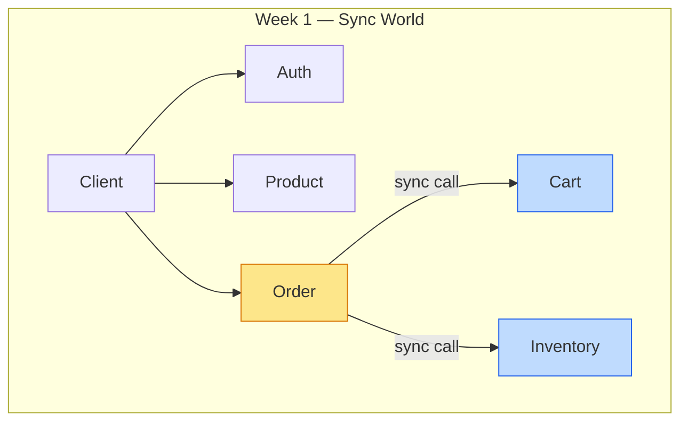

# Chương 7 · 🧹 Dọn nhà cuối tuần

**Day 7 — Refactor + Review + Mock Interview**

---

> *"Tuần đầu tiên kết thúc. 6 ngày build liên tục, code chạy, test pass. Nhưng nhìn lại — 16 file duplicate đang nhìn bạn chằm chằm."*

---

## Bối cảnh

Sau 6 ngày sprint, hệ thống có 5 service hoạt động. Mọi thứ chạy. Test pass. Nhưng có 1 vấn đề: **JWT verify logic copy-paste ở 4 service**.

`product-service` có `JwtAuthenticationFilter` + `JwtVerifier` + `AuthUserPrincipal` + `JwtProperties`.
`inventory-service` có y hệt.
`cart-service` có y hệt.
`order-service` có y hệt.

**16 file. Cùng logic. 4 bản copy.** Sửa 1 bug JWT → sửa 4 chỗ. Quên 1 chỗ → security hole.

---

## Rule of Three đã trigger

Day 2: auth-service có JWT logic → OK, nó là owner.
Day 3: product-service copy JWT verify → hmm, 2 chỗ, chấp nhận.
Day 4: inventory-service copy → **3 chỗ. Rule of Three. Extract.**

Nhưng Day 4-6 đang build feature quan trọng, không muốn refactor giữa chừng. Ghi nợ. Day 7 trả.

---

## Extract lên `common-lib/security/` — nhưng có điều kiện

Không phải "bê nguyên lên common-lib". Phải **có điều kiện**:

```java
@Configuration
@ConditionalOnClass(JwtParser.class)                    // Có jar jjwt?
@ConditionalOnProperty("app.security.jwt.secret")       // Có config secret?
@ConditionalOnMissingBean(JwtAuthenticationFilter.class) // Service muốn custom?
public class SecurityAutoConfiguration {
    // Auto-wire JWT verify stack
}
```

3 layer condition:
1. **`@ConditionalOnClass`** — service không kéo jjwt dependency → auto-config không activate. Notification-service (không cần auth) an toàn.
2. **`@ConditionalOnProperty`** — không config secret → không activate. Tránh fail khi test.
3. **`@ConditionalOnMissingBean`** — service muốn custom filter riêng? Declare bean → auto-config nhường. Auth-service giữ logic riêng (principal có `tokenVersion` — 4 field thay vì 3 field verify-only).

---

## Kết quả

```diff
- 16 files deleted (4 services × 4 files each)
+ 4 files added to common-lib/security/
+ 1 auto-configuration class
```

Build green. 32 test pass. Mọi service hoạt động y hệt. Nhưng giờ sửa JWT logic = sửa **1 chỗ**.

---

## Mock Interview — kiểm tra tuần 1

10 câu hỏi. Self-grade brutally honest. Không tự lừa.

| # | Topic | Grade |
|---|-------|-------|
| 1 | Monorepo vs polyrepo trade-off | ✅ Strong |
| 2 | JWT revocation strategies | ✅ Strong |
| 3 | Optimistic vs pessimistic locking | ✅ Strong |
| 4 | DDD aggregate boundary rules | ✅ Strong |
| 5 | Redis data structure choice for cart | ✅ Strong |
| 6 | Sealed interface vs enum for state | ✅ Strong |
| 7 | DB-per-service enforcement | ✅ Strong |
| 8 | Compensation pattern vs saga | ✅ Strong |
| 9 | Virtual Thread pinning scenario | ⚠️ Borderline |
| 10 | System design: order placement at scale | ✅ Strong |

**9 strong / 1 borderline / 0 fail.**

Borderline: Virtual Thread pinning — biết lý thuyết (`synchronized` block pin carrier thread) nhưng chưa có benchmark thật. Day 19 sẽ fix bằng JFR profiling + JMH benchmark.

---

## CV Bullets — Week 1

> *"Built microservice ecommerce platform (7 services, Gradle monorepo) with DDD aggregates enforcing zero-oversell invariant via optimistic locking — 100-thread concurrency test, 0% oversell rate."*

> *"Designed sealed-interface state machine for order lifecycle (5 states, exhaustive pattern matching) — compile-time guarantee no unhandled transitions, persistence via dual-column VARCHAR+JSONB."*

---

## Kết thúc ngày 7 — Week 1 Retrospective

```
📊 Week 1 Final Scorecard:
├── Services:        5 running (auth, product, inventory, cart, order)
├── Unit tests:      32 passing
├── Docs created:    ~25 files
├── Architecture:    Hybrid (2 DDD + 3 Layered)
├── Communication:   ALL SYNC (RestClient)
├── Single point of failure: YES (any service down → cascade)
├── Biggest debt:    Sync coupling (Day 9 sẽ fix)
└── Ready for:       Week 2 — Kafka sẽ thay đổi mọi thứ
```



> 💡 **Nhìn lại**: Week 1 build **đúng** nhưng **fragile**. Mọi service nói chuyện trực tiếp. 1 service chậm → cả chain chậm. 1 service down → cả flow fail. Week 2 sẽ thêm Kafka — và hệ thống sẽ học cách "thở" bất đồng bộ.

---

*→ Week 1 khép lại. Hệ thống hoạt động, nhưng giống dàn nhạc mà mọi nhạc công phải chơi cùng nhịp — một người lỡ tay, cả bản nhạc dừng. Tuần sau, họ sẽ học cách chơi bất đồng bộ...*
