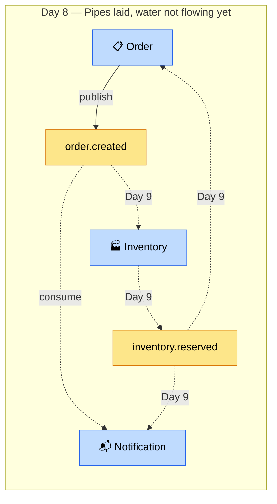

# Chương 8 · 📡 Đường ống ngầm

**Day 8 — Kafka Setup + HTTP Interface vs Feign**

---

> *"Sync là nói chuyện mặt đối mặt — nhanh, nhưng cả hai phải có mặt cùng lúc. Async là gửi thư — chậm hơn một nhịp, nhưng người gửi không cần đứng đợi người nhận mở thư."*

---

## Bối cảnh — Tại sao cần thay đổi?

Week 1 kết thúc với 5 service giao tiếp **hoàn toàn sync**. PlaceOrder gọi Cart, gọi Inventory, chờ response, rồi mới save. Trông gọn gàng. Nhưng:

- Inventory down 3 giây → Order timeout 3 giây → User thấy spinner → bỏ đi
- Cart chậm → Order chậm → mọi thứ downstream chậm theo
- Deploy inventory-service → 30 giây downtime → 30 giây không ai đặt được hàng

Tên gọi cho hiện tượng này: **temporal coupling** — mọi service phải sống cùng lúc mới hoạt động. Đây không phải microservice. Đây là **distributed monolith**.

Day 8 bắt đầu phá vỡ coupling đó.

---

## Kafka vào cuộc — 5 topic khai sinh

```
order.created          ← Order service publish khi đơn mới
order.cancelled        ← Order service publish khi hủy
payment.completed      ← Payment service publish khi thanh toán xong
inventory.reserved     ← Inventory service publish khi giữ hàng thành công
notification.outgoing  ← Notification service publish khi cần gửi thông báo
```

Tên topic là **contract**. Đặt sai tên, 6 tháng sau 15 consumer đang listen → rename = nightmare. Quy tắc: `<domain>.<past-tense-event>`. Không phải command (`reserve-stock`), mà là **fact đã xảy ra** (`inventory.reserved`).

---

## Producer config — paranoid mode

```yaml
spring:
  kafka:
    producer:
      acks: all                              # Leader + all ISR phải confirm
      properties:
        enable.idempotence: true             # Exactly-once per partition
        max.in.flight.requests.per.connection: 5  # Vẫn giữ ordering!
        retries: 2147483647                  # Retry forever (bounded by delivery.timeout.ms)
```

Tại sao `acks=all` mà không `acks=1`?

Với `acks=1`: leader confirm → producer happy → leader crash trước khi replicate → **message mất**. Xác suất thấp (~0.3% khi leader failover), nhưng 0.3% của 1 triệu order/ngày = 3000 order mất event. Không chấp nhận được.

Với `acks=all`: leader + tất cả ISR confirm → message safe. Latency thêm ~2-5ms. Trade-off xứng đáng.

Tại sao `max.in.flight=5` mà không phải `1`? Vì Kafka 1.0+ với `enable.idempotence=true` guarantee ordering kể cả in-flight > 1. Performance 5x mà không hy sinh correctness.

---

## Consumer config — at-least-once, không auto-commit

```yaml
spring:
  kafka:
    consumer:
      enable-auto-commit: false              # Tự commit sau khi process xong
      isolation-level: read_committed        # Không đọc message từ aborted transaction
    listener:
      ack-mode: record                       # Commit sau mỗi record (không batch)
```

`enable.auto.commit=false` là **non-negotiable** cho production. Auto-commit = commit offset trước khi process xong → crash giữa chừng → message mất. At-least-once > at-most-once cho business event.

---

## 🆕 HTTP Interface vs OpenFeign — cuộc so sánh side-by-side

Day 8 cũng là ngày 2 thế hệ HTTP client đứng cạnh nhau:

```java
// OpenFeign (cũ, quen thuộc)
@FeignClient(name = "product-service", url = "${app.services.product.url}")
public interface ProductFeignClient {
    @GetMapping("/products/{sku}/snapshot")
    ProductSnapshot getSnapshot(@PathVariable String sku);
}

// Spring 6.1 HTTP Interface (mới, native)
public interface ProductHttpInterfaceClient {
    @GetExchange("/products/{sku}/snapshot")
    ProductSnapshot getSnapshot(@PathVariable String sku);
}
```

Trông giống nhau? Khác nhau ở **dưới hood**:

| Axis | OpenFeign | HTTP Interface |
|------|-----------|----------------|
| Dependency | Netflix OSS (maintenance mode) | Spring native (active) |
| HTTP client | Apache HttpClient (blocking) | RestClient / WebClient (flexible) |
| Virtual Thread | Cần config thêm | Native support |
| Error handling | `FeignException` hierarchy | Standard Spring `RestClientException` |
| Interceptor | Feign `RequestInterceptor` | Standard `ClientHttpRequestInterceptor` |
| Future | Deprecated direction | Spring's recommended path |

**Verdict: HTTP Interface.** Native Spring, không extra dependency, compile-time safe, virtual thread friendly. Feign giữ lại cho legacy service chưa migrate.

---

## Event schema — contract giữa các service

```java
public sealed interface DomainEvent permits
    OrderCreatedV1, StockReservedV1, PaymentCompletedV1, NotificationOutgoingV1 {

    String eventId();       // UUID — dedup key
    Instant occurredAt();   // Khi nào event xảy ra
    String eventType();     // "order.created.v1"
    int eventVersion();     // Schema version
}
```

**Additive-only contract**: thêm field OK, xóa/rename field = breaking change → tạo v2 topic + dual-publish transition period.

`eventId` là **dedup key** — consumer nhận 2 lần cùng eventId → process 1 lần. At-least-once delivery + idempotent consumer = effectively exactly-once.

---

## Virtual Thread listener — Kafka consumer trên sợi chỉ nhẹ

```java
factory.getContainerProperties().setListenerTaskExecutor(
    new SimpleAsyncTaskExecutor(threadName -> Thread.ofVirtual().name(threadName).start())
);
```

Mỗi Kafka message được process trên 1 virtual thread. 1000 message đồng thời? 1000 virtual thread — tốn ~1KB mỗi thread thay vì ~1MB platform thread. Không thread pool exhaustion.

---

## Kết thúc ngày 8

```
📊 Scorecard:
├── Infrastructure:  Kafka KRaft + 5 topics + Zipkin (tracing)
├── Events:          4 domain event records (v1 schema)
├── Producers:       order-service (order.created)
├── Consumers:       notification-service (scaffold, log only)
├── HTTP clients:    2 side-by-side (Feign + HTTP Interface)
├── Decision:        HTTP Interface chosen (ADR-005)
├── Docs:            6 (lesson kafka, lesson feign-vs-http, architecture event-flow, ADR, issue, interview)
└── Vibe:            "Đường ống đã đặt. Nước chưa chảy. Ngày mai mở van."
```



> 💡 **Senior mindset**: Kafka không phải silver bullet. Nó thêm complexity: eventual consistency, message ordering, consumer lag, DLT handling. Chỉ dùng khi **temporal decoupling** quan trọng hơn **simplicity**. Cho order flow? Absolutely. Cho get product by ID? Absolutely not.

---

*→ Đường ống đã đặt xong. Ngày mai, nước sẽ chảy — và hệ thống sẽ không bao giờ giống cũ nữa...*
