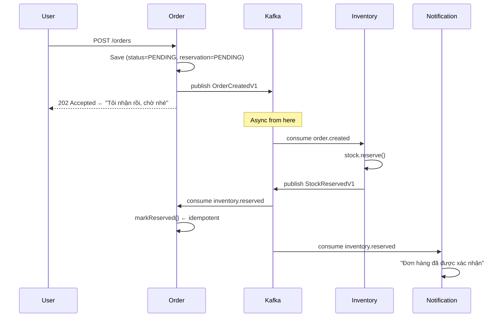

# Chương 9 · ⚡ Cắt dây — buông tay — tin tưởng

**Day 9 — Order Flow chuyển sang Event-Driven + Distributed Tracing**

---

> *"Ngày đau đớn nhất. Ngày quan trọng nhất. Ngày hệ thống học cách buông tay — và tin rằng phía bên kia sẽ làm đúng việc của họ."*

---

> 🎬 **Chương này có gì:** một ca phẫu thuật cắt bỏ toàn bộ sync call, một bài học buông tay tập thở, một anh consumer học cách "nghe trùng mà không hoảng", một sợi chỉ Ariadne xuyên ba service, vài hộ dân lấy nước từ cùng một ống, và một cạm bẫy khiến Kafka quay cuồng vô tận. Đeo khẩu trang vào phòng mổ. 🩺

---

## 🔪 Bối cảnh — Cuộc phẫu thuật lớn

Day 6, `PlaceOrderUseCase` là một orchestrator gọn gàng:

```
1. Lấy cart items (sync)
2. Loop reserve inventory cho từng item (sync)
3. Nếu fail → compensate release (sync)
4. Save order
5. Return response
```

Đẹp. Dễ hiểu. Dễ debug. Và **không scale được** trong distributed system — vì mỗi dòng `sync` là một lần `Order` nắm chặt tay `Inventory` không dám buông.

Chương 8 đào xong đường ống ngầm và siết van. Day 9 không nói lý thuyết nữa — Day 9 cầm dao mổ, **cắt bỏ toàn bộ** sync call tới Inventory. Thay bằng đúng một động tác: bơm event vào ống, rồi **buông tay**. Nghe thì gọn. Làm thì run. 😬

---

## 🫁 Kiến trúc mới — Eventually Consistent



**Sự khác biệt cốt lõi**: User nhận response **trước khi** inventory reserve xong. Order được tạo với `reservation_status = PENDING`. Vài trăm milliseconds sau, inventory reserve thành công, order chuyển sang `RESERVED`.

Đây là **eventual consistency**. Và đây là trade-off được chọn một cách tỉnh táo, không phải nhắm mắt theo trend:

| Tiêu chí | 🤝 Sync (Day 6) | 🫳 Async (Day 9) |
|---|---|---|
| 😊 User experience | Chờ lâu, nhưng biết ngay kết quả | Response nhanh, nhưng "đang xử lý" |
| 🛡️ Availability | 1 service chết = cả cụm chết | 1 service chết = chậm, không sập |
| 🎯 Consistency | Strong (biết ngay còn hàng không) | Eventual (biết sau vài trăm ms) |
| 🧩 Complexity | Đơn giản | Phức tạp hơn (idempotent consumer, DLT, monitoring) |

---

## ♻️ Idempotent consumer — vì Kafka gửi ít nhất 1 lần

At-least-once delivery = consumer có thể nhận cùng message 2 lần. Nếu `markReserved()` không idempotent:

```
Message 1: markReserved() → status = RESERVED ✅
Message 1 (retry): markReserved() → ??? throw? double-process?
```

Fix: `markReserved()` check trước khi mutate:

```java
public boolean markReserved() {
    if (this.reservationStatus == ReservationStatus.RESERVED) {
        return false;  // Already done. No-op. No throw.
    }
    this.reservationStatus = ReservationStatus.RESERVED;
    return true;
}
```

**Không throw khi duplicate.** Throw = Kafka retry = infinite loop. Return false = log + move on.

---

## 🧵 Distributed Tracing — nhìn xuyên 3 service

Buông tay rồi thì làm sao biết lá thư đã trôi tới đâu? Khi mọi thứ async, debug trở thành ác mộng. Request vào Order, event bay qua Kafka, Inventory xử lý, event bay ngược lại... Lỗi nằm ở chặng nào? Chậm ở khúc nào? Ta cần đúng cái mà [Chương 1](01-khai-thien-lap-dia.md) đã hứa hẹn: một **sợi chỉ Ariadne** — buộc vào request từ lúc sinh ra, theo nó qua mọi đường ống, để bất cứ lúc nào cũng kéo ra dò ngược, lần đường ra khỏi mê cung log. 🧶

**OpenTelemetry + Micrometer Tracing** chính là sợi chỉ đó:

```yaml
# Cau hinh o moi service
management:
  tracing:
    sampling:
      probability: 1.0  # Dev trace 100%, prod chi 10-20%
  zipkin:
    tracing:
      endpoint: http://zipkin:9411/api/v2/spans
```

Spring Kafka tự động propagate `traceparent` header (W3C format) qua message:

```
traceparent: 00-4bf92f3577b34da6a3ce929d0e0e4736-00f067aa0ba902b7-01
              │  │                                │                  │
              │  trace-id (xuyên suốt flow)       span-id            sampled
```

Mở Zipkin → thấy 1 trace xuyên: Order (publish) → Kafka → Inventory (consume + reserve) → Kafka → Order (markReserved) → Kafka → Notification (send email). **Một request, 3 service, 5 span, 1 trace ID.**

---

## 🪢 Fan-out pattern — cùng một ống, nhiều hộ dân

`inventory.reserved` event được consume bởi **2 consumer group khác nhau** — như hai hộ dân cắm vòi vào cùng một ống chính, ai lấy nước nhà nấy:

1. `order-service` (group: `order-inv`) → markReserved()
2. `notification-service` (group: `notification-inv`) → gửi email xác nhận

Kafka guarantee: mỗi group nhận **tất cả** message. Các group **độc lập** — notification chậm không block order. Notification down không ảnh hưởng order flow.

Đây là sức mạnh của event-driven: **publisher không biết (và không cần biết) ai đang listen.** Order bơm nước vào ống xong là phủi tay đi pha cà phê — ai uống, uống thế nào, kệ. ☕

---

## 🚨 Failure handling — khi inventory không đủ hàng

```java
// Inventory consumer
try {
    stock.reserve(event.quantity());
    publisher.publish(new StockReservedV1(...));
} catch (InsufficientStockException e) {
    log.warn("INSUFFICIENT_STOCK sku={} requested={} available={}",
        event.sku(), event.quantity(), stock.available());
    // KHÔNG throw! Throw = Kafka retry = infinite loop
    // Day 12 sẽ publish StockReservationFailedV1 → Order cancel
}
```

> ⚠️ **Cạm bẫy chết người:** throw exception trong Kafka consumer = message bị retry vĩnh viễn (hoặc đến max retry). Hết hàng là chuyện business, không phải lỗi hạ tầng — mà bạn ném exception thì Kafka cứ tưởng "lỗi tạm thời, thử lại đi", và thế là nó gửi lại cái message hết-hàng đó mãi mãi, như con vẹt lặp một câu. Nếu business logic fail, **log + handle gracefully**. Day 12 mới thêm DLT cho infra failure thật sự.

---

## 🏁 Kết thúc ngày 9

```
📊 Scorecard:
├── Architecture:    Sync orchestration → Event-driven choreography
├── Consistency:     Strong → Eventually consistent
├── Coupling:        Temporal → Decoupled
├── Observability:   Zipkin trace xuyên 3 service
├── Patterns:        Fan-out, idempotent consumer, no-throw-on-business-fail
├── Debt paid:       Sync coupling từ Day 6
├── New debt:        No DLT yet (Day 12), no outbox yet (Day 13)
└── Vibe:            "Hệ thống đã học cách thở. Không còn nín thở chờ nhau."
```

> 💡 **Câu hỏi phỏng vấn**: *"Eventual consistency — user thấy gì trong consistency window?"*
>
> **Strong answer**: Order status = PENDING (UI show "Đang xử lý"). Polling hoặc WebSocket push khi status change. Consistency window bình thường < 500ms (user không nhận ra). Spike: vài giây. SLI: track `reservation_status=PENDING` older than 30s → alert.

---

*→ Hệ thống đã thở bất đồng bộ. Nhưng tiền thì không được "eventually correct"...*
