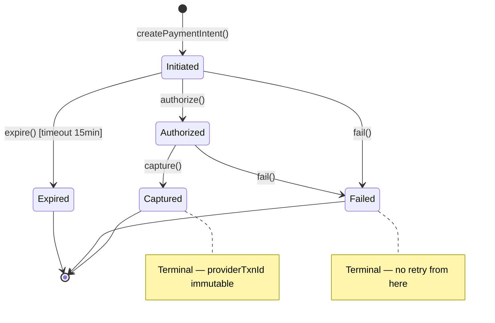

# Chương 10 · 💰 Tiền không được sai

**Day 10 — Payment Service**

---

> *"Trong ecommerce, bạn có thể sai tên sản phẩm, sai màu thumbnail, sai thứ tự sort. Nhưng sai tiền? Một lần thôi, và bạn mất khách hàng vĩnh viễn."*

---

## Bối cảnh

Payment gateway (VNPay, Momo, Stripe...) hoạt động theo pattern callback: user thanh toán trên gateway → gateway gọi webhook về hệ thống: *"Đơn X đã thanh toán thành công, mã giao dịch Y."*

Nghe đơn giản. Nhưng:
- Gateway gọi callback **2 lần** (network retry policy)
- Hoặc **3 lần** (webhook retry khi không nhận 200 OK)
- Hoặc user click "Thanh toán" **2 lần** (nút không disable kịp)
- Hoặc attacker replay request cũ

Mỗi lần đều phải trả về success. Nhưng chỉ **process 1 lần duy nhất**. Charge user 2 lần = lawsuit.

---

## ADR-007: Tại sao Payment là Layered, không phải DDD?

Kiểm tra 3 tiêu chí:

```
≥3 business invariant phức tạp?     → 2 (status transition + amount immutable) → ❌
Concurrency thật (race condition)?   → ✅ (duplicate callback)
Domain events publish ra ngoài?      → ✅ (payment.completed)
```

**Score: 2/3 → Layered.** Nhưng vẫn dùng sealed interface cho status (vì state machine rõ ràng). DDD không phải all-or-nothing — lấy pattern hay, bỏ ceremony thừa.

---

## Sealed `PaymentStatus` — 5 trạng thái, 0 lỗ hổng

```java
public sealed interface PaymentStatus permits
    Initiated, Authorized, Captured, Failed, Expired {

    record Initiated() implements PaymentStatus {}
    record Authorized(String authCode) implements PaymentStatus {}
    record Captured(String providerTxnId, Instant capturedAt) implements PaymentStatus {}
    record Failed(String reason, String errorCode) implements PaymentStatus {}
    record Expired() implements PaymentStatus {}
}
```



---

## 3-Layer Idempotent Dedup — phòng thủ tuyệt đối

Đây là phần hay nhất. 3 lớp phòng thủ server-side, mỗi lớp bắt 1 loại duplicate khác nhau:

> 💡 Tại sao đánh số từ 3? Vì Layer 1-2 là client-side (disable button + idempotency-key header). Server không tin client → cần 3 lớp riêng.

### Layer 3: Fast-path lookup

```java
// Đã có payment với provider + txnId này chưa?
Optional<PaymentIntent> existing = repo.findByProviderAndProviderTxnId(provider, txnId);
if (existing.isPresent()) {
    return existing.get();  // Đã process. Return ngay. Không process lại.
}
```

**Bắt**: 99% duplicate — callback retry sau vài giây, record đã tồn tại.

### Layer 4: UNIQUE constraint race condition

```sql
CREATE UNIQUE INDEX idx_payment_provider_txn
ON payment_intent (provider, provider_txn_id)
WHERE provider_txn_id IS NOT NULL;  -- Partial index: chỉ apply khi đã có txnId
```

2 callback đến **cùng millisecond**. Cả 2 qua Layer 3 (chưa có record). Cả 2 cố INSERT. Một thắng, một nhận `DataIntegrityViolationException`. Catch → return existing.

**Bắt**: Race condition mà Layer 3 miss (window < 1ms).

### Layer 5: Optimistic lock retry

```java
@Retryable(
    retryFor = ObjectOptimisticLockingFailureException.class,
    maxAttempts = 3,
    backoff = @Backoff(delay = 50, maxDelay = 500, multiplier = 2)
)
@Transactional(propagation = REQUIRES_NEW)
public PaymentIntent handleCallback(CallbackRequest request) { ... }
```

**Bắt**: Edge case version conflict khi 2 request cùng update 1 PaymentIntent.

### Tại sao `saveAndFlush()` thay vì `save()`?

```java
repo.saveAndFlush(intent);  // Force SQL execute NGAY → UNIQUE constraint check NGAY
// vs
repo.save(intent);  // Hibernate có thể defer flush → UNIQUE check muộn → logic sai
```

`saveAndFlush()` ép Hibernate flush SQL ngay lập tức. UNIQUE violation xảy ra **trong transaction**, catch được, handle được. Với `save()`, Hibernate có thể batch flush cuối transaction → exception bay ra ngoài `@Transactional` → không catch được gracefully.

---

## HMAC-SHA256 — chống giả mạo callback

Gateway gửi callback kèm signature:

```
X-Signature: HMAC-SHA256(secret, timestamp + "." + body)
X-Timestamp: 1716100000
```

Verify:

```java
public boolean verify(String signature, String timestamp, String body) {
    // 1. Timestamp skew check — chống replay attack
    long skew = Instant.now().getEpochSecond() - Long.parseLong(timestamp);
    if (Math.abs(skew) > 300) return false;  // > 5 phút = reject

    // 2. Compute expected signature
    String payload = timestamp + "." + body;
    String expected = hmacSha256(secret, payload);

    // 3. Constant-time compare — chống timing attack
    return MessageDigest.isEqual(
        expected.getBytes(UTF_8),
        signature.getBytes(UTF_8)
    );
}
```

3 lớp bảo vệ:
1. **Timestamp skew** — replay request cũ 10 phút → reject
2. **HMAC verify** — không biết secret → không giả mạo được
3. **Constant-time compare** — attacker không thể đo thời gian response để đoán từng byte signature

---

## Publish `PaymentCompletedV1` — nhưng có điều kiện

```java
if (result.isNewCapture()) {
    eventPublisher.publish(new PaymentCompletedV1(
        intent.getOrderId(),
        intent.getAmount(),
        intent.getProviderTxnId()
    ));
}
// Duplicate callback? → KHÔNG publish. Tránh downstream process 2 lần.
// FAILED outcome? → KHÔNG publish. Downstream không cần biết failure (Day 12 sẽ handle).
```

---

## Kết thúc ngày 10

```
📊 Scorecard:
├── Services:        6 (+ payment-service)
├── Idempotency:     3-layer dedup (fast-path + UNIQUE + optimistic lock)
├── Security:        HMAC-SHA256 + timestamp skew + constant-time compare
├── State machine:   5 states, sealed interface, immutable providerTxnId
├── Tests:           20 unit (10 state machine + 6 callback + 4 signature)
├── Docs:            4 (ADR-007, lesson idempotency, issue duplicate, interview)
└── Vibe:            "Tiền đã an toàn. Không duplicate. Không giả mạo. Không sai."
```

> 💡 **Bẫy phỏng vấn**: *"Idempotency key ở client vs server — khác gì?"*
>
> Client-generated key (UUID): client control, nhưng client có thể gửi key mới mỗi lần (bypass idempotency). Server-generated key (order_id + provider): server control, guarantee dedup bất kể client behavior. Payment dùng server-side key (`provider + provider_txn_id`) vì **không tin client**.

---

*→ Tiền đã an toàn. Giờ cần ai đó báo cho khách: "Đơn hàng của bạn đã được xác nhận"...*
