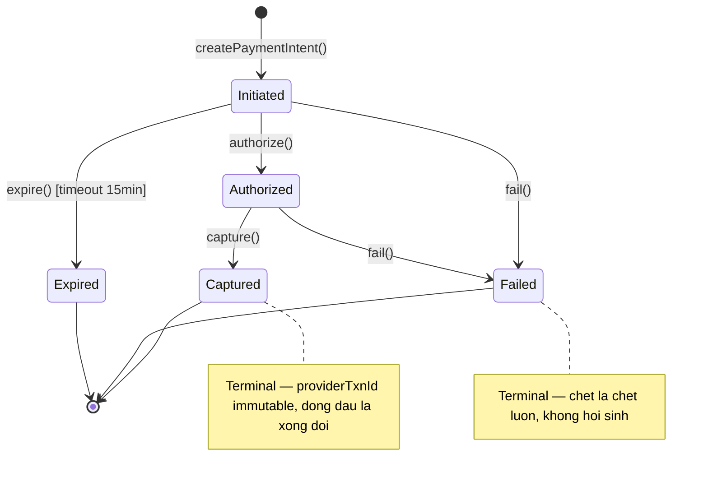

# Chương 10 · 💰 Tiền không được sai

**Day 10 — Payment Service**

---

> *"Sai tên sản phẩm? Sửa. Sai màu thumbnail? Sửa. Sai thứ tự sort? Kệ, ai để ý. Nhưng sai tiền — dù chỉ một lần — thì chúc mừng, bạn vừa tặng khách hàng một câu chuyện để kể cho con cháu nghe về cái shop online đã trừ tiền họ hai lần."*

---

> 🎬 **Chương này có gì:** một bác thủ quỹ hoang tưởng, bốn kiểu tấn công vào ví tiền, ba tầng lưới chống trùng, một con dấu chống giả mạo, và bài học "im lặng đúng lúc cũng là kỹ thuật". Buckle up. 🎢

---

## 🎬 Bối cảnh: gặp gỡ bác thủ quỹ

Chương trước, hệ thống học được một kỹ năng quý: **buông tay**. Order bắn event ra Kafka rồi đi pha cà phê ☕, vài trăm mili-giây sau inventory mới reserve xong, và không ai chết cả. Đó là vẻ đẹp của **eventual consistency** — *"từ từ rồi đâu sẽ vào đấy"*.

Nhưng có một góc của hệ thống mà câu *"từ từ rồi đâu sẽ vào đấy"* nghe xong là muốn gọi luật sư. Đó là **tiền** 💸.

Nên Day 10, chúng ta tuyển một nhân vật mới: **bác thủ quỹ** 🧐. Phải nói trước cho bạn quen tính bác: bác *không tin một ai*. Không tin client. Không tin mạng. Không tin cái nút "Thanh toán" mà ông frontend thề là đã disable. Bác thậm chí còn không tin chính bác của 3 giây trước. Nghe hơi hoang tưởng, nhưng trong nghề giữ tiền, **hoang tưởng là một kỹ năng, không phải bệnh**.

Vì sao bác phải khổ sở đến thế? Nhìn cái flow tưởng-chừng-vô-hại này:

> 📩 User bấm thanh toán trên gateway (VNPay, Momo, Stripe...) → gateway gọi webhook về: *"Đơn X trả tiền rồi nha, mã giao dịch Y."*

Một câu. Gọn gàng. Xử lý xong đi ngủ. Trừ khi... gateway nó gọi y như người yêu cũ nhắn tin lúc 2h sáng 📱:

- 📲 **Lần 1:** *"Đơn X trả tiền rồi nha."*
- 🔁 **3 giây sau:** *"Đơn X trả tiền rồi nha."* (network retry — nó tưởng lần 1 lạc)
- 📢 **5 giây sau:** *"ĐƠN X TRẢ TIỀN RỒI NHA."* (vì bác chưa kịp trả `200 OK`)
- 🖱️ **Đồng thời:** user sốt ruột bấm nút "Thanh toán" thêm phát nữa cho chắc.
- 🥷 **Và đâu đó:** một anh bạn tò mò đang thử **replay** lại request cũ xem có ăn được không.

Mỗi lần gọi, bác thủ quỹ đều phải lịch sự gật đầu *"vâng, thành công ạ"*. Nhưng tiền thì chỉ được trừ **đúng một lần**. Trừ hai lần không gọi là bug — nó gọi là **đơn kiện** ⚖️, kèm một khách hàng biến hình thành rồng phun lửa 🐉 trên fanpage và một bạn CSKH khóc trong nhà vệ sinh 😭.

Đây là lý do payment-service ra đời. Và đây là cách bác thủ quỹ sống sót.

---

## 🏗️ ADR-007: Bác thủ quỹ thuộc biên chế nào — DDD hay Layered?

Trước khi giao việc, phải làm rõ chuyện gây tranh cãi muôn thuở: payment-service nên là **DDD** (full nghi lễ Aggregate/Domain Event) hay **Layered** (gọn gàng, ít lễ nghĩa)?

Đem ra cân đúng 3 tiêu chí quen thuộc của project:

| 🎯 Tiêu chí | Payment có? | Kết |
| --- | --- | --- |
| ≥3 business invariant phức tạp | 1 chính (`amount ≥ 0` + state machine) — cần ≥3 | ❌ |
| Concurrency thật *cần aggregate* | Race chỉ ở callback duplicate → UNIQUE constraint xử đủ, không cần aggregate | ❌ |
| Domain events publish ra ngoài | 1 (`payment.completed`) — DDD service thật có 2+ | 🟡 |

**Tỉ số: 1/3 tiêu chí mạnh.** Chưa đủ ngưỡng lên DDD → **Layered**. 🟢 (chốt ở [ADR-007](../decisions/007-payment-service-layered-not-ddd.md))

Nhưng — và đây là cái hay của một senior chứ không phải kẻ cuồng framework — bác thủ quỹ vẫn được giữ *một* món đồ chơi của DDD: **sealed interface cho trạng thái**. Lý do? State machine của payment rõ ràng như luật giao thông, và sealed interface biến nó thành luật mà *compiler* tự ép tuân. DDD không phải combo "ăn cả hoặc nhịn đói" — lấy món sắc bén, bỏ phần nghi lễ rườm rà.

> 💡 **Ăn điểm phỏng vấn:** đừng nói *"em chọn DDD vì nó xịn"*. Hãy nói *"em đếm invariant, được 1/3 tiêu chí mạnh, nên đi Layered — nhưng vẫn mượn sealed types vì state machine đáng được compiler bảo kê."* Đó là tư duy **chọn pattern theo tiêu chí**, không phải theo trend.

---

## 🚦 Năm trạng thái, và một anh bảo vệ tên là Compiler

Một đồng tiền đi qua payment-service sẽ lần lượt mặc 5 bộ đồng phục. Không hơn, không kém:

```java
public sealed interface PaymentStatus permits
    Initiated, Authorized, Captured, Failed, Expired {

    record Initiated() implements PaymentStatus {}
    record Authorized(String authCode) implements PaymentStatus {}
    record Captured(String providerTxnId, Instant capturedAt) implements PaymentStatus {}
    record Failed(String reason, String errorCode) implements PaymentStatus {}
    record Expired() implements PaymentStatus {}
}
```

Cái từ khoá `sealed` ở đây là cả một thái độ sống. Nó tuyên bố với thế giới: *"Danh sách trạng thái đóng. Năm thằng này thôi. Đứa nào định lén thêm trạng thái thứ sáu mà quên xử lý ở đâu đó — code không build, khỏi cãi."* Compiler đứng gác cổng 👮, và nó **không nhận hối lộ**.



Để ý hai cái `note`:

- 🔒 **`Captured`** là điểm-không-quay-đầu: mã giao dịch nhà cung cấp (`providerTxnId`) đã đóng dấu, **immutable**, có hối hận cũng không sửa.
- ⚰️ **`Failed` / `Expired`** cũng là ngõ cụt — đã tắt thở thì đừng mơ chuyện hồi sinh quay về `Initiated`.

Sealed interface biến cái sơ đồ trên từ "ước gì code chạy đúng vậy" thành "code *buộc* phải chạy đúng vậy".

> 📚 Chi tiết về sealed types làm state machine, ta đã mổ xẻ kỹ ở [Chương 6 — Trái tim](06-trai-tim.md). Ở đây bác thủ quỹ chỉ mượn lại đồ nghề, không giảng lại.

---

## 🛡️ Ba tầng lưới, và triết lý "không tin một ai"

Giờ đến phần hay nhất — phần khiến bác thủ quỹ xứng đáng nhận lương. Nhớ cái danh sách callback gọi điên đảo ở trên chứ? Đây là cách bác chặn đứng chuyện trừ tiền hai lần.

Bác có **ba tầng lưới** 🕸️. Vì sao không tin client tự lo? Để bác giải thích:

> 🗣️ *Client bảo "em chỉ bấm một lần thôi mà anh" — không tin, nút disable trễ một nhịp là bấm được hai lần.*
> *Client gắn `Idempotency-Key` vào header — vẫn không tin, vì cái key đó client tự sinh, nó đổi key mới mỗi lần thì bằng không.*
>
> **Kết luận của bác: mọi phòng thủ thật phải nằm ở server.** Ba tầng, mỗi tầng bắt một loại trùng mà tầng trên lọt lưới.

### 🥅 Tầng 1 — Hỏi trước khi làm (fast-path)

Callback nào tới, việc đầu tiên bác làm là tra sổ cái: *"Cái mã giao dịch này, xử lý chưa ta?"*

```java
// Đã có payment với provider + txnId này chưa?
Optional<PaymentIntent> existing = repo.findByProviderAndProviderTxnId(provider, txnId);
if (existing.isPresent()) {
    return existing.get();   // Rồi! Trả về luôn. Không động vào tiền lần nữa.
}
```

Một mình tầng này gánh **99% lượng trùng**: gateway retry sau vài giây, record nằm chình ình trong sổ rồi, bác chỉ việc chỉ tay *"đây, xử rồi nhé"* và đi tiếp.

### 🧱 Tầng 2 — UNIQUE constraint cho cú đụng độ phần nghìn giây

Nhưng đời không đơn giản vậy. Nếu **hai callback tới cùng một mili-giây** thì sao? Cả hai cùng chạy `findBy...`, cả hai cùng thấy *"chưa có gì cả"*, cả hai cùng hớn hở lao vào INSERT. Tầng 1 vừa bị xỏ mũi đẹp đẽ ở cái khe < 1ms.

Đỡ cú này là một bức tường bê tông dưới tầng database:

```sql
CREATE UNIQUE INDEX idx_payment_provider_txn
ON payment_intent (provider, provider_txn_id)
WHERE provider_txn_id IS NOT NULL;   -- Partial index: chỉ canh khi đã có txnId
```

Database sẽ chọn ra **một kẻ thắng** 🏆 được phép ghi. Kẻ thua lãnh trọn một `DataIntegrityViolationException` vào mặt. Bác thủ quỹ điềm nhiên `catch` nó, mỉm cười, rồi quay sang trả về record kẻ thắng vừa tạo:

```java
catch (DataIntegrityViolationException e) {
    // Có thằng vừa INSERT trước mình 1 nano-giây. Không sao, lấy của nó dùng.
    return repo.findByProviderAndProviderTxnId(provider, txnId).orElseThrow();
}
```

User chẳng bao giờ biết vừa có một cuộc rượt đuổi nghẹt thở ở tầng dưới. Họ chỉ thấy *"thanh toán thành công"*. Đúng một lần.

### 🔁 Tầng 3 — Optimistic lock cho cuộc giành ghi cuối cùng

Tầng cuối, dành cho mấy edge case hiếm như sao chổi ☄️: hai request cùng *update* một `PaymentIntent` đang tồn tại, `@Version` đụng nhau. Đỡ bằng retry có backoff:

```java
@Retryable(
    retryFor = ObjectOptimisticLockingFailureException.class,
    maxAttempts = 3,
    backoff = @Backoff(delay = 50, maxDelay = 500, multiplier = 2)
)
@Transactional(propagation = REQUIRES_NEW)
public PaymentIntent handleCallback(CallbackRequest request) { ... }
```

Đụng version? Nghỉ 50ms, thử lại. Đụng nữa? Nghỉ 100ms. Nữa? 200ms. Bác kiên nhẫn như người câu cá 🎣, tối đa 3 lần.

### 📋 Tổng kết ba tầng lưới

| Tầng | Cơ chế | Bắt loại trùng nào | Tần suất |
| --- | --- | --- | --- |
| 🥅 **1** | `findBy...` fast-path | Retry cách nhau vài giây (record đã có) | ~99% |
| 🧱 **2** | UNIQUE partial index | Hai callback cùng < 1ms (cùng INSERT) | Hiếm |
| 🔁 **3** | Optimistic lock + retry | Hai request cùng UPDATE (version đụng) | Hiếm hơn |

> 💡 **Vì sao đếm "1-2-3" mà không "3-4-5"?** Vì hai lớp đầu tiên thật ra là client-side (disable nút + `Idempotency-Key` header). Nhưng bác thủ quỹ *không tính chúng vào hệ phòng thủ của mình* — bác không tin client, nhớ chứ? Ba tầng trong bảng là ba tầng **server-side**, và đó là ba tầng duy nhất bác ngủ ngon nhờ nó.

### ⚙️ Một chi tiết nhỏ cứu cả ba tầng: `saveAndFlush()` chứ không `save()`

Đây là loại bug mà junior viết xong test vẫn pass, lên prod mới khóc 😢:

```java
repo.saveAndFlush(intent);   // Ép Hibernate phun SQL xuống DB NGAY → UNIQUE check NGAY → catch được
// vs
repo.save(intent);           // Hibernate có thể ngậm SQL trong miệng tới cuối transaction
                             //   → UNIQUE violation nổ MUỘN, bay ra NGOÀI @Transactional → hết đỡ
```

Hình dung thế này: `save()` giống đứa ngậm một ngụm nước, định bụng cuối buổi mới phun 💦. Vấn đề là lúc nó phun (cuối transaction) thì cái `try-catch` của bạn đã đi về từ đời nào — exception bay thẳng ra ngoài, không ai đỡ kịp, request fail xấu xí. `saveAndFlush()` ép nó phun *ngay tại chỗ*, đúng lúc bạn đang giương lưới chờ. UNIQUE violation xảy ra **trong** transaction, **trong** tầm tay catch.

> ⚠️ **Một dòng đổi `save` → `saveAndFlush`** chính là khác biệt giữa "handle gracefully" và "HTTP 500 lúc 3h sáng". Đây là trap kinh điển khi review code idempotency.

---

## 🔒 Con dấu niêm phong: chống thằng giả mạo gõ cửa

Ba tầng lưới trên chống *trùng*. Nhưng còn một nỗi lo khác làm bác mất ngủ: làm sao biết callback đó **thật sự** đến từ gateway, chứ không phải một anh hacker tốt bụng đang gõ cửa hét lớn *"đơn này trả tiền rồi nhé, cho qua đi"* 🥷?

Gateway niêm phong mỗi callback bằng một con dấu — chữ ký **HMAC-SHA256** ký lên `timestamp + "." + body`, dùng `secret` mà chỉ hai bên biết:

```
X-Signature: HMAC-SHA256(secret, timestamp + "." + body)
X-Timestamp: 1716100000
```

Bác kiểm dấu qua ba lớp, không bỏ lớp nào:

```java
public boolean verify(String signature, String timestamp, String body) {
    // 1. Hạn sử dụng của con dấu — chống replay
    long skew = Instant.now().getEpochSecond() - Long.parseLong(timestamp);
    if (Math.abs(skew) > 300) return false;   // lệch > 5 phút = vứt

    // 2. Tự tính lại chữ ký đúng phải ra cái gì
    String payload = timestamp + "." + body;
    String expected = hmacSha256(secret, payload);

    // 3. So sánh hằng-thời-gian — chống thằng cầm đồng hồ bấm giây
    return MessageDigest.isEqual(
        expected.getBytes(UTF_8),
        signature.getBytes(UTF_8)
    );
}
```

Ba lớp, ba kẻ thù khác nhau:

| Lớp | Chặn ai | Cơ chế |
| --- | --- | --- |
| ⏰ **Timestamp skew** | Kẻ replay request cũ 10 phút trước | Lệch > 5 phút = con dấu hết hạn, mời về |
| ✍️ **HMAC verify** | Kẻ giả mạo callback | Không có `secret` thì không ký ra dấu khớp |
| ⏱️ **Constant-time compare** | Kẻ cầm đồng hồ bấm giây dò byte | Luôn chạy hết chuỗi → đo thời gian vô dụng |

Lớp thứ ba tinh vi nhất, nên nói kỹ: nếu so sánh chữ ký kiểu thường (`.equals()`, dừng ngay khi gặp byte sai), kẻ tấn công có thể *bấm giờ* từng lần thử — chữ ký nào làm server phản hồi chậm hơn vài nano-giây nghĩa là đoán đúng được nhiều byte hơn → dò dần từng byte ⏱️. `MessageDigest.isEqual` luôn chạy hết cả chuỗi dù sai từ byte đầu → đồng hồ của hacker thành đồ trang trí.

**Trùng — chặn. Giả mạo — chặn.** Bác thủ quỹ ngủ ngon, một mắt vẫn hé 😴👁️.

---

## 📢 Báo tin — nhưng học cách... im lặng đúng lúc

Cuối cùng, khi tiền *thật sự* nằm yên trong két, bác mới hô lên cho cả hệ thống nghe: event `PaymentCompletedV1`. Order nghe xong thì chuyển trạng thái, notification nghe xong thì gửi mail *"đơn của bạn đã xác nhận"* 📧.

Nhưng bác chỉ hô **đúng một lần, đúng lúc**:

```java
if (result.isNewCapture()) {
    eventPublisher.publish(new PaymentCompletedV1(
        intent.getOrderId(),
        intent.getAmount(),
        intent.getProviderTxnId()
    ));
}
// Callback trùng?  → KHÔNG publish. Hô nữa thì downstream xử lý 2 lần — đúng cái bệnh vừa chữa xong.
// Outcome FAILED?  → KHÔNG publish. Downstream không cần nghe tin buồn (Day 12 lo nhánh thất bại).
```

> 🧠 Bài học nhỏ mà thấm: **im lặng cũng là một quyết định kỹ thuật.** Một event publish thừa ở đây sẽ kéo cả dây chuyền downstream xử lý trùng — bao công ba tầng lưới phía trên đổ sông đổ biển. Bác thủ quỹ biết khi nào nên nói, và quan trọng hơn, khi nào nên ngậm miệng.

---

## 🏁 Kết thúc ngày 10

```
📊 Scorecard:
├── Services:        6 (+ payment-service)
├── Idempotency:     3 tầng lưới (fast-path + UNIQUE + optimistic lock)
├── Security:        HMAC-SHA256 + timestamp skew + constant-time compare
├── State machine:   5 trạng thái, sealed interface, providerTxnId immutable
├── Tests:           20 unit (10 state machine + 6 callback + 4 signature)
├── Docs:            4 (ADR-007, lesson idempotency, issue duplicate, interview)
└── Vibe:            "Tiền đã an toàn. Không trùng. Không giả mạo. Bác thủ quỹ ngủ ngon." 😴
```

> 💡 **Bẫy phỏng vấn kinh điển:** *"Idempotency key ở client vs server — khác gì?"*
>
> **Strong answer:** Client-generated key (UUID) — client cầm quyền, nghe có vẻ hay, nhưng client có thể sinh key mới mỗi lần gọi → bypass idempotency dễ như bỡn. Server-generated key (`provider + provider_txn_id`) — server cầm quyền, guarantee dedup *bất kể* client giở trò gì. Payment chọn server-side key, vì triết lý sống của bác thủ quỹ, nói lần cuối, là **không tin một ai cả**.
>
> 🪤 **Follow-up trap:** *"Lỡ gateway gửi cùng `provider_txn_id` cho hai giao dịch khác nhau thì sao?"* → Nói về việc chọn business key cho đúng, và vì sao ta tin `provider_txn_id` duy nhất *theo hợp đồng của gateway* — nếu gateway vi phạm hợp đồng đó, ta có alert ngay ở tầng UNIQUE constraint.

---

*→ Tiền đã nằm yên trong két, bác thủ quỹ đã ngủ 😴. Nhưng ngoài kia, một anh khách đang bồn chồn refresh hộp mail, chờ đúng một câu: "Đơn hàng của bạn đã được xác nhận." Ai sẽ gõ cửa báo tin? Và quan trọng hơn — làm sao để anh ta không gõ cửa **hai lần**?...* 📬
