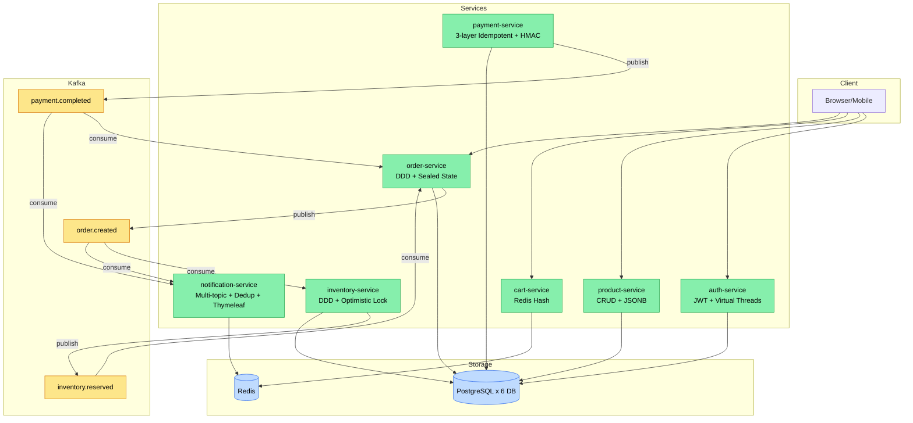

# Chương 11 · 📬 Người đưa thư

**Day 11 — Notification Service**

---

> *"Người đưa thư không cần biết thư viết gì. Họ chỉ cần biết: gửi cho ai, bằng kênh nào, và — quan trọng nhất — đừng bao giờ gõ cửa một nhà hai lần."*

---

> 🎬 **Chương này có gì:** một bác đưa thư hơi-hoang-tưởng-một-chút, một cuốn sổ ghi từng địa chỉ đã giao, một tai nạn ba bức thư giống hệt nhau khiến cả khu phố cấm cửa, một cái túi đeo nhiều ngăn (multi-topic), và một bài học cay đắng: thà gõ nhầm còn hơn không gõ. 📮

---

## 🎬 Bối cảnh: ai sẽ đi giao tin?

Cuối chương trước, bác thủ quỹ đóng két, hô lên một câu giữa không trung: `PaymentCompletedV1` 📢. Tiếng hô bay vào Kafka. Nhưng hô cho *ai* nghe?

Order nghe — để chuyển trạng thái. Đó là việc nội bộ. Nhưng còn một người đang đứng ngoài kia, refresh hộp mail mỗi 5 giây, chờ đúng một câu: *"Đơn hàng của bạn đã được xác nhận."* 📧

Người đó cần một **người đưa thư**.

Day 8 đã dựng tạm một bác đưa thư tập sự: một consumer, nghe một topic, `log.info` ra payload rồi đi về. Tử tế nhưng vô dụng — log không phải là email. Day 11, ta cho bác vào biên chế thật: nghe **nhiều** topic, **render** thư cho đẹp, **gửi** đi thật, và — đây là phần khiến bác xứng đáng nhận lương — **không bao giờ giao trùng một bức thư**.

Phải nói trước cho bạn quen tính bác. Bác đưa thư này hơi hoang tưởng nhẹ 🧐. Bác **ghi sổ** từng địa chỉ đã giao. Trước khi gõ cửa nhà nào, bác lật sổ ra dò: *"Nhà này... mình giao chưa nhỉ?"* Nghe hơi lẩn thẩn. Nhưng để hiểu vì sao bác phải khổ vậy, hãy nghe câu chuyện cái ngày bác *chưa* ghi sổ.

---

## 🔥 Cái ngày ba bức thư giống hệt nhau

Hình dung flow tưởng-chừng-vô-hại này:

> 📩 Gateway thanh toán retry webhook về payment-service → payment-service publish `PaymentCompletedV1` → người đưa thư nghe → gửi mail *"Đơn #1234 đã thanh toán."*

Một event. Một email. Đẹp. Trừ khi... gateway nó bồn chồn như người yêu cũ lúc 2h sáng, và Kafka thì có triết lý sống **at-least-once** (ít nhất một lần — đôi khi *nhiều hơn* một lần):

- 📲 **Lần 1:** event `PaymentCompletedV1` tới. Bác gửi mail. Đẹp.
- 🔁 **2 giây sau:** gateway retry → payment-service publish lại → cùng event tới lần 2. Bác gửi mail. *Lần thứ hai.*
- 📢 **Rồi consumer rebalance** → Kafka redeliver từ offset cũ → event tới lần 3. Bác gửi mail. *Lần thứ ba.*

Giờ nhìn từ phía user: hộp mail của họ **nổ ba bản** *"Đơn #1234 đã thanh toán"* trong vòng 10 giây. Phản xạ đầu tiên của con người khi thấy ba email giống hệt? Nhấn **"Báo cáo Spam"** 🚨.

Và đây là chỗ vui (không vui chút nào): khi đủ user nhấn Spam, SendGrid/SES không cấm *một email* — nó cấm **cả domain `@shopvn.com`**. Nghĩa là từ giờ, *mọi* email của shop — kể cả mail "Quên mật khẩu", kể cả mail "Đơn đã giao" — đều rơi thẳng vào hố đen Spam. Một bug gửi-trùng nhỏ xíu vừa **giết toàn bộ kênh email** của công ty. 💀

> ⚠️ **Idempotency với notification không phải nice-to-have. Nó là survival.** Một event-driven system mà consumer không idempotent thì at-least-once của Kafka biến thành at-least-một-cơn-ác-mộng.

Đây là lý do bác đưa thư phải ghi sổ. Và đây là cuốn sổ.

---

## 📒 Cuốn sổ ghi địa chỉ: Redis SET NX

Cuốn sổ của bác là một lệnh Redis duy nhất: `SET NX` — *Set if Not eXists* (chỉ ghi nếu chưa có).

```java
@Slf4j
@Component
@RequiredArgsConstructor
public class NotificationDeduplicator {

    private static final String KEY_PREFIX = "notif:dedup:";

    private final StringRedisTemplate redisTemplate;

    @Value("${app.notification.dedup-ttl-hours:24}")
    private long dedupTtlHours;

    /**
     * @return true nếu đây là LẦN ĐẦU thấy event này (cứ gửi);
     *         false nếu đã gửi rồi (skip).
     */
    public boolean tryAcquire(UUID eventId) {
        String key = KEY_PREFIX + eventId;
        try {
            Boolean acquired = redisTemplate.opsForValue()
                    .setIfAbsent(key, "1", Duration.ofHours(dedupTtlHours));
            return Boolean.TRUE.equals(acquired);
        } catch (Exception ex) {
            // Fail-OPEN: Redis chết → KHÔNG chặn việc gửi. Xem mục dưới.
            log.warn("[dedup] Redis unavailable for eventId={}, fail-open → process anyway. error={}",
                    eventId, ex.getMessage());
            return true;
        }
    }
}
```

Cuốn sổ hoạt động đúng như bác lật từng trang:

- 📭 **Event tới lần đầu** → `SET NX` thành công (chưa có địa chỉ này trong sổ) → return `true` → bác gửi thư.
- 🔁 **Event tới lần 2, lần 3** → `SET NX` thất bại (địa chỉ đã nằm trong sổ) → return `false` → bác lắc đầu, bỏ qua, đi tiếp.
- ⏳ **TTL 24h** → mỗi trang sổ tự mục sau một ngày → sổ không phình to vô hạn, memory không leak.

Vì sao TTL đúng **24h**? Vì cửa sổ retry tối đa của Kafka mặc định là ~10 phút. 24h cho margin gấp **144 lần** — dư sức cover mọi cú redeliver muộn nhất, mà vẫn không giữ rác quá lâu.

> 💡 **Vì sao dedup theo `eventId` chứ không theo nội dung email?** Vì `eventId` do *publisher* (payment-service) sinh ra một lần và gắn chết vào event. Mọi bản copy mà Kafka redeliver đều mang **cùng** `eventId`. Đó là cái khoá tự nhiên để nhận ra "à, thằng này mình gặp rồi". Lấy nội dung email làm khoá thì mong manh — đổi một dấu phẩy trong template là dedup vỡ.

---

## 🤔 Bác đưa thư hoang tưởng — nhưng hoang tưởng kiểu fail-OPEN

Đây là chỗ tinh tế nhất của chương, và là chỗ phân biệt senior với junior. Câu hỏi: **nếu cuốn sổ bị cháy (Redis down) thì bác làm gì?**

Có hai trường phái:

| Triết lý | Redis down thì... | Hậu quả | Hợp cho |
| --- | --- | --- | --- |
| 🔒 **Fail-closed** | Không tra được sổ → **KHÔNG gửi** (an toàn là trên hết) | User **không** nhận mail nào | OTP, security alert — thà thiếu còn hơn lộ |
| 🔓 **Fail-open** | Không tra được sổ → **cứ gửi** (gửi nhầm còn hơn không gửi) | User **có thể** nhận trùng vài mail | Notification thường — confirm đơn, khuyến mãi |

Bác đưa thư của chúng ta chọn **fail-open**. Nhìn lại code: trong `catch`, bác `return true`. Nghĩa là Redis chết, bác *vẫn gửi*.

Vì sao? Vì với một email *"đơn đã xác nhận"*, hai nỗi đau không cân nhau:

- 😐 Gửi **trùng** 1 email khi Redis sập (hiếm, ngắn) → user hơi khó chịu. Sống được.
- 😡 **Không gửi** email nào → user tưởng đặt hàng thất bại, gọi CSKH, mở ticket, mất niềm tin. Tệ hơn nhiều.

> 🧠 **Senior mindset:** at-least-once tốt hơn at-most-once *cho notification thường*. Nhưng câu này KHÔNG phải chân lý vũ trụ — nó là một lựa chọn gắn với context. Đổi sang OTP hay "cảnh báo đăng nhập lạ"? Lật ngược ngay sang fail-closed: thà user không nhận còn hơn token bay lung tung. **Cùng một dòng `catch`, hai quyết định trái dấu — tuỳ giá trị của bức thư.**

Cái hoang tưởng của bác, hoá ra, có chừng mực: bác cẩn thận ghi sổ để khỏi giao trùng, nhưng khi sổ cháy thì bác chọn *thà giao nhầm còn hơn để khách chờ trong vô vọng*.

---

## 👜 Cái túi nhiều ngăn: một bác, nhiều loại thư

Một bác đưa thư xịn không chỉ giao một loại thư. Bác đeo cái túi nhiều ngăn — ngăn này thư "đơn mới", ngăn kia thư "đã thanh toán". Trong code, mỗi ngăn là một `@KafkaListener` nghe một topic riêng:

```java
@Slf4j
@Component
@RequiredArgsConstructor
public class OrderCreatedConsumer {

    private static final String TEMPLATE_NAME = "order-created";

    private final NotificationDeduplicator deduplicator;
    private final NotificationTemplateEngine templateEngine;
    private final NotificationChannel notificationChannel;

    @KafkaListener(topics = TopicNames.ORDER_CREATED, groupId = "${spring.application.name}")
    public void onOrderCreated(
            OrderCreatedV1 event,
            @Header(KafkaHeaders.RECEIVED_PARTITION) int partition,
            @Header(KafkaHeaders.OFFSET) long offset) {

        // Lật sổ TRƯỚC. Đã giao địa chỉ này chưa?
        if (!deduplicator.tryAcquire(event.eventId())) {
            log.info("[order-created] duplicate eventId={} orderId={} → skip",
                    event.eventId(), event.orderId());
            return;
        }

        String body = templateEngine.render(TEMPLATE_NAME, Map.of(
                "orderId", event.orderId().toString(),
                "totalAmount", event.totalAmount().toPlainString(),
                "currency", event.currency(),
                "itemCount", event.items().size()
        ));

        NotificationPayload payload = new NotificationPayload(
                "user+" + event.userId() + "@shopvn.com",
                "Đơn hàng #" + event.orderId() + " đã được xác nhận",
                body
        );
        notificationChannel.send(payload);
    }
}
```

Và ngăn thứ hai — thư báo thanh toán — chính là người nhận tiếng hô `PaymentCompletedV1` của bác thủ quỹ ở cuối chương trước:

```java
@Slf4j
@Component
@RequiredArgsConstructor
public class PaymentCompletedConsumer {

    private static final String TEMPLATE_NAME = "payment-completed";

    private final NotificationDeduplicator deduplicator;
    private final NotificationTemplateEngine templateEngine;
    private final NotificationChannel notificationChannel;

    @KafkaListener(topics = TopicNames.PAYMENT_COMPLETED, groupId = "${spring.application.name}")
    public void onPaymentCompleted(PaymentCompletedV1 event) {
        if (!deduplicator.tryAcquire(event.eventId())) {
            return;   // đã gửi rồi → skip
        }
        String body = templateEngine.render(TEMPLATE_NAME, Map.of(
                "orderId", event.orderId().toString(),
                "amount", event.amount().toPlainString()
        ));
        notificationChannel.send(new NotificationPayload(
                "user+" + event.userId() + "@shopvn.com",
                "Thanh toán đơn #" + event.orderId() + " thành công",
                body
        ));
    }
}
```

Điểm hay: hai ngăn túi **độc lập hoàn toàn**. Kafka đảm bảo mỗi consumer group nhận đủ message của topic mình. Ngăn "đơn mới" có kẹt (lag) thì ngăn "thanh toán" vẫn chạy phây phây. Một bác, nhiều tai, không tai nào điếc lây sang tai kia. 👂👂

---

## 🎨 Thư phải đẹp — và phải an toàn: Thymeleaf

Bác đưa thư không tự viết thư bằng tay (string concatenation) — bác dùng khuôn in sẵn (Thymeleaf template), chỉ điền chỗ trống:

```html
<!-- templates/order-created.html -->
<div style="font-family: Arial, sans-serif; max-width: 600px;">
    <h2>Đơn hàng mới!</h2>
    <p>Mã đơn: <strong th:text="${orderId}">ORD-001</strong></p>
    <table>
        <tr th:each="item : ${items}">
            <td th:text="${item.sku}">SKU</td>
            <td th:text="${item.quantity}">1</td>
        </tr>
    </table>
</div>
```

Vì sao khuôn in chứ không phải nối chuỗi tay?

| Lý do | Nối chuỗi tay | Thymeleaf `th:text` |
| --- | --- | --- |
| 🛡️ **Chống XSS** | User tên `<script>alert('xss')</script>` → chèn thẳng vào HTML, nổ | Auto-escape thành text vô hại |
| 👥 **Chia việc** | Designer phải đọc code Java để sửa màu | Designer sửa `.html`, dev sửa logic |
| 🧪 **Test được** | Phải bật cả app mới thấy output | Render offline, assert chuỗi ra |

Một bức thư có tên khách là `<script>` mà render bằng nối chuỗi tay thì bạn vừa biến email confirm thành lỗ hổng XSS. `th:text` đỡ giúp, miễn phí.

---

## 🔌 Một bác, đổi xe tuỳ địa hình: Adapter pattern

Bác đưa thư hôm nay đi xe đạp (log ra console). Mai mốt lên xe máy (SendGrid), rồi ô tô (SES). Nhưng *cách bác giao thư* không đổi — chỉ đổi cái xe. Đó là **Adapter pattern**:

```java
public interface NotificationChannel {
    void send(NotificationPayload payload);
}

// Production: SendGrid / SES / SMTP — gửi email thật
public class SmtpEmailChannel implements NotificationChannel { /* ... */ }

// Dev/Test: log ra console — không cần SMTP server
@Slf4j
public class LoggingEmailChannel implements NotificationChannel {
    @Override
    public void send(NotificationPayload payload) {
        log.info("📧 EMAIL to={} subject={} bodyLength={}",
                payload.to(), payload.subject(), payload.htmlBody().length());
    }
}
```

Day 11 đi `LoggingEmailChannel` — chưa có SMTP server, gửi mail thật làm gì. Nhưng **cái interface đã đúng**. Hôm nào lên prod, swap sang SendGrid = đổi *một bean* trong config. Business logic của consumer không động một dòng. Bác vẫn là bác, chỉ thay phương tiện.

---

## 🆕 Thí nghiệm nhỏ: đánh số phiên bản cho API

Bác tranh thủ làm một thí nghiệm bên lề — thêm một endpoint health-check có **versioning**:

```
GET /api/v1/notifications/health → {"status": "UP"}
GET /api/v2/notifications/health → {"status": "UP", "channelUsed": "LoggingEmailChannel"}
```

ADR-008 chốt: dùng **URI versioning** (`/v1/`, `/v2/`) thay vì nhét version vào header. Cân ba lựa chọn:

| Strategy | Pros | Cons |
| --- | --- | --- |
| 🟢 **URI path** `/v1/` | Dễ route, dễ cache, dễ debug (nhìn URL biết version) | URL đổi khi lên version, dân RESTful thuần tuý cau mày |
| 🟡 **Header** `Accept-Version` | URL ổn định, "RESTful đúng chuẩn" | Khó cache (phải set `Vary`), debug cực (version giấu trong header) |
| 🔴 **Query param** `?version=2` | Đơn giản nhất | Dễ quên, khó enforce, lẫn với param thường |

Kèm **N-1 deprecation policy**: khi `v3` ra đời, `v1` bị đánh dấu deprecated (trả warning header), `v2` vẫn sống khoẻ. Client có 3 tháng để migrate. Không ai bị cắt cầu đột ngột giữa đêm. 🌉

---

## 🏁 Kết thúc ngày 11

```
📊 Scorecard:
├── Services:        7 chạy (+ notification-service hoàn chỉnh)
├── Kafka consumers: order.created + payment.completed (mỗi cái 1 ngăn túi)
├── Dedup:           Redis SET NX, key theo eventId, TTL 24h, FAIL-OPEN
├── Templates:       2 (order-created, payment-completed), Thymeleaf auto-escape
├── Patterns:        Adapter (NotificationChannel) · fire-and-forget · multi-topic
├── API versioning:  URI path /v1 /v2 + N-1 deprecation (ADR-008)
├── Tests:           consumer dedup + template render + channel swap
├── Docs:            5 (2 lessons, ADR-008, issue email-spam, interview)
└── Vibe:            "Bác đưa thư đã vào biên chế. Gửi đúng người, đúng lúc, đúng MỘT lần." 📬
```

> 💡 **Bẫy phỏng vấn kinh điển:** *"Consumer của em idempotent kiểu gì? Dedup ở client hay server?"*
>
> **Strong answer:** Dedup theo `eventId` do *publisher* sinh, lưu Redis bằng `SET NX` TTL 24h. Mọi bản redeliver mang cùng `eventId` → `SET NX` thứ hai fail → skip. KHÔNG dedup theo nội dung (mong manh) hay theo key client tự sinh (client đổi key là bypass). Và nói thêm cái mà junior hay quên: **chọn fail-open hay fail-closed khi Redis chết** — notification thường đi fail-open (gửi nhầm còn hơn không gửi), OTP đi fail-closed.
>
> 🪤 **Follow-up trap:** *"Fail-open thì lỡ Redis sập 5 phút, user nhận trùng cả trăm mail thì sao?"* → Đó là trade-off có ý thức: tần suất Redis-down thấp + ngắn, đau của "trùng" nhỏ hơn đau của "mất". Muốn chặn triệt để thì thêm tầng dedup thứ hai ở DB (UNIQUE trên `eventId`) như bác thủ quỹ đã làm ở Chương 10 — nhưng notification chưa đáng đánh đổi thêm latency đó.

---

## 📸 Snapshot hệ thống sau Day 11



---

*→ Bác đưa thư đã giao tin chuẩn chỉ, đúng một lần. Hệ thống đã sống, đã thở, đã biết nói chuyện. Nhưng cuộc đời không toàn happy path. Tuần trước, có một bức thư địa chỉ rách góc — `totalAmount = null` — và bác đứng trước cửa, đọc đi đọc lại, thử lại mãi không thôi. Phía sau, hai trăm nghìn bức thư khác đứng xếp hàng chờ. Khi một bức thư không thể giao, ta làm gì với nó?...* 🛡️
