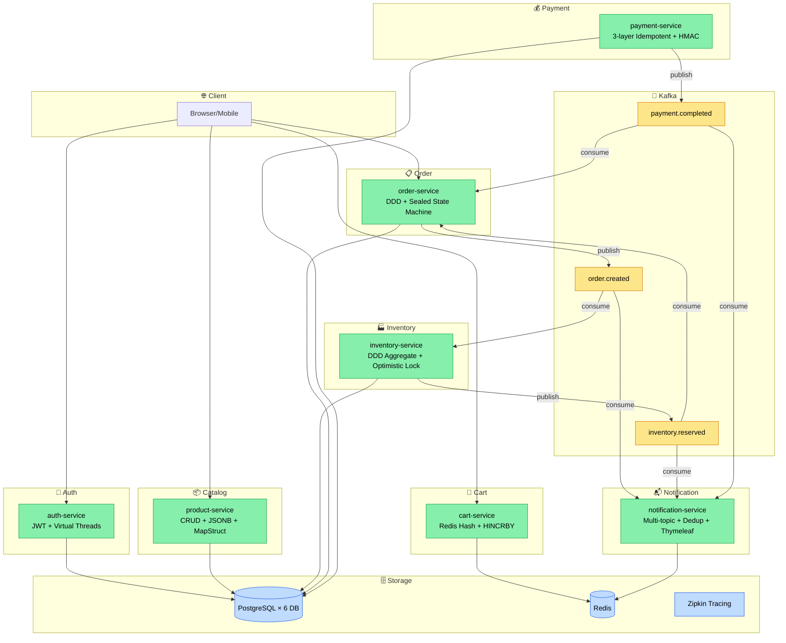

# Chương 11 · 📬 Người đưa thư

**Day 11 — Notification Service**

---

> *"Người đưa thư không cần biết thư viết gì. Họ chỉ cần biết: gửi cho ai, bằng kênh nào, và đừng gửi 2 lần."*

---

## Bối cảnh

Day 8 tạo scaffold — 1 consumer log payload. Day 11 thổi hồn: notification-service trở thành service thật, lắng nghe nhiều topic, render template, gửi thông báo, và **tuyệt đối không gửi trùng**.

Notification là **fire-and-forget** — gửi xong không cần confirm user đã đọc. Nhưng "fire" 2 lần cùng 1 email = spam = user report = domain bị blacklist. Idempotency ở đây không phải nice-to-have, mà là survival.

---

## Multi-topic consumer — 1 service, nhiều tai

```java
@KafkaListener(topics = TopicNames.ORDER_CREATED, groupId = "notification-order")
public void onOrderCreated(OrderCreatedV1 event) {
    if (!dedup.tryAcquire(event.eventId())) return;  // Đã gửi? Skip.
    String html = templateEngine.render("order-created", Map.of(
        "orderId", event.orderId(),
        "items", event.items()
    ));
    channel.send(event.userEmail(), "Đơn hàng mới #" + event.orderId(), html);
}

@KafkaListener(topics = TopicNames.PAYMENT_COMPLETED, groupId = "notification-payment")
public void onPaymentCompleted(PaymentCompletedV1 event) {
    if (!dedup.tryAcquire(event.eventId())) return;
    String html = templateEngine.render("payment-completed", Map.of(
        "orderId", event.orderId(),
        "amount", event.amount()
    ));
    channel.send(event.userEmail(), "Thanh toán thành công #" + event.orderId(), html);
}
```

2 consumer group riêng biệt (`notification-order`, `notification-payment`). Kafka guarantee: mỗi group nhận tất cả message từ topic của mình. Các group độc lập — 1 group lag không ảnh hưởng group kia.

---

## Redis SET NX — dedup đơn giản mà hiệu quả

```java
public class RedisEventDeduplicator {
    public boolean tryAcquire(String eventId) {
        // SET NX = Set if Not eXists. Return true nếu set thành công (chưa tồn tại)
        Boolean acquired = redis.opsForValue()
            .setIfAbsent("dedup:" + eventId, "1", Duration.ofHours(24));
        return Boolean.TRUE.equals(acquired);
    }
}
```

- Event đến lần đầu → `SET NX` thành công → return true → process
- Event đến lần 2 (retry) → `SET NX` fail (key đã tồn tại) → return false → skip
- TTL 24h → key tự xóa sau 1 ngày → memory không leak

**Fail-open design**: Redis down → `tryAcquire()` throw → catch → **process anyway** (at-least-once tốt hơn at-most-once cho notification). Gửi trùng 1 email tốt hơn không gửi email nào.

---

## Thymeleaf — template engine cho email

```html
<!-- templates/order-created.html -->
<div style="font-family: Arial, sans-serif; max-width: 600px;">
    <h2>🎉 Đơn hàng mới!</h2>
    <p>Mã đơn: <strong th:text="${orderId}">ORD-001</strong></p>
    <table>
        <tr th:each="item : ${items}">
            <td th:text="${item.sku}">SKU</td>
            <td th:text="${item.quantity}">1</td>
        </tr>
    </table>
</div>
```

Tại sao Thymeleaf mà không phải String concatenation?
- **XSS prevention**: `th:text` auto-escape HTML entities. User tên `<script>alert('xss')</script>` → render safe
- **Separation of concerns**: designer sửa template, developer sửa logic
- **Testable**: render template offline, verify output

---

## Adapter pattern — `NotificationChannel`

```java
public interface NotificationChannel {
    void send(String to, String subject, String htmlBody);
}

// Production: SendGrid / SES / SMTP
public class SmtpEmailChannel implements NotificationChannel { ... }

// Dev/Test: Log ra console
public class LoggingEmailChannel implements NotificationChannel {
    public void send(String to, String subject, String htmlBody) {
        log.info("📧 EMAIL to={} subject={} bodyLength={}", to, subject, htmlBody.length());
    }
}
```

Day 11 dùng `LoggingEmailChannel` — không gửi email thật (chưa có SMTP server). Nhưng **interface đã đúng**. Swap sang SendGrid = thay 1 bean. Không sửa business logic.

---

## 🆕 API Versioning — thí nghiệm nhỏ, bài học lớn

Thêm 1 endpoint demo versioning:

```
GET /api/v1/notifications/health → {"status": "UP"}
GET /api/v2/notifications/health → {"status": "UP", "channelUsed": "LoggingEmailChannel"}
```

ADR-008 chốt: **URI versioning** (`/v1/`, `/v2/`) thay vì header versioning (`Accept: application/vnd.api.v2+json`).

| Strategy | Pros | Cons |
|----------|------|------|
| URI path `/v1/` | Dễ route, dễ cache, dễ debug | URL thay đổi, không RESTful purist |
| Header `Accept-Version` | URL stable, RESTful | Khó cache (Vary header), khó debug |
| Query param `?version=2` | Đơn giản | Dễ quên, khó enforce |

**N-1 deprecation policy**: khi v3 ra, v1 deprecated (warning header), v2 vẫn active. Cho client 3 tháng migrate. Không break ai đột ngột.

---

## Kết thúc ngày 11

```
📊 Scorecard:
├── Services:        7 running (+ notification-service full)
├── Kafka consumers: 4 (order-created × 2 groups, payment-completed, inventory-reserved)
├── Dedup:           Redis SET NX, TTL 24h, fail-open
├── Templates:       2 (order-created, payment-completed)
├── Patterns:        Adapter (NotificationChannel), fire-and-forget, multi-topic consumer
├── API versioning:  URI path + N-1 deprecation policy (ADR-008)
├── Docs:            5 (2 lessons, ADR-008, issue email-spam, interview)
└── Vibe:            "Người đưa thư đã sẵn sàng. Gửi đúng người, đúng lúc, đúng 1 lần."
```

---

## 📸 Snapshot hệ thống sau Day 11



---

> 💡 **Nhìn lại 11 ngày**: Từ thư mục trống → 7 service, 5 Kafka topic, event-driven architecture, distributed tracing, 3-layer idempotency, sealed state machines. Hệ thống đã "thở" async. Nhưng chưa có lưới an toàn — message fail thì sao? Service down lâu thì sao? Day 12 sẽ thêm **Resilience4j + Dead Letter Topic** — lưới an toàn cho distributed system.

---

*→ 11 chương đã kể. Hệ thống đã sống, đã thở, đã giao tiếp. Nhưng cuộc sống thật không phải lúc nào cũng happy path. Chương tiếp theo: khi mọi thứ đi sai...*
