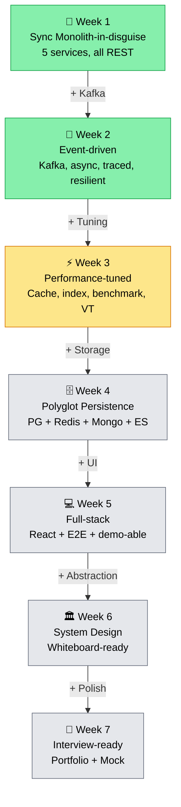

# 🔮 Những chương chưa kể — Preview Day 16→40

> *"Đã đi hết Week 1 (nền móng) và Week 2 (Kafka). Câu chuyện qua được gần 40% chặng đường. Phần hay nhất — tốc độ, polyglot, frontend, system design — vẫn còn ở phía trước."*

> 📚 Day 1–15 đã có **chương đầy đủ** — xem [mục lục](./README.md). File này chỉ giữ preview cho **Day 16→40**; mỗi day xong, một mục ở đây sẽ "tốt nghiệp" thành chương thật.

---

## Phần III — Tốc độ (Week 3, Day 16-21)

> *"Correct is table stakes. Fast is the game."*

### Chương 16 · 🔬 Đọc vị database

**Day 16 — SQL Tuning với 1M products**

```sql
EXPLAIN ANALYZE SELECT * FROM products WHERE name ILIKE '%iphone%';
-- Seq Scan on products  (cost=0.00..35847.00 rows=100 width=312)
-- Planning Time: 0.1ms
-- Execution Time: 847ms  ← 😱
```

847ms cho 1 search query. Với 100 concurrent user = database khóc.

Fix: GIN trigram index → 3ms. **280x improvement.** Nhưng Day 22 sẽ chứng minh Elasticsearch vẫn nhanh hơn 10x cho full-text search phức tạp.

---

### Chương 17 · 🔪 N+1: Kẻ giết người thầm lặng

**Day 17 — JPA N+1 Problem**

```
GET /orders → 1 query lấy 20 orders
           → 20 query lấy items cho mỗi order (N+1!)
           → 20 query lấy product info cho mỗi item (N+1 lồng N+1!)
Total: 1 + 20 + 400 = 421 queries cho 1 API call 😱
```

Fix progression: `@EntityGraph` → `JOIN FETCH` → DTO projection. Từ 421 queries → 1 query. Từ 200ms → 5ms.

---

### Chương 18 · 📖 Lật trang triệu bản ghi

**Day 18 — Keyset Pagination**

```sql
-- Offset pagination: page 5000 of 10M rows
SELECT * FROM products ORDER BY id OFFSET 100000 LIMIT 20;
-- DB phải scan 100,000 rows rồi bỏ đi. Chậm dần theo page number.

-- Keyset pagination: same result, constant time
SELECT * FROM products WHERE id > :lastSeenId ORDER BY id LIMIT 20;
-- Chỉ scan 20 rows. Luôn nhanh. Bất kể page nào.
```

---

### Chương 19 · 🧵 Ngàn sợi chỉ nhẹ

**Day 19 — Virtual Threads Deep-dive**

Virtual Threads đã bật từ Day 2. Giờ benchmark thật:
- 10,000 concurrent requests, mỗi request sleep 100ms (simulate DB call)
- Platform threads: 200 threads max → throughput 2000 req/s → 8 giây clear queue
- Virtual threads: 10,000 virtual threads → throughput 10,000 req/s → 1 giây clear queue

**5x throughput improvement** cho IO-bound workload. Zero code change.

Nhưng gotcha: `synchronized` block **pin** virtual thread vào carrier thread. Fix: chuyển sang `ReentrantLock`. JFR profiling chứng minh.

---

### Chương 20 · 💥 Stress test: Tìm điểm gãy

**Day 20 — k6 Load Test + Grafana**

Mọi hệ thống đều có điểm gãy. Câu hỏi không phải "có gãy không?" mà là "gãy ở đâu, ở bao nhiêu QPS, và recover mất bao lâu?"

k6 script simulate place-order flow: login → add to cart → checkout → payment callback. Ramp up từ 10 → 100 → 500 → 1000 virtual users. Tìm: P50, P95, P99, error rate, throughput ceiling.

---

## Phần IV — Polyglot Persistence (Week 4, Day 22-25)

> *"Khi tay bạn chỉ có búa, mọi thứ trông giống cái đinh. Senior engineer có toolbox — và biết khi nào dùng cái nào."*

### Chương 22 · 🔎 Tìm kim trong đống rơm

**Day 22 — Elasticsearch**

LIKE search chết ở 1M rows (Day 16 đã chứng minh). GIN trigram giúp, nhưng:
- Fuzzy search ("iphon" → "iPhone")? Không.
- Faceted filter (brand + price range + category)? Chậm.
- Relevance scoring? Không.
- Autocomplete suggestion? Không.

Elasticsearch: inverted index, analyzer pipeline, fuzzy matching, aggregation, sub-10ms response cho 10M documents. Đúng tool cho đúng việc.

Sync strategy: Postgres vẫn là source of truth. Kafka event `product.upserted` → ES consumer index document. Eventual consistency ~500ms.

---

### Chương 23 · 🍃 Khi schema là gánh nặng

**Day 23 — MongoDB**

Không dùng Mongo "cho có". 2 use case **có chủ ý**:

1. **Event store** — `ProductViewed`, `CartUpdated`, `OrderPlaced` có schema khác nhau hoàn toàn. Ép vào 1 relational table = EAV hell. Document model = tự nhiên.

2. **Flexible product attributes** — TV có 20 field khác laptop có 20 field khác áo có 10 field. JSONB column ở Postgres đủ cho query đơn giản, nhưng aggregation pipeline (top products by category, conversion funnel) cần MongoDB.

---

### Chương 24 · 🗺️ Bản đồ quyết định

**Day 24 — SQL vs NoSQL vs ES Decision Matrix**

Câu hỏi phỏng vấn kinh điển: *"Khi nào dùng NoSQL?"*

Sau 24 ngày, câu trả lời không còn là lý thuyết:

| Use case | Storage | Why |
|----------|---------|-----|
| Order (strong consistency, ACID) | PostgreSQL | Invariant phức tạp, transaction required |
| Cart (ephemeral, speed) | Redis | Sub-ms latency, acceptable loss |
| Product search (full-text, faceted) | Elasticsearch | Inverted index, relevance scoring |
| Event store (schemaless, append) | MongoDB | Flexible schema, aggregation pipeline |
| Product catalog (source of truth) | PostgreSQL | Relational integrity, FK constraints |

---

## Phần V — Frontend (Week 5, Day 26-30)

> *"Backend engineer viết frontend giống như đầu bếp Pháp nấu phở — biết nguyên lý, nhưng thiếu muscle memory."*

React 18 + TypeScript + TanStack Query v5 + Ant Design. Đủ để **demo end-to-end** trong portfolio review. Không phải FE showcase.

Highlight: optimistic update (cart add item → UI update ngay, rollback nếu server fail), infinite scroll (cursor pagination), SSE real-time order status.

---

## Phần VI — System Design (Week 6, Day 31-37)

> *"Code là implementation. Design là thinking. Phỏng vấn senior đo thinking, không đo typing speed."*

7 bài whiteboard classic:

| Day | Problem | Key insight |
|-----|---------|-------------|
| 31 | Capacity estimation | Numbers every engineer should know |
| 32 | Homepage feed (Tiki/Shopee) | Fan-out write vs read, pre-compute vs on-demand |
| 33 | Flash sale | Redis Lua atomic decrement + queue + fairness |
| 34 | Notification at scale | Priority queue + provider failover + rate limit |
| 35 | Search autocomplete | Trie vs ES suggester vs Redis sorted set |
| 36 | Payment reconciliation | Double-entry bookkeeping + exception flow |
| 37 | Distributed rate limiter | Token bucket + sliding window + Redis Lua |

---

## Phần VII — Final (Week 7, Day 38-40)

> *"40 ngày. Từ thư mục trống đến distributed system. Từ 'tôi biết Spring Boot' đến 'tôi thiết kế hệ thống chịu 100k QPS'. Giờ là lúc đóng gói và ra trận."*

CV bullets compiled. Portfolio polished. Mock interview — brutally honest, no mercy. Retrospective: gì work, gì waste, gì cần ôn thêm.

---

## 📈 Evolution Arc — tóm tắt 1 hình



---

> *Câu chuyện còn dài. Mỗi ngày là một chương mới. Mỗi chương là một bước tiến hóa.*
>
> *Quay lại đây sau mỗi day — chương mới sẽ được viết.*
