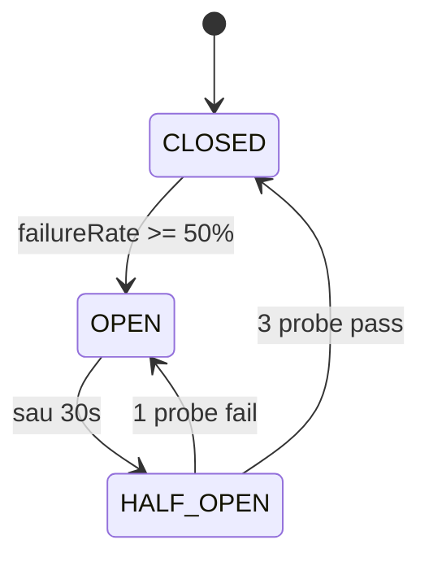

# Chương 12 · 🛡️ Lưới an toàn

**Day 12 — Resilience: Retry, Dead Letter Topic, Circuit Breaker**

---

> *"Một hệ thống production không phải là hệ thống không bao giờ ngã. Nó là con tàu biết chìm đẹp — và biết tự nổi lại lên."*

---

> 🎬 **Chương này có gì:** một con tàu gặp bão, ba thiết bị cứu sinh (phao, khoang kín, lệnh hạ buồm), một bức thư địa chỉ rách góc đánh chìm 4 giờ, một "phòng chờ ICU" cho thư hỏng, và bài học: chìm là chuyện thường, *chìm đẹp* mới là kỹ thuật. ⚓

---

## 🎬 Bối cảnh: bức thư rách góc

Cuối chương trước, bác đưa thư đứng trước một cánh cửa, cầm bức thư địa chỉ rách góc — `totalAmount = null`. Bác đọc. Không hiểu. Thử lại. Đọc lại. Thử lại nữa. **Vô tận.** Và phía sau bác, 200 nghìn bức thư khác đứng xếp hàng, không nhúc nhích.

Đó là **poison message** ☠️. Một payload xấu, một consumer chân thật quá mức, và một thư viện cài mặc định `FixedBackOff(0, MAX_LONG)` — retry *0 giây delay, vô số lần*. Đủ để biến 4 giờ chiều thành một sự cố **SEV-2**.

Day 12 không thêm tính năng mới. Day 12 hạ thuỷ một con tàu — và trang bị cho nó đủ đồ để **chìm đẹp** khi bão tới. Vì một con người ốm thì xin nghỉ. Một service ốm thì kéo cả hạm đội xuống đáy. 🌊

---

## ⚓ Ba thiết bị cứu sinh

Con tàu cần ba thứ để sống sót cơn bão: **phao cứu sinh** (lùi lại rồi thử lại), **khoang kín nước** (cô lập chỗ hỏng), và **lệnh hạ buồm bỏ neo** (ngừng đâm đầu vào sóng).

### 🛟 Phao 1 — Lùi lại có nhịp (Retry + backoff)

Retry không phải là "thử lại". Retry là **thử lại có chiến lược**.

Fixed delay = thảm hoạ. Khi 100 consumer cùng tỉnh dậy đúng một thời điểm, downstream chưa kịp thở đã ăn thêm một spike. Đó là **thundering herd** — đàn voi đồng loạt giẫm chân lên một cây cầu. 🐘🐘🐘

Exponential backoff phân tán cú giẫm ra: **1 giây → 4 giây → 16 giây**. Tăng dần. Cho downstream khoảng thở. Cho mạng cơ hội ổn định lại.

```java
ExponentialBackOff backOff = new ExponentialBackOff(1_000L, 4.0);
backOff.setMaxInterval(16_000L);
backOff.setMaxElapsedTime(21_000L);  // hard cap — quá 21s coi như persistent failure
```

Nhưng exp backoff vẫn chưa đủ: nếu mọi consumer dùng *cùng* công thức, chúng vẫn có thể đồng pha. **Jitter** thêm chút random vào mỗi khoảng chờ — phá thế đối xứng. Đơn giản, hiệu quả.

### 📦 Phao 2 — Chuyển hướng thư hỏng (DLT)

Có những bức thư không bao giờ đọc được: schema lỗi, payload `null`, JSON malformed. Retry 100 lần cũng vô nghĩa — bức thư không tự lành.

Mẹo: **phân loại trước, retry sau**.

```java
handler.addNotRetryableExceptions(
    IllegalArgumentException.class,
    DeserializationException.class,
    JsonProcessingException.class);
```

Mấy exception này → vào **DLT NGAY**, không phí 21 giây retry vô ích. Các exception khác (transient — mạng chớp tắt, downstream nấc) → thử 3 lần; vẫn fail → DLT.

DLT (Dead Letter Topic) **không phải nghĩa địa** ⚰️. Nó là **phòng chờ ICU** 🏥 — nơi thư hỏng nằm chờ con người tới khám, sửa root cause, rồi replay lại nếu cứu được.

### ⛵ Phao 3 — Hạ buồm khi nhà cháy (Circuit Breaker)

Resilience4j Circuit Breaker là bậc thầy của nghệ thuật "biết-khi-nào-dừng".



Khi gateway VNPay phun 503 hàng loạt, payment-service không nên tiếp tục đập đầu vào tường. Sau **5 fail trong 10 call gần nhất**, CB chuyển sang **OPEN** — mọi call mới fast-fail tức thì (sub-millisecond), fallback trả `UNKNOWN`, để dành cho reconciliation Day 36 verify lại async.

Sau 30 giây, CB lén hé cửa thử lại — **HALF_OPEN**, gửi 3 probe call. Pass hết → về **CLOSED** (tàu chạy bình thường). Một probe fail → **OPEN** tiếp 30 giây nữa.

Đây là cơ chế **đợi-chứ-không-đập**. ⏸️

---

## 🚪 Khoang kín nước: Bulkhead

Tàu Titanic có vách ngăn chia thân tàu thành nhiều khoang. Một khoang ngập nước, khoang khác vẫn nổi. (Bi kịch của Titanic là vách *quá thấp* — tàu nghiêng, nước tràn từ khoang này sang khoang kia. Code của ta dựng vách *kín tới trần*.)

Bulkhead trong code cũng vậy: `maxConcurrentCalls=10` — chỉ cho phép 10 thread cùng gọi gateway một lúc. Vượt → `BulkheadFullException` → fallback. Thread của caller không bị lụt theo.

```yaml
resilience4j.bulkhead.instances.paymentGateway:
  maxConcurrentCalls: 10
  maxWaitDuration: 0   # fail-fast, KHONG xep hang cho
```

`maxWaitDuration: 0` — không queue. Đầy thì fail ngay. Đây là **load shedding** chủ động: tốt hơn nhiều so với để 1000 request xếp hàng rồi cùng nhau timeout một lượt.

> 🧠 Có người hỏi: *"Day 8 đã có virtual thread rồi, cần Bulkhead làm gì?"* Câu trả lời ngắn: **virtual thread thì rẻ, nhưng connection pool của downstream thì đắt.** Virtual thread bảo vệ *caller* (mình tạo bao nhiêu thread cũng được). Bulkhead bảo vệ *callee* (đừng bóp cổ gateway bằng 1000 connection cùng lúc). Hai vai, hai việc, không thay thế nhau.

---

## 🧭 Quyết định thiết kế

| Quyết định | Lựa chọn | Vì sao |
| --- | --- | --- |
| Retry strategy | Exp backoff 1s/4s/16s, max 3 | Recover transient, có cap rõ ràng |
| Poison handling | Retry-then-DLT | Cân bằng recover vs block cả partition |
| DLT routing | Giữ partition affinity | Giữ ordering khi replay |
| CB sliding window | COUNT_BASED size=10 | Gateway traffic thấp (~10/s), time-based sẽ noise |
| Bulkhead | Semaphore, không queue | Fast-fail tốt hơn slow-fail |
| Fallback path | Trả `UNKNOWN`, defer reconcile | Không chặn luồng order |

---

## 🏥 DLT — phòng chờ ICU, không phải nghĩa địa

```java
@KafkaListener(topicPattern = ".*\\.DLT", groupId = "notification-dlt")
public void onDeadLetter(/* ... */) {
    try {
        log.error("[DLT] topic={} ex={} ...", topic, exClass, /* ... */);
        dltCount.incrementAndGet();
    } catch (Exception swallow) {
        // KHONG throw — chong .DLT.DLT cascade.
        log.error("[DLT] handler internal error", swallow);
    }
}
```

Hai luật vàng của phòng ICU:

1. 🚫 **DLT consumer KHÔNG BAO GIỜ throw.** Throw → message rớt sang `.DLT.DLT` → vòng lặp địa ngục vô tận.
2. 🚫 **DLT KHÔNG auto-replay.** Replay khi chưa fix root cause → message quay lại DLT → infinite loop. Phải có người khám trước.

Người ops nhìn alert `notification.dlt.count > 0`, mở runbook 5 bước:

```
Triage → Inspect payload → Classify → Replay/Discard → Post-mortem
```

5 phút tới 45 phút. Có quy trình. Không panic. 🧑‍🚒

---

## 🏁 Kết thúc ngày 12

```
📊 Scorecard:
├── Phao cứu sinh:   3 lớp (retry backoff + DLT + circuit breaker)
├── Backoff:         1s / 4s / 16s, max 3 lần, hard cap 21s
├── Poison routing:  non-retryable → DLT ngay; transient → 3 thử rồi DLT
├── Circuit breaker: 5 fail / 10 call → OPEN; 30s → HALF_OPEN; 3 probe → CLOSED
├── Bulkhead:        maxConcurrentCalls=10, no queue (fast-fail)
├── DLT guard:       consumer không throw + không auto-replay (2 luật vàng)
├── Runbook:         5 bước triage (5–45 phút)
├── Tests:           5 PASS (2 retry topology + 3 circuit breaker)
└── Vibe:            "Phao đã sẵn. Khoang đã kín. Buồm biết hạ. Mai bão cũng không chìm." ⚓
```

> 💡 **Senior insight:** Resilience không phải "thêm thư viện". Resilience là **classify failure trước** — transient vs persistent, validation vs schema, downstream-down vs downstream-slow. Mỗi loại một phao riêng. Trộn lẫn (retry một lỗi validation 3 lần) = lãng phí. Tách rõ = mỗi phao làm đúng việc của nó.

---

*→ Ba phao đã treo lên mạn tàu. Lưới đã đan dưới mỗi đường ống. Nhưng còn một lỗ hổng mà lưới không bắt được: khi service ghi DB xong, rồi mới publish Kafka — và Kafka *chết* đúng ngay khe đó. Event bốc hơi. DB nói "đơn đã lưu", Kafka nói "tôi chẳng nhận gì". Hai thế giới, hai sự thật. Day 13 vá lỗ này bằng một cái hộp — và một sợi chỉ đỏ luồn qua cả hai...* 🧵
