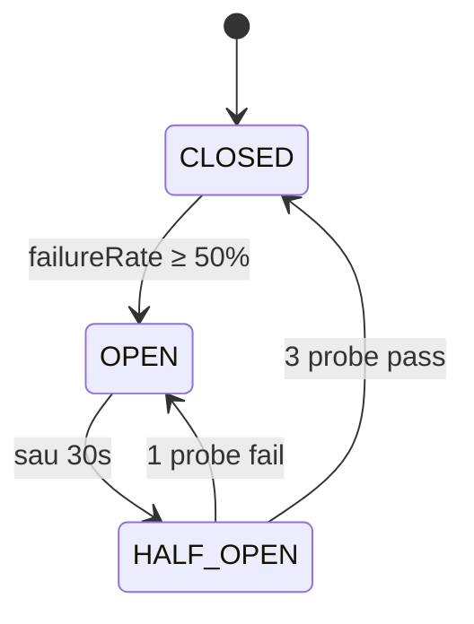

# Chương 12 · 🛡️ Lưới an toàn

**Day 12 — Resilience: Retry, Dead Letter Topic, Circuit Breaker**

---

> *"Một hệ thống production không phải là hệ thống không bao giờ ngã. Nó là hệ thống biết ngã đẹp — và biết tự đứng dậy."*

---

## Bối cảnh

Day 11, người đưa thư đã đến từng cánh cửa. Nhưng tuần trước, một bức thư có địa chỉ rách góc — `totalAmount = null`. Người đưa thư không đọc được, thử lại. Đọc lại. Thử lại nữa. Vô tận. 200 nghìn bức thư đứng xếp hàng sau lưng.

Đó là **poison message**. Một payload xấu, một consumer chân thật, và một thư viện default `FixedBackOff(0, MAX_LONG)` — đủ để biến 4 giờ thành sự cố SEV-2.

Day 12 không thêm tính năng mới. Day 12 đan **lưới an toàn** dưới mỗi đường ống.

---

## Ba lớp lưới

Một con người ốm thì có thể nghỉ. Một service ốm thì kéo theo cả hệ thống.
Hệ thống cần ba lớp bảo vệ: lùi lại, chuyển hướng, và tự kéo cầu.

### Lớp 1 — Lùi lại có nhịp

Retry không phải là "thử lại". Retry là **thử lại có chiến lược**.

Fixed delay = thảm họa. Khi 100 consumer cùng wake same time, downstream chưa kịp thở đã ăn thêm spike. Đó là **thundering herd** — đàn voi đồng loạt giẫm chân.

Exponential backoff phân tán: 1 giây, 4 giây, 16 giây. Tăng dần. Cho downstream khoảng thở. Cho mạng cơ hội ổn định.

```java
ExponentialBackOff backOff = new ExponentialBackOff(1_000L, 4.0);
backOff.setMaxInterval(16_000L);
backOff.setMaxElapsedTime(21_000L);  // hard cap — sau 21s là persistent failure
```

Nhưng exp backoff vẫn chưa đủ. Nếu mọi consumer dùng cùng công thức, vẫn có nguy cơ đồng pha. **Jitter** thêm chút random — phá đối xứng. Đẹp. Đơn giản. Hiệu quả.

### Lớp 2 — Chuyển hướng poison

Có những bức thư không bao giờ đọc được. Schema lỗi, payload null, JSON malformed. Retry 100 lần cũng vô nghĩa.

Phân loại trước, retry sau:

```java
handler.addNotRetryableExceptions(
    IllegalArgumentException.class,
    DeserializationException.class,
    JsonProcessingException.class);
```

Những exception này → DLT NGAY. Không tốn 21 giây retry vô ích.

Các exception khác → 3 lần thử. Vẫn fail → DLT.

DLT — Dead Letter Topic — là nơi nghỉ ngơi cho những message không xử lý được. Không phải nghĩa địa. Là **phòng chờ ICU**: cần human triage, có thể replay sau khi fix.

### Lớp 3 — Cầu rút khi nhà cháy

Resilience4j Circuit Breaker là bậc thầy của "biết-khi-nào-dừng".



Khi gateway VNPay 503 spike, payment-service không cần tiếp tục đập đầu vào tường. Sau 5 fail trong 10 call gần nhất, CB chuyển **OPEN** — mọi call mới fast-fail (sub-millisecond), fallback trả `UNKNOWN`, reconciliation Day 36 sẽ verify lại async.

Sau 30 giây, CB lén thử lại — HALF_OPEN, 3 probe call. Pass hết → trở về CLOSED. Một probe fail → OPEN tiếp 30 giây.

Đây là cơ chế **đợi-không-phải-đập**.

---

## Bulkhead — vách ngăn tàu

Tàu Titanic có vách ngăn. Mỗi khoang ngập nước, khoang khác vẫn nổi. Nhưng vách thấp quá → khi tàu nghiêng, nước tràn từ khoang này sang khoang kia.

Bulkhead trong code cũng vậy. `maxConcurrentCalls=10` — chỉ 10 thread cùng gọi gateway một lúc. Vượt → `BulkheadFullException` → fallback. Caller thread không bị lụt.

```yaml
resilience4j.bulkhead.instances.paymentGateway:
  maxConcurrentCalls: 10
  maxWaitDuration: 0   # fail-fast, không queue
```

`maxWaitDuration: 0` — không queue. Đầy thì fail ngay. Đây là **load shedding** chủ động. Tốt hơn để 1000 request xếp hàng chờ rồi cùng timeout.

Có người hỏi: virtual thread (Day 8) rồi, cần Bulkhead làm gì? Câu trả lời ngắn: **virtual thread cheap, downstream connection pool đắt**. VT bảo vệ caller; Bulkhead bảo vệ callee. Hai vai trò khác nhau.

---

## Quyết định thiết kế

| Quyết định | Lựa chọn | Vì sao |
|---|---|---|
| Retry strategy | Exp backoff 1s/4s/16s, max 3 | Recover transient, cap rõ ràng |
| Poison handling | Retry-then-DLT (chosen) | Cân bằng recover vs block partition |
| DLT routing | Giữ partition affinity | Ordering khi replay |
| CB sliding window | COUNT_BASED size=10 | Low traffic gateway (~10/s), time-based sẽ noise |
| Bulkhead | Semaphore, không queue | Fast-fail tốt hơn slow-fail |
| Fallback path | Trả `UNKNOWN`, defer reconcile | Không chặn luồng order |

---

## DLT — phòng chờ ICU, không phải nghĩa địa

```java
@KafkaListener(topicPattern = ".*\\.DLT", groupId = "notification-dlt")
public void onDeadLetter(...) {
    try {
        log.error("[DLT] topic={} ex={} ...", topic, exClass, ...);
        dltCount.incrementAndGet();
    } catch (Exception swallow) {
        // KHÔNG throw — chống .DLT.DLT cascade.
        log.error("[DLT] handler internal error", swallow);
    }
}
```

Hai luật vàng:
1. **DLT consumer KHÔNG bao giờ throw.** Throw = `.DLT.DLT` = vòng lặp địa ngục.
2. **DLT KHÔNG auto-replay.** Replay khi chưa fix root cause = quay lại DLT = infinite loop.

Người ops nhìn alert `notification.dlt.count > 0`, mở runbook 5 bước:

```
Triage → Inspect payload → Classify → Replay/Discard → Post-mortem
```

5 phút tới 45 phút. Có quy trình. Không panic.

---

## Kết thúc ngày 12

```
├── notification-service
│   ├── RetryTopologyConfiguration ✅ — exp backoff 1s/4s/16s, DLT publishing
│   ├── DltConsumer ✅ — pattern .*\.DLT, swallow + metric
│   ├── OrderCreatedConsumer ✅ — bỏ swallow, release dedup + re-throw
│   └── PaymentCompletedConsumer ✅ — cùng pattern
├── payment-service
│   ├── MockGatewayClient ✅ — @CircuitBreaker + @Bulkhead + fallback
│   ├── VerificationResult ✅ — SUCCESS/FAILED/UNKNOWN sealed-ish record
│   └── GatewayDebugController ✅ — /debug/gateway/{verify,force-fail,state}
├── docs
│   ├── lessons 12, 12b, 12c (filled), 12d (filled) ✅
│   ├── issues 12-poison-message ✅
│   ├── runbooks kafka-topic-recovery ✅
│   └── interview day-12-resilience ✅
└── tests
    ├── RetryTopologyConfigurationTest ✅ — 2/2 PASS
    └── MockGatewayClientCircuitBreakerTest ✅ — 3/3 PASS (CLOSED→OPEN, fast-fail, HALF_OPEN→CLOSED)

Vibe: "Lưới căng. Tàu có vách ngăn. Cầu có thể rút. Ngày mai mưa cũng không sợ."
```

> 💡 **Senior insight**: Resilience không phải "thêm thư viện". Resilience là **classify failure** trước — transient vs persistent, validation vs schema, downstream-down vs downstream-slow. Mỗi loại có pattern riêng. Trộn lẫn = retry validation lỗi = lãng phí. Tách rõ = mỗi pattern làm đúng việc.

---

*→ Lưới đã đan. Nhưng còn một lỗ hổng: khi service ghi DB xong mà Kafka publish fail, event mất. Day 13 sẽ vá lỗ đó bằng một cái hộp — Outbox.*
