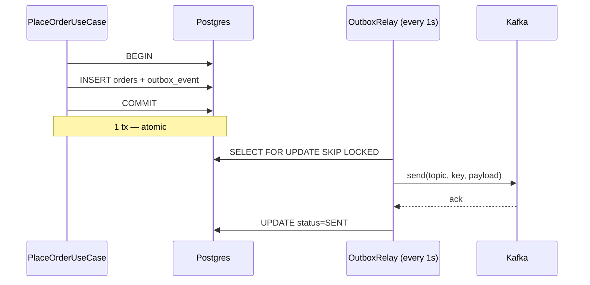

# Chương 13 · 🧵 Sợi chỉ đỏ

**Day 13 — Transactional Outbox Pattern**

---

> *"Hai cái COMMIT không thể đồng thời ở hai thế giới. Nhưng một cái COMMIT có thể giấu trong mình hạt giống của cái kia."*

---

> 🎬 **Chương này có gì:** hai thế giới không chịu bắt tay nhau, 23 đơn hàng bốc hơi trong 90 giây, một sợi chỉ đỏ luồn qua cả hai COMMIT mà không bao giờ đứt, một cái loa di động đi rao mỗi giây, và phép lịch sự `SKIP LOCKED` của Postgres. 📮

---

## 🎬 Bối cảnh: cái lỗ mà lưới không bắt được

Day 12 đan lưới an toàn dưới mỗi đường ống. Lưới bắt poison, lưới ngắt mạch, lưới giữ message khỏi rơi. Nhưng có một loại rơi mà lưới *không bao giờ* bắt được — vì cú rơi xảy ra **trước khi message kịp lên đường**. 🕳️

Sáng 24/05. Kafka broker primary OOM, restart 90 giây. Trong đúng 90 giây ấy, **23 đơn hàng** được lưu vào Postgres. User thấy "Đặt hàng thành công". Nhưng `order.created` **không bao giờ** đến inventory-service. Customer trả tiền. Customer chờ hàng. CSKH ngập ticket. 🔥

Code Day 9 đã thú nhận trước chuyện này từ lâu:

```java
// Dual-write debt: DB commit + Kafka publish KHONG atomic.
// Day 13 outbox pattern se tra debt nay.
```

Comment là một lời hứa. Day 13 là ngày trả nợ.

---

## 🌍 Hai thế giới, một sợi chỉ đỏ

Postgres là một thế giới. Kafka là một thế giới khác. Mỗi thế giới có khái niệm transaction riêng, mỗi thế giới chỉ biết về `COMMIT` của *chính nó*. Không có điều luật vũ trụ nào ép hai cái `COMMIT` đó xảy ra cùng một khoảnh khắc.

Industry đã thử **2PC** (two-phase commit). Một coordinator nắm tay hai bên: *"Sẵn sàng chưa?" — "Sẵn sàng." — "Commit!"*. Lý thuyết đẹp. Thực tế: coordinator chết đúng lúc tay vẫn đang nắm → cả hai thế giới đóng băng ở `prepared` state, DBA mất nguyên một đêm gỡ. Cộng đồng lặng lẽ chia tay 2PC khoảng 2015.

Vậy thì sao? Đáp án không phải *tăng* coordinator. Đáp án là **dồn vấn đề về một thế giới duy nhất**.

Nếu cả Order *và* "ý định publish event" cùng được ghi vào Postgres trong **một transaction duy nhất** — thì atomicity tự nhiên mà có, miễn phí, Postgres lo. Một người khác sẽ đọc bảng đó, publish lên Kafka, đánh dấu đã gửi. Người đó chết cũng được, chậm cũng được, chạy hai bản cũng được — không sao, vì source of truth nằm yên trong DB.

Đó là **outbox** — hộp thư đi 📤. Và cái dòng outbox ấy chính là **sợi chỉ đỏ**: nó được khâu *bên trong* cái COMMIT của thế giới Postgres, rồi luồn sang thế giới Kafka qua tay người relay — một sợi chỉ duy nhất nối hai thế giới, không bao giờ đứt giữa chừng.

---

## 🧷 Một dòng INSERT, một bản hợp đồng

```java
@Transactional
public Order place(PlaceOrderCommand cmd) {
    // ... build Order
    Order saved = orderRepository.save(order);

    // KHONG send Kafka o day. Chi ghi outbox row.
    outboxRecorder.record(
        "Order", saved.getId().toString(),
        "OrderCreatedV1",
        TopicNames.ORDER_CREATED,
        saved.getId().toString(),
        toEvent(saved));
    return saved;
}
```

Hai dòng. `orderRepository.save()` và `outboxRecorder.record()`. Cả hai đều là DB INSERT. Cả hai cùng nằm trong một `@Transactional`. Postgres bảo đảm: **hoặc cả hai commit, hoặc cả hai rollback** — sợi chỉ đỏ được khâu vào cùng một đường kim với đơn hàng, không tách rời.

Không còn dual-write. Không còn cảnh "DB OK nhưng Kafka fail". Không còn 23 customer trả tiền mà không có hàng.

---

## 📣 Relay — cái loa di động của hệ thống

Nhưng event vẫn cần lên Kafka thật. Một process khác phải đọc outbox, publish, rồi đánh dấu đã gửi. Đó là **relay**.



Relay là **cái loa di động** 📣. Cứ mỗi 1 giây, nó đi một vòng quanh chợ, hô lên: *"Có ai PENDING không?"*. Vớ một nắm row. Publish. Đánh dấu `SENT`. Quay lại sau 1 giây. Đơn giản, tách hoàn toàn khỏi business code.

Câu hỏi tự nhiên: nếu chạy **2 relay song song** thì sao? Hai cái loa, một cái chợ — có lo double-publish không? 🤔

---

## 🤝 SKIP LOCKED — phép lịch sự của Postgres

`SELECT ... FOR UPDATE` lock row lại. Relay A vớ một row, lock nó. Relay B vớ *đúng* row đó → **block**, đứng chờ A xong. Đó là pessimistic lock truyền thống — và nó tệ, vì relay B đứng đợi vô ích.

`SKIP LOCKED` thêm một phép lịch sự: *"Row này đã có người cầm rồi à? Thôi tôi bỏ qua, tìm row khác."* Relay A và B tự chia nhau hai batch không giao nhau (disjoint). Không block. Không duplicate. Native Postgres, cost gần như zero.

```java
@Lock(LockModeType.PESSIMISTIC_WRITE)
@QueryHints(@QueryHint(name = "jakarta.persistence.lock.timeout", value = "-2"))
@Query("SELECT e FROM OutboxEvent e WHERE e.status = PENDING ORDER BY e.createdAt ASC")
List<OutboxEvent> fetchBatchForRelay(Pageable pageable);
```

`-2` trong Hibernate là magic number cho `SKIP_LOCKED`. Một dòng config. Một bài toán race-free. Hai cái loa, một cái chợ, không ai giẫm chân ai. ✅

---

## 🔍 Index nhỏ, query nhanh

DBA Hằng sẽ hỏi ngay: *"50k orders/day × 365 ngày = 18 triệu rows. Em định query nó mỗi giây à?"* 😤

Đáp án: query **không bao giờ nhìn thấy** 18 triệu rows. Vì index là **partial**:

```sql
CREATE INDEX outbox_pending_idx
    ON outbox_event (created_at)
    WHERE status = 'PENDING';
```

Chỉ row `PENDING` mới vào index. Row `SENT` — chiếm 99.99% volume — bị loại thẳng. Index size = số row đang chờ publish ≈ vài chục. Relay scan vài chục entry, lấy 100 row đầu, lock, đi. **Milliseconds.** ⚡

Cron đêm dọn rác: `DELETE WHERE status='SENT' AND sent_at < now() - interval '7 days'`. Bảng giữ size quản lý được. Chưa partition vội — khi nào cần mới làm (Day 20 sẽ benchmark).

---

## 💸 Cái giá phải trả

Outbox không miễn phí. Cái giá là **latency**.

| | Direct publish (Day 9) | Outbox (Day 13) |
| --- | --- | --- |
| Event tới Kafka | ~5ms | 1–2 giây (polling tick) |
| Atomic với DB write? | ❌ Không (dual-write) | ✅ Có |
| Mất event khi Kafka down? | 🔴 Có (23 đơn) | 🟢 Không |

Với realtime trading thì 2 giây là một đời. Với ecommerce order — user nhìn banner *"Đang giữ hàng..."* — 2 giây *không ai cảm nhận được*. Đó là **trade-off có ý thức**: không phải bug, không phải chấp nhận thất bại, mà là chọn đúng tool cho đúng problem.

Khi nào outbox không đủ? Khi volume vượt 10k events/s, hoặc latency budget tụt xuống dưới 500ms. Lúc đó migrate sang **Debezium** — đọc thẳng Postgres WAL, push sang Kafka, sub-second. Outbox table vẫn xài được (Debezium có "Outbox Event Router" SMT). Không vứt code, chỉ thay người relay. Đó là **migration path** — tech lead nghĩ trước hai bước. 🎯

---

## 🏁 Kết thúc ngày 13

```
📊 Scorecard:
├── Sợi chỉ đỏ:    outbox_event row — khâu trong cùng tx business write
├── Atomicity:     1 @Transactional ôm cả save(order) + record(outbox)
├── Relay:         scheduled 1s + SKIP LOCKED + REQUIRES_NEW
├── Index:         partial WHERE status='PENDING' → scan vài chục row, ms
├── Latency cost:  5ms → 1–2s (chấp nhận cho ecommerce order)
├── Migration path: outbox → Debezium WAL khi >10k events/s
├── Tests:         8 (recorder 3 + relay 5)
├── Docs:          ADR-009 + 2 lessons + 1 issue + interview Q&A
└── Vibe:          "Trả nợ kỹ thuật cũ bằng một bảng đơn giản hơn mong đợi." 🧵
```

> 💡 **Senior insight:** Outbox không phải pattern để khoe code. Nó là một **lời thừa nhận**: hai hệ thống không thể atomic với nhau, nên ta dồn cả hai về một. Đơn giản tới mức junior nhìn xong hỏi *"ủa, chỉ thế thôi á?"*. Senior trả lời: *"Đúng vậy. Vì ta đã đi qua 2PC, đã đi qua chained tx manager, đã đi qua dual-write retry — và biết tất cả đều tệ hơn cái bảng này."*

---

*→ Sang chương sau, Week 2 đóng lại. Mock interview. Sẽ có ai đó nhìn thẳng vào mắt và hỏi: "Kể anh nghe, em đã build cái event-driven system này như thế nào?". Và lần đầu tiên, ta có câu trả lời đầy đủ — không phải lý thuyết suông, mà là code đã chạy qua 23 ticket CSKH...* 🎤
