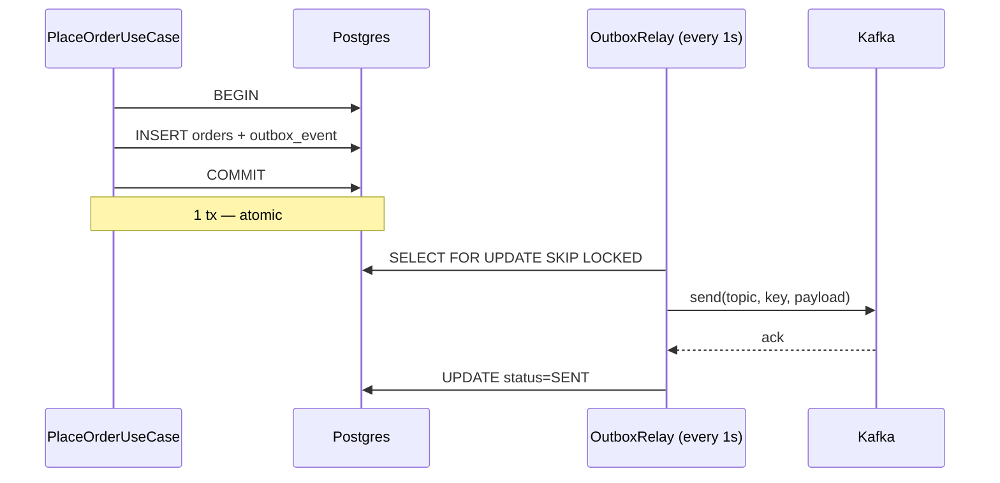

# Chương 13 · 🧵 Sợi chỉ đỏ

**Day 13 — Transactional Outbox Pattern**

---

> *"Hai cái COMMIT không thể đồng thời ở hai thế giới. Nhưng một cái COMMIT có thể giấu trong mình hạt giống của cái kia."*

---

## Bối cảnh

Day 12 đan lưới an toàn dưới mỗi đường ống. Lưới bắt poison, lưới ngắt mạch, lưới giữ message khỏi rơi. Nhưng có một loại rơi mà lưới không bắt được — vì sự rơi xảy ra **trước khi message kịp lên đường**.

Sáng 24/05. Kafka broker primary OOM, restart 90 giây. Trong 90 giây ấy, 23 đơn hàng được lưu vào Postgres. User thấy "Đặt hàng thành công". Nhưng `order.created` không bao giờ đến inventory-service. Customer paid. Customer chờ. CSKH ngập ticket.

Code Day 9 đã thừa nhận trước đó:

```java
// Dual-write debt: DB commit + Kafka publish KHÔNG atomic.
// Day 13 outbox pattern sẽ trả debt này.
```

Comment là lời hứa. Day 13 là ngày trả nợ.

---

## Hai thế giới, một mạch máu

Postgres là một thế giới. Kafka là một thế giới khác. Mỗi thế giới có khái niệm transaction riêng. Mỗi thế giới biết về `COMMIT` của chính nó. Không có điều luật vũ trụ nào ép hai `COMMIT` đó xảy ra cùng nhau.

Industry đã thử 2PC. Coordinator nắm tay hai bên: "Sẵn sàng chưa?" — "Sẵn sàng" — "Commit!". Lý thuyết đẹp. Thực tế: coordinator chết khi tay vẫn nắm → cả hai thế giới đóng băng prepared state. DBA mất một đêm gỡ rối. Cộng đồng từ bỏ 2PC khoảng 2015.

Vậy thì sao? Đáp án không phải tăng coordinator. Đáp án là **dịch chuyển vấn đề về một thế giới duy nhất**.

Nếu cả Order và "ý định publish event" đều ghi vào Postgres trong **một transaction duy nhất** — thì atomicity miễn phí. Postgres tự lo. Một người khác đọc bảng đó, publish Kafka, đánh dấu đã gửi. Người đó có thể chết, có thể chậm, có thể chạy hai bản. Không quan trọng — vì source of truth nằm trong DB.

Đó là **outbox**. Hộp thư đi.

---

## Một dòng INSERT, một bản hợp đồng

```java
@Transactional
public Order place(PlaceOrderCommand cmd) {
    // ... build Order
    Order saved = orderRepository.save(order);

    // KHÔNG send Kafka ở đây. Chỉ ghi outbox row.
    outboxRecorder.record(
        "Order", saved.getId().toString(),
        "OrderCreatedV1",
        TopicNames.ORDER_CREATED,
        saved.getId().toString(),
        toEvent(saved));
    return saved;
}
```

Hai dòng. `orderRepository.save()` và `outboxRecorder.record()`. Cả hai đều là DB INSERT. Cả hai đều nằm trong cùng `@Transactional`. Postgres đảm bảo: hoặc cả hai commit, hoặc cả hai rollback.

Không còn dual-write. Không còn "DB OK, Kafka fail". Không còn 23 customer paid nhưng không có hàng.

---

## Relay — người bán hàng rong của hệ thống

Nhưng event vẫn cần lên Kafka. Một process khác phải đọc outbox, publish, đánh dấu. Đó là **relay**.



Relay là cái loa di động. Cứ 1 giây nó đi quanh chợ, hô lên: "Có gì PENDING không?". Lấy một nắm. Publish. Đánh dấu. Quay lại sau 1 giây.

Đẹp. Đơn giản. Tách hoàn toàn khỏi business code.

Câu hỏi: nếu chạy 2 relay song song thì sao? Hai cái loa, một cái chợ. Có lo double-publish không?

---

## SKIP LOCKED — phép lịch sự của Postgres

`SELECT ... FOR UPDATE` lock row. Relay A vớ một row, lock. Relay B vớ cùng row → **block**, chờ A. Đó là pessimistic lock truyền thống. Tệ — relay B đứng đợi vô ích.

`SKIP LOCKED` thêm phép lịch sự: "Nếu row này đã có người, tôi bỏ qua, tìm row khác". Relay A và B chia nhau hai batch disjoint. Không block. Không duplicate. Native Postgres. Cost gần như zero.

```java
@Lock(LockModeType.PESSIMISTIC_WRITE)
@QueryHints(@QueryHint(name = "jakarta.persistence.lock.timeout", value = "-2"))
@Query("SELECT e FROM OutboxEvent e WHERE e.status = PENDING ORDER BY e.createdAt ASC")
List<OutboxEvent> fetchBatchForRelay(Pageable pageable);
```

`-2` trong Hibernate là magic number cho `SKIP_LOCKED`. Một dòng config. Một bài toán race-free.

---

## Index nhỏ, query nhanh

DBA Hằng sẽ hỏi: "50k orders/day × 365 ngày = 18 triệu rows. Em định query nó mỗi giây?".

Đáp án: query không bao giờ thấy 18 triệu rows. Vì index là **partial**:

```sql
CREATE INDEX outbox_pending_idx
    ON outbox_event (created_at)
    WHERE status = 'PENDING';
```

Chỉ PENDING vào index. SENT — chiếm 99.99% volume — bị loại. Index size = số row đang đợi publish ≈ vài chục. Query relay scan vài chục entry, lấy 100 row đầu, lock, đi. Milliseconds.

Cron đêm `DELETE WHERE status='SENT' AND sent_at < now() - interval '7 days'` dọn rác. Bảng giữ size manageable. Không partition vội — khi cần mới làm (Day 20 sẽ benchmark).

---

## Cái giá phải trả

Outbox không miễn phí. Cái giá là **latency**.

Direct publish Day 9: event tới Kafka trong ~5ms. Outbox: 1-2 giây (polling tick). Đối với realtime trading thì là một đời. Đối với ecommerce order — user thấy "Đang giữ hàng..." banner — 2 giây không cảm nhận.

Đó là **trade-off có ý thức**. Không phải bug. Không phải chấp nhận thất bại. Là chọn đúng tool cho đúng problem.

Khi nào outbox không đủ? Khi volume vượt 10k events/s, hoặc latency budget xuống dưới 500ms. Lúc đó migrate Debezium — đọc Postgres WAL trực tiếp, push sang Kafka, sub-second. Outbox table vẫn dùng được (Debezium "Outbox Event Router" SMT). Không phải vứt code, chỉ thay relay.

Đó là **migration path**. Tech lead nghĩ trước 2 bước.

---

## Kết thúc ngày 13

```
day-13/
├── outbox_event table        ✅ Postgres partial index PENDING
├── OutboxRecorder            ✅ ghi cùng tx business write
├── OutboxRelay               ✅ scheduled 1s + SKIP LOCKED + REQUIRES_NEW
├── PlaceOrderUseCase         ✅ refactor bỏ direct Kafka send
├── 8 unit tests              ✅ recorder 3 + relay 5
└── ADR-009 + 2 lessons + 1 issue + interview Q&A  ✅
```

> Vibe: *"Trả nợ kỹ thuật cũ bằng một bảng đơn giản hơn mong đợi."*

---

> 💡 **Senior insight**: Outbox không phải pattern khoe code. Nó là **lời thừa nhận**: hai hệ thống không thể atomic, nên ta dồn về một. Đơn giản đến mức team junior nghĩ "ủa chỉ thế thôi?". Senior trả lời: "Đúng vậy. Vì ta đã đi qua 2PC, đã đi qua chained tx manager, đã đi qua dual-write retry — và biết tất cả đều tệ hơn."

---

*→ Sang chương sau, Week 2 đóng lại. Mock interview. Sẽ có ai đó hỏi: "Kể em nghe em đã build cái event-driven system này như thế nào?". Và lần đầu tiên, ta có câu trả lời đầy đủ — không phải lý thuyết, mà là code đã chạy qua 23 ticket CSKH.*
