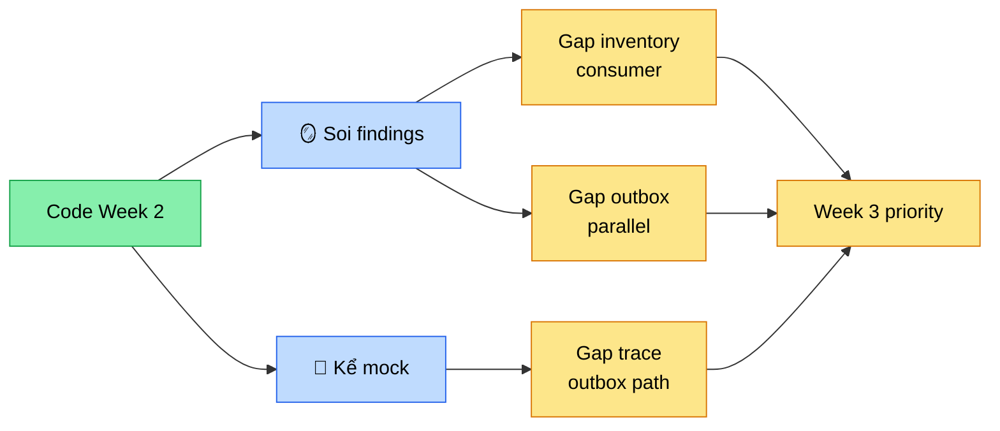

# Chương 14 · 🪞 Tấm gương soi

**Day 14 — Mock Interview Week 2 + Code Review**

---

> *"Code chỉ thật sự là của bạn khi có người ngoài hỏi: 'Em đã làm cái này như thế nào?' — và bạn trả lời được trong 60 giây mà không cần mở IDE."*

---

> 🎬 **Chương này có gì:** một tấm gương hai mặt — một mặt soi code, một mặt soi miệng người kể; sáu vết bẩn lộ ra dưới ánh đèn; một câu hỏi bẫy chỉ khác nhau **đúng một từ**; và một định luật chấm điểm tàn nhẫn: ở senior, "gần đúng" tính là sai. 🪞

---

## 🎬 Bối cảnh: tuần 2 khép lại, gương được kéo ra

Chương trước, [sợi chỉ đỏ Day 13](13-soi-chi-do.md) buộc xong cả tuần 2 thành một dải liền mạch: từ *"Kafka là gì"* đến *"tại sao outbox đẹp hơn Debezium"*. Sáu ngày, sáu chương, một dòng chảy. Code chạy. Test xanh. ROADMAP tick xong. 🎉

Nhưng có một sự thật khó chịu mà mọi engineer self-taught đều biết tỏng: **code chạy ≠ hiểu code**. Build được không có nghĩa kể được. Kể được trong console — một mình lẩm bẩm — không có nghĩa kể được trước một senior Tiki ngồi ngó chéo qua bàn, tay khoanh trước ngực, chờ một câu lúng túng để bắt bài.

Nên Day 14 không build gì cả. Day 14 kéo ra một **tấm gương** 🪞. Không code mới. Không lesson mới. Chỉ hai việc: **soi lại** và **kể lại**.

---

## 🪞 Hai việc, hai mặt gương

Soi và kể nghe thì giống. Không phải.

| Mặt gương | Hành động | Câu hỏi nó hỏi | Bắt được gì |
| --- | --- | --- | --- |
| 🔍 **Soi** (mặt trong) | Code review | "Code này *ngầm giả định* gì mà không nói ra?" | Assumption ngầm — cái code tin là đúng nhưng không enforce |
| 🎤 **Kể** (mặt ngoài) | Mock interview | "Bạn config acks=all + idempotence + read_committed — đang ở semantics nào?" | Hiểu nông — nhớ buzzword nhưng không phân biệt được sắc thái |

🔍 **Soi** là nhìn vào *bên trong* code. Một senior reviewer không đi tìm bug — bug thì compiler tìm hộ rồi. Senior tìm **assumption ngầm**: cái mà code mặc định đúng nhưng chẳng có dòng nào bắt nó phải đúng.

🎤 **Kể** là đứng *bên ngoài* code, để người khác hỏi. Câu hỏi không phải *"định nghĩa exactly-once là gì"* — đó là câu cho sinh viên. Câu hỏi là *"bạn đã config thế kia, vậy hệ thống đang ở semantics nào?"* — gắn chặt vào code chính tay mình viết. Tay run khi trả lời = chấm borderline. Lúng túng = fail.

Hai mặt nhìn từ hai phía. Cả hai phải khớp thì code mới thật sự là *của mình*.

---

## 🔍 Sáu finding, một khoản nợ ẩn

Soi xong, gương trả lại **sáu vết**: ba đỏ 🔴, ba vàng 🟡. Vết khó chịu nhất nằm ở inventory consumer:

```java
// inventory/OrderCreatedConsumer.java:65-71
} catch (RuntimeException ex) {
    log.warn("Reserve failed orderId={} sku={} qty={} reason={}", ...);
}
```

Một cú **catch-all**. Comment Day 9 biện hộ *"tránh retry storm"*. Nghe hợp lý — cho đến khi soi kỹ: cái `catch (RuntimeException)` này gộp *"stock hết thật"* (đáng nuốt) chung với *"DB down"*, *"connection mất"* (phải retry). Tất cả đều bị nuốt êm ru. Message được ack. **Message biến mất.** Đơn hàng mất hút mà chẳng ai hay. 😱

Nhưng vết sâu hơn là chuyện khác — và đây mới là điểm senior soi ra mà junior nhìn xuyên qua:

> ⚠️ Day 11 làm dedup cho **notification** thì nhớ. Inventory consumer thì **quên**. Mà chính comment Day 9 trong code đã tự hứa *"Day 11 sẽ làm"*. Day 11 đến rồi đi — debt vẫn nằm nguyên đó.

Đó là kiểu nợ tệ nhất: **nợ ẩn**. Code tự nhận *"tôi sẽ fix"*, không ai ghi vào đâu để theo dõi, rồi fix không bao giờ xảy ra. Một lời hứa mồ côi trong comment. Senior soi ra được. Junior thì tin lời comment.

---

## 🪤 Câu Q1 — bẫy chỉ khác nhau một từ

> *"Bạn config acks=all + idempotence + read_committed. Hệ thống đang ở delivery semantics nào?"*

Junior trả lời ngay, tự tin căng tràn: *"Exactly-once!"* 🎯 — Sai.

Câu trả lời senior gọn lại còn một mệnh đề:

> 🧠 At-least-once delivery + dedup ở consumer = **exactly-once-*effects*** — không phải exactly-once *thật*. Exactly-once thật chỉ tới khi bật full Kafka transactions; project không trả cái giá 5-10% throughput đó.

Khác biệt nằm **đúng một từ**: *effects* vs *delivery*. Một từ tách senior khỏi mid-level. (Chi tiết bộ ba `transactional.id` + `initTransactions()` + `sendOffsetsToTransaction()` và phép tính overhead → để dành [interview doc Day 14](../interview/day-14-mock.md).)

Đây là **brutality của mock interview** đó: nó không hỏi bạn *biết* gì, nó hỏi bạn có hiểu đủ sâu để phân biệt *effect vs delivery* — hay chỉ lướt blog post rồi nhớ lấy buzzword cho oai.

---

## 🪞 Tấm gương phản chiếu cùng một danh sách



Để ý điều kỳ lạ: cả hai mặt gương — soi và kể — đều chỉ về **cùng một danh sách gap**. Không phải tình cờ. Vì cả hai test đúng một thứ: **mức độ bạn hiểu chính code mình đã viết.**

🔍 Soi phát hiện inventory consumer chưa idempotent. 🎤 Kể phát hiện trace E2E qua outbox path chưa verify thật. Hai con đường, một đích đến: Week 3. Cả hai biến code từ *"đã merge"* thành *"biết mình đang đứng đâu trên bản đồ"*.

---

## ⚖️ Brutally honest — định luật cuối tuần

Kết quả mock: **9 strong / 1 borderline / 0 fail.**

Borderline rơi vào câu Q9 — trace propagation từ HTTP qua Kafka qua consumer. Mechanism thì kể trôi chảy. Nhưng **outbox path chưa verify Zipkin thật**: Day 9 mới verify HTTP→Kafka direct, còn outbox là `@Scheduled` job — nó *không* inherit HTTP context, trace có thể đứt khúc giữa chừng. Kể như-thể-đã-verify = **cheat**. ❌

Và đây là chỗ phân định senior với junior — không nằm ở số câu pass, mà ở *định nghĩa của chữ pass*:

| | Tiêu chuẩn "pass" | Khi gặp 1 lỗ |
| --- | --- | --- |
| 🟡 **Junior** | 7/10 = đủ rồi, đi tiếp | Tự cho strong, lờ đi |
| 🟢 **Senior** | 1 lỗ nhỏ = vẫn fail | Nhìn lại, fix, kể lại tuần sau |

Borderline không phải *"trả lời được 70%"*. Borderline là *"trả lời được **nhưng có lỗ**"*. Mà lỗ nhỏ ở senior thì tính là fail. Tự cho điểm rộng tay = tự lừa mình. 🪞

---

## 🏁 Kết thúc ngày 14

```
📊 Scorecard:
├── Code mới:     0 dòng (freeze trước campaign 6/6)
├── Findings:     6 (🔴 3 / 🟡 3) — debt list cho Week 3
├── Mock Q&A:     10 câu → 9 strong / 1 borderline / 0 fail
├── CV bullets:   2 metric-driven + elevator pitch refresh v2
├── Docs:         4 (findings + mock + cv + chương này)
└── Vibe:         "Không thêm dòng code nào nhưng hiểu code mình hơn cả tuần trước." 😌
```

> 💡 **Senior insight:** Mock interview brutally honest **đáng giá hơn** một feature mới. Feature mới chỉ tăng *lượng* code. Mock interview tăng **mức độ bạn own code đã có**. Code không own được = code chỉ đang nợ. Sáu mươi giây lúng túng = một lời thú nhận chưa hiểu hết. Senior khác junior ở chỗ: senior dám tự chấm borderline rồi đi fix — junior tự cho strong rồi đi tiếp.

---

*→ Sang chương sau, Week 3 mở ra. **Tốc độ** trở thành nhân vật chính. Cache hai tầng — Caffeine cục bộ + Redis chung — sẽ phải trả lời một câu hỏi cũ kỹ mà chưa bao giờ dễ: "Khi data còn nóng trong RAM, có nên tin nó không?"* 🔥
