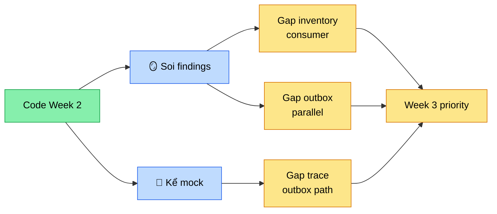

# Chương 14 · 🪞 Tấm gương soi

**Day 14 — Mock Interview Week 2 + Code Review**

---

> *"Code chỉ thật sự là của bạn khi có người ngoài hỏi: 'Em đã làm cái này như thế nào?' — và bạn trả lời được trong 60 giây mà không cần mở IDE."*

---

## Bối cảnh

Sợi chỉ đỏ Day 13 buộc xong cuối tuần 2. Sáu ngày, sáu chương, một dòng chảy: từ "Kafka là gì" đến "tại sao outbox đẹp hơn Debezium". Code chạy. Test xanh. ROADMAP tick.

Nhưng có một sự thật khó chịu mà mọi engineer self-taught đều biết: **code chạy ≠ hiểu code**. Build được không có nghĩa kể được. Kể được trong console không có nghĩa kể được trước một senior Tiki ngồi ngó chéo qua bàn.

Day 14 là tấm gương. Không có code mới. Không có doc lesson mới. Chỉ có hai việc: **soi lại** và **kể lại**.

---

## Hai việc, hai góc nhìn

Soi và kể tưởng giống nhau. Không phải.

**Soi** là review. Mở từng file Week 2. Tự hỏi: code này assume gì mà nó không nói ra? Một senior reviewer không tìm bug — bug compiler tìm. Senior tìm **assumption ngầm**. Cái mà code giả định đúng nhưng không enforce.

**Kể** là mock interview. Có người hỏi, có người trả lời. Câu hỏi không phải "định nghĩa exactly-once là gì" — câu hỏi là "bạn config acks=all + idempotence + read_committed, hệ thống đang ở semantics nào?". Câu hỏi gắn vào code đã viết. Trả lời tay run = chấm borderline. Lúng túng = fail.

Hai việc nhìn từ hai phía: **bên trong code** và **bên ngoài code**. Cả hai phải khớp.

---

## Sáu finding, một giấc mộng

Soi xong, có sáu finding. Một số đỏ, một số vàng.

```java
// inventory/OrderCreatedConsumer.java:65-71
} catch (RuntimeException ex) {
    log.warn("Reserve failed orderId={} sku={} qty={} reason={}", ...);
}
```

Catch-all. Comment Day 9 nói "tránh retry storm". Nhưng "retry storm" ép "stock hết thật" thành "mọi RuntimeException". DB down? Cũng catch. Connection mất? Cũng catch. Message ack. Message mất.

Tệ hơn: Day 11 dedup thì nhớ làm cho notification. Inventory consumer thì quên. Comment Day 9 trong code thừa nhận "Day 11 sẽ làm" — Day 11 đến rồi đi, debt vẫn ở đó. Đó là kiểu nợ tệ nhất: **nợ ẩn**. Code nói "sẽ fix", không ai theo dõi, fix không xảy ra.

Senior soi ra. Junior không.

---

## Câu Q1 — câu test mệnh đề

> *"Bạn config acks=all + idempotence + read_committed. Hệ thống đang ở delivery semantics nào?"*

Junior trả lời: *"Exactly-once!"*. Tự tin. Sai.

Senior trả lời:

> At-least-once delivery + dedup ở consumer = **exactly-once-effects**. Không phải exactly-once thật. Exactly-once thật chỉ có với Kafka transactions — `transactional.id` + `initTransactions()` + `sendOffsetsToTransaction()` — producer + offset commit trong 1 atomic tx. Project không dùng vì overhead 5-10% throughput không justify.

Khác biệt một từ. "Effects" vs "delivery". Một từ tách Senior khỏi Mid.

Đây là **brutality của mock interview**: bạn có hiểu sâu đến mức phân biệt được effect vs delivery không, hay chỉ đọc lướt blog post và nhớ buzzword?

---

## Tấm gương phản chiếu



Cả hai góc — code review và mock interview — đều dẫn về cùng một danh sách gap. Không phải tình cờ. Vì cả hai đều test cùng một thứ: **mức độ bạn hiểu chính code mình đã viết**.

Soi phát hiện inventory consumer chưa idempotent. Kể phát hiện trace E2E qua outbox path chưa verify thật. Cả hai trỏ về Week 3. Cả hai biến từ "code đã merge" thành "code biết mình ở đâu trong bản đồ".

---

## Brutally honest — định luật cuối tuần

9 strong / 1 borderline / 0 fail.

Borderline ở câu Q9: trace propagation từ HTTP qua Kafka qua consumer — mechanism kể được, nhưng **outbox path chưa verify Zipkin thật**. Day 9 verify HTTP→Kafka direct, nhưng outbox là `@Scheduled` job không inherit HTTP context. Trace có thể bị cắt. Kể as-if là cheat.

Quy tắc tự chấm: borderline không phải "trả lời được 70%". Borderline là **"trả lời được nhưng có lỗ"**. Lỗ nhỏ ở senior = fail. Tự cho điểm rộng = tự lừa.

> **Junior**: pass 7/10 = đủ.
> **Senior**: 1 lỗ = nhìn lại, fix, kể lại tuần sau.

Khác biệt không nằm ở số câu pass — nằm ở **tiêu chuẩn pass là gì**.

---

## Kết thúc ngày 14

```
day-14/
├── 6 review findings        🔴 3 / 🟡 3 / 🟢 0 — debt list cho Week 3
├── 10 mock interview Q&A    ✅ 9 strong / 🟡 1 borderline / ❌ 0 fail
├── 2 CV bullet metric-driven ✅ + elevator pitch refresh v2
├── 4 doc mới                ✅ findings + mock + cv + chapter này
└── 0 code mới               ✅ freeze trước campaign 6/6
```

> Vibe: *"Không thêm dòng code nào nhưng hiểu code mình hơn cả tuần trước."*

---

> 💡 **Senior insight**: Mock interview brutally honest **đáng giá hơn** một feature mới. Feature mới chỉ tăng code. Mock interview tăng **mức độ bạn own code đã có**. Code không own = code chỉ đang nợ. Câu trả lời lúng túng 60 giây = lời thừa nhận chưa hiểu hết. Senior khác Junior ở chỗ: senior dám tự chấm borderline và đi fix, junior tự cho strong và đi tiếp.

---

*→ Sang chương sau, Week 3 mở ra. Tốc độ trở thành chủ đề. Cache hai tầng — Caffeine cục bộ + Redis chung — sẽ phải trả lời một câu hỏi cũ kỹ nhưng chưa bao giờ dễ: "Khi data còn nóng trong RAM, có nên tin nó không?"*
