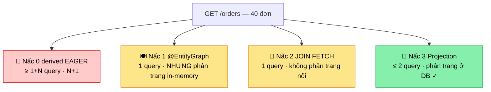

# Chương 17 · 🍽️ Anh bồi bàn chạy bộ

**Day 17 — JPA N+1 (EntityGraph · JOIN FETCH · Projection)**

---

> *"Có một loại chậm không nằm trong query nào cả. Nó nằm ở chỗ bạn hỏi quá nhiều lần. Mỗi câu hỏi nhanh như chớp — chỉ là bạn hỏi bốn mươi lần."*

---

## Bối cảnh

Chương trước, ta cầm **kính hiển vi** soi từng query, bắt quả tang con `LIKE '%kw%'` quét cạn 1 triệu dòng. EXPLAIN ANALYZE phơi bày tất cả: Seq Scan, Rows Removed, Buffers. Tưởng đã thấy hết mặt kẻ thù tốc độ.

Nhưng sáng nay anh Hùng quăng lên Slack một screenshot Datadog. Trang **"Đơn hàng của tôi"** load **3.2 giây**. Không phải 1 query chậm. Mà là **41 query nhanh**.

Kính hiển vi soi từng con query thì thấy... mỗi con đều khỏe mạnh, chạy dưới 1ms, có index đầy đủ. Không con nào "có tội". Vậy mà cộng lại thành 3.2 giây.

Đây là tên sát thủ mà kính hiển vi soi-từng-cái sẽ **bỏ sót**. Vì tội của nó không nằm ở một query. Tội của nó là **số lượng**.

Gặp gỡ anh bồi bàn nhiệt tình nhất quán ăn. 🍽️

## Anh bồi bàn và bốn mươi vòng chạy bếp

Hãy tưởng tượng bạn vào nhà hàng, gọi: *"Cho tôi xem danh sách 40 đơn gần nhất của tôi, mỗi đơn bao nhiêu món."*

Anh bồi bàn **siêu nhiệt tình** làm thế này:

1. Chạy vào bếp lấy danh sách 40 đơn. (1 vòng)
2. Nhìn đơn #1: *"À, để em hỏi bếp đơn này mấy món."* — chạy vào bếp. (vòng 2)
3. Nhìn đơn #2: chạy vào bếp lần nữa. (vòng 3)
4. ... lặp lại **40 lần**.

Tổng cộng: **1 + 40 = 41 vòng chạy**. Mỗi vòng nhanh thôi — nhưng anh ấy chạy bộ, và bếp ở cuối hành lang (network round-trip tới Postgres).

Đó chính xác là **N+1**: 1 query lấy N parent, rồi N query lấy con. Trong code nó trông ngây thơ thế này:

```java
Page<Order> page = orderRepository.findByUserId(userId, pageable); // 1 query
page.getContent().forEach(o -> o.getItems().size());               // N query — mỗi order 1 lần
```

Hibernate SQL log khai báo tội trạng:

```
select o.* from orders o where o.user_id = ? limit ?    -- vòng chạy thứ 1
select i.* from order_items i where i.order_id = ?       -- vòng 2
select i.* from order_items i where i.order_id = ?       -- vòng 3
... (× 40)
```

> ⚠️ **Bẫy chết người**: từng query đều dùng index `order_items(order_id)`, đều <1ms. APM mỗi span xanh lè. Không có "slow query" nào để kính hiển vi bắt. Latency = 41 × round-trip. Soi từng cái → vô tội. Đếm tổng số → thủ phạm.

## Vì sao anh bồi bàn lại nhiệt tình thế? Tại `EAGER`

Mở [Order.java](../../services/order-service/src/main/java/com/ecommerce/order/domain/Order.java) ra, thủ phạm ngồi chình ình:

```java
@OneToMany(cascade = CascadeType.ALL, orphanRemoval = true, fetch = FetchType.EAGER)
private List<OrderItem> items = new ArrayList<>();
```

`FetchType.EAGER`. Day 6 đặt nó vì hồi đó chỉ load **1** order/lần — bê 1 đơn kèm món thì hợp lý. Nhưng EAGER có một hiểu lầm chí mạng:

> 💡 **`FetchType` quyết định KHI NÀO load, KHÔNG quyết định CÁCH load.** EAGER nói "load ngay". Nó **không** nói "load bằng JOIN". Khi query trả về 40 root, Hibernate hiểu "load ngay từng cái" → 40 vòng chạy bếp.

Và đây là nghịch lý cay đắng: EAGER **tệ hơn** LAZY ở đây. LAZY ít ra còn cho bạn **không hỏi** (nếu màn hình không cần món thì khỏi chạy bếp). EAGER thì luôn chạy, và bạn **không tắt được** cho riêng câu query này. Anh bồi bàn EAGER bị lập trình để luôn-luôn-chạy, dù khách chỉ muốn đếm.

Bài học đầu tiên, neo vào đầu:

> 💡 **Senior vs junior**: junior nghe "N+1" liền nghĩ "tại lazy". Sai. N+1 sinh từ **load-theo-từng-root** thay vì load-theo-mẻ. EAGER cũng N+1, mà còn cưỡng bức. Collection mặc định nên để LAZY, rồi *chủ động* chọn cách nạp khi cần.

## Nấc 1 — Dạy bồi bàn bê cả mâm: `@EntityGraph`

"Anh đừng chạy 40 lần nữa. Bê **một mâm** ra đây, đơn kèm món luôn." Đó là `@EntityGraph`:

```java
@EntityGraph(attributePaths = "items")
@Query("select o from Order o where o.userId = :userId")
Page<Order> findWithItemsByUserId(@Param("userId") UUID userId, Pageable pageable);
```

Hibernate đổi sang **1 query JOIN FETCH**. Hết 41 vòng. Tưởng thắng.

Nhưng bê cả mâm + **phân trang** thì sinh chuyện. Log Hibernate nhả ra một dòng mà 9/10 dev lướt qua:

```
HHH000104: firstResult/maxResults specified with collection fetch; applying in memory!
```

Dịch ra: *"Anh dặn lấy trang đầu 20 đơn hả? Nhưng vì em bê cả mâm có món, em không cắt được ở bếp (`LIMIT` ở DB). Nên em bê **TẤT CẢ** ra phòng ăn, rồi đếm tay 20 cái đầu cho anh."*

Khách có 40 đơn thì "chạy được". Khách có **100.000 đơn** thì anh bồi bàn bê cả nhà kho ra phòng ăn → sàn sập. **OOM.** Phân trang không còn ở DB nữa — nó nhảy vào JVM heap.

> ⚠️ Đây mới là chỗ độc: `HHH000104` chỉ là **WARNING**, không phải error. Test trang nhỏ pass hết. Code review lướt qua. Nó nằm im tới ngày có ông khách mua sỉ 100K đơn thì thức dậy. *Senior đọc log. Junior đọc kết quả.*

## Nấc 2 — Ôm hết ra tay: `JOIN FETCH` (và con quái bag)

Viết tay JOIN FETCH, bỏ phân trang đi:

```java
@Query("select distinct o from Order o join fetch o.items where o.userId = :userId")
List<Order> findAllWithItemsByUserId(@Param("userId") UUID userId);
```

Đúng **1 query**. Sạch. Order chỉ có 1 collection (`items`) nên an toàn. Dùng tốt cho path "xuất toàn bộ đơn của 1 user" số lượng nhỏ.

Nhưng thử JOIN FETCH **hai** collection kiểu `List` cùng lúc — ví dụ mai mốt thêm `payments` và `statusHistory` — và Hibernate gào lên ngay lúc khởi động:

```
org.hibernate.loader.MultipleBagFetchException: cannot simultaneously fetch multiple bags
```

`List` không có thứ tự cố định = **bag**. Bê 2 mâm bag cùng lúc, anh bồi bàn không biết món nào của mâm nào (cartesian product mơ hồ). Cách gỡ:

- Đổi `List` → `Set` (Set không phải bag → hợp lệ). **Nhưng** vẫn coi chừng: 2 collection N và M phần tử JOIN ra **N×M** dòng — blow up băng thông.
- Hoặc tách nhiều query, mỗi collection một phát.

Order của ta chỉ 1 collection nên chưa nổ. Nhưng Tonny ghi cảnh báo này vào [lesson 17](../lessons/17-jpa-fetch-strategies.md) — để hôm nào ai thêm collection thứ hai thì biết con bag đang ngủ ở đâu.

## Nấc 3 — Đừng bê món nữa, chỉ ghi phiếu: Projection 🧾

Khoan đã. Quay lại câu hỏi gốc của khách: *"Danh sách đơn, **mỗi đơn mấy món**."*

Khách có cần nhìn từng món không? **Không.** Khách cần con số. Vậy sao phải bê món ra?

Đây là cú lật bàn của senior: **đừng load entity nữa.** Ghi thẳng vào phiếu những gì màn hình cần:

```java
@Query("""
        select new com.ecommerce.order.application.dto.OrderSummaryView(
            o.id, o.statusType, o.total.amount, o.total.currency,
            o.reservationStatus, o.placedAt, size(o.items))
        from Order o
        where o.userId = :userId
        """)
Page<OrderSummaryView> findSummariesByUserId(@Param("userId") UUID userId, Pageable pageable);
```

`size(o.items)` dịch sang một subquery `COUNT(*)` — bếp tự đếm món, không bê ra. Kết quả là một `record` phẳng lì, [OrderSummaryView](../../services/order-service/src/main/java/com/ecommerce/order/application/dto/OrderSummaryView.java), **không phải** entity:

```java
public record OrderSummaryView(
        UUID orderId, String statusType, long totalAmount, String currency,
        String reservationStatus, Instant placedAt, long itemCount) {}
```

Không entity. Không vào persistence context. Không dirty-checking. Không snapshot. Và quan trọng nhất: `LIMIT/OFFSET` chạy ở **DB thật** — phân trang về đúng chỗ của nó. Count query Spring tự suy ra được (`select count(o)...`) vì select clause là constructor expression đơn, không GROUP BY.

Một câu hỏi treo lơ lửng: *làm sao Tonny biết chắc nó nhanh, không chỉ "cảm giác nhanh"?* Đo. Bằng số.

## Đo bằng số, không bằng niềm tin 📏

Hibernate có sẵn cái cân: `Statistics.getPrepareStatementCount()` — đếm số JDBC statement thật sự bắn xuống DB. Tonny dựng [OrderNPlusOneIntegrationTest](../../services/order-service/src/test/java/com/ecommerce/order/OrderNPlusOneIntegrationTest.java), seed 5 đơn × 3 món, rồi cân từng nấc:

```java
private long countQueries(Statistics stats, Runnable block) {
    em.clear();      // dọn L1 cache — bắt query phải vào DB thật
    stats.clear();
    block.run();
    return stats.getPrepareStatementCount();
}
```

Và đây là bảng điểm phơi bày 4 anh bồi bàn:



Test assert thẳng tay: nấc projection `getPrepareStatementCount() ≤ 2`. Và — đây là phần Tonny thích — test nấc 0 assert **`≥ 1+N`**, tức là **bắt buộc N+1 phải tồn tại**. Vì sao lock cả chiều xấu? Để 6 tháng sau ai đọc lại test này thấy ngay "à, nấc 0 đúng là N+1 thật", không phải lý thuyết suông. Test vừa là lưới chặn regression, vừa là tài liệu sống.

41 query → **2 query**. 3.2s → ~30ms. Anh Hùng thả tim. 💚

> 💡 **Vì sao chấp nhận maintain 2 model** (`OrderSummaryView` cho đọc, `Order` cho ghi)? Vì DRY nói về *knowledge*, không phải *shape*. Màn list và detail là hai access pattern khác nhau — ép một model gánh cả hai chính là cái đẻ ra N+1. Đây là CQRS-lite, không phải over-engineer: list = projection, detail/write = aggregate. Quy tắc một dòng, dán lên tường.

## Còn một tấm lưới nữa đã giăng từ Day 3

Nhớ `open-in-view: false` ta bật từ Day 3 không? Hôm nay nó mới khoe hết giá trị. Với `open-in-view: false`, nếu ai đó lỡ tay chạm lazy collection **ngoài** transaction (lúc serialize JSON chẳng hạn), nó nổ `LazyInitializationException` **ngay lúc dev** — thay vì âm thầm chạy 40 vòng bếp lúc 3h sáng trên prod. Lỗi to còn hơn lỗi ẩn. Lưới này giăng trước 14 ngày, hôm nay mới có người rơi vào để thấy nó đỡ.

## Kết thúc ngày 17

```
Trang "Đơn hàng của tôi"
├── 🏃 Trước: 41 query, 3.2s — anh bồi bàn chạy 41 vòng bếp
├── 🧾 Sau: 2 query, ~30ms — ghi phiếu, bếp tự đếm món
├── 🪤 Gỡ 3 cái bẫy: EAGER cưỡng bức · HHH000104 in-memory · MultipleBagFetchException
├── 📏 Đo bằng Statistics.getPrepareStatementCount() — số, không phải cảm giác
├── 🧪 Test lock cả 2 chiều: projection ≤2, nấc-0 ≥1+N (chứng minh N+1 có thật)
└── 🧱 Build green · 22 unit test pass · 3 IT gated RUN_ORDER_INTEGRATION_TESTS

Vibe: "Đừng dạy bồi bàn chạy nhanh hơn. Dạy nó hỏi ít lần hơn."
```

> 🧠 **Neo phỏng vấn**: khi bị hỏi "tối ưu JPA list", đừng phun "dùng JOIN FETCH". Hãy hỏi ngược: *"màn này cần gì?"* — read-only đếm số thì projection; cần full graph thì EntityGraph; cần mutate thì load entity. Chọn fetch theo access pattern, không theo phản xạ.

---

*→ Projection đã cứu được 40 đơn. Nhưng nếu là trang 5000, mỗi trang 20 đơn thì sao? `OFFSET 100000 LIMIT 20` — Postgres vẫn phải đếm và **vứt bỏ** 100.000 dòng trước khi trả 20 dòng bạn cần. Anh bồi bàn không chạy bếp nữa, nhưng giờ anh ấy phải **đếm từ đầu hàng mỗi lần lật trang**. Ngày mai, ta dạy hệ thống cách nhớ nó đang đứng ở đâu — keyset pagination.*
