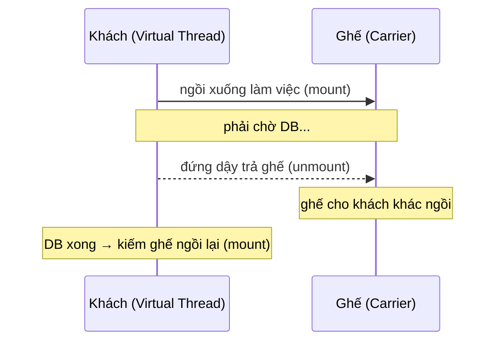
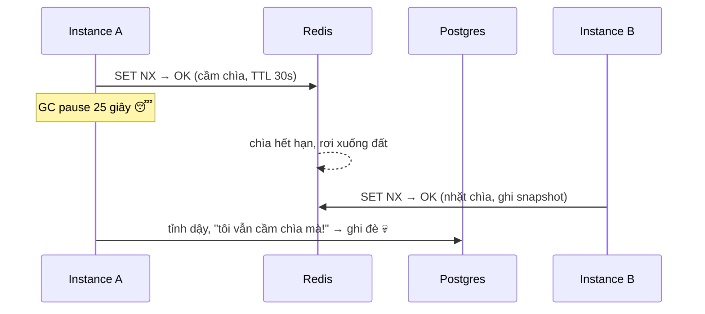

# Chương 19 · 🕺 Anh bảo vệ phòng VIP một chìa

**Day 19 — Java Concurrency (locks · Virtual Threads · distributed lock)**

---

> *"Phòng VIP chỉ có một chìa khoá. Anh bảo vệ đứng cửa, đưa chìa cho từng người. Vấn đề không phải cái chìa — mà là chuyện gì xảy ra khi người cầm chìa... ngủ quên."*

---

## Bối cảnh

Chương trước, ta học cách *xếp hàng đọc sách* — keyset pagination, lười đúng cách.
Nhưng thủ thư phục vụ từng người một thì êm. Hôm nay khác: **nghìn người cùng
lao vào một món hàng**. Không phải đọc — mà tranh. Và khi người ta tranh, tốc độ
vô nghĩa. Chỉ **trật tự** cứu được ta.

Trật tự, trong thế giới Java, có tên là **lock**. 🔒

Anh Hùng quăng cho tôi một sự cố thật: báo cáo tồn kho cuối tháng **nhân đôi**.
"Job snapshot chạy hai lần cùng lúc," anh nói. "Tụi nó dùng Redis lock rồi mà.
Sao vẫn đôi?" Tôi nhìn log. Một dòng lạnh người: `[GC pause] 24532ms` — ngay
trước dòng "writing snapshot". Cái chìa khoá đã rơi khỏi tay người cầm nó. Mà
người đó không hề biết.

Nhưng trước khi mổ con quái đó, phải hiểu mấy cái chìa khoá trong nhà đã.

## Ba anh bảo vệ, ba tính cách

Trong JVM có ba anh bảo vệ phòng VIP. Cùng một việc — cho **một người vào mỗi
lần** — nhưng tính cách khác nhau một trời một vực.

**Anh `synchronized`** — bảo vệ già, hiền, đáng tin. Ai vào anh khoá cửa, ai ra
anh tự mở (kể cả người đó té xỉu — exception — anh vẫn mở cửa dọn ra). Gọn gàng.
Nhưng anh có một tật chết người ở thời đại virtual thread: anh **ôm khư khư** cái
ghế carrier khi người bên trong ngủ. (Lát nữa kể.)

**Anh `ReentrantLock`** — bảo vệ trẻ, nhiều chiêu. Có thể gõ cửa hỏi "trống
không?" (`tryLock`), chờ 5 giây rồi bỏ đi (`timeout`), bị gọi về giữa chừng cũng
nghe (`interruptible`). Đổi lại: bạn **phải tự dặn anh mở cửa** trong `finally` —
quên một lần là phòng khoá vĩnh viễn.

**Anh `StampedLock`** — thiên tài lập dị. Anh phát hiện: *người chỉ ghé nhìn* thì
cần gì khoá cửa? Anh phát cho họ một con tem (`stamp`), cho nhìn thoải mái, lúc ra
mới hỏi "lúc nãy có ai sửa đồ trong phòng không?" (`validate`). Không ai sửa →
xong, khỏi khoá. Người xem không cản người xem. Nhanh khủng khiếp. Cái giá: anh
**không nhớ mặt** (không reentrant — bạn vào hai lần là anh khoá luôn chính bạn),
và nếu bạn quên hỏi `validate`, bạn đọc trúng món đồ ai đó đang thay dở. 🧦

Tôi không tin lời quảng cáo. Tôi đo. JMH, 8 thread, đa số chỉ ghé nhìn:

```
Benchmark                                       Mode  Cnt        Score        Error   Units
LockThroughputBenchmark.synchronizedRead       thrpt    5     7271.124 ±    814.653  ops/ms
LockThroughputBenchmark.reentrantLockRead      thrpt    5    20827.085 ±   5793.575  ops/ms
LockThroughputBenchmark.stampedOptimisticRead  thrpt    5  5623426.644 ± 654988.331  ops/ms
```

Tôi dụi mắt nhìn lại. Không phải gấp đôi. Không phải gấp mười. Anh thiên tài lập dị
thắng **gấp bảy trăm bảy mươi lần** anh già. 🤯 Vì sao kinh khủng vậy? Vì người ghé
nhìn của anh `StampedLock` **không lấy chìa, không chạm cửa** — chỉ liếc con tem.
Tám anh bảo vệ kia, mỗi lần phát/thu chìa là một lần tám cái não CPU phải hét vào
tai nhau "*tao vừa sửa chìa nhé!*" (cache-line bouncing) — cái tiếng hét đó mới là
thứ giết throughput, không phải bản thân việc khoá. Người xem không hét, nên người
xem bay. Logic optimistic read, viết đúng kiểu:

```java
long stamp = stamped.tryOptimisticRead();
int cx = x, cy = y;                  // copy RA NGOÀI trước
if (!stamped.validate(stamp)) {      // rồi mới hỏi: có ai xen vào không?
    stamp = stamped.readLock();      // có → khoá thật, đọc lại
    try { cx = x; cy = y; } finally { stamped.unlockRead(stamp); }
}
return cx + cy;
```

> ⚠️ **Cạm bẫy**: đọc field rồi mới copy *sau* `validate` = đọc trúng torn state.
> Phải copy ra local **trước**. Optimistic không phải "khỏi lo" — là "đọc xong
> kiểm tra lại". Bỏ bước kiểm tra = bug âm thầm.

> 💡 **Senior vs junior**: junior thấy "5.6M > 7K, xài StampedLock hết đi". Senior
> hỏi: *write-heavy hay read-heavy?* Con số ×770 chỉ đúng cho **read thuần** — có
> writer xen vào liên tục thì optimistic validate fail, rớt về read-lock, khoảng
> cách co lại. StampedLock không reentrant, dễ viết sai. Sai workload = nợ kỹ thuật.

## Anh bảo vệ già và cái ghế ôm khư khư 🪑

Giờ tới cái tật của anh `synchronized`. Để hiểu, phải nhớ virtual thread sống thế nào.

Virtual thread không có ghế riêng. Nó **mượn** một cái ghế (carrier — platform
thread thật) để ngồi làm việc. Khi nó phải chờ (gọi DB, gọi HTTP, `sleep`), nó
**đứng dậy trả ghế** cho người khác ngồi — *unmount*. Chờ xong, kiếm ghế khác ngồi
tiếp — *mount*. Nhờ vậy 4 cái ghế phục vụ được 10.000 vị khách hay chờ. Đó là toàn
bộ phép màu Loom.



Trừ khi... khách đang ngồi **trong khu vực anh `synchronized` canh**. Lúc đó nếu
khách phải chờ, anh **không cho đứng dậy**. "Ngồi yên đó, giữ ghế!" Cái ghế bị
*đóng đinh* — **pinning**. Một khách ngủ quên giữ một ghế. Mười nghìn khách kiểu
đó → bốn cái ghế cạn sạch → phép màu Loom tan thành mây khói. App của bạn "đã bật
virtual thread" mà chậm như chưa bật.

Tôi không kể suông. Tôi **bắt tận tay** bằng JFR — 200 khách, mỗi người chờ 50ms:

```java
synchronized (MONITOR) { sleep(50); }   // → ~200 event jdk.VirtualThreadPinned
// đổi sang:
LOCK.lock(); try { sleep(50); } finally { LOCK.unlock(); }   // → 0 event
```

Anh `ReentrantLock` không đóng đinh ai — anh để khách *park* qua `LockSupport`,
đứng dậy trả ghế bình thường. Một dòng `synchronized` đổi thành `ReentrantLock`,
pinning biến mất.

> 💡 **Interview gold**: ai đó than "bật virtual thread mà throughput không lên" —
> câu trả lời senior là *"check pinning trước"*. Một `synchronized` ôm câu JDBC
> trong hot path đủ giết toàn bộ Loom. Đo bằng JFR `jdk.VirtualThreadPinned`,
> đừng đoán. (Java 24+ JEP 491 xoá tật này — nhưng ta chạy 21, vẫn phải né.)

## Fan-out: ba việc, một hơi thở 🌬️

Còn một viên ngọc preview ở Java 21: **structured concurrency**. Trang chi tiết
sản phẩm cần ba nguồn — cart, product, inventory — độc lập. Cách cũ
`CompletableFuture.allOf` có một thói xấu: một thằng chết, hai thằng kia vẫn chạy
tới hết, như ba người yêu cũ nhắn tin lúc 2h sáng — bạn block một đứa, hai đứa
còn lại vẫn spam. 📱

`StructuredTaskScope` coi ba việc như **một hơi thở** — vào cùng nhau, ra cùng nhau:

```java
try (var scope = new StructuredTaskScope.ShutdownOnFailure()) {
    var cart      = scope.fork(cartCall);
    var product   = scope.fork(productCall);
    var inventory = scope.fork(inventoryCall);
    scope.joinUntil(deadline);   // chờ cả ba HOẶC tới hạn
    scope.throwIfFailed();       // MỘT đứa fail → hủy luôn hai đứa kia
    return new Result<>(cart.get(), product.get(), inventory.get());
}
```

Một subtask ném exception → scope **tự tay hủy** sibling. Test của tôi chứng minh:
thằng inventory ném lỗi, thằng product chậm 1 giây *không bao giờ chạy xong* — bị
cắt ngang. Fail-fast, không leak. Vào đâu, ra đó.

> ⚠️ Đây là **preview** — cần `--enable-preview`. Tôi nhốt nó trong module
> `concurrency-lab` riêng, KHÔNG cho cờ này lan ra service production (preview bit
> đóng dấu lên class → ép cả runtime phải bật cờ → rủi ro ops). Production hôm nay
> xài `CompletableFuture` fan-out; chờ API final (Java 25, JEP 505) rồi migrate.

## Người cầm chìa ngủ quên 😴💀

Giờ quay lại con quái đầu chương. Snapshot nhân đôi.

Job chạy trên nhiều instance. Mỗi sáng, chúng tranh nhau một cái chìa khoá Redis —
`SET NX`. Ai chiếm được thì làm leader, ghi snapshot. Nghe chuẩn. Nhưng:



Đây không phải lỗi Redis. Đây là lỗi **niềm tin**. Code tin rằng "chiếm được lock
= an toàn ghi". Sai. Distributed lock chỉ là **best-effort** — nó giảm trùng, nó
KHÔNG bảo đảm đúng. Khi A ngủ 25 giây, cái chìa trong tay A đã thành đồ giả mà A
không biết.

Kleppmann gọi đây là lý do "lock alone không cứu được bạn". Có người đáp "thì xài
Redlock 5 node đi" — nhưng Kleppmann cười: 5 cái chìa giả vẫn là chìa giả khi bạn
ngủ quên. Đáp án đúng không nằm ở **cái chìa**. Nó nằm ở **cánh cửa**.

## Vé số tăng dần — fencing token 🎟️

Giải pháp: mỗi lần ai đó nhặt chìa, phát kèm một **tấm vé có số tăng dần**. Cửa
(Postgres) chỉ nhớ một điều: *"số vé lớn nhất tao từng thấy"*. Ai trình vé nhỏ hơn
→ đuổi thẳng.

```java
// tryAcquire: chiếm chìa XONG, lấy vé (INCR — tăng đơn điệu, không bao giờ lùi)
Boolean ok = redis.opsForValue().setIfAbsent(lockKey, token, ttl);
if (!Boolean.TRUE.equals(ok)) return Optional.empty();
Long fencing = redis.opsForValue().increment(FENCE_PREFIX + key);
return Optional.of(new LockHandle(key, token, fencing));
```

Và cánh cửa — một câu SQL upsert cầm cân nảy mực:

```sql
INSERT INTO inventory_snapshot (...) VALUES (..., :token, ...)
ON CONFLICT (snapshot_date) DO UPDATE SET ...
 WHERE inventory_snapshot.last_fencing_token < EXCLUDED.last_fencing_token
```

A cầm vé số 10, ngủ. B nhặt chìa, lấy vé số 11, ghi trước → cửa lưu "đã thấy 11".
A tỉnh dậy trình vé 10 → `WHERE 11 < 10` sai → **0 row** → đuổi. Job log lạnh lùng:
`STALE-WRITER blocked by fence`. Split-brain bị chặn **tại cửa**, không phải tại chìa.

Còn cái chìa Redis? Vẫn giữ — nó lo phần *giảm trùng* (đỡ chạy thừa). Nhưng nó
không còn được tin để lo phần *đúng đắn* nữa. Hai lớp, hai vai. Chìa lo nhanh, vé
lo đúng.

> 💡 **Vì sao không xài luôn DB unique constraint như payment Day 10?** Vì hình
> dạng bài khác. Payment: "1 txn xử 1 lần" map thẳng vào 1 key → constraint là đủ.
> Snapshot job: cần serialize *cả đoạn xử lý* không map vào 1 key → cần lock. Chọn
> vũ khí theo **hình dạng invariant**, không theo "cái nào mạnh nhất".

> ⚠️ **Hai lỗi junior + AI chắc chắn mắc**: (1) benchmark không warmup → đo trúng
> lúc JIT chưa nóng → kết luận sai gấp 10 lần; (2) "chiếm lock = ghi an toàn" → bỏ
> fencing → đúng con quái này. Review code lock, soi đúng hai chỗ đó.

## Kết thúc ngày 19

```
Day 19 — Concurrency
├── 🔒 Lock benchmark ........ synchronized 7K / ReentrantLock 21K / StampedLock optimistic 5.6M ops/ms (×770 — không acquire lock)
├── 🪑 Pinning .............. synchronized ~200 pin · ReentrantLock 0 (JFR chứng minh)
├── 🌬️ Structured fan-out .... ShutdownOnFailure, fail-fast hủy sibling — 2 test xanh
├── 🎟️ Distributed lock ...... SET NX + Lua release + fencing token (common-lib)
├── 💀 Issue 19 ............. GC-pause split-brain → fence reject stale writer
├── 🧪 Build ................ common-lib + concurrency-lab + inventory xanh
└── 📚 Docs ................. 19 / 19b / 19c (fill) + issue 19 + interview + chương này

Vibe: "Cái chìa có thể rơi. Nhưng vé số thì không bao giờ lùi."
```

> 💡 **Bài học xuyên ngày**: ba anh bảo vệ trong nhà (JVM lock), một anh ngoài
> đường (distributed lock). Anh trong nhà — chọn theo tính cách + workload + đừng
> để pin VT. Anh ngoài đường — đừng bao giờ tin chìa khoá; tin **cánh cửa** (fencing).

---

*→ Chương sau: ta đã có lock đúng, VT không pin, fan-out gọn. Nhưng tất cả mới
chỉ là **lý thuyết trên máy một người**. Ngày 20, ta nã **k6** vào hệ thống —
nghìn user ảo cùng đặt hàng — và xem cái gì gãy trước. Tốc độ thật, không phải lời hứa.*
