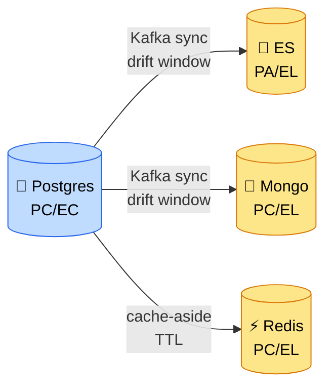

# Chương 24 · 🧰 Bốn món đồ nghề và gã chỉ thích cầm búa

**Day 24 — SQL vs NoSQL vs ES: Decision Matrix**

---

> *"Đưa thằng bé một cái búa, cả thế giới bỗng hóa thành đinh. Nó đóng đinh cái bàn — chuẩn. Đóng đinh con ốc — méo ốc. Đóng đinh ly nước — vỡ ly. Đóng đinh con mèo — thôi đừng. Cái búa không có lỗi. Lỗi ở chỗ nó là món **duy nhất** trong tay."*

---

> 🎬 **Chương này có gì:** một hộp đồ nghề bốn ngăn, một gã thợ chỉ thích cầm búa, một cái bảng treo tường để cãi với sếp, hai chữ cái mà ai cũng quên (E và L), và một câu hỏi của anh Khải làm cả phòng họp im phắc. Không có dòng code mới nào — nhưng có thứ đắt hơn code: **biết khi nào KHÔNG viết nó.** 🧠

---

## Bối cảnh

Cuối chương trước, bác thư ký tốc ký vừa chép xong cuốn sổ trắng (ch.23). Hệ thống đếm
được **bốn cái kho**: sổ gốc kẻ ô (Postgres 🐘), bộ nhớ chớp nhoáng (Redis ⚡), mục lục
lật-ngược (Elasticsearch 🔎), cuốn sổ trắng (MongoDB 🍃). Bốn kho, bốn tính nết. Đẹp.

Nhưng anh Khải đã cảnh báo ngay từ cliffhanger: **đẹp cũng là lúc nguy hiểm nhất.** Bốn
cái búa trên bàn, và con người ta có thói quen cầm cái búa quen tay đập mọi cái đinh.

Sáng thứ Hai, sprint planning. Một bạn dev trẻ — gọi là **Hùng-búa** 🔨 — đứng lên,
slide đẹp, giọng tự tin: *"Em đề xuất move `orders` với `stock` sang MongoDB. Mongo nhanh
hơn, linh hoạt hơn, scale ngang dễ. Bỏ Postgres cho gọn."*

Cả phòng gật gù. Slide đẹp mà. Anh Khải không gật. Anh quay sang bạn — Tech Lead — và nói
một câu mà bạn sẽ nghe đi nghe lại suốt sự nghiệp:

> 🗣️ *"Trước khi anh duyệt — em nói cho anh nghe, dựa vào **cái gì** để chọn kho. Đừng nói 'nhanh'. Đừng nói 'linh hoạt'. Nói anh nghe **access pattern**."*

Hôm nay không build gì. Hôm nay bạn phải **treo một cái bảng lên tường** — bảng quyết định —
để lần sau Hùng-búa (và chính bạn) không cầm nhầm đồ nghề.

---

## 🔨 Luật của cái búa: vì sao "Mongo cho nhanh" là cái bẫy

Có một định luật tâm lý cũ rích tên là *law of the instrument* — **luật của cái búa**:
*"Nếu thứ duy nhất bạn có là cái búa, mọi thứ trông như cái đinh."* Hùng-búa không ngu.
Hùng-búa chỉ vừa học Mongo tuần trước, thấy nó bóng loáng, và giờ nhìn đâu cũng thấy
"chỗ này nhét Mongo được".

Vấn đề của câu *"Mongo nhanh hơn"* không phải nó sai. Là nó **thiếu vế**. Nhanh hơn — ở
đâu? Đo bằng gì? Cho access pattern nào?

```
"Mongo nhanh hơn"          → nhanh hơn ở write-heavy schemaless single-doc. OK.
"nên dùng cho order"       → order cần ACID + invariant cross-document. ❌ SAI VẾ.
```

Order với stock là loại data gì? Bạn lật lại hồ sơ Day 4 — cái pháo đài invariant:

- Status transition phải đúng luật (`PENDING → PAID`, không nhảy cóc).
- `amount ≥ 0`. `reserved ≤ quantity`. **Ba invariant.**
- Nhiều người mua cùng một SKU. **Concurrency thật.**
- Order + items + outbox phải ghi trong **một transaction**. **Atomicity cross-entity.**

Đây *chính xác* là ba tiêu chí đã chọn DDD-trên-Postgres ở [ADR-003](../decisions/003-ddd-for-order-inventory-payment.md).
Đẩy sang Mongo nghĩa là gì? Mongo single-doc atomic — ngon cho *một* document. Nhưng
invariant của bạn nằm *vắt qua nhiều document*. Muốn bao? Phải bật **multi-doc transaction**
trên replica-set. Tức là... 🥁

> 💡 **Cú twist:** để cứu vãn migration sang Mongo, bạn phải dựng lại đúng cái transaction
> mà Postgres cho **free**. Bạn dùng Mongo để **giả làm Postgres**, chậm hơn, phức tạp hơn.
> Một vòng tròn vô nghĩa. Đây là dấu hiệu kinh điển của cầm-nhầm-đồ-nghề: bạn phải *chống lại*
> bản chất của công cụ để ép nó làm việc của công cụ khác.

Bạn nói với Hùng-búa, nhẹ thôi: *"Stock mà chạy concurrency test 100 thread no-oversell
trên Mongo single-doc là **rớt ngay**. Cái test đó là red line. Chưa pass thì chưa bàn migrate."*

Chi tiết "incident suýt xảy ra" này: [issue 24](../issues/24-cargo-cult-storage-migration.md).

---

## 🧰 Mở hộp đồ nghề: bốn ngăn, bốn việc

Thay vì cãi tay đôi, bạn mở hộp đồ nghề ra cho cả phòng nhìn. Bốn ngăn, mỗi ngăn một món,
mỗi món sinh ra cho một loại đinh:

| 🧰 Món | Là gì | Đóng loại đinh nào | Trong repo |
| --- | --- | --- | --- |
| 🐘 **Cờ-lê chỉnh lực** | Postgres — vặn chặt, đo được lực (ACID) | Data có invariant, quan hệ, cần "vặn đúng số" | order · payment · stock · product |
| ⚡ **Dao bấm** | Redis — rút ra cái *tách*, dùng xong gập lại | Việc nhanh, tạm, có hạn dùng (TTL) | cart · cache L2 · session · lock |
| 🍃 **Băng keo vạn năng** | Mongo — dán hình gì cũng được | Hình dạng đa biến, dán nhiều, gỡ ra phân tích | analytics event · catalog read-model |
| 🔎 **Kính lúp dò chữ** | ES — đọc được cả chữ mờ, chữ sai | Tìm chữ trong đống giấy, đoán ý (relevance) | product search |

Cờ-lê không dán được hình. Băng keo không vặn được lực. Kính lúp không giữ được tiền. Mỗi
món **giỏi đúng một việc và dở mọi việc khác** — đó không phải khuyết điểm, đó là *thiết kế*.

Và đây là cái bảng bạn treo lên tường — **decision matrix**, 8 cái đinh × 4 món đồ nghề.
✅ = món chính, 🟡 = tạm được (có giá), ❌ = đừng-có-dại:

| Cái đinh (access pattern) | 🐘 | ⚡ | 🍃 | 🔎 |
| --- | --- | --- | --- | --- |
| Order + Payment (invariant, tiền) | ✅ | ❌ | 🟡 | ❌ |
| Stock reservation (concurrency) | ✅ | 🟡 | ❌ | ❌ |
| Cart (ephemeral, TTL) | 🟡 | ✅ | 🟡 | ❌ |
| Session / token | 🟡 | ✅ | ❌ | ❌ |
| Full-text search (relevance) | 🟡 | ❌ | ❌ | ✅ |
| Flexible attributes (đa hình) | ✅ | ❌ | 🟡 | ❌ |
| Analytics event (ghi nhiều, TTL) | 🟡 | ❌ | ✅ | 🟡 |
| Hot-read cache | ❌ | ✅ | ❌ | ❌ |

> ⚠️ **Mẹo đọc bảng:** đừng đọc ô ✅. Ai cũng đọc được ô xanh. Đọc **ô vàng** 🟡 — đó là
> nơi interviewer phục kích. Ô (Flexible attributes, Mongo) = 🟡 chứ không ✅. *"Mongo sinh
> ra cho schemaless mà, sao lại vàng?"* — câu đó làm rớt khối người. Trả lời ở ngay dưới.

Bản đầy đủ kèm reasoning từng ô: [lesson 24](../lessons/24-sql-vs-nosql-vs-es-decision-matrix.md).

---

## 🤨 Câu hỏi làm cả phòng im: "Sao không Mongo luôn cho attributes?"

Anh Khải chỉ vào ô vàng. *"Đây này. Em để flexible product attributes ở **Postgres JSONB**
(Day 3), trong khi Mongo nằm ngay đó, sinh ra để làm đúng cái đó. Mâu thuẫn không? Defend đi."*

Phòng họp im phắc. Hùng-búa hơi nhếch mép — tưởng bắt được lỗi.

Bạn thở ra, và đếm **ba** ngón tay 🖐️ (senior luôn đếm, nhớ chứ?):

> **Một** — query attribute hiện tại *đơn giản*. `attributes->>'screen_size'` + một cái
> GIN index là xong. Chưa cần aggregation pipeline nặng. Cờ-lê Postgres vặn được con ốc này,
> chưa cần tới băng keo.
>
> **Hai** — và đây là bài học máu từ ch.22 — đẩy attribute sang Mongo nghĩa là thêm **một
> dual-write nữa, một sync drift nữa**. Mỗi cái phô-tô là một cơ hội lệch bản gốc. Em vừa
> mới đau cái drift ES xong, không tự rước thêm cái thứ hai khi chưa cần.
>
> **Ba** — Mongo *vẫn có mặt* trong hệ. Nhưng nó là **catalog read-model derived**, không
> phải nơi ghi gốc. Postgres giữ truth, Mongo chép lại để đọc. Em không vứt băng keo đi — em
> để nó đúng ngăn.

Rồi bạn thêm câu chốt — cái làm senior khác junior:

> *"Và đây là **ngưỡng đảo chiều**: nếu mai mốt attribute bùng nổ shape, cần aggregate phức
> tạp trên chính các field đó — lúc ấy Mongo làm primary cho catalog mới đáng. Em sẽ đo, thấy
> số, rồi đổi. Hôm nay chưa tới ngưỡng. JSONB thắng."*

Anh Khải gật. *"Đúng. Quyết định không phải 'đúng mãi mãi'. Nó đúng **trong ngưỡng**. Em
nói được cái ngưỡng — anh tin em hiểu, không phải học vẹt."*

> 💡 **Senior vs junior, một câu:** junior nói *"chọn X vì X tốt"*. Senior nói *"chọn X vì
> access pattern Y, hy sinh Z, và đây là **ngưỡng** mà em sẽ đổi sang W."* Cái ngưỡng đảo chiều
> là chữ ký. Không có nó, bạn chỉ đang đọc lại blog.

---

## 🔤 Hai chữ cái ai cũng quên: PACELC

Anh Khải chưa tha. Đòn cuối: *"CAP theorem. Mongo là CP hay AP?"*

Đây là câu mọi người trả lời *"AP, vì NoSQL mà"* — và sai. Bạn không cắn câu.

> *"Mặc định **CP** ở vế partition — write phải tới primary. Nhưng anh ơi, câu hỏi này
> **thiếu vế**. CAP chỉ nói chuyện lúc mạng đứt — mà mạng đứt hiếm lắm. Em trả lời bằng
> **PACELC**."*

Bạn vẽ lên bảng:

```
P (Partition)?  → A hay C    ← chuyện ngày bão, hiếm
E (Else)?       → L hay C    ← chuyện ngày nắng, 99.9% thời gian
```

> *"**P**artition thì chọn A hay C. **E**lse — lúc *không* đứt mạng — chọn **L**atency hay
> **C**onsistency. Vế ELC mới là cái em sống cùng mỗi ngày. Mongo là **PC/EL**: lúc thường nó
> ưu tiên latency, đọc secondary nhanh nhưng có thể stale. Em kéo về EC được bằng
> `writeConcern=majority` — nhưng **trả bằng latency**. Trong project, analytics em để EL, vì
> đếm xấp xỉ là đủ."*

Bốn cái kho, xếp theo PACELC:



> 💡 **Quy luật vàng nhìn ra từ cái sơ đồ:** *mọi derived store đều là EL.* Bất cứ thứ gì
> sync async từ source of truth — ES, Mongo read-model, Redis cache — đều hy sinh consistency
> lấy latency. Và bạn **phải đo cái window đó**, đừng giả vờ nó bằng 0. Đó là bản chất của
> polyglot persistence — món chính của chương sau.

Chi tiết hai chữ E và L: [lesson 24b](../lessons/24b-cap-pacelc-in-practice.md).

---

## Kết thúc ngày 24

```
📊 Scorecard:
├── 🆕 Code:          0 dòng service mới (đúng kế hoạch — day của cái đầu, không phải bàn phím)
├── 🧰 Decision matrix: 8 use case × 4 storage, mỗi ô có verdict + ngưỡng đảo chiều
├── 📏 5 axis:        consistency · schema · query · scaling · ops cost
├── 🔤 PACELC:        Postgres PC/EC · Mongo PC/EL · ES PA/EL · Redis PC/EL
├── 🔨 Anti-pattern:  3 cái (Mongo-cho-invariant · Postgres-EAV · ES-làm-primary)
├── 🗺️ Diagram:       system-overview tô màu 4 storage paradigm
├── 📚 Docs:          lesson 24 + 24b · issue 24 · interview day-24
└── Vibe:            "Cái búa không có lỗi. Lỗi là nó nằm một mình trong tay." 🧰
```

> 💡 **Bẫy phỏng vấn kinh điển:** *"Khi nào dùng NoSQL?"*
>
> **Strong answer:** Không phải "khi data lớn". Mà khi **access pattern** không hợp relational —
> cần full-text relevance (ES), cần TTL + tốc độ ephemeral (Redis), cần schema đa hình + ghi
> nhiều để phân tích (Mongo). Mặc định vẫn là Postgres; chỉ rời đi khi *đo được* access pattern
> cụ thể. Và mọi thứ ngoài Postgres đều là **derived view** — source of truth không nhân bản.
>
> 🪤 **Follow-up trap:** *"Nhưng project anh có 4 storage, không sợ vận hành cực à?"* → Sợ chứ.
> Mỗi storage thêm = **+1 failure mode + 1 sync drift**. Nên em chỉ thêm khi access pattern thật
> sự khác — không vì CV cần dòng "MongoDB". Đó là ranh giới giữa polyglot **đúng** và polyglot
> **gone wrong**.

---

*→ Bốn món đồ nghề đã có. Bảng quyết định đã treo. Nhưng treo bảng xong mới lộ ra câu hỏi
khó hơn: bốn cái kho cùng giữ data, vậy **ai làm chủ cái gì**? Khi Postgres sửa một dòng,
ai có nghĩa vụ cập nhật theo, theo chiều nào, trễ bao lâu? Và nếu một kho **chết** giữa đêm —
hệ thống còn đứng được không? Chương 25: tấm bản đồ chủ quyền dữ liệu, và nghệ thuật để
"polyglot" không biến thành "poly-mess".* 🗺️
</content>
