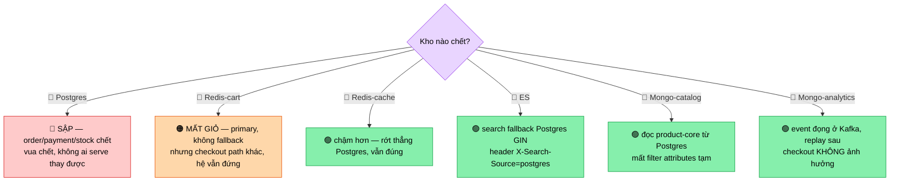

# Chương 25 · 🗺️ Tấm bản đồ chủ quyền

**Day 25 — Polyglot Persistence: Data Ownership & Anti-patterns**

---

> *"Bốn cái kho không nguy hiểm. Nguy hiểm là bốn cái kho mà không kho nào chịu nhận mình là vua. Lúc đó bạn không có 'polyglot persistence' — bạn có **loạn mười hai sứ quân**, mỗi ông một cuốn sổ, không ông nào chịu sai."*

---

> 🎬 **Chương này có gì:** một tấm bản đồ vẽ ấn tín ai giữ, một câu hỏi của anh Khải làm Tuấn-búa
> chột dạ lần hai, ba kỷ luật để bốn vùng đất không đánh nhau, một đêm giả định Elasticsearch tắt
> thở lúc 9h sáng, và một sự thật phũ: *cùng một Redis, hai vai, hai số phận khi chết.* Vẫn không
> một dòng service code mới — nhưng có một tấm bản đồ mà thiếu nó thì 6 tháng nữa cả team lạc đường. 🧭

---

## Bối cảnh

Cuối chương trước, cái hộp đồ nghề bốn ngăn đã mở, cái bảng quyết định đã treo lên tường. Tuấn-búa
thôi đòi đóng đinh con ốc bằng búa. Đẹp.

Nhưng anh Khải — EM ex-Tiki, người chưa bao giờ gật khi chưa nghe đủ — gọi Tonny vào phòng họp
lần nữa. Lần này không cầm slide. Anh cầm một tờ giấy trắng.

> 🗣️ *"Em chọn đúng kho rồi, anh tin. Giờ câu khác. Bốn cái kho cùng giữ data của một sản phẩm: Postgres
> có, Elasticsearch có, Mongo có, Redis có. Anh hỏi em **một** câu thôi — sản phẩm đó, **gốc** nằm ở đâu?
> Khi giá đổi, ai sửa trước, ai chép theo, chép trễ bao lâu? Và" — anh gõ bút xuống bàn — *"nếu nửa đêm
> một kho chết, hệ thống của em còn đứng được không, hay đổ rạp như domino?"*

Đây không phải câu hỏi code. Đây là câu hỏi **chủ quyền**. Bốn vùng đất, ai làm vua, ai làm chư hầu,
ai nộp cống cho ai. Hôm nay Tonny không build. Hôm nay Tonny vẽ **bản đồ chủ quyền** — để bốn vùng đất
không biến thành loạn sứ quân.

---

## 👑 Ai là vua: phân loại bốn vùng đất

Phản xạ đầu tiên của junior: *"Cả bốn đều giữ data của product, nên cả bốn đều... ngang nhau?"* Sai.
Trong một vương quốc lành mạnh, **chỉ một người giữ ấn tín**. Số còn lại chép chiếu chỉ.

Tonny vẽ lên giấy, chia ba hạng — và đây là chỗ tinh tế nhất cả chương:

```
👑 VUA (source of truth)        → Postgres: order · payment · stock · product-core · user
                                   ấn tín nằm đây. Sửa gì sửa ở đây trước.

📜 CHƯ HẦU (derived, chép lại)  → ES (search) · Mongo (catalog) · Redis (cache L2)
                                   chỉ chép chiếu chỉ từ vua. Không tự ra luật.

🏴 LÃNH ĐỊA RIÊNG (đặc biệt)    → Redis-cart (PRIMARY — tự trị, không phải chư hầu của ai)
                                   Mongo-analytics (SINK — sử quan chép biên niên, không chép từ vua)
```

Hai cái cuối là bẫy. Ai cũng tưởng "ngoài Postgres = cache = chép lại". Sai hai chỗ:

- **Cart trên Redis là vua của chính nó** 🏴 — không có bảng `cart` ở Postgres để fallback. Giỏ hàng
  ghi gốc thẳng vào Redis (HINCRBY atomic, TTL 7 ngày). Redis chết = giỏ mất thật, không chép lại từ đâu được.
- **Analytics trên Mongo là sử quan** 📖 — nó không chép một bảng Postgres nào để giữ khớp 1-1. Truth của
  nó **chính là dòng event** (append-only). Mất vài event = đếm lệch chút, *chấp nhận* (đã chốt từ ch.23).

> ⚠️ **Bẫy phỏng vấn số một của chương này:** gộp Redis-cart và Mongo-analytics vào nhóm "cache/derived".
> Cùng một câu hỏi *"Redis chết thì sao?"* — cache-Redis chết là degrade nhẹ, cart-Redis chết là **mất data**.
> Một công nghệ, hai vai, hai số phận. Senior tách được; junior trả lời chung chung rồi rớt.

Bản đầy đủ — owner, derived?, sync edge, window — nằm ở [data-ownership-map](../architecture/data-ownership-map.md).
Đó là tấm bản đồ Tonny dán lên tường, để 6 tháng nữa người mới vào không phải đoán.

---

## 📜 Chư hầu chép chiếu chỉ thế nào: đừng để hai sứ giả cùng phi ngựa

Anh Khải hỏi tiếp, mắt nhíu: *"Postgres sửa giá. Làm sao ES với Mongo biết? Em ghi thẳng cả ba nơi à?"*

Đây là cái bẫy tên **dual-write** — và Tonny đã bị nó cắn một lần ở ch.13, đau tới giờ.

```
❌ Hai sứ giả cùng phi ngựa (dual-write):
   save(Postgres)        ← sứ giả 1 phi đi
   esClient.index()      ← sứ giả 2 phi đi
   // ngựa sứ giả 2 gãy chân giữa đường (crash) → ES không bao giờ nhận chiếu
   //  → Postgres nói giá 100, ES nói giá 90, MÃI MÃI. Không ai biết.
```

Không có phép thuật nào ghi atomic vào hai vương quốc khác nhau. Nên Tonny làm thế này — **một** sứ giả,
một con đường, có sổ ghi:

```
✅ Một chiếu, một đường truyền, có biên nhận:
   save(Postgres)  ─┐ cùng một transaction
   record(outbox)  ─┘ (order: OutboxRelay @Scheduled + SKIP LOCKED — ch.13)
        └→ Kafka product.upserted (key=productId, giữ thứ tự)
              ├→ group "-indexer"  → ES   (chép cho ông thầy bói)
              └→ group "-catalog"  → Mongo (chép cho bác thư ký)
```

Một event `product.upserted` phi ra, **hai** chư hầu cùng nghe — mỗi ông một consumer group, ông này
fail/replay không ảnh hưởng ông kia. Product dùng `afterCommit publish` (write rate thấp, có reindex bù);
order dùng outbox thật (không được phép mất). Khác nhau ở mức độ nghiêm — và Tonny nói được *vì sao* mỗi cái.

> 💡 **Một bài học, ba lần học:** cái đau dual-write ở ch.13 (outbox), drift ES ở ch.22 (ông thầy bói đọc
> bản phô-tô lệch), drift catalog ở ch.23 — **cùng một bài**. Không ghi atomic được hai hệ. Chọn một vua,
> mọi chư hầu chép qua **một** đường async đo được. Đó là xương sống của polyglot làm đúng.

---

## ⏳ Chép trễ bao lâu: "chắc là nhanh" không phải câu trả lời

*"Chép trễ bao lâu?"* — anh Khải gõ bút. Tonny biết tỏng cái bẫy: ai trả lời *"chắc là nhanh thôi anh"*
là rớt. Eventual consistency không phải lời hứa *"rồi sẽ khớp"*. Nó là *"lệch trong một **window** —
và em **đo** được cái window đó."*

| Đo cái gì | Bằng công cụ | Số bình thường |
| --- | --- | --- |
| Độ trễ chép (Postgres→derived) | Kafka consumer lag | ~1-2 giây |
| Lệch bao nhiêu doc | `GET /admin/search/drift` (so id-set) | ≈ 0 ngoài window |
| Chữa lệch | `POST /admin/search/reindex` (chép lại từ vua) | reindex on-demand |

Và — đây là câu chốt — *window acceptable tùy việc*. Search lệch 1-2s: **OK**, không ai chết vì sản phẩm
mới xuất hiện chậm hai giây. Nhưng order/stock thì **KHÔNG eventual** — đó chính là lý do chúng ở Postgres
ACID, làm vua, không làm chư hầu. Mọi chư hầu là **EL** (PACELC — ch.24): chép async = hy sinh consistency
lấy latency. Tonny sống với điều đó, miễn là **đo** nó.

> 💡 **Senior vs junior, một câu:** junior nói *"hệ em đồng bộ"*. Senior nói *"hệ em eventual với window
> ~1-2s, đo bằng consumer lag, reconcile bằng reindex từ source of truth, và đây là use case nào chịu được
> window đó, use case nào không."* Drift *trong* window là tính năng. Drift *im lặng, không đo* mới là bug.

---

## 🌃 Đêm Elasticsearch tắt thở: ai sập, ai đứng

Đòn cuối của anh Khải, giọng thấp xuống như kể chuyện ma: *"9 giờ sáng thứ Hai, flash sale. Một cái kho
chết. Hệ em đổ tới đâu?"*

Đây là lúc cái phân loại vua/chư hầu/lãnh-địa ở đầu chương **trả tiền**. Vì degrade behavior bám vào *vai*,
không bám vào *công nghệ*:



Tonny trả lời gọn: *"Chỉ **một** kho chết làm sập hệ — Postgres, vì nó là vua. Đó là lý do **duy nhất** kho
phải có HA thật (Multi-AZ). Còn lại đều degrade: ES chết → search rớt về Postgres GIN (ch.22 đã làm sẵn,
có header `X-Search-Source` để biết đang ăn bản dự phòng). Mongo-catalog chết → đọc product-core thẳng từ
Postgres. Mongo-analytics chết → event đọng ở Kafka, lên thì replay, khách mua hàng không hề biết. Redis-cache
chết → cache miss, chậm hơn, vẫn đúng."*

Anh Khải: *"Còn Redis-cart?"* — câu bẫy.

Tonny không cắn: *"Cart mất, anh ạ. Nó là **primary**, không có Postgres backing để fallback. Nhưng — TTL
giỏ vốn dĩ 7 ngày, nó ephemeral từ đầu. Khách thêm lại giỏ. Checkout path không phụ thuộc Redis-cart. Hệ
**đứng**, chỉ giỏ trống."*

> ⚠️ **Triết lý cả team 6 người sống được:** chư hầu **chấp nhận degrade thay vì HA đắt**. Bạn không nuôi
> nổi bốn cluster full-HA, và *không cần*. Chỉ vua (Postgres) đầu tư HA thật. Nếu lỡ để app hard-depend vào
> chư hầu (tắt ES mà cả site 500) → đó là **thiết kế sai**, phải sửa cho degrade. "Derived store chết = degrade,
> không phải outage" là **tiêu chí thiết kế**, không phải may rủi. Cách verify: chủ động tắt ES/Mongo trong
> staging, xem fallback có chạy không.

---

## 🏴 "Một service một database" — câu bị hiểu sai nhiều nhất

Trước khi đóng họp, Tuấn-búa vớt vát: *"Nhưng microservice phải 'một service một database' mà anh. Sao
nhiều service em xài chung Postgres?"*

Tonny cười: *"Câu đó nói về **chủ quyền**, không nói về **công nghệ**. Rule thật là: **không service nào
được query thẳng DB của service khác** — muốn data thì gọi Feign hoặc nghe Kafka. Nó KHÔNG bắt mỗi service
phải có một *loại* DB riêng cho 'trông hiện đại'. Nhiều service chung engine Postgres, mỗi service một schema/ownership
— hoàn toàn đúng chuẩn. Em thêm Mongo, ES là vì **đo được access pattern khác**, không phải vì mỗi đứa cần
một kho cho oai."*

Đây chính là anti-pattern số 5 trong [lesson 25](../lessons/25-polyglot-persistence-anti-patterns.md) —
nhầm *ownership boundary* với *technology diversity*. Thêm Cassandra chỉ để "có thêm NoSQL" = cargo-cult
(ch.24, [issue 24](../issues/24-cargo-cult-storage-migration.md)): gánh +1 failure mode + 1 sync drift mà
chẳng được gì.

---

## Kết thúc ngày 25

```
📊 Scorecard:
├── 🆕 Code:          0 dòng service mới (đúng kế hoạch — day vẽ bản đồ, không gõ phím)
├── 🗺️ Ownership map: 4 store × 3 hạng (vua / chư hầu / lãnh-địa-riêng) + sync edge + window
├── ⚠️ Anti-pattern:  6 kiểu (dual-write · no-source-of-truth · derived-as-primary ·
│                      drift-im-lặng · "1-service-1-DB"-giáo-điều · ops-sprawl)
├── 🔥 Failure-mode:  ma trận 6 store-down → chỉ Postgres hard-fail, còn lại degrade
├── 📏 Kỷ luật:       1 source of truth · không dual-write · đo+reconcile được
├── 📚 Docs:          data-ownership-map · lesson 25 · interview day-25 · week-04 CV bullets
└── Vibe:            "Bốn kho không loạn — vì có một tấm bản đồ ghi rõ ai là vua." 🗺️
```

> 💡 **Bẫy phỏng vấn chốt Week 4:** *"Hệ anh có 4 storage — làm sao tránh nó thành mớ hỗn độn?"*
>
> **Strong answer:** Không phải nhờ *ít* store — nhờ **ba kỷ luật**. (1) Một source of truth: Postgres giữ
> mọi data có invariant/tiền; ES/Mongo/Redis-cache là chư hầu chép lại, viết ra ownership-map để không ai
> nhầm. (2) Không dual-write: mọi sync đi qua *một* kênh async (outbox/event), không ghi thẳng hai nơi. (3)
> Đo + reconcile: mỗi chư hầu có drift metric + reindex + alert. Polyglot hỏng không vì *nhiều* kho — vì
> thiếu một trong ba kỷ luật đó.
>
> 🪤 **Follow-up:** *"Một công nghệ đóng hai vai thì sao — Redis vừa cart vừa cache?"* → Tách theo **vai**,
> không theo công nghệ. Cart-Redis là primary (chết = mất data), cache-Redis là derived (chết = degrade).
> Cùng Redis, hai blast radius. Ai trả lời chung "Redis chết thì cache miss thôi" là bỏ sót cái giỏ hàng.

---

*→ Bốn tuần. Pháo đài invariant, đường ống Kafka, lưới an toàn, tầng tầng cache, bốn cái kho và một tấm
bản đồ chủ quyền. Hậu trường đã dựng xong — chắc, sâu, đo được. Nhưng có một sự thật phũ phàng: **suốt
25 chương, chưa một con người thật nào nhìn thấy nó.** Không một cái nút bấm, không một ô tìm kiếm, không
một cái giỏ hàng hiện ra trên màn hình. Sân khấu lộng lẫy, đèn đã bật — mà rèm chưa kéo. Chương 26: lần
đầu tiên hệ thống **có một khuôn mặt** — React dựng lên, và backend bốn tuần cuối cùng cũng được ai đó
chạm vào bằng con trỏ chuột.* 💻
