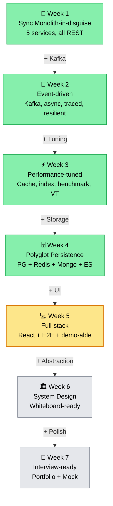

# 🔮 Những chương chưa kể — Preview Day 26→40

> *"Đã đi hết Week 1 (nền móng), Week 2 (Kafka), Week 3 (tốc độ) và Week 4 (polyglot). Câu chuyện qua được hơn 60% chặng đường. Phần còn lại — frontend, system design, final mock — vẫn ở phía trước."*

> 📚 Day 1–25 đã có **chương đầy đủ** — xem [mục lục](./README.md). File này chỉ giữ preview cho **Day 26→40**; mỗi day xong, một mục ở đây sẽ "tốt nghiệp" thành chương thật.

---

## Phần V — Frontend (Week 5, Day 26-30)

> *"Backend engineer viết frontend giống như đầu bếp Pháp nấu phở — biết nguyên lý, nhưng thiếu muscle memory."*

React 18 + TypeScript + TanStack Query v5 + Ant Design. Đủ để **demo end-to-end** trong portfolio review. Không phải FE showcase.

Highlight: optimistic update (cart add item → UI update ngay, rollback nếu server fail), infinite scroll (cursor pagination — nối thẳng keyset của ch.18), SSE real-time order status.

---

## Phần VI — System Design (Week 6, Day 31-37)

> *"Code là implementation. Design là thinking. Phỏng vấn senior đo thinking, không đo typing speed."*

7 bài whiteboard classic:

| Day | Problem | Key insight |
|-----|---------|-------------|
| 31 | Capacity estimation | Numbers every engineer should know |
| 32 | Homepage feed (Tiki/Shopee) | Fan-out write vs read, pre-compute vs on-demand |
| 33 | Flash sale | Redis Lua atomic decrement + queue + fairness |
| 34 | Notification at scale | Priority queue + provider failover + rate limit |
| 35 | Search autocomplete | Trie vs ES suggester vs Redis sorted set |
| 36 | Payment reconciliation | Double-entry bookkeeping + exception flow |
| 37 | Distributed rate limiter | Token bucket + sliding window + Redis Lua |

---

## Phần VII — Final (Week 7, Day 38-40)

> *"40 ngày. Từ thư mục trống đến distributed system. Từ 'tôi biết Spring Boot' đến 'tôi thiết kế hệ thống chịu 100k QPS'. Giờ là lúc đóng gói và ra trận."*

CV bullets compiled. Portfolio polished. Mock interview — brutally honest, no mercy. Retrospective: gì work, gì waste, gì cần ôn thêm.

---

## 📈 Evolution Arc — tóm tắt 1 hình

---

> *Câu chuyện còn dài. Mỗi ngày là một chương mới. Mỗi chương là một bước tiến hóa.*
>
> *Quay lại đây sau mỗi day — chương mới sẽ được viết.*
