# 🏗️ Biên niên sử của một Ecommerce Platform

> *Câu chuyện về hành trình từ một thư mục trống đến một distributed system production-grade.*
> *Kể qua 40 chương. Mỗi chương là một ngày. Mỗi ngày là một bước tiến hóa.*

---

## 📖 Mục lục

### Phần I — Nền móng (Week 1)
*"Không ai chụp ảnh cái hố móng, nhưng không có nó thì không có tòa nhà."*

| Chương | Tên | File |
|--------|-----|------|
| 1 | [Ngày khai thiên lập địa](./01-khai-thien-lap-dia.md) | Day 1 — Foundation |
| 2 | [Người gác cổng thành](./02-nguoi-gac-cong.md) | Day 2 — Auth |
| 3 | [Kệ hàng và nghệ thuật phân trang](./03-ke-hang.md) | Day 3 — Product |
| 4 | [Kho hàng — nơi invariant là vua](./04-kho-hang.md) | Day 4 — Inventory DDD |
| 5 | [Giỏ hàng — tốc độ là tất cả](./05-gio-hang.md) | Day 5 — Cart |
| 6 | [Trái tim hệ thống](./06-trai-tim.md) | Day 6 — Order DDD |
| 7 | [Dọn nhà cuối tuần](./07-don-nha.md) | Day 7 — Refactor |

### Phần II — Kafka: Hệ thống học cách "thở" (Week 2)
*"Sync là nói chuyện mặt đối mặt. Async là gửi thư — bạn tin người nhận sẽ đọc."*

| Chương | Tên | File |
|--------|-----|------|
| 8 | [Đường ống ngầm](./08-duong-ong-ngam.md) | Day 8 — Kafka setup |
| 9 | [Cắt dây — buông tay — tin tưởng](./09-cat-day.md) | Day 9 — Async flow |
| 10 | [Tiền không được sai](./10-tien-khong-sai.md) | Day 10 — Payment |
| 11 | [Người đưa thư](./11-nguoi-dua-thu.md) | Day 11 — Notification |
| 12 | [Lưới an toàn](./12-luoi-an-toan.md) | Day 12 — Resilience |
| 13 | [Sợi chỉ đỏ](./13-soi-chi-do.md) | Day 13 — Outbox |
| 14 | [Tấm gương soi](./14-guong-soi.md) | Day 14 — Mock interview Week 2 + Review |

### Phần III — Tốc độ: Khi mili giây cũng tính (Week 3)
*"Mỗi nano second tiết kiệm được ở backend là một trải nghiệm khác ở frontend."*

| Chương | Tên | File |
|--------|-----|------|
| 15 | [Tầng tầng bộ nhớ](./15-tang-tang-bo-nho.md) | Day 15 — Two-tier cache (Caffeine + Redis) |

### [Phần III → VII — Preview Day 12-40](./12-40-preview.md)
*Tốc độ → Polyglot → Frontend → System Design → Final Mock*

---

## 🗺️ Bản đồ tiến hóa

```mermaid
graph LR
    subgraph "Week 1: Nền móng"
        D1[🧱 Foundation] --> D2[🔐 Auth]
        D2 --> D3[📦 Product]
        D3 --> D4[🏭 Inventory]
        D4 --> D5[🛒 Cart]
        D5 --> D6[📋 Order]
        D6 --> D7[🧹 Refactor]
    end

    subgraph "Week 2: Async"
        D7 --> D8[📡 Kafka]
        D8 --> D9[⚡ Event-driven]
        D9 --> D10[💰 Payment]
        D10 --> D11[📬 Notification]
        D11 --> D12[🛡️ Resilience]
        D12 --> D13[📤 Outbox]
    end

    subgraph "Week 3: Speed"
        D13 --> D15[⚡ Cache]
        D15 --> D16[🔍 SQL]
        D16 --> D19[🧵 Concurrency]
        D19 --> D20[📊 Load test]
    end

    subgraph "Week 4: Data"
        D20 --> D22[🔎 ES]
        D22 --> D23[🍃 Mongo]
        D23 --> D25[🗄️ Polyglot]
    end

    subgraph "Week 5-7"
        D25 --> D26[💻 Frontend]
        D26 --> D31[🏛️ System Design]
        D31 --> D40[🎯 Interview Ready]
    end

    classDef done fill:#86efac,stroke:#16a34a,color:#000
    classDef current fill:#fde68a,stroke:#d97706,color:#000
    classDef future fill:#e5e7eb,stroke:#6b7280,color:#000

    class D1,D2,D3,D4,D5,D6,D7,D8,D9,D10,D11,D12,D13 done
    class D15 current
    class D16,D19,D20,D22,D23,D25,D26,D31,D40 future
```

---

> ✅ = Đã viết · 🔮 = Coming soon
>
> *Đọc theo thứ tự để thấy hệ thống lớn lên từng ngày. Hoặc nhảy vào bất kỳ chương nào bạn tò mò.*
