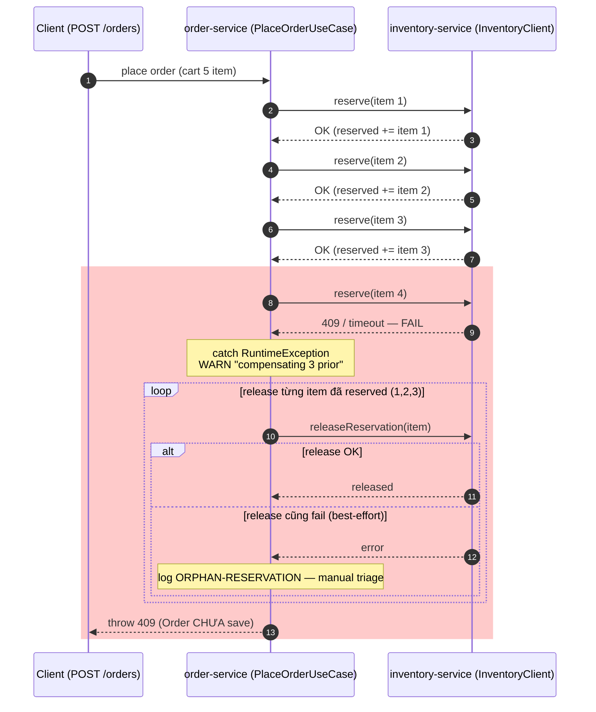

# 🔥 Issue 06 — Order persisted nhưng inventory reserve không rollback

> **Day 6 simulation.** Cross-service orchestration không có 2PC →
> partial-failure window. Phân tích 4 approach + lựa chọn Day 6.

## 1. Problem

`PlaceOrderUseCase` gọi `inventory.reserve` sync rồi save Order. Nếu
reserve thành công cho 3/5 item rồi item 4 fail (409 hoặc timeout),
inventory đã giữ reservation cho 3 item — nhưng Order CHƯA save. Kết
quả: stock bị "trừ ảo" mà không có order → orphan reservation.

## 2. Symptoms

- Log `WARN Reserve failed at item 4/5 — compensating 3 prior reservations`.
- Inventory metric `stock.reserved` cao bất thường trong vài phút sau peak.
- Customer thấy error 409 ở `POST /orders` (xong nhảy ra cart vẫn 5 item).
- Worst case: order-service crash giữa lúc compensate → log
  `ORPHAN-RESERVATION sku=... qty=... — release failed, manual triage needed`.

## 3. Root cause

Không có distributed transaction giữa order-service và inventory-service.
`@Transactional` JPA chỉ ôm Order DB, **không** rollback Feign/RestClient
call. Bất kỳ thao tác cross-service nào sau call thành công đều cần
compensation thủ công.

> Diagram dưới show saga compensation thủ công của `PlaceOrderUseCase`:
> reserve item 1,2,3 OK → item 4 FAIL → loop release 3 reservation trước đó →
> nhánh `alt` cuối cho thấy nếu chính `releaseReservation` cũng fail thì
> best-effort chỉ log `ORPHAN-RESERVATION`, không còn gì rollback ở caller. Khối
> đỏ = window orphan reservation.



## 4. Approaches compared

| Approach | Pros | Cons |
|----------|------|------|
| **1. Sync + try-catch compensate** (Day 6) | Đơn giản, không thêm infra. Code đọc top-down dễ. | Compensate cũng có thể fail → orphan. Không idempotent guaranteed. Latency cộng dồn. |
| **2. Saga choreography** (Kafka events) | Loose coupling, async, retry tự nhiên. | Khó debug, eventual consistency window. Cần outbox để reliable publish. |
| **3. Saga orchestration** (Camunda / Temporal) | State machine explicit, có retry/timeout/compensation as code. | Thêm 1 hệ thống stateful — vận hành nặng cho mid-size. |
| **4. 2PC (XA transactions)** | Atomicity thật. | Performance kém, không scale, vendor lock-in. Modern stack KHÔNG dùng. |

## 5. Chosen approach + Why

**Day 6 chọn (1) — sync + try-catch compensate**.

Lý do:
- Chưa có Kafka (Day 8 mới setup). Saga choreography cần outbox + topic
  → premature.
- Project mid-size MVP, mục tiêu Day 6 là demo end-to-end + sealed
  pattern. Đầu tư Temporal cho 1 use case là over-engineer.
- Trade-off accepted: window orphan ~5 phút (TTL ở inventory Day 12 sẽ
  thêm) + manual reconcile job (Day 13 outbox).

**Day 13 sẽ refactor sang (2)** — outbox + Kafka event-driven, reserve
trở thành async listener với retry + DLT.

## 6. Fix

Code: [`PlaceOrderUseCase.java`](../../services/order-service/src/main/java/com/ecommerce/order/application/PlaceOrderUseCase.java) lines 60-90.

```java
List<CartView.CartItem> reserved = new ArrayList<>();
try {
    for (CartView.CartItem item : cart.items()) {
        inventoryClient.reserve(item.sku(), item.quantity(), token);
        reserved.add(item);
    }
} catch (RuntimeException ex) {
    log.warn("Reserve failed at item {}/{} — compensating {} prior",
            reserved.size() + 1, cart.items().size(), reserved.size());
    for (CartView.CartItem done : reserved) {
        inventoryClient.releaseReservation(done.sku(), done.quantity(), token);
    }
    throw ex;
}

// Save Order — nếu save fail, compensate ALL reserved.
try {
    orderRepository.save(order);
} catch (RuntimeException ex) {
    for (CartView.CartItem done : reserved) {
        inventoryClient.releaseReservation(done.sku(), done.quantity(), token);
    }
    throw new BusinessException(ErrorCode.INTERNAL_ERROR, "Failed to persist order");
}
```

`releaseReservation()` ở `InventoryClient` là **best-effort** — log
`ORPHAN-RESERVATION` nếu fail thay vì throw (đã không còn gì để
rollback ở caller).

## 7. Prevention

- **Test integration**: scenario reserve fail item N → assert N-1 item
  được release (Day 6 IT gated, Day 13 wire vào CI).
- **Metric**: `inventory.orphan_reservation_count` Micrometer counter,
  alert nếu > 0 trong 5 phút.
- **Log `ORPHAN-RESERVATION` ERROR-level** → ops dashboard pickup.
- **Reconcile job** (Day 13): scheduled query so sánh inventory.reserved
  vs order với status PendingPayment trong 5 phút → release orphan.

## 8. Trade-off accepted

Window orphan reservation 5-30 phút (đến reconcile job chạy). Trong
window đó, stock available giảm — flash sale có thể thấy "hết hàng"
giả. Với traffic mid-size acceptable; với flash sale Day 33 sẽ dùng
Redis Lua atomic không qua flow này.

## 9. Related

- Code: [`PlaceOrderUseCase.java`](../../services/order-service/src/main/java/com/ecommerce/order/application/PlaceOrderUseCase.java), [`InventoryClient.java`](../../services/order-service/src/main/java/com/ecommerce/order/infrastructure/client/InventoryClient.java)
- Lesson [`06-aggregate-root.md`](../lessons/06-aggregate-root.md) — "1 tx 1 aggregate" rule
- Architecture [`order-domain.md`](../architecture/order-domain.md) — sequence diagram place-order
- Day 13 outbox [`lessons/13-outbox-pattern.md`](../lessons/13-outbox-pattern.md) (⏳ planned)
- ADR [`003-ddd-for-order-inventory-payment.md`](../decisions/003-ddd-for-order-inventory-payment.md)
