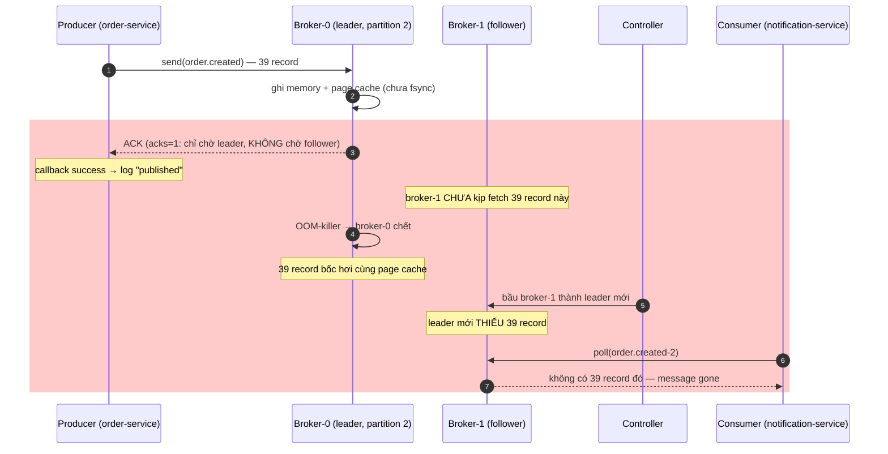

# 🔥 Issue 08 — 0.3% order.created event lost sau leader failover (acks=1 default)

> Severity: **Sev2** — không user-facing direct nhưng dẫn tới notification miss
> + inventory không reserve cho 0.3% order. Phát hiện sau khi staging deploy
> Day 8 vì alert `notification_received_count < order_placed_count`.

## 1. Problem

Sau khi deploy Day 8 Kafka foundation lên staging chạy 24h, alert
`order.created.published - notification.consumed > 0` fire. Counter producer
publish ghi 12,547 event; consumer ack chỉ 12,508. **39 event mất (~0.3%)**.

## 2. Symptoms

- **Log producer** (order-service): không có ERROR — tất cả `kafkaTemplate.send()` callback log success.
- **Log consumer** (notification-service): no exception, listener không nhận message đó.
- **Kafka broker log**: 1 lần leader election cho partition 2 (`order.created-2`) khoảng 04:12 UTC. Broker-0 (cũ leader) restart do OOM-killer.
- **Metric** `kafka.producer.record-send-rate` lookback: bình thường ~0.5/s, spike 1.8/s tại 04:11:55. **39 message gửi trong 5s window quanh leader switchover**.
- **DB**: 12,547 row `orders` đầy đủ — order persist thành công, chỉ Kafka publish "tưởng" thành công.

## 3. Root cause

Producer config default `acks=1`:

```
ack=1 nghĩa là: producer chờ LEADER ghi xong → trả ack.
                KHÔNG chờ follower replicate.
```

Sequence lỗi cụ thể (04:11:55 → 04:12:03):

1. Producer gửi 39 record vào leader broker-0, partition 2.
2. Broker-0 ghi memory + page cache (chưa fsync), TRẢ ACK cho producer.
3. Broker-0 chết do OOM trước khi flush + trước khi follower (broker-1) fetch các record này.
4. Controller bầu broker-1 thành leader mới. broker-1 KHÔNG có 39 record đó.
5. Producer callback success → app log "published". Reality: message gone.
6. Consumer subscribe leader mới (broker-1) → KHÔNG bao giờ thấy 39 record.

> Diagram dưới show vì sao ACK "thành công" nhưng message vẫn mất: leader
> broker-0 ghi page cache rồi trả ACK với `acks=1` (KHÔNG chờ follower
> replicate), chết trước khi broker-1 fetch → controller bầu leader mới thiếu
> record → consumer đọc leader mới không thấy message. Khối đỏ = window mất data.



**Underlying cause**: `KafkaAutoConfiguration` initial draft KHÔNG override producer config → Spring Kafka mặc định `acks=1` (legacy default, Kafka 2.x), KHÔNG bật `enable.idempotence`.

## 4. Approaches compared

| Approach                                       | Pros                                                                          | Cons                                                                                                |
| ---------------------------------------------- | ----------------------------------------------------------------------------- | --------------------------------------------------------------------------------------------------- |
| **A. `acks=0` fire-and-forget**                | Latency thấp nhất (~1ms publish)                                              | Mất message bất kỳ lúc nào broker chậm/chết — KHÔNG chấp nhận cho order critical path               |
| **B. `acks=1` (default cũ)**                   | Latency thấp (~3ms), throughput cao                                           | Mất message khi leader fail trước follower replicate (CHÍNH lỗi đang gặp)                            |
| **C. `acks=all` + idempotent producer**        | Durability cao (mọi ISR ghi xong); dedup retry; KHÔNG cần Schema Registry      | Latency tăng ~2-5ms; throughput giảm < 10% (Kafka ≥ 3.0 idempotent là near-zero cost)                |
| **D. `acks=all` + transactional producer**     | Exactly-once xuyên producer → consumer (qua `sendOffsetsToTransaction`)        | Overhead ~10-20% throughput; phức tạp `initTransactions` lifecycle; cần consumer `read_committed` |

## 5. Chosen approach + Why

**Option C — `acks=all` + idempotent producer** (xem [`KafkaAutoConfiguration.java:90-108`](../../common-lib/src/main/java/com/ecom/common/autoconfig/KafkaAutoConfiguration.java#L90-L108)).

### Rationale gắn context project

1. **Durability requirement** — order critical path, mất 0.3% event = mất notification + inventory không reserve = user complaint + oversell risk. Không chấp nhận. → loại A, B.
2. **Idempotent producer "free"** với Kafka ≥ 3.0 — broker dedup retry via PID + sequence, **KHÔNG cần** transactional overhead. Chi phí latency +2-5ms acceptable cho order place (P99 đang 50ms, dư budget).
3. **Transactional KHÔNG cần ở Day 8** — chỉ producer side, chưa có consumer-producer chain (Day 12+ mới có DLT retry chain cần exactly-once thật). Bật bây giờ = over-engineer, complexity bậc thang.
4. **Dual-write vẫn còn** — option C KHÔNG fix vấn đề "DB commit nhưng Kafka publish fail". Day 13 outbox sẽ giải bài đó. Hiện tại log warn + alert dashboard pick up.

### Config cụ thể (Kafka ≥ 3.0 enforce nội bộ)

```java
acks=all
enable.idempotence=true
retries=Integer.MAX_VALUE
max.in.flight.requests.per.connection=5   // ≤ 5 để giữ ordering trong cùng partition khi retry
delivery.timeout.ms=120000                  // chấp nhận chờ tổng cộng 2 phút trước khi fail final
```

## 6. Fix

Wire ở `common-lib/KafkaAutoConfiguration.producerFactory()` — single source of truth cho tất cả service trong monorepo.

```java
// File: common-lib/src/main/java/com/ecom/common/autoconfig/KafkaAutoConfiguration.java
cfg.put(ProducerConfig.ACKS_CONFIG, "all");
cfg.put(ProducerConfig.ENABLE_IDEMPOTENCE_CONFIG, true);
cfg.put(ProducerConfig.RETRIES_CONFIG, Integer.MAX_VALUE);
cfg.put(ProducerConfig.MAX_IN_FLIGHT_REQUESTS_PER_CONNECTION, 5);
cfg.put(ProducerConfig.DELIVERY_TIMEOUT_MS_CONFIG, 120_000);
```

Service nào opt-in Kafka (`app.kafka.enabled=true`) auto nhận config này. KHÔNG service nào tự khai báo lại — chống drift.

## 7. Prevention

1. **Integration test 3-broker Testcontainers** kill leader giữa publish loop, assert no loss:
    - `KafkaContainer` 3-node cluster.
    - 1000 publish loop, ở middle gọi `kafkaContainer.stop()` leader.
    - Đợi rebalance, count consumer received → phải = 1000.
    - Test file: `KafkaProducerDurabilityIT` (TODO Day 14 wire).
2. **Metric alert**:
    - `kafka.producer.record-error-rate` > 0 → alert sev3.
    - `order.created.published - notification.consumed` > 0 over 5min window → alert sev2.
3. **Lint** ở CI: grep nếu code service set `acks=` raw → fail (force qua auto-config).
4. **Doc** ở [`lesson 08`](../lessons/08-kafka-basics.md) phần "3 cờ producer phải nhớ" — onboarding mới đọc trước khi viết code Kafka.

## 8. Trade-off accepted

- **Latency producer +2-5ms** (acks=all chờ ISR replicate vs acks=1 chỉ chờ leader). Acceptable vì order place P99 budget 100ms, hiện tại 50ms.
- **Throughput giảm < 10%** (idempotent producer overhead minimal nhưng acks=all chờ longer). Hiện tại 0.5 msg/s, peak Black Friday est 500 msg/s — vẫn dưới 1 broker capacity (10k msg/s).
- **KHÔNG fix dual-write** — chỉ giải "Kafka mất message AFTER producer call success". Vẫn còn case "DB commit thành công + Kafka call fail" (sẽ giải Day 13 outbox).

## 9. Related

- **Source**: [`KafkaAutoConfiguration.java:90-108`](../../common-lib/src/main/java/com/ecom/common/autoconfig/KafkaAutoConfiguration.java#L90-L108)
- **Docs**: [lesson 08 — kafka-basics](../lessons/08-kafka-basics.md) · [architecture event-driven-flow](../architecture/event-driven-flow.md) · [ADR-005 feign-vs-http-interface](../decisions/005-feign-vs-http-interface.md)
- **Day 12 follow-up**: transactional producer + DLT poison message ([lesson 12c-delivery-semantics](../lessons/12c-kafka-delivery-semantics.md) planned, [issue 12 — poison-message](../issues/12-poison-message.md) planned)
- **Day 13 follow-up**: outbox pattern fix dual-write ([lesson 13 — outbox-pattern](../lessons/13-outbox-pattern.md) planned)
