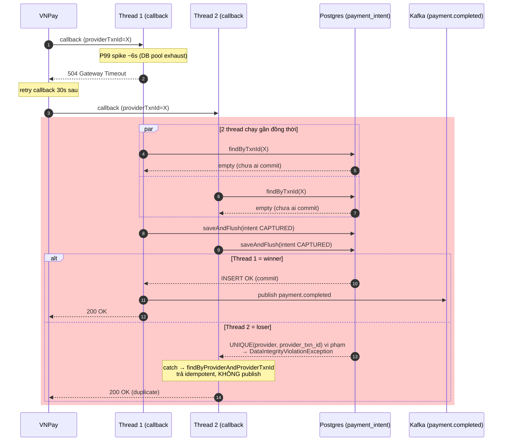

# 🔥 Issue 10 — Duplicate payment callback gây double-event

> Day 10 · production-style incident simulation
> Related: [lesson 10 idempotency](../lessons/10-idempotency.md) · [ADR-007 payment-layered](../decisions/007-payment-service-layered-not-ddd.md) · [interview day-10](../interview/day-10-payment.md)

## 1. Problem

Sau khi user thanh toán thành công qua VNPay, hệ thống publish **2 event `payment.completed`** cho cùng `orderId`. Reconciliation report cuối ngày báo mismatch giữa "số order Paid" và "số event consumed", PM Linh nhận alert lúc 22:30.

## 2. Symptoms

- Kafka topic `payment.completed` log: 2 message khác `eventId` cùng `orderId` cùng `providerTxnId`, cách nhau ~120ms.
- Order-service consumer log: lần 1 transition `PendingPayment → Paid` thành công; lần 2 `markPaid` no-op log warn → **không** double-charge user (Order side idempotent).
- Reconciliation alarm trigger: `count(payment_intent WHERE status=CAPTURED) ≠ count(event payment.completed) cho cùng window`.
- 2 row trong bảng `payment_intent` ở status `CAPTURED` cùng `provider_txn_id` — vi phạm dedup design.

## 3. Root cause

VNPay phát hiện app trả `504 Gateway Timeout` ở lần callback đầu (do P99 spike ở payment-service ~6s khi DB pool exhaust). VNPay **retry callback 30 giây sau**. Lần 2 app tỉnh lại, xử lý OK.

Code cũ ở `HandleCallbackUseCase` dedup theo **check-then-insert** thuần:

```java
// SAI — race window ~20ms
if (repo.findByTxnId(txnId).isEmpty()) {
    repo.save(intent);  // 2 thread cùng đến đây
    publisher.publish(event);
}
```

Khi 2 callback đến gần như đồng thời (lần 1 chưa kịp commit DB + lần 2 đã pass `findByTxnId`), CẢ HAI cùng INSERT thành công → 2 row + 2 event.

**Tại sao test không catch?** Unit test chạy sequential. IT chạy 1 thread mock callback. **Không có concurrency test ở payment**.

> Diagram dưới show race window của code cũ (sau khi đã fix bằng UNIQUE
> constraint): callback#1 timeout 504 → VNPay retry → 2 thread đến gần đồng thời,
> cả 2 pass `findByTxnId` (chưa ai commit) → cả 2 `saveAndFlush` INSERT → nhánh
> `alt`: winner commit + publish event, loser dính UNIQUE
> `DataIntegrityViolationException` → trả idempotent KHÔNG publish. Khối đỏ =
> race window.



## 4. Approaches compared

| Approach | Pros | Cons |
|---|---|---|
| **A. App-level cache dedup (Redis SETNX 24h)** | Nhanh, không đụng schema; throughput cao. | Redis down → race lọt qua. Không atomic với DB transaction → có thể SETNX OK nhưng DB commit fail → mất idempotency. Không phải source of truth. |
| **B. DB UNIQUE(provider, provider_txn_id)** | Atomic ở B-tree index — không thể bypass dù app race. Source of truth persistent. Catch `DataIntegrityViolationException` để return idempotent. | Cost 1 INSERT attempt + 1 SELECT khi race (acceptable, race rate <5%). Cần migration nếu schema cũ chưa có. |
| **C. Idempotency token table riêng** | Tách concern dedup khỏi business table — schema cleaner. Reusable cho nhiều operation. | 2 write/operation → tốn IO. Dual-state risk (token committed, business chưa commit → inconsistent). Phức tạp hơn. |
| **D. Event version + optimistic lock** | Reuse `@Version` sẵn có; rẻ. | CHỈ dedup UPDATE (vd retry transition INITIATED→CAPTURED), KHÔNG dedup CREATE (2 row mới với cùng txn_id). Không đủ. |

## 5. Chosen approach + Why

**Approach B — DB UNIQUE constraint** trên `(provider, provider_txn_id)`, partial WHERE `provider_txn_id IS NOT NULL` (vì PaymentIntent INITIATED chưa có txn_id).

Lý do:
- Payment callback CHẮC CHẮN cần persist → UNIQUE là layer rẻ nhất + đáng tin cậy nhất.
- Atomic ở DB level — không phụ thuộc Redis health.
- Survive app crash giữa chừng (Redis ephemeral).
- Tốn ~1 INSERT attempt khi race — `<5%` rate × O(log n) index lookup = không đáng kể.
- **Approach A là L1 optimization, có thể bolt-on sau** ở Day 15 cache layer.

> 🧠 **Senior lesson**: idempotency phải ở **storage level**, không ở app level. App có thể crash/scale/replace; storage là contract bền nhất.

## 6. Fix

**Migration**: [`V1__init_payment.sql`](../../services/payment-service/src/main/resources/db/migration/V1__init_payment.sql)

```sql
CREATE UNIQUE INDEX uq_payment_provider_txn
    ON payment_intent (provider, provider_txn_id)
    WHERE provider_txn_id IS NOT NULL;
```

**Use case**: [`HandleCallbackUseCase.java`](../../services/payment-service/src/main/java/com/ecommerce/payment/application/HandleCallbackUseCase.java)

```java
try {
    intent.capture(cmd.providerTxnId());
    repo.saveAndFlush(intent);  // flush để UNIQUE fail-fast trong tx
    publisher.publishPaymentCompleted(event);
    return new CallbackResult(intent, false, true);
} catch (DataIntegrityViolationException dup) {
    // Race lose — lookup existing → idempotent response, NO publish.
    var winner = repo.findByProviderAndProviderTxnId(provider, txnId).orElseThrow();
    return new CallbackResult(winner, true, false);
}
```

**Retry**: `@Retryable(ObjectOptimisticLockingFailureException, maxAttempts=3, backoff exp 50→500ms)` cho race ở UPDATE.

**Saveandflush** thay vì save: ép Hibernate flush INSERT ngay trong tx → exception raise ngay, không đợi commit (lúc đó đã ra khỏi `try`).

## 7. Prevention

- **Concurrency unit test (mock-based)** — `HandleCallbackUseCaseTest.uniqueConstraintRace_returnsDuplicate` — mock repo throw `DataIntegrityViolationException` lần đầu, verify use case catch + return duplicate, KHÔNG publish event.
- **Integration test (Testcontainers, gated `RUN_PAYMENT_INTEGRATION_TESTS=true`)** — TODO Day 11: 100-thread concurrent callback cùng `providerTxnId`, assert exactly 1 event published + 1 row CAPTURED.
- **Metric alarm**: `payment.duplicate.callback.count` — count log warn "Callback duplicate ignored". Spike → gateway misconfig / network issue.
- **Code review checklist** ([`docs/review/ai-junior-traps.md`](../review/ai-junior-traps.md)): pattern `findBy…isEmpty()` rồi `save()` mà không có UNIQUE bảo vệ → reject.

## 8. Trade-off accepted

- **1 extra DB round-trip khi race** (INSERT fail → SELECT). Acceptable vì race rate <5%.
- **Reliance on Postgres B-tree UNIQUE** — nếu sau này shard horizontal theo `orderId`, UNIQUE cross-shard không guarantee → cần dedup ở app layer thêm. Day 25 polyglot review sẽ note.
- **`provider_txn_id` được assume immutable trong scope provider** — VNPay/Momo confirm "txn_id unique per merchant trong N năm". Nếu provider reuse → composite key cần thêm `(provider, year, txn_id)` (theo dõi Day 36).
- **Publish Kafka vẫn dual-write debt** — DB idempotent nhưng nếu Kafka publish fail sau khi DB commit, event mất. Day 13 outbox fix.

## 9. Related

- Code: [`HandleCallbackUseCase.java`](../../services/payment-service/src/main/java/com/ecommerce/payment/application/HandleCallbackUseCase.java) · [`V1__init_payment.sql`](../../services/payment-service/src/main/resources/db/migration/V1__init_payment.sql) · [`PaymentCompletedConsumer.java`](../../services/order-service/src/main/java/com/ecommerce/order/infrastructure/messaging/PaymentCompletedConsumer.java)
- Lesson: [10 idempotency](../lessons/10-idempotency.md)
- ADR: [007 payment-service Layered](../decisions/007-payment-service-layered-not-ddd.md)
- Related issue: [08 kafka message loss](08-kafka-message-loss-acks-default.md) (producer side guarantee)
- Sẽ link Day 13 outbox + Day 36 reconciliation.
