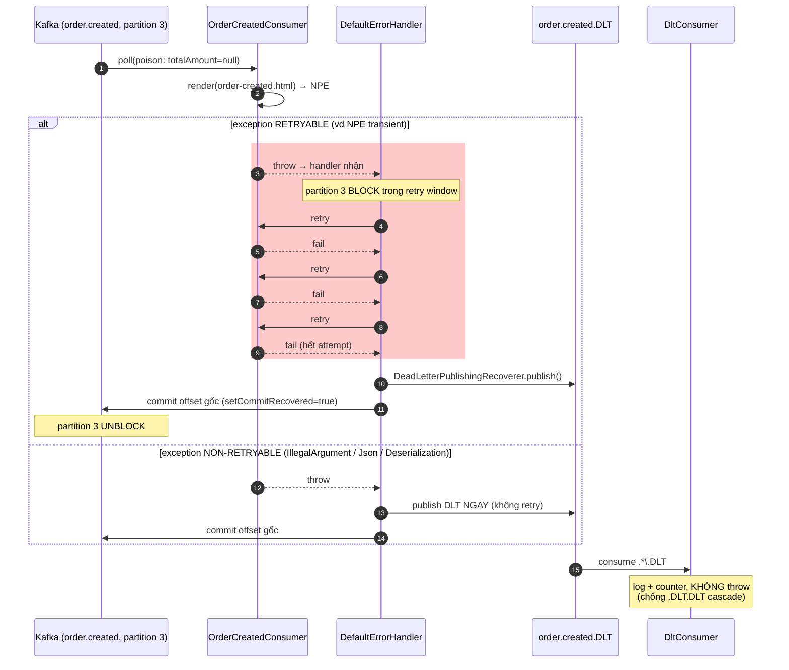

# Issue 12 — 🔥 Poison message làm consumer lag 200k message

> **Day**: 12 · **Severity**: SEV-2 (consumer lag, không user-facing downtime nhưng email/notification delay 4h)
> **Date**: simulation incident · **Related code**: [`RetryTopologyConfiguration`](../../services/notification-service/src/main/java/com/ecommerce/notification/messaging/RetryTopologyConfiguration.java)

---

## 1. Problem

`notification-service` ngừng consume `order.created` trong 4 giờ. 200k message backlog. Email "Order Confirmed" delay → 47 customer complaint, CS bị overload.

## 2. Symptoms

- Grafana alert `kafka_consumer_lag{group="notification-service"}` > 50k, climbing linearly.
- Loki log flood:
  ```
  ERROR NotificationTemplateEngine - NullPointerException at render(order-created.html, ctx)
  Caused by: TemplateInputException: Exception evaluating SpringEL expression: "totalAmount.toPlainString()"
  Caused by: NullPointerException
  ```
- Metric `kafka_consumer_records_consumed_total{group="notification-service"}` đứng yên.
- Cùng partition (partition 3) bị stuck — 2 partition khác (0, 1) vẫn consume bình thường (cluedo: 1 key — `orderId=ord-2026-05-19-1847` — bị poison, hash về partition 3).

## 3. Root cause

3 nguyên nhân chồng nhau:

1. **Producer-side bug** (Day 9-10 không catch): trong edge case 1 promo code 100% discount → `totalAmount = null` thay vì `BigDecimal.ZERO`. Schema `OrderCreatedV1.totalAmount` declare `BigDecimal` (non-nullable conceptually) nhưng JSON cho phép null → deserialize ok, render fail.
2. **Consumer Spring Kafka default error handler retry VÔ HẠN** (kế thừa pre-2.8 behavior `FixedBackOff(0, 9223372036854775807L)` = retry every 0ms, max=Long.MAX_VALUE). Mỗi NPE → retry ngay → re-fail → loop tight.
3. **Không có DLT** — không có lối thoát cho poison message, partition bị block.

> Diagram dưới show flow retry-then-DLT (sau khi fix): consumer nhận poison
> message → render fail → `DefaultErrorHandler` backoff exponential 1s → 4s → 16s
> (max 3 attempts, ~21s) → hết attempt thì `DeadLetterPublishingRecoverer` publish
> sang `<topic>.DLT` + commit offset gốc → partition unblock. Nhánh `alt`:
> exception non-retryable (`IllegalArgumentException` / `JsonProcessingException` /
> `DeserializationException`) → DLT NGAY, không retry. Khối đỏ = window block
> partition trong lúc retry.



## 4. Approaches compared

| Approach                          | Pros                                         | Cons                                                              |
| --------------------------------- | -------------------------------------------- | ----------------------------------------------------------------- |
| **Skip silently (swallow + ack)** | Đơn giản, không block partition              | Mất data — không có audit trail; bug ẩn tiếp; không alert         |
| **DLT ngay (no retry)**           | Không block partition                        | Mất chance recover transient failure (network blip, broker election) — false positive vào DLT |
| **Sidetrack queue (delayed retry topic)** | Non-blocking retry, configurable delay | Ops phức tạp (1 topic delay 1s, 1 topic 10s, 1 topic 1min...); cần `@RetryableTopic` Spring Kafka 2.8+ |
| **Retry-then-DLT (chosen)**       | ✅ Recover transient + bảo vệ partition       | Block partition trong retry window (~21s/message); hard cap maxAttempts |

## 5. Chosen approach + Why

**Retry-then-DLT** với `DefaultErrorHandler` + `DeadLetterPublishingRecoverer`:
- Exponential backoff 1s → 4s → 16s, max 3 attempts (~21s total per poison).
- Sau 3 attempts → publish sang `<topic>.DLT` + commit offset gốc → partition unblock.
- **Non-retryable shortcut**: `IllegalArgumentException`, `JsonProcessingException`, `DeserializationException` → DLT ngay (validation lỗi retry vô nghĩa).

Lý do chọn:
- **Recover transient**: 80% production "poison" thực ra là transient (Redis spike, downstream 503) — retry recover được. Skip-silently mất data; DLT-ngay false positive cao.
- **Block partition giới hạn**: 21s/poison là acceptable. Volume cao → switch sang sidetrack queue (Day 13+ outbox + retry topic non-blocking) — Day 12 chưa cần.
- **Đơn giản hơn sidetrack**: 1 config block trong 1 file thay vì 3-4 topic delay + consumer factory riêng.

## 6. Fix

[`services/notification-service/src/main/java/com/ecommerce/notification/messaging/RetryTopologyConfiguration.java`](../../services/notification-service/src/main/java/com/ecommerce/notification/messaging/RetryTopologyConfiguration.java) — `DefaultErrorHandler` bean override `kafkaListenerContainerFactory` của common-lib:

```java
ExponentialBackOff backOff = new ExponentialBackOff(1_000L, 4.0);
backOff.setMaxInterval(16_000L);
backOff.setMaxElapsedTime(21_000L);

DefaultErrorHandler handler = new DefaultErrorHandler(recoverer, backOff);
handler.addNotRetryableExceptions(
        IllegalArgumentException.class,
        JsonProcessingException.class,
        DeserializationException.class);
handler.setCommitRecovered(true);
```

[`DltConsumer.java`](../../services/notification-service/src/main/java/com/ecommerce/notification/messaging/DltConsumer.java) — listen pattern `.*\.DLT`, log + counter, **KHÔNG throw** (chống `.DLT.DLT` cascade).

Consumer rewrite ([`OrderCreatedConsumer`](../../services/notification-service/src/main/java/com/ecommerce/notification/consumer/OrderCreatedConsumer.java)): bỏ swallow `catch (Exception)` → re-throw + release dedup token (Redis SET NX) để retry attempt thấy fresh state.

## 7. Prevention

- **Schema validation tại producer** — `@NotNull` trên `OrderCreatedV1.totalAmount`, fail-fast trước publish. Day 9-10 sẽ patch.
- **Alert `kafka_consumer_lag > 10k` 5 phút** — sớm hơn nhiều so với 50k.
- **Alert `notification.dlt.count > 0` 5 phút window** — DLT bất kỳ event nào → trigger oncall investigate.
- **Runbook**: [`docs/runbooks/kafka-topic-recovery.md`](../runbooks/kafka-topic-recovery.md) — 5 bước recovery DLT.
- **Contract test producer-consumer** — Day 14 mock interview sẽ propose Pact / spring-cloud-contract cho schema drift.

## 8. Trade-off accepted

- **Block partition 21s/poison** — chấp nhận vì volume notification thấp (~10/s peak), 21s = 210 message backlog tối đa per poison. Volume cao (>100/s) → phải migrate sang `@RetryableTopic` non-blocking.
- **DLT cần human triage** — không auto-replay. Lý do: nếu auto-replay mà chưa fix root cause → infinite cycle. Runbook ép ops classify (code bug / data bad) trước replay.
- **Producer schema drift vẫn lọt qua** — non-retryable DLT-ngay tốt cho NPE/parse error nhưng nếu producer publish field name sai (`total_amount` thay vì `totalAmount`) — Jackson deser thành null, render fail runtime — vẫn vào retry-then-DLT. Pact contract test Day 14 sẽ close gap.

## 9. Related

- Code: [`RetryTopologyConfiguration.java`](../../services/notification-service/src/main/java/com/ecommerce/notification/messaging/RetryTopologyConfiguration.java) · [`DltConsumer.java`](../../services/notification-service/src/main/java/com/ecommerce/notification/messaging/DltConsumer.java) · [`OrderCreatedConsumer.java`](../../services/notification-service/src/main/java/com/ecommerce/notification/consumer/OrderCreatedConsumer.java)
- Docs: [`lessons/12-retry-strategy.md`](../lessons/12-retry-strategy.md) · [`lessons/12c-kafka-delivery-semantics.md`](../lessons/12c-kafka-delivery-semantics.md) · [`runbooks/kafka-topic-recovery.md`](../runbooks/kafka-topic-recovery.md)
- Related issue: [`issues/08-kafka-message-loss-acks-default.md`](08-kafka-message-loss-acks-default.md) — Day 8 producer side reliability
