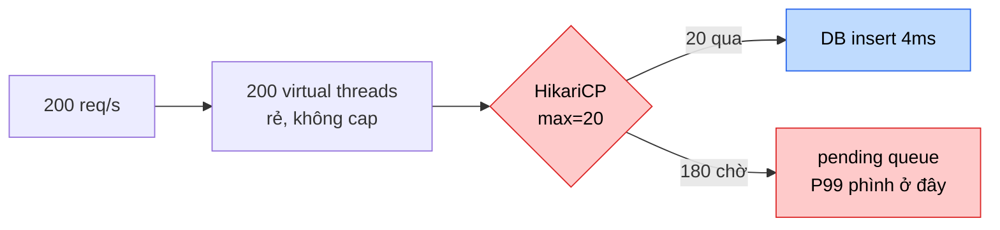

# 🔥 Issue 20 — Bật Virtual Threads, P99 vẫn nổ: bottleneck dời sang connection pool

> **Severity**: Sev-3 (load test, chưa lên prod) · **Phát hiện**: Day 20 load test
> · **Liên quan**: Day 2 (VT), Day 19 (concurrency), Day 4 (Hikari pool)

---

## 1. Problem

Bật `spring.threads.virtual.enabled=true` cho order-service, kỳ vọng throughput
place-order tăng mạnh. Nhưng khi k6 đẩy 200 req/s, **P99 vọt từ ~120ms lên >2s**
và throughput **không** tăng so với platform thread. "VT chẳng giúp gì."

## 2. Symptoms

- k6: `http_req_duration p(99)=2.1s` (threshold 500ms vỡ), `place_order_latency`
  tăng dần theo thời gian dù arrival-rate giữ phẳng.
- Grafana panel **HikariCP**: `hikaricp_connections_active` ghim ở **20**
  (= max pool), `hikaricp_connections_pending` leo lên 150+.
- Grafana CPU: `process_cpu_usage` chỉ **~35%** — CPU rảnh mà vẫn chậm.
- Tempo trace `POST /orders`: span `Connection Acquisition` (chờ Hikari) chiếm
  **~1.8s/2.1s** tổng; span DB insert thật chỉ 4ms.
- `jvm_threads_live_threads` thấp (VT không đếm vào đây) — không phải thread exhaustion.

## 3. Root cause

Virtual thread bỏ giới hạn **số thread** — order-service giờ chấp nhận hàng ngàn
request đồng thời, mỗi request 1 virtual thread rẻ. NHƯNG mỗi request place-order
cần 1 **JDBC connection** từ HikariCP (`maximum-pool-size=20`). Connection pool là
tài nguyên **bounded** — VT không nhân nó lên.

Kết quả: 200 virtual thread cùng chạy tới bước DB, 20 cái lấy được connection, **180
cái xếp hàng** chờ ở `getConnection()`. Bottleneck **dời** từ thread pool (đã gỡ)
sang connection pool (vẫn 20). Vì virtual thread block ở connection acquisition là
"cheap" (không ghim carrier), hệ thống không sập — nó **âm thầm** dồn ứ, latency
phình ở hàng đợi chứ không phải ở xử lý.



> 💡 **Insight**: VT làm bottleneck **dễ ẩn hơn** chứ không biến mất. Platform
> thread cạn pool → có thread starvation rõ ràng (thread dump thấy ngay). VT cạn
> connection → không có dấu hiệu thread, phải nhìn `hikaricp_connections_pending`
> + trace span mới thấy. Quan sát khó hơn = nguy hiểm hơn.

## 4. Approaches compared

| Approach | Pros | Cons |
| --- | --- | --- |
| **A. Tăng pool mù (20 → 500)** | Sửa nhanh, pending về 0 | DB connection storm: Postgres `max_connections` (default 100) cạn, mọi service tranh nhau; mỗi connection ~10MB RAM phía DB; context-switch DB-side tăng. Đẩy bottleneck xuống DB. |
| **B. Size pool đúng Little's Law + bounded VT semaphore** (chosen) | Pool khớp năng lực DB thật; backpressure sớm ở app thay vì dồn xuống DB; số có cơ sở | Phải đo `service_time` để tính; cần thêm semaphore/bulkhead nếu muốn fail-fast |
| C. Chuyển sang reactive (R2DBC/WebFlux) | Non-blocking tới tận DB driver, không tốn connection chờ | Rewrite lớn; mất đồng bộ với JPA/JDBC stack hiện tại; debugging khó; ROI thấp cho bài toán này |
| D. Read replica + tách read/write pool | Giảm tải write pool | Phức tạp hạ tầng; place-order là write-path nên replica không giúp trực tiếp |

## 5. Chosen approach + Why

**Chọn B**: size connection pool theo **Little's Law** + giữ VT, thêm
backpressure có chủ đích.

Little's Law: `concurrency = throughput × latency`. Nếu DB xử lý mỗi
place-order tx ~8ms và mục tiêu 200 req/s thì connection cần thiết ≈
`200 × 0.008 = 1.6` — pool 20 đã **thừa** cho 200 req/s *nếu DB nhanh*. P99 nổ
ở test là vì tx thật (insert order + items + outbox cùng tx) ~40ms dưới
contention → cần `200 × 0.04 = 8` connection steady, nhưng burst + lock chờ đẩy
lên >20. Tăng pool lên **mức khớp `max_connections` chia số instance** (vd 30)
+ đặt `connection-timeout` ngắn để fail-fast thay vì chờ 30s.

Quan trọng hơn: **VT vẫn đáng giữ** — nó cho phép 1000 request *đứng chờ* mà
không tốn 1000 platform thread (mỗi cái ~1MB stack). Vấn đề không phải VT, mà
là **kỳ vọng sai**: VT tăng concurrency của *thread*, không tăng năng lực của
*tài nguyên bounded phía sau*. Pool phải size độc lập.

Gắn context project: order-service write-path, Postgres `max_connections=100`,
7 service chia nhau → mỗi service ~10-15 connection là trần hợp lý. Không thể
"tăng pool 500" — đó là đẩy quả bom xuống DB.

## 6. Fix

**(a) Size pool có cơ sở** — [`application.yml`](../../services/order-service/src/main/resources/application.yml) hiện `maximum-pool-size: 20`. Đặt theo
`min(Little's-Law-need × hệ-số-burst, max_connections / num_instances)`:

```yaml
spring:
  datasource:
    hikari:
      maximum-pool-size: 30          # khớp DB budget, không vô hạn
      connection-timeout: 2000       # fail-fast 2s thay vì chờ 30s mặc định
      # leak-detection-threshold: 20000  # cảnh báo connection giữ quá lâu
```

**(b) Backpressure ở edge** (tùy chọn, khi cần fail-fast under overload): bulkhead
semaphore quanh use case write (đã có Resilience4j từ Day 12) — vượt N concurrent
thì trả 429/503 ngay thay vì để dồn ứ pool.

**(c) Observability để thấy sớm**: panel `hikaricp_connections_pending` + alert
khi pending > 0 kéo dài (đã thêm vào dashboard Day 20).

## 7. Prevention

- **Load test gate trong CI** (k6 threshold P99 < 500ms) — Day 20 harness. Regression
  pool/lock sẽ làm test fail trước khi lên prod.
- **Alert** `hikaricp_connections_pending > 0 for 1m` trên Prometheus.
- **Runbook**: khi P99 nổ mà CPU thấp → check pool pending TRƯỚC, không tăng instance mù.
- **Code review trap**: bật VT đi kèm review pool sizing + timeout (xem
  [`review/ai-junior-traps.md`](../review/ai-junior-traps.md)).

## 8. Trade-off accepted

Pool 30 (không phải 500) nghĩa là **chấp nhận** có trần concurrency write thật:
khi traffic vượt năng lực DB, app trả lỗi nhanh (429) thay vì cố nuốt rồi chậm
cho tất cả. **Hy sinh**: vài request bị từ chối lúc đỉnh (fail-fast) đổi lấy P99
ổn định cho số đông + bảo vệ DB khỏi connection storm. Đây là lựa chọn senior:
*shed load có kiểm soát > degrade toàn cục*.

## 9. Related

- Code: [`services/order-service/src/main/resources/application.yml`](../../services/order-service/src/main/resources/application.yml) · [`application-platform.yml`](../../services/order-service/src/main/resources/application-platform.yml)
- Load harness: [`load/k6/place-order.js`](../../load/k6/place-order.js)
- Lesson: [`lessons/20-load-testing-methodology.md`](../lessons/20-load-testing-methodology.md) (Little's Law, percentile)
- [`performance/20b-vt-vs-platform-thread-bench.md`](../performance/20b-vt-vs-platform-thread-bench.md) — VT không phải thuốc tiên
- Day 19 concurrency: [`evolution/19-...`] · Day 12 bulkhead: [`lessons/12b-circuit-breaker-resilience4j.md`](../lessons/12b-circuit-breaker-resilience4j.md)
