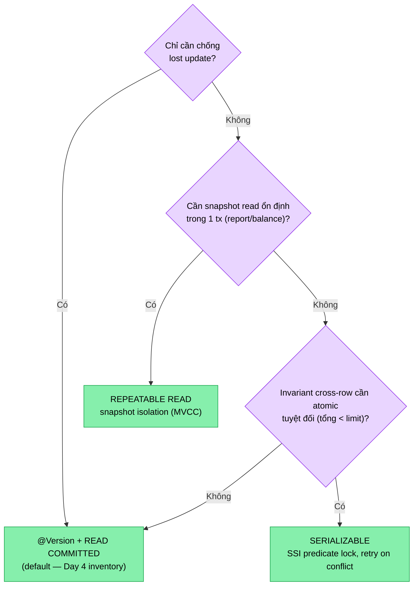

# Lesson 04b — Transaction Isolation Levels (Postgres)

> **Status**: ✅ Done · 2026-05-09
> **Related day**: Day 4 (Inventory + optimistic locking)

---

## 🎯 TL;DR

4 isolation levels giải quyết 3 anomaly: **dirty read · non-repeatable read · phantom read**. Postgres default = `READ COMMITTED`. Khác với MySQL: Postgres `REPEATABLE READ` = **snapshot isolation** (chặn cả phantom read qua MVCC snapshot, không phải qua next-key lock như MySQL InnoDB).

`@Version` (optimistic lock) **không phải replacement** cho isolation level — nó là cơ chế bổ sung ở app layer. Isolation level vẫn luôn chạy.

---

## 📚 4 isolation levels × 3 anomaly

| Level             | Dirty read | Non-repeatable read | Phantom read | Postgres ngầm map sang |
| ----------------- | ---------- | ------------------- | ------------ | ---------------------- |
| READ UNCOMMITTED  | ❌          | ❌                   | ❌            | (Postgres không support — = READ COMMITTED) |
| READ COMMITTED    | ✅          | ❌                   | ❌            | default                |
| REPEATABLE READ   | ✅          | ✅                   | ✅ (snapshot)  | snapshot isolation     |
| SERIALIZABLE      | ✅          | ✅                   | ✅            | SSI (predicate lock)   |

> ⚠️ Postgres khác MySQL: `REPEATABLE READ` của Postgres = snapshot isolation — đã chặn phantom read qua snapshot MVCC. MySQL InnoDB chặn phantom bằng next-key lock (gap lock) ở `REPEATABLE READ`.

### Anomaly cheat sheet

- **Dirty read**: tx-A đọc data tx-B chưa commit. Postgres KHÔNG có (mọi level từ READ COMMITTED trở lên).
- **Non-repeatable read**: trong cùng tx-A, đọc 1 row 2 lần ra 2 giá trị khác nhau (vì tx-B commit giữa chừng). `READ COMMITTED` cho phép.
- **Phantom read**: đọc cùng query 2 lần, lần 2 ra thêm row mới (tx-B insert). `READ COMMITTED` + `REPEATABLE READ` ở MySQL cho phép; Postgres `REPEATABLE READ` chặn.

---

## 🔧 Khi nào dùng cái nào

- **READ COMMITTED** (default Postgres): 95% case CRUD bình thường. Đúng cho hầu hết. Day 4 inventory dùng level này, kết hợp `@Version` chống lost update.
- **REPEATABLE READ**: report cần đọc snapshot ổn định trong 1 tx (ví dụ: balance sheet đọc 100 row cùng lúc, không muốn 1 row update giữa chừng). Trade-off: chấp nhận serialization failure khi 2 tx update cùng row.
- **SERIALIZABLE**: business invariant kiểu "tổng < limit" mà cần check + write atomically (ví dụ: "tổng tiền rút trong ngày < 100M"). Postgres dùng SSI (Serializable Snapshot Isolation) — predicate lock thay vì pessimistic. Trade-off: throughput thấp hơn, serialization failure → retry.
- **READ UNCOMMITTED**: Postgres không support — = READ COMMITTED. Đừng cargo-cult từ legacy SQL Server.

Decision tree chọn isolation level (mặc định RC, chỉ nâng khi có lý do cụ thể):

## ⚠️ Cạm bẫy

1. **`SELECT ... FOR UPDATE` không thay thế isolation level** — chỉ row lock khi SELECT, isolation vẫn chạy bình thường. 2 cơ chế độc lập.
2. **Postgres `REPEATABLE READ` không lock**: 2 tx cùng UPDATE 1 row → 1 thành công, tx kia throw `could not serialize access due to concurrent update`. Caller phải retry. KHÁC MySQL: MySQL `REPEATABLE READ` lock row (next-key) → tx kia chờ.
3. **Spring `@Transactional(isolation=...)` set ở method, KHÔNG phải class-level mặc định**: class-level dễ bị quên override khi thêm method mới. Best practice: set explicit ở method cần khác default.
4. **`SERIALIZABLE` có chi phí ẩn**: Postgres SSI track predicate dependency cho mọi tx — overhead nhớ. Nếu set bừa cho cả app → throughput drop 20-30%.
5. **Optimistic lock + `READ COMMITTED` đủ chống lost update** — KHÔNG cần nâng lên `REPEATABLE READ`. Day 4 chứng minh.

## 🆚 Approaches compared (cho case "prevent overselling")

| Approach                              | Pros                                       | Cons                                            |
| ------------------------------------- | ------------------------------------------ | ----------------------------------------------- |
| Optimistic lock (`@Version`) + RC default | High throughput, no DB lock                | Retry storm khi contention cao                  |
| Pessimistic `SELECT FOR UPDATE`       | Đơn giản, không retry                      | Lock contention, có thể deadlock                |
| `SERIALIZABLE` isolation              | Đảm bảo invariant, không cần lock thủ công | Throughput thấp, serialization failure → retry  |
| `REPEATABLE READ` snapshot + `@Version` | Snapshot ổn định cho read, vẫn chống lost update | Phức tạp hơn cần thiết — nếu chỉ chống lost update, RC + @Version đủ |

> Day 4 chọn **optimistic lock + RC default** vì context inventory: contention thật nhưng không quá cao (<500 RPS/SKU MVP), retry rẻ. Nâng isolation = over-engineer.

---

## 🎤 Trả lời phỏng vấn

> **Q**: "Dirty read là gì? Postgres có support READ UNCOMMITTED không?"
>
> **A**: Dirty read là tx đọc data tx khác chưa commit. Postgres không support READ UNCOMMITTED — set thì cũng = READ COMMITTED (mọi level từ RC trở lên đều chặn dirty read qua MVCC).

> **Q**: "Tại sao Postgres `REPEATABLE READ` chặn được phantom read mà MySQL không?"
>
> **A**: Khác cơ chế. Postgres dùng **MVCC snapshot** — tx khi start chụp snapshot, mọi SELECT đọc snapshot đó → không thấy row mới của tx khác (kể cả đã commit). MySQL InnoDB dùng **next-key lock** ở `REPEATABLE READ` để chặn insert vào range, nhưng chỉ khi đọc với `SELECT FOR UPDATE/SHARE` — `SELECT` thường vẫn có phantom (`READ`-only mode). SQL standard không yêu cầu `REPEATABLE READ` chặn phantom; Postgres chặn vì snapshot, MySQL chỉ chặn ở `SERIALIZABLE`.

> **Q**: "Khi nào em dùng `SERIALIZABLE`?"
>
> **A**: Business invariant cross-row mà optimistic lock không cover được. Ví dụ: "tổng số tiền rút trong ngày của user < 100M" — cần check + insert đồng thời atomically. `SERIALIZABLE` (SSI) cho phép viết code đơn giản như single-thread, Postgres tự throw serialization failure nếu detect conflict, caller retry. Trade-off throughput thấp — chỉ dùng khi cần.

> **Q**: "Anh có Postgres `READ COMMITTED` default — có chống được lost update không?"
>
> **A**: KHÔNG. RC chỉ chặn dirty read. Lost update (2 tx đọc → cả 2 update dựa giá trị cũ) RC không chặn. Cần optimistic lock (`@Version`) hoặc pessimistic `SELECT FOR UPDATE` hoặc nâng lên `REPEATABLE READ` (Postgres sẽ throw serialization error → retry).

## 🔗 Related

- [Lesson 04 — Optimistic locking](04-optimistic-locking.md)
- [Issue 04 — Overselling stock](../issues/04-overselling-stock.md)
- [ADR-003 — DDD selective](../decisions/003-ddd-for-order-inventory-payment.md)
- Code: [`Stock.java`](../../services/inventory-service/src/main/java/com/ecom/inventory/domain/Stock.java)
