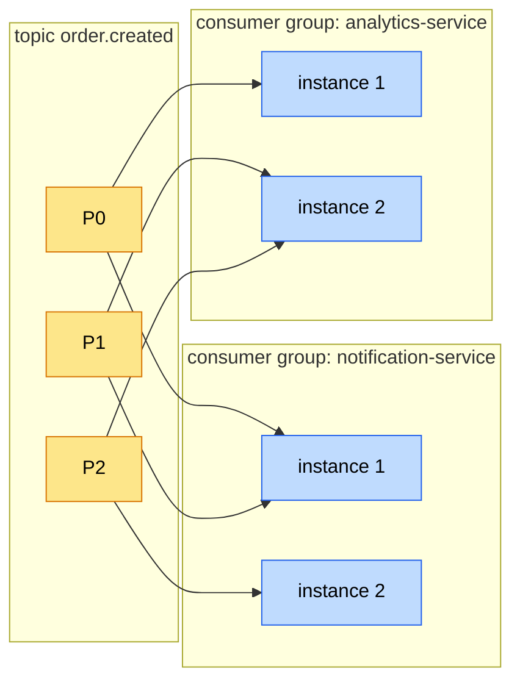

# 📚 Lesson 08 — Kafka basics: topic / partition / consumer group / delivery semantics

> Foundation cho Week 2 async. Mục tiêu: hiểu đủ để giải thích "tại sao
> Kafka không phải queue, là log" và config được idempotent producer
> không mất message. Day 12 sẽ deep-dive exactly-once + transactional;
> Day 13 sẽ giải dual-write bằng outbox.

## TL;DR

Kafka là **distributed append-only log**. Không phải queue (consume xong
là biến) — là log (offset retention theo TTL, replay được). Producer
ghi vào **partition** (chia sharded theo key); consumer thuộc **consumer
group** chia partition để đọc parallel.

3 cờ producer phải nhớ thuộc lòng (Day 8 wire ở
[`common-lib/KafkaAutoConfiguration.java:90-108`](../../common-lib/src/main/java/com/ecom/common/autoconfig/KafkaAutoConfiguration.java#L90-L108)):

```
acks=all
enable.idempotence=true
max.in.flight.requests.per.connection=5
```

Bỏ 1 trong 3 = mất message hoặc duplicate trong production.

## 🎯 Khi nào dùng Kafka

- **Event-driven architecture** — nhiều consumer độc lập đọc cùng event (fan-out: notification + analytics + inventory cùng react `order.created`).
- **Stream processing** — Kafka Streams / Flink consume + process tiếp.
- **Audit log / event sourcing** — retention dài, replay được.
- **Buffer giữa fast producer + slow consumer** — Kafka hold message, consumer drain theo throughput của nó.
- **Cross-service eventual consistency** — order-service publish, downstream (inventory, payment, notification) async react.

## ⚠️ Khi nào KHÔNG dùng Kafka

- **Sync request-response** — dùng REST/gRPC, không phải Kafka.
- **Workload < 1k msg/s + 1 producer + 1 consumer** — RabbitMQ / SQS đơn giản hơn, ops cost thấp hơn.
- **Cần priority queue / dead letter retry với delay tuỳ ý** — Kafka không native; dùng RabbitMQ với x-delayed-message hoặc SQS với delay-seconds.
- **Strict ordering toàn topic** — phải dùng 1 partition → mất parallelism. Nếu workload thật yêu cầu total order → re-design (đa số case chỉ cần per-key order, dùng key partition là đủ).

## 🧠 Core concepts

### Partition + Key + Ordering

- 1 topic có N partition. Producer pick partition theo key hash (`key % N`).
- **Same key → same partition → ordered**. Different key → different partition → KHÔNG đảm bảo cross-key order.
- Day 8 chọn `orderId` làm key cho `order.created` (xem [`OrderEventPublisher:43`](../../services/order-service/src/main/java/com/ecommerce/order/infrastructure/messaging/OrderEventPublisher.java#L43)) → consumer xử event của cùng 1 order theo thứ tự `created → paid → shipped → delivered`.
- **Cạm bẫy hot partition**: nếu key skewed (vd hot SKU flash sale → 90% event cùng 1 key) → 1 partition nghẽn. Fix Day 33: composite key hoặc custom partitioner.

### Consumer Group

- 1 consumer group đọc 1 topic, Kafka chia partition đều cho instance trong group.
- 4 partition + 4 instance = 1-1. 4 partition + 8 instance = 4 instance đọc, 4 idle (over-provisioned).
- **Khác group = fan-out**: `notification-service` group + `analytics-service` group cùng đọc `order.created` → cả 2 nhận event.
- Day 8 set `groupId = ${spring.application.name}` (xem [`OrderEventListener:33`](../../services/notification-service/src/main/java/com/ecommerce/notification/listener/OrderEventListener.java#L33)) → mỗi service 1 group, scale-out tự chia partition.

Topology dưới đây: 1 topic `order.created` (3 partition) fan-out tới 2 consumer
group — mỗi group nhận **full bản sao** event; partition chia cho instance trong
cùng group (không trùng nhau).



### Offset + Commit

- Mỗi consumer group lưu offset đã đọc đến đâu cho từng partition.
- **`enable.auto.commit=true` là cạm bẫy phổ biến nhất**: Kafka tự commit offset theo interval (5s default), KHÔNG quan tâm handler đã xử xong chưa. Crash giữa lúc đang process → restart → offset đã commit → message bị skip.
- Day 8 set `enable.auto.commit=false` (xem [`KafkaAutoConfiguration:129`](../../common-lib/src/main/java/com/ecom/common/autoconfig/KafkaAutoConfiguration.java#L129)) — Spring Kafka manual ack mode mặc định commit SAU khi listener method return không exception.

### Idempotent Producer (Kafka ≥ 3.0 default)

- Producer gắn **PID (Producer ID) + sequence number** vào mỗi record.
- Broker dedup theo `(PID, partition, sequence)` → retry không tạo duplicate.
- **Ép buộc**: `acks=all` + `retries=∞` + `max.in.flight ≤ 5`.
- KHÔNG cần transactional → đủ cho 95% use case ecommerce.

### `acks=0/1/all` — durability vs latency

| `acks` | Hành vi                                      | Mất message khi      | Latency |
| ------ | -------------------------------------------- | -------------------- | ------- |
| 0      | Producer fire-and-forget, không chờ broker   | Broker đơn giản chết | Thấp nhất |
| 1      | Chờ leader ack (default cũ ≤ 2.x)            | Leader fail trước follower replicate | Trung bình |
| all    | Chờ tất cả ISR ack                           | Tất cả ISR cùng chết (rare) | Cao nhất |

**Day 8 chọn `acks=all` + idempotent** (xem [issue 08](../issues/08-kafka-message-loss-acks-default.md)).

## 🎤 Trả lời phỏng vấn

> **Q**: Kafka đảm bảo exactly-once không?

**A**: Không "free" — phụ thuộc 3 thứ wire đúng:
1. **Producer**: `enable.idempotence=true` → dedup retry trong session.
2. **Consumer**: `isolation.level=read_committed` + chỉ commit offset SAU khi handler success.
3. **Transactional producer + consumer trong cùng transaction** (`initTransactions`, `beginTransaction`, `sendOffsetsToTransaction`) → exactly-once xuyên producer↔consumer.

Ecommerce 95% case chỉ cần **at-least-once + idempotent handler** (consumer dedup theo `eventId`) — đơn giản hơn nhiều, throughput cao hơn. Transactional overhead khoảng 10-20% throughput (Day 12 sẽ benchmark).

## 🔗 Related

- Source: [`common-lib/KafkaAutoConfiguration`](../../common-lib/src/main/java/com/ecom/common/autoconfig/KafkaAutoConfiguration.java) · [`OrderEventPublisher`](../../services/order-service/src/main/java/com/ecommerce/order/infrastructure/messaging/OrderEventPublisher.java) · [`OrderEventListener`](../../services/notification-service/src/main/java/com/ecommerce/notification/listener/OrderEventListener.java)
- Issue: [issue 08 — kafka-message-loss-acks-default](../issues/08-kafka-message-loss-acks-default.md)
- Architecture: [event-driven-flow](../architecture/event-driven-flow.md)
- ADR: [005 — feign-vs-http-interface](../decisions/005-feign-vs-http-interface.md)
- Day 12 will cover: [lesson 12c — kafka-delivery-semantics](../lessons/12c-kafka-delivery-semantics.md) (planned), [lesson 12d — partition-key-ordering](../lessons/12d-partition-key-ordering.md) (planned)
- Day 13 will cover dual-write: [lesson 13 — outbox-pattern](../lessons/13-outbox-pattern.md) (planned)
