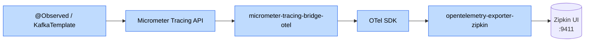
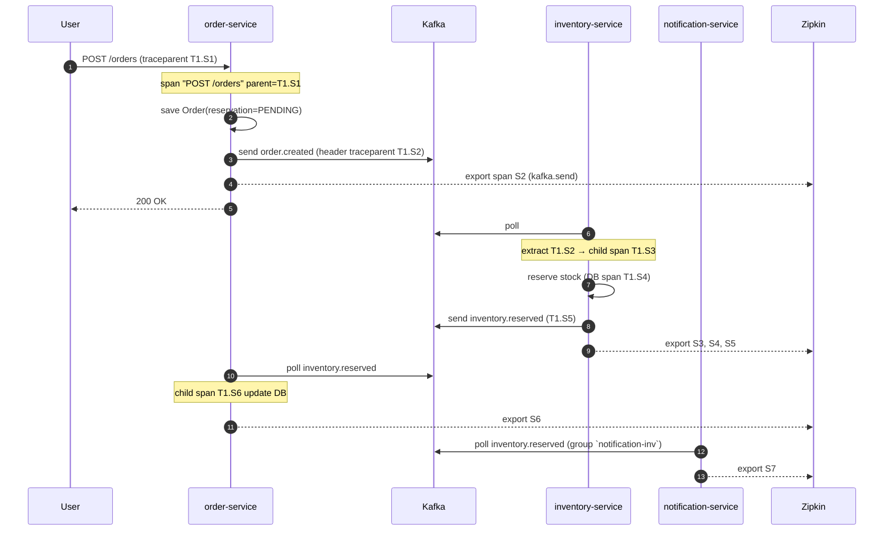

# 📚 Lesson 09 — Distributed Tracing với Micrometer + OpenTelemetry

> **Day**: 9 · **Status**: ✅ Done · **Modernity**: Micrometer Tracing 1.4 + OTel + W3C `traceparent`

## TL;DR

- **Tracing** = tree of **spans** xuyên qua nhiều service. 1 trace = 1 user request (place order). 1 span = 1 đơn vị công việc (HTTP call, DB query, Kafka publish).
- W3C **`traceparent`** header (`00-{traceId}-{spanId}-{flags}`) propagate qua HTTP và Kafka headers, link span con-cha tự động.
- Stack hôm nay: **Micrometer Tracing** (API + auto-config) + **OTel bridge** (chuẩn cross-vendor) + **Zipkin exporter** (UI nhẹ, prod migrate Tempo Day 20).
- Sleuth đã **deprecated từ Spring Boot 3** — KHÔNG dùng `@NewSpan` / `Tracer` cũ.

## 🎯 Khi nào dùng

- ≥ 2 service gọi nhau → log correlation MDC không đủ (không thấy waterfall, không thấy duration mỗi span).
- Cần đo latency P95/P99 từng span để identify bottleneck (vs đoán mò qua log).
- Cần debug "request này chậm vì sao" — Zipkin/Tempo UI cho ra span tree trực quan.

## ❌ Khi nào KHÔNG dùng

- App monolith 1 service không gọi ai → MDC log đủ.
- Toàn bộ logic batch offline (Spark job, cron) — đo throughput, không phải latency per request.
- Production có ngân sách tracing < 1% sampling → drill specific user complaint sẽ bị missing trace, dùng synthetic check + targeted log thay vào.

## ⚠️ Cạm bẫy

1. **Sampling probability=1.0 ở prod** → Zipkin storage bùng nổ ở 10k QPS. Default 0.01-0.1 head-based, hoặc tail-based via OTel collector (giữ trace có error/slow).
2. **Quên propagate qua Kafka**: Spring Boot auto-config CHỈ propagate HTTP. Kafka cần `spring.kafka.template.observation-enabled=true` + `spring.kafka.listener.observation-enabled=true` (Spring Kafka 3.x). KHÔNG bật = trace dừng ở producer, consumer span là root mới → trace tree gãy.
3. **Confuse `@Observed` vs `@NewSpan`**: Spring Boot 3 dùng Micrometer Observation (`@Observed` ở method tự tạo span + metric). `@NewSpan` (Sleuth) bị deprecated, KHÔNG dùng.
4. **Trace context lost ở virtual thread / `@Async`**: cần `ContextSnapshot` capture + restore. Spring Kafka 3.x đã handle khi observation-enabled.
5. **`traceparent` vs `X-Correlation-Id`**: 2 thứ khác nhau. CorrelationId (Day 1) = đơn giản, log MDC; traceparent = tree span chuẩn W3C. Giữ cả 2 — chúng KHÔNG đụng nhau.

## 🔄 Approaches compared

| Approach | Pros | Cons |
| --- | --- | --- |
| **MDC + correlation id** | Đơn giản, log-aggregator (ELK) join được | Không thấy waterfall + duration; phải tự grep nhiều file log |
| **Sleuth (legacy)** | Quen từ Spring Boot 2 | Deprecated từ Boot 3; không phải chuẩn OTel |
| **Micrometer Tracing + OTel bridge (chosen)** | Chuẩn vendor-neutral; Spring Boot 3 first-class | 1 lớp abstraction thêm (Observation → Tracer → OTel SDK) |
| **OTel SDK trực tiếp** | Bỏ qua Micrometer | Spring Boot không auto-wire; phải tự viết HandlerInterceptor + KafkaInterceptor |

## 🔧 Stack hôm nay



**Common-lib** (Day 9): add `api` deps để mọi service tracing-ready khi include `common-lib`:

```kotlin
// common-lib/build.gradle.kts
api(libs.micrometer.tracing.bridge.otel)
api(libs.opentelemetry.exporter.zipkin)
```

**Per-service config**:

```yaml
management:
  tracing:
    sampling.probability: 1.0          # dev 100%, prod 0.01-0.1
  zipkin:
    tracing.endpoint: http://localhost:9411/api/v2/spans

spring.kafka:
  template.observation-enabled: true
  listener.observation-enabled: true
```

## 📞 Trace flow Day 9 — place order



Zipkin UI search theo `traceId=T1` thấy 7 span con-cha duration đầy đủ.

## 🎤 Trả lời phỏng vấn

> **Q**: "Tại sao không dùng Sleuth?"
>
> Sleuth deprecated từ Spring Boot 3.0 — Spring team chuyển sang Micrometer Tracing để align với chuẩn OTel cross-vendor. Sleuth API (`@NewSpan`, `Tracer`) cũ vẫn chạy được qua compatibility layer nhưng không recommend code mới.

> **Q**: "Trace context qua Kafka inject bằng cách nào?"
>
> Spring Kafka 3.x khi bật `observation-enabled=true` ở template/listener tự wrap send/receive vào Micrometer Observation. OTel `TextMapPropagator` inject `traceparent` vào `ProducerRecord.headers()`. Consumer side extract ngược lại trong observation scope → span con tự link cha. KHÔNG cần code `KafkaHeaders.inject(...)` manual.

> **Q**: "Sampling 1.0 dev — prod set bao nhiêu?"
>
> Phụ thuộc QPS + storage budget. 1k QPS Zipkin in-memory + Tempo S3 backend → 0.1 (100k trace/day) đã đủ ngân sách. > 10k QPS → tail-based 0.01 + giữ tất cả error/slow trace qua OTel collector tail sampling rule.

## 🔗 Related

- Code: [`common-lib/build.gradle.kts`](../../common-lib/build.gradle.kts) tracing deps · [`services/order-service/src/main/resources/application.yml`](../../services/order-service/src/main/resources/application.yml) Zipkin endpoint
- Doc: [issue 09 eventual-consistency](../issues/09-eventual-consistency-order.md) · [lesson 09b](09b-eventual-consistency-window.md) · [ADR-006](../decisions/006-sync-orchestration-vs-async-events.md)
- Day trước: [day-08 Kafka basics](08-kafka-basics.md)
