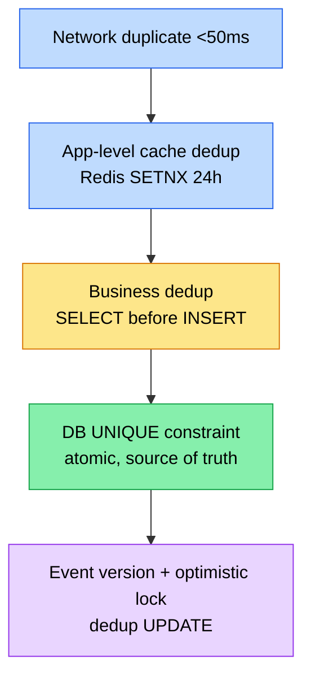

# Lesson 10 — Idempotency: contract, không phải implementation

> Day 10 · `payment-service` callback handler
> Related: [issue 10 duplicate-payment-callback](../issues/10-duplicate-payment-callback.md) · [ADR-007 payment-layered](../decisions/007-payment-service-layered-not-ddd.md) · [lesson 08 kafka-basics](08-kafka-basics.md)

## 🎯 TL;DR

**Idempotent operation**: N lần gọi với cùng input → **side-effect chỉ xảy ra 1 lần** + response giống nhau. KHÔNG phải "không có side-effect" (đó là safe method, như GET).

Trong payment-service, callback từ gateway có thể đến **N lần**:
- Gateway retry khi app trả 5xx (VNPay retry 3 lần / 24h, Momo retry 5 lần / 1h).
- Network duplicate (mobile cell tower handover) — cùng request đến 2 lần < 1s.
- Operator gửi tay từ admin dashboard.

→ Endpoint PHẢI idempotent. Đây là **contract với gateway**, không phải optional.

## 📋 Khi nào dùng

✅ **Mọi endpoint nhận callback từ external system** (payment, courier, webhook).
✅ **POST tạo resource có natural key** (user register theo email, order theo idempotency-key).
✅ **Kafka consumer** — at-least-once đảm bảo redeliver, consumer phải idempotent.
✅ **Job retry** — scheduler chạy hỏng → retry không gây side-effect kép.

## ❌ Khi nào KHÔNG cần (hoặc không thể)

- **Streaming / WebSocket message**: không có natural dedup key, latency-sensitive.
- **Counter increment** không có business meaning (vd analytics page view) — accept duplicate, fix bằng aggregation.
- **Endpoint chỉ gọi nội bộ + có lock** (vd cron singleton) — overhead idempotent không bù được.

## 🏗️ 4 layer idempotency (chống đỡ chiều sâu)



| Layer | Cơ chế | Trade-off |
|---|---|---|
| **L1 Network** | TCP/HTTP đã handle ở transport. App KHÔNG cần làm gì. | — |
| **L2 App cache** | Redis `SETNX idempotency:{key} 1 EX 86400` trước khi xử lý. Hit → trả cached response. | Nhanh; nhưng Redis down → race lọt qua. KHÔNG là source of truth. |
| **L3 Check-then-act** | `SELECT WHERE txn_id = ?` → nếu exist trả existing. | **Race condition** giữa SELECT + INSERT — 2 thread đồng thời cùng miss SELECT. KHÔNG đủ. |
| **L4 DB UNIQUE** | UNIQUE constraint trên dedup key. INSERT race lose → catch exception. | Atomic ở DB level. **Source of truth.** Day 10 chọn approach này. |

> ⚠️ **L3 không thay được L4**. AI/junior code thường viết L3 + tin là idempotent — chỉ test sequential nên không thấy race. Production gặp peak → 2 callback < 50ms → 2 row tạo.

## 💡 Idempotency-Key header pattern (RFC draft-ietf-httpapi-idempotency-key)

Cho endpoint client tự tạo request (vd `POST /orders`):

```http
POST /orders
Idempotency-Key: f47ac10b-58cc-4372-a567-0e02b2c3d479
Content-Type: application/json

{ "items": [...] }
```

Server:
1. Hash request body → `body_hash`.
2. Lookup `idempotency_key` table: nếu key có sẵn → so sánh `body_hash`:
   - Match → trả cached response (200 cũ).
   - Mismatch → 422 "Idempotency-Key reuse with different payload".
3. Không có key → xử lý + lưu `(key, body_hash, response)` 24h.

**Khác callback dedup**: Idempotency-Key client tự sinh (UUID); callback dedup server dedup theo `provider_txn_id` gateway sinh. Cùng nguyên lý L4 UNIQUE.

## 🪤 5 Cạm bẫy

1. **Check-then-act race** — pattern phổ biến nhất AI viết. Phải L4 UNIQUE.
2. **Idempotent ≠ commutative** — `cancelOrder` rồi `payOrder` ≠ `payOrder` rồi `cancelOrder`. Idempotent chỉ nói về **lặp cùng operation**.
3. **Cache TTL quá ngắn** — gateway retry sau 24h, cache 1h → miss → xử lý 2 lần.
4. **Response cached khác status** — duplicate trả 200 (đã xử lý) hay 201 (mới tạo)? Spec phải rõ. Day 10 dùng 200 + field `duplicate=true` metadata.
5. **Dual-write idempotent ở 1 phía** — DB idempotent nhưng publish Kafka duplicate → consumer nhận 2 event. Day 13 outbox fix.

## 🔍 Đoạn code điển hình (Day 10)

```java
// services/payment-service/.../HandleCallbackUseCase.java
@Retryable(retryFor = ObjectOptimisticLockingFailureException.class, maxAttempts = 3,
           backoff = @Backoff(delay = 50, maxDelay = 500, multiplier = 2.0))
@Transactional(propagation = Propagation.REQUIRES_NEW)
public CallbackResult execute(CallbackCommand cmd) {
    // L3 fast path — KHÔNG là correctness, chỉ optimization.
    var existing = repo.findByProviderAndProviderTxnId(cmd.provider(), cmd.providerTxnId());
    if (existing.isPresent()) return new CallbackResult(existing.get(), true, false);

    var intent = repo.findById(cmd.paymentId()).orElseThrow(...);
    try {
        intent.capture(cmd.providerTxnId());
        repo.saveAndFlush(intent);  // L4 UNIQUE fail-fast trong cùng tx
        publisher.publishPaymentCompleted(...);
        return new CallbackResult(intent, false, true);
    } catch (DataIntegrityViolationException dup) {
        // Race: thread khác đã INSERT trước. Lookup existing → idempotent.
        var winner = repo.findByProviderAndProviderTxnId(...).orElseThrow();
        return new CallbackResult(winner, true, false);
    }
}
```

3 layer cùng lúc: L3 fast-path + L4 UNIQUE catch + retry optimistic lock.

## 🎤 Trả lời phỏng vấn

**Q1: Idempotent là gì? Khác safe method thế nào?**
A: Idempotent = N lần gọi cho **side-effect bằng 1 lần**. Safe = không có side-effect (như GET/HEAD). PUT/DELETE idempotent theo HTTP spec, nhưng IMPLEMENTATION phải đảm bảo — nhiều API "PUT" thực chất không idempotent vì bug. POST có thể idempotent nếu kèm Idempotency-Key.

**Q2: Sao không dùng SERIALIZABLE isolation thay UNIQUE?**
A: Được nhưng đắt — throughput drop 5-10x do lock conflict. UNIQUE constraint là index-level check, atomic ở B-tree, không lock toàn bảng. Production-grade chọn UNIQUE.

**Q3: Idempotency-Key có cần expire không?**
A: Có. Lưu vĩnh viễn tốn storage + nguy cơ key clash dài hạn. Khuyến nghị 24-72h (>> retry window của gateway). Sau đó expire → request mới cùng key được coi là request mới.

**Q4: Dual-write Kafka publish — idempotent từ DB nhưng broker nhận double, sao?**
A: 2 vấn đề khác nhau. DB idempotent xong → publish có thể fail/duplicate. Day 13 outbox pattern fix: ghi event vào outbox table cùng tx, relay async publish; consumer dedup theo `eventId`.

## 🔗 Related

- Code: [`HandleCallbackUseCase.java`](../../services/payment-service/src/main/java/com/ecommerce/payment/application/HandleCallbackUseCase.java) · [`V1__init_payment.sql`](../../services/payment-service/src/main/resources/db/migration/V1__init_payment.sql)
- Issue: [10 duplicate payment callback](../issues/10-duplicate-payment-callback.md)
- ADR: [007 payment-service Layered](../decisions/007-payment-service-layered-not-ddd.md)
- Lesson 08 Kafka basics (producer idempotent flag) · Lesson 13 outbox (Day 13)
