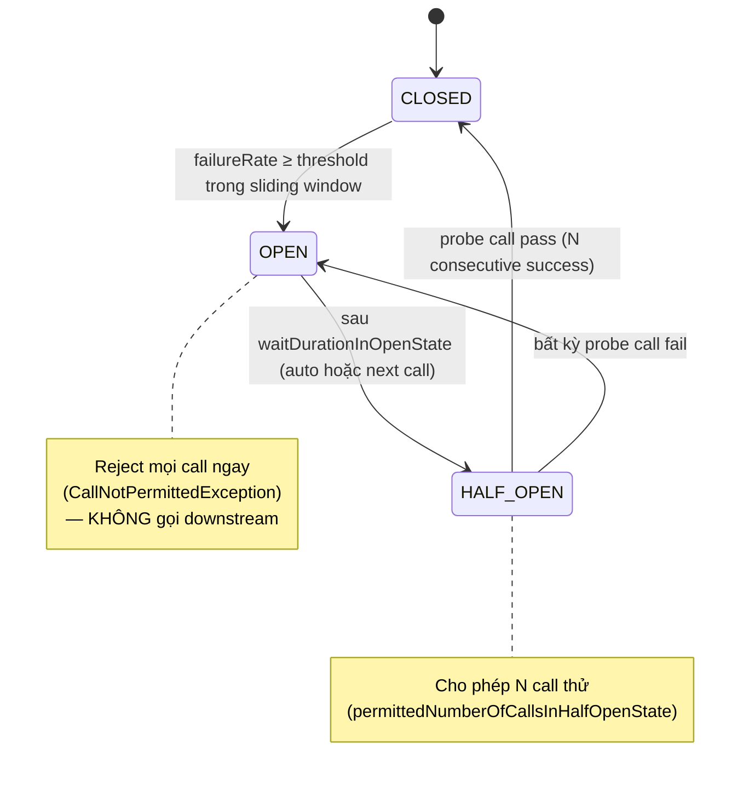

# Lesson 12b — Circuit Breaker với Resilience4j

> **Day**: 12 · **Topic**: Circuit breaker state machine, sliding window, fallback path.
> **Related code**: [`MockGatewayClient`](../../services/payment-service/src/main/java/com/ecommerce/payment/gateway/MockGatewayClient.java) · [`application.yml`](../../services/payment-service/src/main/resources/application.yml)

---

## 🎯 TL;DR

> Circuit breaker fast-fail khi downstream sick để bảo vệ **caller** (thread/connection pool exhaustion) và **callee** (cho nó thời gian recover). 3 state: CLOSED → OPEN → HALF_OPEN. Resilience4j 2.x là replacement đúng cho Netflix Hystrix (đã sunset 2018).

---

## 🏗️ State machine



### Config Day 12 (payment-service)

```yaml
resilience4j.circuitbreaker.instances.paymentGateway:
  slidingWindowType: COUNT_BASED
  slidingWindowSize: 10
  minimumNumberOfCalls: 5
  failureRateThreshold: 50           # %
  waitDurationInOpenState: 30s
  permittedNumberOfCallsInHalfOpenState: 3
  automaticTransitionFromOpenToHalfOpenEnabled: true
  recordExceptions:
    - com.ecommerce.payment.gateway.GatewayUnavailableException
```

`minimumNumberOfCalls=5` chống false positive: nếu mới có 1 call mà nó fail thì failure rate = 100%, nhưng KHÔNG nên trip CB ngay (window quá nhỏ để statistical significance).

---

## 📚 Sliding window — count vs time

| Type            | Khi nào dùng                              | Trade-off                          |
| --------------- | ----------------------------------------- | ---------------------------------- |
| **COUNT_BASED** | Low traffic, ratio chính xác mỗi N call   | Khi traffic spike, window slide nhanh — failure cũ bị quên |
| **TIME_BASED**  | High traffic, ratio per window time       | Cần đủ call trong window — low traffic = ít data → noise |

Project chọn `COUNT_BASED` vì payment gateway call volume thấp (~10/s), time-based window 10s có thể chỉ có 2-3 call → noise.

---

## 🆚 Approaches compared — fast-fail patterns

| Pattern                  | Pros                                       | Cons                                                    |
| ------------------------ | ------------------------------------------ | ------------------------------------------------------- |
| **Timeout only**         | Đơn giản                                   | Mỗi call vẫn chiếm thread/connection — không bảo vệ caller |
| **Circuit breaker**      | ✅ Fast-fail sub-ms khi OPEN — protect caller | Cần tune threshold + window theo traffic                |
| **Bulkhead semaphore**   | ✅ Cap concurrent — protect resource pool   | KHÔNG fast-fail khi downstream chậm-mà-vẫn-trả-response |
| **CB + Bulkhead combo**  | ✅ Project Day 12 chosen                    | 2 config phải sync                                      |
| **Hedged request**       | Latency P99 thấp (gửi 2 song song)         | 2x load downstream, không phải mọi gateway support      |

> CB **bổ sung** Bulkhead chứ không thay thế. Bulkhead chống "downstream slow but not down" — CB chống "downstream down".

---

## 🔧 Annotation order matters

```java
@CircuitBreaker(name = "paymentGateway", fallbackMethod = "verifyFallback")
@Bulkhead(name = "paymentGateway")
public VerificationResult verify(String txnId) { ... }
```

Resilience4j default decorator order (outer → inner): **Bulkhead → TimeLimiter → RateLimiter → CircuitBreaker → Retry**. CB ở trong cùng = thấy mọi exception (kể cả `BulkheadFullException`).

**Quan trọng**: `recordExceptions` ở config CHỈ count `GatewayUnavailableException`. `BulkheadFullException` → fallback chạy NHƯNG KHÔNG count vào CB failure rate. Lý do: Bulkhead full = caller overload, KHÔNG phải downstream lỗi.

---

## 🚧 Fallback method rules

```java
public VerificationResult verifyFallback(String txnId, Throwable ex) { ... }
```

3 rule cứng:
1. **Same return type** — không thì runtime classCastException.
2. **Same params + extra `Throwable`** — Resilience4j match signature theo exception hierarchy.
3. **Public hoặc package-private** — proxy AOP cần access.

Có thể có **multiple fallback** khác exception type: `fallback(String, CallNotPermittedException)` cho CB-OPEN, `fallback(String, BulkheadFullException)` cho overload. Resilience4j pick most-specific.

---

## ⚠️ Cạm bẫy

1. **Fallback gọi blocking I/O** — fallback chạy trong CB-protected thread; nếu fallback gọi DB hoặc Kafka publish và bị block → mất ý nghĩa fast-fail. Fallback nên là **constant return** hoặc **local cache**.
2. **CB trên virtual thread vẫn cần** — VT (Day 8) không tự bảo vệ downstream từ overload. VT chỉ giảm memory + thread switching cost.
3. **CB instance share giữa endpoint** — cùng name `paymentGateway` thì share state. 2 method khác nhau dùng cùng name → 1 method spam fail làm method kia bị block. Tách name khi semantic khác.
4. **Quên `recordExceptions`** — default count MỌI exception, kể cả `IllegalArgumentException` (validation lỗi của caller). CB trip vì caller code sai, không phải downstream lỗi.
5. **Hystrix migration** — Hystrix dùng thread-pool isolation (mỗi command = 1 threadpool); Resilience4j default semaphore. Nếu migrate phải cân nhắc lại blocking behavior.

---

## 🎤 Trả lời phỏng vấn

**Q1: Giải thích state machine circuit breaker?**

CLOSED là default — request đi qua bình thường, CB count fail trong sliding window. Khi failure rate vượt threshold (vd 50% trong 10 call gần nhất) → chuyển OPEN. OPEN reject mọi call NGAY (sub-millisecond fast-fail, fallback chạy) — KHÔNG gọi downstream. Sau `waitDurationInOpenState` (vd 30s) → HALF_OPEN: cho phép N probe call (vd 3) đi qua, nếu pass hết → CLOSED, nếu bất kỳ fail → OPEN lại. Pattern này cho downstream thời gian recover thay vì retry storm tăng load.

**Q2: Sliding window count vs time, chọn cái nào?**

Phụ thuộc traffic profile. Count-based ratio chính xác mỗi N call → tốt cho low traffic (~10/s). Time-based ratio per window thời gian → tốt cho high traffic (~1000/s) vì window slide đều, không spike. Mistake là pick time-based cho low traffic → window 10s chỉ có 2-3 call → 1 fail = 50% rate = trip giả. Project Day 12 payment gateway low volume → count-based.

**Q3: Bulkhead — semaphore vs thread-pool?**

Semaphore = đếm concurrent permit, lightweight, **không isolate thread** (caller thread vẫn chạy). Thread-pool = isolate hoàn toàn (call chạy trong pool riêng), overhead lớn nhưng caller thread không bị block. Hystrix default thread-pool; Resilience4j default semaphore. Với virtual thread (Day 8), semaphore là default đúng — VT không cần isolate vì cheap. Thread-pool chỉ khi cần isolation timeout cứng (downstream không có client-side timeout).

### Follow-up traps

- *"CB trip rồi auto recover sao?"* — `automaticTransitionFromOpenToHalfOpenEnabled=true` cần 1 background scheduler thread; nếu false thì cần call mới trigger transition. Trap: candidate bảo "auto" nhưng không biết phải bật flag.
- *"`recordExceptions` vs `ignoreExceptions` — khác gì?"* — `record` = whitelist count vào failure rate; `ignore` = exclude. Mặc định count tất cả không-ignore. Setting cả 2 → record thắng.

---

## 🔗 Related

- [`lessons/12-retry-strategy.md`](12-retry-strategy.md) — Retry stack với CB
- [`decisions/006-sync-orchestration-vs-async-events.md`](../decisions/006-sync-orchestration-vs-async-events.md) — vì sao Day 9 chuyển async — CB chỉ áp dụng cho sync RPC residual (gateway verify)
- Code: [`MockGatewayClient.java`](../../services/payment-service/src/main/java/com/ecommerce/payment/gateway/MockGatewayClient.java) · test [`MockGatewayClientCircuitBreakerTest.java`](../../services/payment-service/src/test/java/com/ecommerce/payment/gateway/MockGatewayClientCircuitBreakerTest.java)
