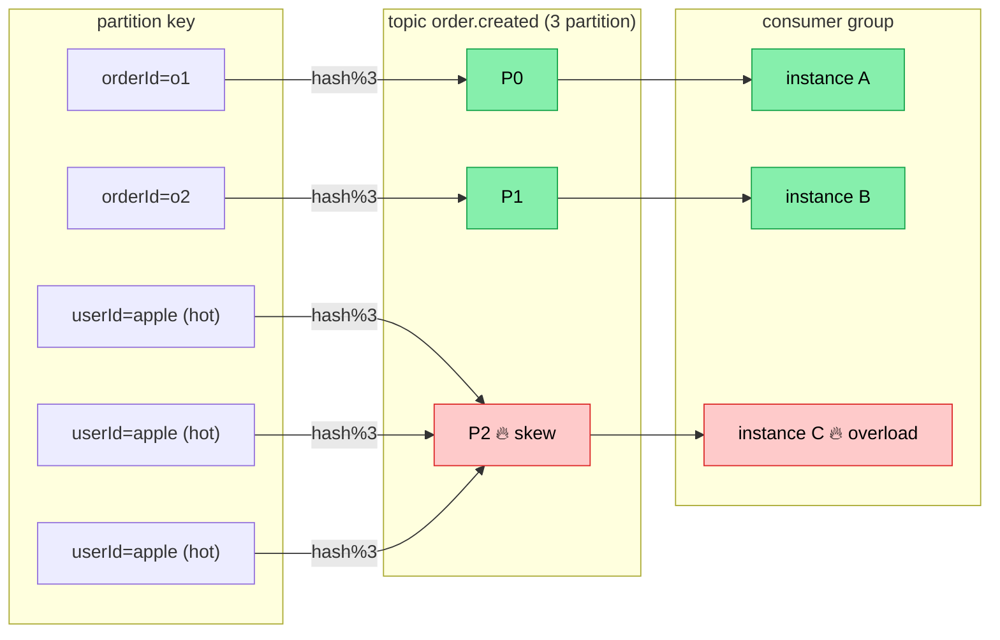

# Lesson 12d — Kafka Partition Key & Ordering

> **Day**: 12 · **Topic**: Partition key choice, ordering guarantee, hot-partition skew.
> **Status**: ✅ Done

---

## 🎯 TL;DR

> Kafka chỉ guarantee ordering **trong 1 partition**, KHÔNG phải toàn topic. Partition key quyết định message cùng key đi cùng partition. Project: `orderId` cho `order.*` events, `paymentId` cho `payment.*` — entity ID là default đúng. `userId` cho hot-VIP-user → skew. KHÔNG dùng `null` (round-robin) cho stateful event.

---

## 📚 Cơ chế

```
partition = hash(key) % numPartitions
```

- Cùng key → cùng partition → cùng consumer (trong group) → ordered.
- Khác key → có thể khác partition → consumer khác → KHÔNG ordered cross-partition.
- `null` key → round-robin (cũ) hoặc sticky-batching (Kafka 2.4+) — KHÔNG ordering guarantee.

`orderId` (high cardinality) hash đều across partition → mỗi order ordered trong
partition của nó. Đổi sang `userId` → hot VIP user (Apple flash-sale) dồn 1
partition → skew, consumer của partition đó cháy:



### Trong project

| Event topic           | Key chosen   | Reasoning                                                  |
| --------------------- | ------------ | ---------------------------------------------------------- |
| `order.created`       | `orderId`    | OrderCreated → InventoryReserved → OrderConfirmed cùng partition |
| `inventory.reserved`  | `orderId`    | Để order-service consume theo order order                  |
| `payment.completed`   | `orderId`    | Pair với order.created cùng partition → trace dễ           |
| `product.upserted`    | `productId`  | Sync ES theo product, không cross-product ordering         |
| `analytics.event`     | `null` (TBD) | Day 22+: cardinality cực cao, không cần ordering           |

---

## 🆚 Approaches compared — partition key cho `order.*`

| Key choice           | Ordering guarantee                          | Pros                                | Cons                                                    |
| -------------------- | ------------------------------------------- | ----------------------------------- | ------------------------------------------------------- |
| `null` (round-robin) | Không có                                    | Distribute đều                      | Mất ordering — không dùng cho stateful event            |
| **`orderId`**        | Ordering per order                          | ✅ Project chọn — fine-grained, balanced | Cardinality rất cao → distribute đều across partition |
| `userId`             | Ordering per user (mọi order của user)      | Có thể stream-process per user      | Hot user (VIP) → 1 partition nóng (skew)                |
| `region` / coarse    | Ordering trong region                       | Đơn giản                            | Skew nặng, không đủ fine-grained                        |
| `userId#bucket`      | Ordering per user + sharding                | Cân giữa skew + per-user ordering   | Composite key complex; nếu cần per-user ordering chính xác → break |

> Project Day 8-12 dùng `orderId` — high cardinality (mỗi order unique), distribute đều, đảm bảo lifecycle events 1 order luôn cùng partition.

---

## ⚠️ Cạm bẫy

1. **Tăng partition KHÔNG retro-active** — message cũ vẫn ở partition cũ, chỉ message mới hash lại với `numPartitions` mới. Trong cửa sổ chuyển đổi có thể **đảo thứ tự**: message cũ key X ở partition 2, message mới key X ở partition 5 — 2 consumer khác nhau → race. Mitigation: tăng partition vào maintenance window, drain backlog trước.
2. **Consumer rebalance window** — khi 1 consumer down, partition reassign → 1-3s rebalance. Có thể duplicate process (consumer mới poll lại từ last commit). **Phải dedup** (Day 10 pattern).
3. **Skew "hot user/seller"** — Tiki flash sale: 1 seller (Apple) chiếm 30% order → partition của `userId=apple` cháy. Mitigation: composite key `sellerId#productId` hoặc switch sang `orderId`.
4. **DLT mất key** — nếu `DeadLetterPublishingRecoverer` không set destination resolver → default round-robin → DLT message không cùng partition như original → mất ordering khi replay. Day 12 fix: `(record, ex) → new TopicPartition(record.topic() + ".DLT", record.partition())` giữ partition affinity.
5. **Compaction + key** — log compaction giữ message gần nhất per key. Nếu key = null thì compaction không work. Nếu key high-cardinality (UUID per message) thì compaction không reclaim space.

---

## 🎤 Trả lời phỏng vấn

**Q1: "Kafka guarantee ordering không?"**

Guarantee ordering **trong 1 partition**, KHÔNG phải toàn topic. Cùng key → cùng partition (hash modulo) → consumer trong cùng group nhận đúng thứ tự append. Cross-partition không guarantee. Topic muốn full ordering = 1 partition = không scale. Production luôn pick partition key = entity ID để get "ordering per entity" — đủ cho phần lớn use case.

**Q2: "Bạn chọn partition key thế nào cho order events? Tại sao không phải `null`?"**

`orderId` — vì 3 lý do: (1) cardinality cao → distribute đều across partition; (2) lifecycle events của 1 order (created → reserved → paid → shipped) luôn cùng partition → consumer nhận đúng thứ tự, không cần dedup ordering logic; (3) trace dễ — filter Kafka log theo key thấy full lifecycle. `null` mất ordering, dùng cho event không stateful (analytics, log).

**Q3: "Tăng partition từ 3 lên 6 — message cũ thế nào?"**

Message cũ KHÔNG re-hash, vẫn ở partition cũ. Chỉ message mới hash với `numPartitions=6`. Hệ quả: cùng key có thể bị split — cũ ở partition 2, mới ở partition 5. Trong cửa sổ này consumer của 2 partition khác nhau process song song → có thể đảo thứ tự (cũ chậm hơn mới). Mitigation: tăng partition vào maintenance window, đảm bảo broker drain backlog xong rồi mới bật producer trở lại. Hoặc: pre-provision partition count đủ lớn từ đầu (vd 12-24 partition cho topic core) — cheap.

### Follow-up traps

- *"Hash function của default partitioner là gì?"* — Murmur2 (Kafka < 2.4) hoặc sticky partitioner cho null key (2.4+). Custom partitioner cần extend `Partitioner` interface. Trap: candidate nói "hashCode()" — sai.
- *"Per-partition ordering ok nhưng nếu retry vào DLT thì partition vẫn giữ?"* — Day 12 implement giữ. Default `DeadLetterPublishingRecoverer` round-robin → mất partition affinity. Trap dễ miss khi review code.

---

## 🔗 Related

- [`lessons/12c-kafka-delivery-semantics.md`](12c-kafka-delivery-semantics.md) — delivery semantic pair với ordering
- [`lessons/08-kafka-basics.md`](08-kafka-basics.md) — Topic/Partition/Offset/Consumer group
- Code: [`RetryTopologyConfiguration.java`](../../services/notification-service/src/main/java/com/ecommerce/notification/messaging/RetryTopologyConfiguration.java) — DLT giữ partition affinity
