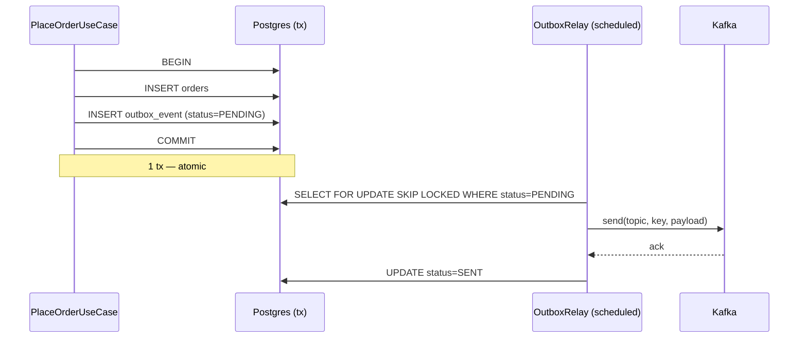

# Lesson 13 — 📦 Transactional Outbox Pattern

> **Day 13** · trả dual-write debt của [Day 9](09-distributed-tracing-otel.md).
> Related: [13b dual-write problem](13b-dual-write-problem.md) · [issue 13](../issues/13-order-paid-inventory-not-reserved.md) · [ADR-009](../decisions/009-outbox-vs-cdc.md)

---

## 🎯 TL;DR

Ghi domain event vào **bảng outbox cùng tx Postgres** với business write. Một
**relay process** poll bảng đó, publish lên Kafka, mark `SENT`. Atomic DB +
at-least-once delivery, consumer side phải idempotent.



---

## ✅ Khi nào dùng

- Business logic ghi DB + cần publish message → **không có 2PC** giữa DB và
  broker. Outbox là default cho ecommerce / payment / order flow.
- Cần **strong delivery guarantee** (event không được mất khi broker down).
- Volume < 10k events/s, latency budget cho event delivery ≥ 1s.
- Team chưa muốn ops Debezium connector cluster.

## ❌ Khi nào KHÔNG dùng

- **Realtime/latency-critical** (< 100ms event delivery): polling lag 1-2s
  giết SLA. Cân nhắc Debezium CDC (sub-second WAL stream).
- Volume > 100k events/s: outbox table thành bottleneck (insert + index +
  vacuum overhead). Cần partition table hoặc switch CDC.
- DB không support row-lock SKIP semantics (vd MySQL < 8.0): multi-instance
  relay khó race-free, phải dùng app-level lock (ShedLock/Redis).
- Event không cần durability (vd analytics page view) — fire-and-forget OK.

---

## ⚠️ 5 cạm bẫy

1. **Publish trong cùng tx**: AI/junior dễ viết `outboxRepo.save() + kafkaTemplate.send()` trong cùng `@Transactional`. Defeat purpose — quay lại dual-write. Relay PHẢI là background process tách hoàn toàn.
2. **Ordering loss multi-partition**: outbox FIFO theo `created_at` không đảm bảo Kafka per-partition ordering nếu partition_key khác nhau. Rule: cùng `aggregate_id` → cùng `partition_key` → cùng partition.
3. **Table bloat**: 50k orders/day × 365 = 18M rows/năm chưa cleanup. Cần cron DELETE SENT > 7 ngày, hoặc partition theo `created_at` (monthly), drop partition cũ.
4. **Lock contention với write traffic**: index `outbox_pending_idx` PHẢI là partial (WHERE status='PENDING'). Full index = scan toàn bảng mỗi tick = lock contention với INSERT business. Partial index chỉ contain PENDING rows = nhỏ.
5. **Retry storm khi broker permanent down**: nếu relay retry forever, mỗi tick lại retry hết PENDING → broker recover sẽ flood. Bound `maxAttempts` + status `FAILED` cho manual triage; alert nếu `FAILED > 0`.

---

## ⚖️ Approaches compared

| Approach                | Latency        | Atomic | Ops cost | Khi nào chọn                       |
| ----------------------- | -------------- | ------ | -------- | ---------------------------------- |
| Direct publish (Day 9)  | < 10ms         | ❌      | Zero     | Event không quan trọng, có thể mất |
| **Outbox poll (chosen)**| 1-2s           | ✅      | Low      | Default cho ecommerce/order/payment|
| Outbox + LISTEN/NOTIFY  | < 100ms        | ✅      | Medium   | Single Postgres, push notification |
| Debezium CDC            | sub-second     | ✅      | High     | > 10k/s hoặc latency < 1s          |
| Saga + compensation     | n/a            | ✅      | Highest  | Cross-service workflow đa bước    |

Chi tiết alternatives + rationale: [ADR-009](../decisions/009-outbox-vs-cdc.md).

---

## 🔧 Implementation chi tiết

### Schema

[`V3__create_outbox_event.sql`](../../services/order-service/src/main/resources/db/migration/V3__create_outbox_event.sql):

- `partition_key` lưu sẵn — relay không cần logic chọn key.
- `payload` JSONB serialize tại recorder time.
- Partial index `(created_at) WHERE status='PENDING'` cho relay batch fetch.
- CHECK constraint enforce status whitelist + attempts ≥ 0.

### Recorder — cùng tx business write

[`OutboxRecorder.java:34-58`](../../services/order-service/src/main/java/com/ecommerce/order/infrastructure/outbox/OutboxRecorder.java) gọi từ [`PlaceOrderUseCase.java`](../../services/order-service/src/main/java/com/ecommerce/order/application/PlaceOrderUseCase.java) trong `@Transactional`. Serialize Jackson tại đây để fail-fast trong business tx.

### Relay — multi-instance race-free

[`OutboxEventRepository.java`](../../services/order-service/src/main/java/com/ecommerce/order/infrastructure/outbox/OutboxEventRepository.java):

```java
@Lock(LockModeType.PESSIMISTIC_WRITE)
@QueryHints(@QueryHint(name = "jakarta.persistence.lock.timeout", value = "-2"))
@Query("SELECT e FROM OutboxEvent e WHERE e.status = PENDING ORDER BY e.createdAt ASC")
List<OutboxEvent> fetchBatchForRelay(Pageable pageable);
```

`-2` = SKIP_LOCKED ở Hibernate (`LockOptions.SKIP_LOCKED`). 2 relay tick đồng thời → mỗi cái lock 1 batch disjoint, không duplicate publish.

[`OutboxRelay.java`](../../services/order-service/src/main/java/com/ecommerce/order/infrastructure/outbox/OutboxRelay.java):

- `@Scheduled(fixedDelay=1000)` — không phải fixedRate (tránh chồng tick).
- Mỗi event tx riêng (`REQUIRES_NEW`) — 1 row lỗi không rollback cả batch.
- `kafkaTemplate.send().get(5s)` block tới khi broker ack — chỉ mark SENT khi confirmed.
- `attempts++` keep PENDING → tick sau retry. Vượt 10 → `FAILED` + alert log.

### Multi-instance relay scaling

- Day 13: single instance đủ (50k orders/day = 0.5 event/s).
- Day 20 load test sẽ verify: 2 relay instance cùng chạy, SKIP LOCKED đảm bảo no duplicate.
- Scale out tới N instance: outbox table có thể trở thành bottleneck do INSERT contention với business write. Lúc đó switch sang Debezium CDC (no polling).

---

## 🎤 Trả lời phỏng vấn

> **"Tại sao không dùng 2PC giữa Postgres và Kafka?"**
>
> 2PC (XA) cần resource manager support — Kafka không phải XA-compliant. Tx
> manager 2PC kẹt prepared state khi coordinator crash, ops nightmare. Outbox
> + at-least-once + consumer idempotent là pragmatic alternative, được dùng
> ở Confluent reference, Microsoft eShopOnContainers, Netflix.

> **"Outbox guarantee delivery semantic gì?"**
>
> **At-least-once**. Nếu relay crash sau khi Kafka ack nhưng trước khi
> UPDATE status=SENT → tick sau retry, consumer thấy duplicate. Consumer
> PHẢI idempotent (Day 12 đã wire `NotificationDeduplicator` + Day 10
> 4-layer idempotency cho payment).

> **"Ordering guarantee?"**
>
> Per-aggregate-id, KHÔNG global. Relay FIFO + `partition_key = aggregate_id`
> → cùng order tất cả event vào cùng Kafka partition → ordered. Cross-order
> không guarantee (different partitions). Đây là trade-off của Kafka không
> riêng outbox.

---

## 🔗 Related

- [13b — Dual-write problem](13b-dual-write-problem.md) — concept foundation
- [Issue 13 — Order paid inventory not reserved](../issues/13-order-paid-inventory-not-reserved.md) — incident drove this pattern
- [ADR-009 — Outbox vs CDC](../decisions/009-outbox-vs-cdc.md) — 5 alternatives
- [Day 10 — Idempotency lesson](10-idempotency.md) — consumer side counterpart
- [Day 12 — Kafka delivery semantics](12c-kafka-delivery-semantics.md)
- Code: [`OutboxEvent.java`](../../services/order-service/src/main/java/com/ecommerce/order/infrastructure/outbox/OutboxEvent.java) · [`OutboxRecorder.java`](../../services/order-service/src/main/java/com/ecommerce/order/infrastructure/outbox/OutboxRecorder.java) · [`OutboxRelay.java`](../../services/order-service/src/main/java/com/ecommerce/order/infrastructure/outbox/OutboxRelay.java)
