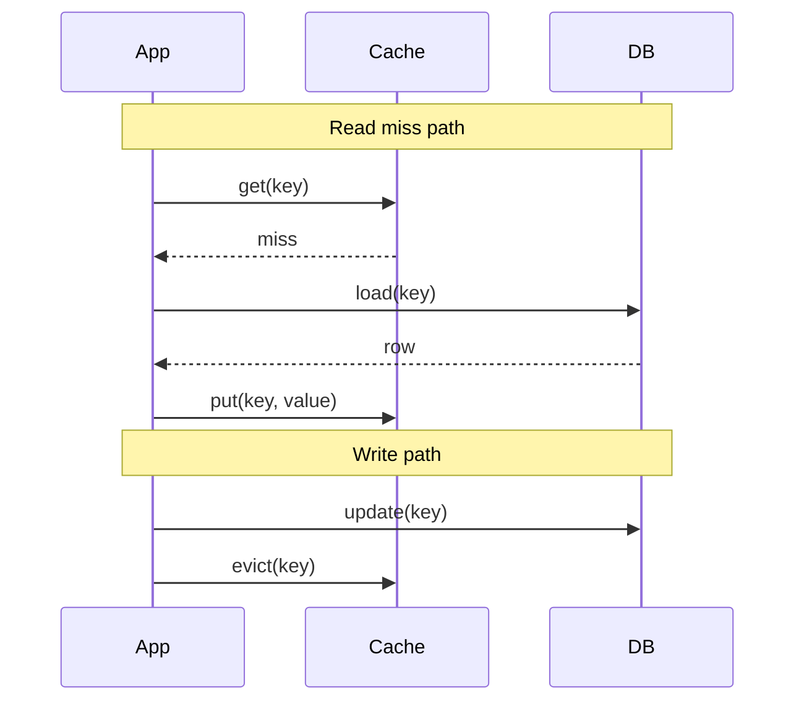
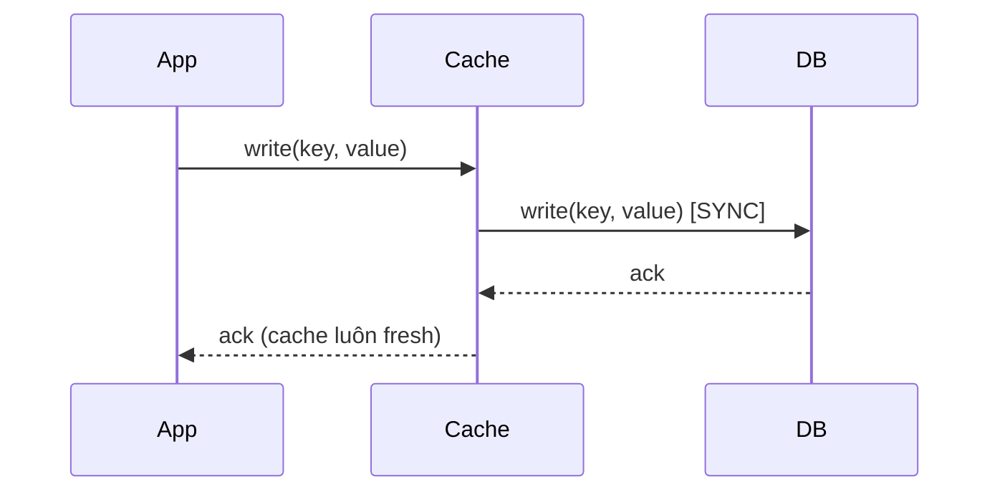
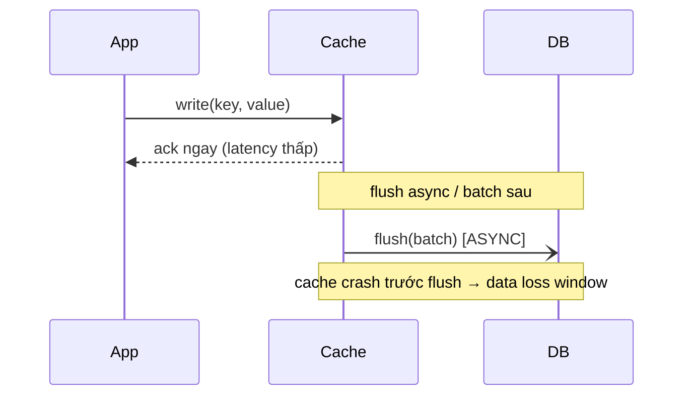

# Lesson 15 — 🏗️ Cache Strategies (4 patterns + khi nào chọn)

> **Day 15** · Liên quan: [ADR 012 — Two-tier cache](../decisions/012-two-tier-cache-caffeine-redis.md) · [Performance 15 — Cache aside](../performance/15-cache-aside.md) · [Performance 15b — Two-tier](../performance/15b-two-tier-cache.md) · [Issue 15 — Cache stampede](../issues/15-cache-stampede.md)

---

## TL;DR

4 cache pattern phổ biến — **cache-aside / read-through / write-through / write-behind** — khác nhau ở **ai quản cache** (app vs cache layer) và **khi nào ghi** (sync vs async). Project chọn **cache-aside** vì code visibility cao nhất, dễ debug, và Spring Cache abstraction (`@Cacheable`) tự generate boilerplate.

## Khi nào dùng

- **Cache-aside**: read-heavy, tolerate eventual consistency ≤TTL, infra đơn giản. Default cho 90% case ecommerce catalog.
- **Read-through**: muốn business code "không biết" cache tồn tại — service chỉ gọi `repository.find()`, cache layer (cache-aside provider như Spring `@Cacheable` thực ra cũng đạt được điều này).
- **Write-through**: cache là source-of-truth ngang DB, mọi write đồng bộ vào cache trước khi return → cache không bao giờ stale. Dùng cho data đọc cực hot và write cũng nhiều (session state, leaderboard).
- **Write-behind (write-back)**: cache nhận write, flush DB async batch sau. Latency write thấp đột biến (chỉ ghi RAM), trade-off **mất data window** nếu cache crash. Dùng cho counter/metric không critical.

## Khi nào KHÔNG dùng

- **Strong consistency** required (price tại checkout, stock count): cache TTL dài = bug. Nếu phải cache → TTL ≤5s + invalidate ngay khi write.
- **Write-heavy**: cache invalidation cost > benefit. Hit ratio < 30% → bỏ cache.
- **Data đặc biệt nhỏ + truy cập đều**: DB query đã <1ms thì thêm cache là over-engineering, lại tạo consistency window.
- **Cache size ≪ working set**: thrashing — evict liên tục, hit ratio thấp + CPU cao. Tăng size hoặc bỏ cache.

## Cạm bẫy

### 1. Cache stampede (thundering herd)

Hot key expire đồng thời → N concurrent request miss → tất cả đập DB cùng lúc → DB overload.

**Fix**: XFetch (probabilistic early refresh — refresh trước khi TTL hết) hoặc distributed lock (chỉ 1 thread rebuild, còn lại chờ). Project chọn XFetch vì lock-free, không tạo bottleneck. Xem [issue 15](../issues/15-cache-stampede.md).

### 2. Cache avalanche (mass expiry)

Nhiều key cùng TTL → expire đồng loạt → DB bị spike đột ngột (khác stampede ở chỗ: stampede = 1 hot key, avalanche = hàng ngàn key).

**Fix**: TTL jitter — thêm random ±10-20% vào TTL khi put cache. Ví dụ TTL base 300s → actual TTL = 300 + random(-30, +30). Đảm bảo expiry phân tán đều theo thời gian.

### 3. Cache penetration (non-existent key attack)

Query key không tồn tại liên tục (attacker hoặc bug) → mỗi request đều miss cache + miss DB → DB load tăng vô ích.

**Fix**: Cache null sentinel với TTL ngắn (30-60s), hoặc bloom filter ở front để reject key chắc chắn không tồn tại trước khi query.

### 4. Cache invalidation logic incomplete

Code update qua native query / bulk update KHÔNG annotate `@CacheEvict` → cache stale forever. **Audit toàn bộ write path** khi add cache — bao gồm cả admin tool, migration script, event handler.

### 5. Mutable cached value

Cache entity managed (JPA), caller mutate object → poison cache cho request sau. **Luôn cache immutable record/DTO**, không entity.

### 6. Multi-instance L1 inconsistency

Instance A evict L1, instance B vẫn cache cũ. Fix: pub/sub invalidation, hoặc giảm L1 TTL (project chọn TTL 60s — acceptable cho catalog).

### 7. Hot key bottleneck

1 viral product key dồn 1 Redis shard → shard overload. Fix: key replication (append random suffix) hoặc local L1 absorb. Xem [issue 15b](../issues/15b-hot-key.md).

## Approaches compared

| Pattern        | Ai quản cache | Read miss path                    | Write path                          | Consistency | Khi nào chọn                          |
|----------------|---------------|-----------------------------------|--------------------------------------|-------------|---------------------------------------|
| Cache-aside    | **App**       | App đọc cache → miss → đọc DB → ghi cache | App ghi DB → invalidate cache       | Eventual    | Default. Read-heavy. Code đơn giản.   |
| Read-through   | Cache layer   | Cache miss → cache tự đọc DB qua loader   | App ghi DB → invalidate cache       | Eventual    | Muốn business code clean (Spring `@Cacheable` thực chất là read-through over cache-aside) |
| Write-through  | Cache layer   | Same as read-through               | App ghi CACHE → cache ghi DB (sync) | Strong      | Cache là source-of-truth. Session, leaderboard. |
| Write-behind   | Cache layer   | Same as read-through               | App ghi CACHE → cache flush DB ASYNC | Weak (data loss window) | Write-heavy, tolerate loss. Counters, metrics. |

Sequence dưới đây show điểm khác cốt lõi của **write path**: cache-aside ghi DB
trước rồi invalidate cache (App drive), write-through ghi cache rồi cache **sync**
ghi DB, write-behind ghi cache rồi flush DB **async** (return ngay, data loss
window nếu cache crash trước flush).

### Cache-aside — read miss + write (App quản lifecycle)

### Write-through — write đồng bộ qua cache layer

### Write-behind — write vào cache, flush DB async

## Trả lời phỏng vấn

**Q**: "So sánh 4 cache strategy — khi nào chọn cái nào?"

> **Strong answer outline** (trả lời 2 phút):
>
> 1. Mở: "4 strategy khác nhau ở 2 trục: **ai quản cache** (app vs cache layer) và **write timing** (sync vs async)."
> 2. Cache-aside: app tự quản, read miss → app load DB → app put cache. Write → app update DB + evict cache. **Default cho 90% read-heavy case** vì code visibility cao, dễ debug.
> 3. Read-through: cache layer tự load DB khi miss (qua CacheLoader). App không biết cache tồn tại. Spring `@Cacheable` thực chất là hybrid cache-aside + read-through.
> 4. Write-through: mọi write đi qua cache → cache sync ghi DB. Cache luôn fresh. Trade-off: write latency tăng, cache thành critical path.
> 5. Write-behind: write vào cache, flush DB async (batch). Write latency cực thấp. Trade-off: **data loss window** nếu cache crash trước flush.
> 6. Kết: "Project tôi chọn cache-aside vì catalog read-heavy (ratio 100:1), tolerate stale ≤60s, và team cần debug visibility."

**Follow-up trap 1**: "Vì sao chọn cache-aside thay vì read-through?"

> Hai pattern thực tế chồng lên nhau trong Spring. `@Cacheable` ở method service là cache-aside (app gọi cache.get → miss → app gọi DB → app put cache) nhưng đứng từ góc nhìn business code, **trông như read-through** vì developer chỉ viết `productRepository.findById(id)` bên trong method, không thấy cache call. Tôi gọi nó là cache-aside vì lifecycle vẫn do app drive — cache layer không tự đọc DB qua loader. Lợi: debug rõ ràng, tự kiểm soát serialize, easy unit test (mock CacheManager).

**Follow-up trap 2**: "Write-through đảm bảo strong consistency — tại sao không dùng nó cho price?"

> Strong consistency chỉ trong "cache layer + DB" — KHÔNG strong giữa multi-instance app. Nếu Redis là cache layer, write-through nghĩa là app ghi Redis (atomic-ish), Redis flush DB. Nhưng 4 pod app đọc Redis → vẫn thấy giá trị mới đồng thời ≥ khi DB commit. Cách này hợp lý hơn cache-aside ở 1 điểm: KHÔNG có race "evict xong, read race ghi lại stale". Trade-off: latency write tăng (phải qua Redis), Redis trở thành tier critical (down → write down).

**Follow-up trap 3**: "Write-behind mất data — có ai dùng production không?"

> Có. MySQL InnoDB buffer pool chính là write-behind (dirty page flush async). Redis AOF `everysec` cũng là write-behind (1s data loss window). Dùng cho counter, view count, analytics event — data mất 1 batch không critical. KHÔNG dùng cho payment, order, inventory.

## Related

- Code: [`services/product-service/src/main/java/com/ecom/product/config/cache/`](../../services/product-service/src/main/java/com/ecom/product/config/cache/)
- [Performance 15 — Cache aside implementation](../performance/15-cache-aside.md)
- [Performance 15b — Two-tier hierarchy](../performance/15b-two-tier-cache.md)
- [ADR 012 — Vì sao 2-tier](../decisions/012-two-tier-cache-caffeine-redis.md)
- [Issue 15 — Cache stampede full](../issues/15-cache-stampede.md)
- [Issue 15b — Hot key](../issues/15b-hot-key.md)
