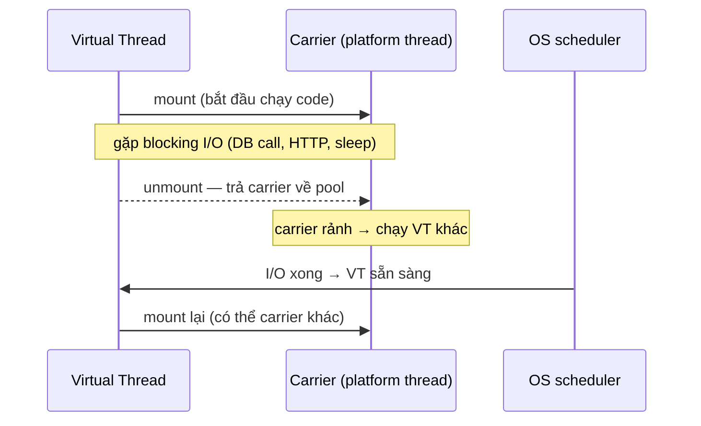

# Lesson 19b — ⚡ Virtual Threads Deep: mount/unmount, pinning, structured concurrency

> **Status**: ✅ Done · Day 19
> **Related code**: [`PinningDemo.java`](../../concurrency-lab/src/main/java/com/ecom/lab/pinning/PinningDemo.java) · [`VirtualVsPlatformBenchmark.java`](../../concurrency-lab/src/main/java/com/ecom/lab/vthread/VirtualVsPlatformBenchmark.java) · [`StructuredFanout.java`](../../concurrency-lab/src/main/java/com/ecom/lab/structured/StructuredFanout.java)

---

## 🎯 TL;DR

> Virtual thread (Loom) = thread "rẻ" do JVM lập lịch, **mount** lên 1 carrier
> (platform thread) khi chạy và **unmount** khi block I/O → 1 carrier phục vụ
> vạn VT. Thắng **chỉ khi IO-bound**. Cạm bẫy #1: **pinning** — VT bị "đóng đinh"
> vào carrier (không unmount được) khi block bên trong `synchronized` hoặc gọi
> native → mất hết lợi thế scale. Fix: đổi `synchronized` → `ReentrantLock`.

---

## 🧠 Mount / unmount — mental model



Carrier pool mặc định = số CPU core (`ForkJoinPool`). Vạn VT block cùng lúc chỉ
tốn ~vài KB stack mỗi VT, KHÔNG tốn OS thread. Đó là lý do
`Executors.newVirtualThreadPerTaskExecutor()` xử lý 10K request blocking
song song mà không OOM.

## ⚠️ Pinning — cạm bẫy #1 (và cách CHỨNG MINH bằng JFR)

VT **không thể unmount** khi:
1. block (sleep/IO) bên trong khối `synchronized` → object monitor gắn vào carrier;
2. gọi native method (JNI).

Carrier bị giữ → nếu nhiều VT cùng pin, pool carrier cạn → throughput sụp về
như platform-thread pool (mất hết lợi thế Loom).

[`PinningDemo`](../../concurrency-lab/src/main/java/com/ecom/lab/pinning/PinningDemo.java)
chạy 200 VT × block 50ms theo 2 cách, đếm event JFR `jdk.VirtualThreadPinned`:

```java
synchronized (MONITOR) { sleep(50); }   // → ~200 pinned events
// vs
LOCK.lock(); try { sleep(50); } finally { LOCK.unlock(); }   // → 0 pinned event
```

Detect ở production:
- `-Djdk.tracePinnedThreads=full` (in stacktrace mỗi lần pin ra stderr — dev only, ồn).
- JFR event `jdk.VirtualThreadPinned` (cách đúng cho prod — bật trong recording).
- Java 24+ (JEP 491): `synchronized` hết pin — nhưng project chạy Java 21 nên vẫn phải né.

> 💡 **Interview gold**: "Bật virtual thread xong throughput không tăng" — câu
> trả lời senior là *"check pinning trước"*: 1 `synchronized` ôm JDBC call trong
> hot path đủ để vô hiệu hoá toàn bộ Loom. Đo bằng JFR, không đoán.

## 📊 VT vs Platform thread — số đo (IO-bound)

[`VirtualVsPlatformBenchmark`](../../concurrency-lab/src/main/java/com/ecom/lab/vthread/VirtualVsPlatformBenchmark.java):
10.000 task, mỗi task block `ioMillis`.

- **VT**: tất cả 10K block song song → thời gian ≈ `ioMillis` (+ overhead nhỏ).
- **Platform pool 200**: chỉ 200 chạy đồng thời → ≈ `ioMillis × ceil(10000/200)` = ×50.

> ⚠️ **KHÔNG overclaim**: VT thắng *vì* workload block. CPU-bound (tính toán
> thuần, không block) thì VT **không** nhanh hơn — vẫn giới hạn ở số core. Nói
> "VT làm app nhanh hơn" chung chung = sai; phải nói "nhanh hơn cho IO-bound".

## 🧬 Structured Concurrency (JEP 453 — preview Java 21)

Fan-out nhiều call con như 1 đơn vị: vào cùng scope, ra cùng scope.
[`StructuredFanout`](../../concurrency-lab/src/main/java/com/ecom/lab/structured/StructuredFanout.java):

```java
try (var scope = new StructuredTaskScope.ShutdownOnFailure()) {
    var cart      = scope.fork(cartCall);
    var product   = scope.fork(productCall);
    var inventory = scope.fork(inventoryCall);
    scope.joinUntil(deadline);   // chờ tất cả HOẶC tới hạn
    scope.throwIfFailed();       // 1 con fail → hủy sibling, ném ngay (fail-fast)
    return new Result<>(cart.get(), product.get(), inventory.get());
}
```

So với `CompletableFuture.allOf`:

| | `CompletableFuture.allOf` | `StructuredTaskScope` |
| --- | --- | --- |
| 1 task fail | task khác vẫn chạy tới hết (lãng phí) | sibling bị **hủy tự động** |
| Cancellation | tự gọi `cancel(true)`, dễ quên → leak | tự động khi scope đóng |
| Quan hệ cha-con | mờ, stacktrace rối | rõ ràng (structured) |
| Deadline | tự ghép `orTimeout` từng future | `joinUntil(deadline)` 1 chỗ |

> ⚠️ Preview API: cần `--enable-preview`. Project cô lập ở module `concurrency-lab`
> để KHÔNG ép cờ này lên service production (preview bit ép runtime cũng phải có cờ).
> Production hôm nay dùng được `CompletableFuture` fan-out; migrate khi API final (Java 25 JEP 505).

## ⚠️ Cạm bẫy tổng hợp

- Pinning vì `synchronized` + blocking call (đã nói trên).
- `ThreadLocal` trên VT: 1 triệu VT × ThreadLocal nặng = OOM. Dùng `ScopedValue` (preview) hoặc tránh.
- Pool VT? **Đừng** pool virtual thread (chúng vốn rẻ, vứt đi tạo mới). Pool dành cho carrier, JVM lo.
- `Semaphore` để giới hạn concurrency downstream (vd DB connection) — VT không tự giới hạn, vẫn cần bulkhead.

## 🎤 Trả lời phỏng vấn

> **"Virtual thread pin là gì, fix sao?"** VT không unmount được khỏi carrier khi
> block trong `synchronized` hoặc native. Fix: đổi sang `ReentrantLock` (park qua
> LockSupport → unmount OK). Detect bằng JFR `jdk.VirtualThreadPinned` hoặc
> `-Djdk.tracePinnedThreads`. Java 24+ JEP 491 xoá pin cho synchronized.

> **"Structured concurrency hơn gì CompletableFuture?"** Fail-fast (1 con fail
> hủy sibling), cancellation tự động, quan hệ cha-con rõ → ít leak, dễ debug.

## 🔗 Related

- [`lessons/19-java-locking.md`](19-java-locking.md) — ReentrantLock unpin
- [`lessons/19c-distributed-lock-redlock.md`](19c-distributed-lock-redlock.md)
- Day 2 — bật `spring.threads.virtual.enabled=true` lần đầu
- [`interview/day-19-concurrency.md`](../interview/day-19-concurrency.md)
